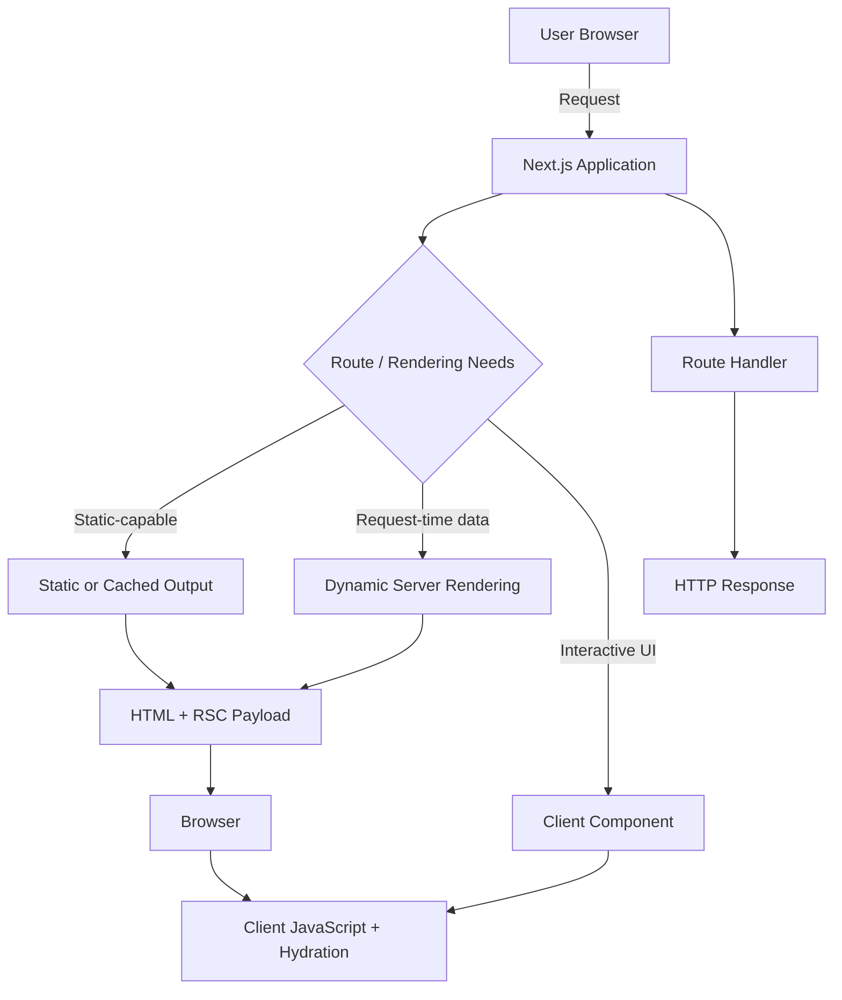

# Day 1 [Beginner]: What is Next.js and Why Use It

## Goal

Understand what Next.js is, how it differs from plain React, how the App Router works at a high level, and why Next.js is widely used for modern production web applications.

## Prerequisites

- Basic JavaScript knowledge
- Node.js installed (Next.js 16 requires Node.js 20.9 or later)
- VS Code installed

## Explanation

Next.js is a React framework created by Vercel. React provides the component model and UI primitives, while Next.js provides an application framework around React with routing, server and client rendering capabilities, data-fetching conventions, optimization features, and server-side application features.

A plain React application can be built as a client-rendered application, but React itself does not prescribe the complete application architecture. You may need to choose and configure routing, data fetching, code splitting, rendering, SEO metadata, and deployment patterns yourself. Next.js provides conventions for these concerns so teams can build and maintain production applications with less application-level plumbing.

Next.js supports multiple rendering approaches. A route can be statically rendered when its data and runtime behavior allow it, rendered dynamically when request-time information is required, or combine static and dynamic portions using features such as Suspense and Cache Components. Rendering strategy and caching strategy are related, but they are not the same thing. For example, a request can be rendered dynamically while selected data or components are cached, and revalidation controls when cached content becomes stale.

The App Router uses React Server Components by default. Server Components can run on the server and can access server-only resources without sending their implementation JavaScript to the browser. A component that needs browser APIs, event handlers, or client hooks such as `useState` and `useEffect` can opt into the client boundary with `"use client"`. This server/client model helps keep browser JavaScript smaller when used deliberately.

Beyond rendering and components, Next.js provides file-system routing, layouts, loading and error UI conventions, Route Handlers, metadata APIs, `next/image`, `next/font`, environment-variable support, navigation utilities, and deployment options. Next.js 16 is the current major release line used by this tutorial; always check the official release notes when working with version-specific behavior because the framework evolves quickly.

## Topic by Topic

### Topic 1: React vs Next.js

Theory:
React is a library for building user interfaces. Next.js is a React framework that provides an application structure and features around React, including routing, server/client rendering, data-fetching patterns, optimization, and server-side capabilities. Next.js does not replace React; it uses React as its UI foundation.

Practical:
Think of React as the UI building system and Next.js as an application framework that provides the surrounding architecture. With plain React, you choose more pieces yourself. With Next.js, many common web-application concerns have established conventions.

Code Example:

```jsx
// Plain React component - data is requested from the browser
import { useEffect, useState } from "react";

export default function App() {
  const [data, setData] = useState(null);

  useEffect(() => {
    fetch("/api/data")
      .then((response) => response.json())
      .then(setData)
      .catch(console.error);
  }, []);

  return <div>{data ? data.message : "Loading..."}</div>;
}
```

**Explanation:** This example shows one common client-side React pattern: the browser makes the request after the component mounts. In a Next.js App Router application, data can instead be fetched in a Server Component when appropriate, or through a Route Handler, Server Function/Action, or client-side request depending on the application requirement. Next.js gives you these choices rather than forcing every request into one pattern.
**Key Points:**
- React focuses on UI; Next.js provides a broader application framework around React.
- Next.js can move appropriate work from the browser to the server.
- Choose the data-fetching and rendering approach based on freshness, interactivity, security, and performance requirements.


### Topic 2: Server-side Rendering (SSR)

Theory:
Server-side rendering means generating the HTML for a request on the server rather than relying entirely on the browser to construct the initial UI. SSR is a rendering strategy, not simply a particular `fetch` option. A dynamically rendered route may use request-specific information such as cookies, headers, or uncached data and produce HTML for that request.

Practical:
Use dynamic server rendering when the response needs request-time information or data that should be resolved for the current request. Do not assume that every Server Component is SSR: Server Components can also participate in statically rendered or cached output.

Code Example:

```tsx
// app/page.tsx — Server Component using request-time data
import { headers } from "next/headers";

export default async function Page() {
  const requestHeaders = await headers();
  const userAgent = requestHeaders.get("user-agent") ?? "unknown";

  return (
    <main>
      <h1>Request Information</h1>
      <p>User-Agent: {userAgent}</p>
    </main>
  );
}
```

**Explanation:** Reading request-specific information such as headers makes the route depend on the incoming request. This is different from saying that `cache: "no-store"` defines SSR. Caching, revalidation, and rendering determine different parts of the application's behavior. Server Components also do not automatically mean that a new HTML document is generated for every request.
**Key Points:**
- SSR describes server-side HTML generation for a request.
- Server Components and SSR are related but not synonymous concepts.
- Rendering strategy and caching strategy should be considered separately.


### Topic 3: Static Site Generation (SSG)

Theory:
Static rendering means Next.js can produce route output ahead of a request when the route's code and data allow it. This is useful for content that does not need to be generated uniquely for every request, such as many documentation, marketing, and public content pages.

Practical:
Use static rendering when content can be shared safely between requests and does not require request-time information. A statically rendered route can still be revalidated or contain dynamic portions when using the appropriate Next.js features.

Code Example:

```tsx
// app/about/page.tsx — simple route with no request-time dependency
export default function AboutPage() {
  return (
    <main>
      <h1>About Us</h1>
      <p>We build great software.</p>
    </main>
  );
}
```

**Explanation:** This route has no request-specific data or browser-only behavior, so it is a good candidate for static rendering. Static rendering is not the same as saying that every page is permanently frozen at build time. Data fetching, revalidation, dynamic APIs, and Cache Components can change how a route is produced and kept fresh.
**Key Points:**
- Static rendering is ideal when output can be shared across requests.
- Static and dynamic behavior depends on the route's data and runtime characteristics.
- Revalidation can provide freshness without requiring every request to rebuild the entire page.


### Topic 4: File-based Routing

Theory:
In the App Router, folders and special files inside the `app/` directory define the route hierarchy. A `page.tsx` file makes a route publicly accessible. Folders can represent URL segments, while special files such as `layout.tsx`, `loading.tsx`, `error.tsx`, and `not-found.tsx` provide additional route behavior.

Practical:
Create `app/about/page.tsx` and Next.js creates the `/about` route. Create `app/blog/[slug]/page.tsx` for dynamic blog URLs such as `/blog/hello-nextjs`.

Code Example:

```
app/
  page.tsx                 → /
  about/
    page.tsx               → /about
  blog/
    page.tsx               → /blog
    [slug]/
      page.tsx             → /blog/:slug
  api/
    hello/
      route.ts             → /api/hello
```

**Explanation:** File structure defines routes in the App Router, so a separate client-side router configuration is normally unnecessary. Dynamic segments such as `[slug]` capture values from the URL. Route Handlers use `route.ts` rather than `page.tsx` because they return HTTP responses instead of UI.
**Key Points:**
- `page.tsx` defines a UI route in the App Router.
- `[slug]` creates a dynamic route segment.
- `route.ts` defines an HTTP Route Handler and is distinct from a UI page.


### Topic 5: App Router vs Pages Router

Theory:
Next.js has two routing systems. The App Router uses the `app/` directory and is the recommended approach for new applications. The older Pages Router uses the `pages/` directory and remains important when maintaining existing applications. The App Router is built around React Server Components, nested layouts, streaming, and newer routing capabilities.

Practical:
Use the App Router for new projects unless a project requirement specifically calls for the Pages Router. When reading an existing codebase, identify which router it uses before applying APIs because data fetching and routing conventions differ.

Code Example:

```tsx
// App Router: app/page.tsx
export default function Home() {
  return <h1>Home (App Router)</h1>;
}

// Pages Router: pages/index.tsx
export default function Home() {
  return <h1>Home (Pages Router)</h1>;
}
```

**Explanation:** Both examples create a homepage, but they belong to different routing systems. Pages Router applications commonly use APIs such as `getServerSideProps` and `getStaticProps`; these are Pages Router concepts and should not be copied into an App Router page. App Router applications instead use Server Components, route conventions, and modern server/client APIs.

**Key Points:**
- App Router uses `app/`; Pages Router uses `pages/`.
- Prefer App Router for new applications.
- Do not mix router-specific APIs without understanding which routing system they belong to.


### Topic 6: API Routes

Theory:
In the App Router, backend HTTP endpoints are called **Route Handlers** and are defined with `route.ts` or `route.js`. They can implement HTTP methods such as `GET`, `POST`, `PUT`, `PATCH`, and `DELETE`. Pages Router applications use `pages/api/*` API Routes instead.

Practical:
Create `app/api/hello/route.ts` and expose a `GET` endpoint at `/api/hello`. For a real application, validate input, authenticate and authorize protected operations, and avoid returning sensitive server data.

Code Example:

```tsx
// app/api/hello/route.ts
import { NextResponse } from "next/server";

export async function GET() {
  return NextResponse.json({ message: "Hello from a Next.js Route Handler!" });
}

export async function POST(request: Request) {
  const body = await request.json();

  if (!body?.name || typeof body.name !== "string") {
    return NextResponse.json(
      { error: "name is required" },
      { status: 400 }
    );
  }

  return NextResponse.json({ message: `Hello, ${body.name}` }, { status: 201 });
}
```

**Explanation:** A Route Handler is server-side code that returns an HTTP response. It is useful when a browser, mobile application, webhook, or another service needs an HTTP endpoint. A Route Handler is not automatically a database layer or authentication system, so production endpoints should include appropriate validation, authorization, rate limiting, and error handling.

**Key Points:**
- App Router uses Route Handlers in `route.ts` files.
- HTTP methods are exported as functions such as `GET` and `POST`.
- Validate and authorize incoming requests before performing protected operations.


### Topic 7: Deployment and Vercel

Theory:
Next.js is created and maintained by Vercel, and Vercel provides a highly integrated deployment platform for Next.js applications. Next.js can also be deployed to other supported environments, including Node.js servers and container-based infrastructure, depending on the application's features and hosting requirements.

Practical:
A common workflow is to push the application to GitHub and connect the repository to a deployment platform. Before production deployment, test the production build, configure environment variables securely, and verify that external services, image sources, authentication, and caching behave correctly.

Code Example:

```bash
# Create a production build locally
npm run build

# Run the production server locally
npm start

# Optional: deploy with the Vercel CLI
npx vercel
```

**Explanation:** Deployment is more than uploading static files. Applications using server rendering, Route Handlers, authentication, or other server features need a compatible runtime and correctly configured environment variables. Never commit secrets such as database passwords or API keys to source control.

**Key Points:**
- Vercel provides first-class Next.js deployment support, but it is not the only deployment option.
- Test `next build` and the production server before deployment.
- Keep secrets in environment configuration rather than source code.


## Key Concepts

- **Framework**: A structured application framework built around React; Next.js provides conventions for routing, rendering, data access, optimization, and deployment.
- **SSR (Server-Side Rendering)**: Rendering HTML for a request on the server; SSR is a rendering strategy, not a synonym for `fetch({ cache: "no-store" })`.
- **Static Rendering / SSG**: Producing route output ahead of requests when the route can be shared safely; data can also be revalidated when freshness is required.
- **Dynamic Rendering**: Rendering that depends on request-time information or other dynamic runtime behavior.
- **App Router**: The modern routing system based on the `app/` directory and React Server Components.
- **React Server Components (RSC)**: Components that can run on the server and keep their implementation out of the browser JavaScript bundle.
- **Client Component**: A component marked with `"use client"` when it needs client-side interactivity, browser APIs, or client React hooks.
- **File-based Routing**: Routes are defined by the file and folder conventions in the selected Next.js router.
- **Route Handler**: A server-side HTTP endpoint defined with `route.ts` in the App Router.
- **Hydration**: The client-side React process that attaches behavior to server-rendered UI where client components are involved.
- **Revalidation**: A mechanism for refreshing cached or pre-rendered data/output according to a freshness policy.

## Visual Concept Map



## End-to-End Practical

1. Visit the official Next.js website and read the current "Why Next.js" and App Router documentation.
2. Create a new Next.js project with `npx create-next-app@latest my-app` and use the App Router.
3. Open `app/page.tsx` and observe that an App Router component is a Server Component by default.
4. Create `app/about/page.tsx` and verify that `/about` is created from the folder structure.
5. Add `app/api/hello/route.ts` and call `/api/hello` from the browser or an API client.
6. Run `npm run dev` and inspect the browser Network tab to distinguish document requests, JavaScript, and other requests.
7. Run `npm run build` followed by `npm start` to test the production build locally.
8. Compare a static page with a page that reads request-time information and discuss why their rendering behavior can differ.

## Hands-on Coding

### Example 1: Your First Next.js Page

Create a simple homepage and observe the default Server Component behavior.

```tsx
// app/page.tsx
export default function HomePage() {
  return (
    <main style={{ padding: "2rem", fontFamily: "sans-serif" }}>
      <h1>Welcome to My Next.js App</h1>
      <p>This App Router page is a Server Component by default.</p>
    </main>
  );
}
```

### Example 2: Adding a Second Page

Add an About page and use Next.js `Link` for internal navigation.

```tsx
// app/about/page.tsx
import Link from "next/link";

export default function AboutPage() {
  return (
    <main style={{ padding: "2rem" }}>
      <h1>About</h1>
      <p>Next.js automatically creates routes from the App Router file structure.</p>
      <Link href="/">← Back to Home</Link>
    </main>
  );
}
```

### Example 3: A Simple API Route

Create a GET endpoint that returns JSON data. The endpoint runs on the server.

```tsx
// app/api/status/route.ts
import { NextResponse } from "next/server";

export async function GET() {
  return NextResponse.json({
    status: "ok",
    framework: "Next.js",
    version: "16.x",
    timestamp: new Date().toISOString(),
  });
}
```

## Mini Exercise

Scenario:
You want to understand the difference between static/server-generated HTML and a fully client-rendered application.

Steps:

1. Create a new Next.js app with `npx create-next-app@latest mini-exercise` and choose the App Router.
2. Run `npm run dev` and open `http://localhost:3000`.
3. Right-click the page and choose "View Page Source".
4. Look for the visible page content in the returned document HTML.
5. Open DevTools and inspect the Network tab to see the document request and subsequent resources.
6. Remember that seeing HTML in the response does not by itself prove that every part of the route used SSR; Next.js can statically render, dynamically render, and stream different portions depending on the route.

Expected output:

- The Next.js page source contains useful HTML content for the rendered page.
- The page is not simply an empty `<div id="root"></div>` shell.
- You can explain that HTML generation, client hydration, and caching are separate concepts.

## Assessment Quiz

### Quiz Questions

1. What does Next.js add on top of React?
2. What is the difference between SSR and static rendering?
3. Which directory does the App Router use?
4. What is the difference between a `page.tsx` file and a `route.ts` file?
5. Are Server Components and SSR exactly the same concept?

### Quiz Answers

1. Next.js adds application-level conventions and features such as routing, server/client rendering, data-fetching patterns, Route Handlers, metadata, and performance optimizations on top of React.
2. SSR generates HTML in response to a request, while static rendering produces reusable route output ahead of individual requests when the route allows it. Revalidation can be used when freshness is needed.
3. The App Router uses the `app/` directory.
4. `page.tsx` defines a UI route, while `route.ts` defines an HTTP Route Handler that returns a response.
5. No. Server Components are a React architecture in which components can execute on the server. They can participate in statically rendered, dynamically rendered, or streamed output; they are not automatically equivalent to SSR.

## Task

- Create a Next.js project using `create-next-app` with TypeScript and the App Router.
- Add an `/about` page and a `/contact` page.
- Create an App Router Route Handler at `/api/hello` that returns `{ message: "Hello World" }`.
- Replace any raw internal `<a href>` navigation with `next/link` where client-side Next.js navigation is appropriate.
- Inspect the page source and Network tab, and explain what is rendered on the server and what is hydrated in the browser.
- Run a production build and identify which routes are static or dynamic in the build output.

## Self Check

- Can you explain what Next.js provides beyond React?
- Can you distinguish SSR, static rendering, dynamic rendering, caching, and revalidation?
- Do you know that App Router Server Components are the default?
- Do you know when `"use client"` is required?
- Can you explain the difference between `page.tsx` and `route.ts`?
- Can you create a basic Route Handler that returns JSON?

## Interview Questions and Answers

### Beginner

**Question:** What is Next.js and how does it differ from React?
**Answer:** React is a UI library for building components, while Next.js is a React framework that adds application-level conventions and features such as routing, server/client rendering, data-fetching patterns, optimization, metadata, and server-side capabilities.

**Question:** What is the difference between client-side rendering and server-side rendering?
**Answer:** In client-side rendering, the browser performs the main UI rendering work using JavaScript. In server-side rendering, the server generates HTML for the request and sends that HTML to the browser. A Next.js application can use both server and client rendering patterns, and a single route can contain both Server and Client Components.

### Middle

**Question:** When would you choose static rendering over dynamic rendering in Next.js?
**Answer:** Prefer static or cached output when content can safely be shared between requests and does not require request-time information. Use dynamic rendering when the result depends on request-specific data or runtime information. Revalidation and Cache Components can provide controlled freshness and a mixture of static and dynamic behavior.

**Question:** What are React Server Components and how does Next.js use them?
**Answer:** Server Components can execute on the server and their implementation does not become browser JavaScript. They can perform server-side data access and compose UI without requiring `"use client"`. Next.js App Router uses Server Components by default. Components that need browser APIs, event handlers, or client hooks can be marked with `"use client"`.

### Advanced

**Question:** Explain hydration and potential hydration mismatch errors.
**Answer:** Hydration is the client-side process that attaches React behavior to server-rendered UI for Client Components. A mismatch can occur when the server and browser produce different initial markup, for example because of non-deterministic values, browser-only APIs used during render, or different conditional output. Keep the initial server and client render consistent and isolate browser-only behavior to appropriate client-side effects or components.

**Question:** How does the App Router differ architecturally from the Pages Router?
**Answer:** The App Router uses the `app/` directory and is built around React Server Components, nested layouts, streaming, Suspense, and modern routing conventions. The Pages Router uses the `pages/` directory and legacy APIs such as `getServerSideProps` and `getStaticProps`. Both are valid routing systems, but App Router is the preferred approach for new applications.

## Day 1 Outcome

- You understand what Next.js provides on top of React.
- You can explain the difference between static rendering, dynamic rendering, SSR, CSR, caching, and revalidation at a high level.
- You know that App Router uses Server Components by default and when `"use client"` is needed.
- You understand the difference between App Router Route Handlers and Pages Router API Routes.
- You have created and run a Next.js project locally.
- You are ready to dive into project setup in Day 2.