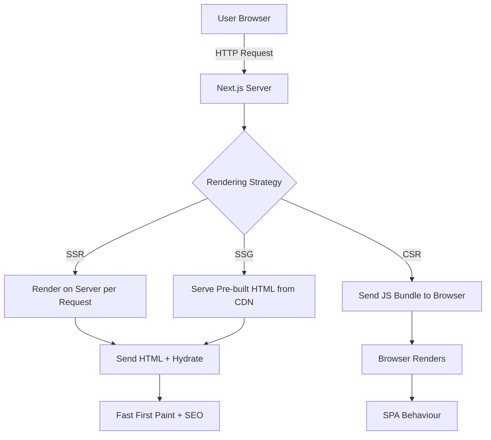

# Day 1 [Beginner]: What is Next.js and Why Use It

## Index

- [Goal](#goal)
- [Prerequisites](#prerequisites)
- [Explanation](#explanation)
- [Topic by Topic](#topic-by-topic)
- [Key Concepts](#key-concepts)
- [Visual Concept Map](#visual-concept-map)
- [End-to-End Practical](#end-to-end-practical)
- [Hands-on Coding](#hands-on-coding)
- [Mini Exercise](#mini-exercise)
- [Assessment Quiz](#assessment-quiz)
- [Task](#task)
- [Self Check](#self-check)
- [Interview Questions and Answers](#interview-questions-and-answers)
- [Day 1 Outcome](#day-1-outcome)

## Goal

Understand what Next.js is, how it differs from plain React, and why it is a popular choice for modern web applications.

## Prerequisites

- Basic JavaScript knowledge
- Node.js installed (v18+)
- VS Code installed

## Explanation

Next.js is a React framework built by Vercel that adds powerful features on top of React — things React alone does not provide out of the box. When you write a plain React app, you get a Single Page Application (SPA) that runs entirely in the browser. This works well for dashboards and internal tools, but it has limitations for public-facing sites: poor SEO because search engines see an empty HTML shell, slow initial load because JavaScript must download and run before anything appears, and no built-in routing or data fetching conventions.

Next.js solves these problems by offering server-side rendering (SSR), static site generation (SSG), and the newer App Router with React Server Components. With SSR, the HTML is generated on the server for every request so the browser gets a fully-formed page immediately — great for SEO and perceived performance. With SSG, pages are pre-built at deploy time into static HTML files that can be served from a CDN at blazing speed.

Beyond rendering, Next.js gives you file-based routing (no need to install React Router), API routes so you can write backend logic in the same project, image and font optimisation built-in, TypeScript support with zero config, and a rich ecosystem of official examples. This is why Next.js has become the de-facto standard for production React applications.

## Topic by Topic

### Topic 1: React vs Next.js

Theory:
React is a UI library — it only handles the view layer. Next.js is a full-stack React framework that adds routing, data fetching, server rendering, and more on top of React.

Practical:
Think of React as an engine and Next.js as the complete car — it includes the engine (React) plus the chassis, transmission, and navigation system.

Code Example:

```jsx
// Plain React app - you manage routing, data fetching, etc. yourself
import { useState, useEffect } from "react";

export default function App() {
  const [data, setData] = useState(null);

  // Must manually fetch data on component load
  useEffect(() => {
    fetch("/api/data")
      .then((r) => r.json())
      .then(setData);
  }, []);

  return <div>{data ? data.message : "Loading..."}</div>;
}
```

**Explanation:** In plain React (without a framework), you must handle routing, data fetching, code splitting, and more yourself. This works but requires more boilerplate. Next.js provides these features out of the box.
**Key Points:**
- Understand the core concept behind React vs Next.js.
- Apply it with the right Next.js feature and defaults.
- Watch for common mistakes that affect performance, SEO, or maintainability.


### Topic 2: Server-side Rendering (SSR)

Theory:
With SSR, Next.js runs your React components on the server and sends ready-made HTML to the browser. This means faster first paint and better SEO.

Practical:
Every time a user visits the page, the server fetches fresh data and renders HTML before sending the response.

Code Example:

```tsx
// app/page.tsx — Server Component fetches data on the server
async function getData() {
  // This runs on the server, not the browser
  const res = await fetch("https://api.example.com/posts", {
    cache: "no-store", // Fetch fresh data every time
  });
  return res.json();
}

export default async function Page() {
  const posts = await getData(); // Data fetched before rendering

  return (
    <ul>
      {posts.map((p: { id: number; title: string }) => (
        <li key={p.id}>{p.title}</li>
      ))}
    </ul>
  );
}
```

**Explanation:** Next.js Server Components fetch data on the server before rendering. The user receives fully-formed HTML immediately (good for SEO). No client-side loading spinner needed. The `cache: "no-store"` option prevents caching so fresh data loads each time.
**Key Points:**
- Understand the core concept behind Server-side Rendering (SSR).
- Apply it with the right Next.js feature and defaults.
- Watch for common mistakes that affect performance, SEO, or maintainability.


### Topic 3: Static Site Generation (SSG)

Theory:
With SSG, pages are built into static HTML at build time. These files are then served from a CDN — extremely fast and cheap to host.

Practical:
Use SSG for content that does not change on every request: marketing pages, blog posts, documentation.

Code Example:

```tsx
// app/about/page.tsx — no dynamic fetching, builds to static HTML
export default function AboutPage() {
  return (
    <main>
      <h1>About Us</h1>
      <p>We build great software.</p>
    </main>
  );
}
```

**Explanation:** This page has no dynamic data, so Next.js builds it to static HTML at deploy time. The HTML is served instantly from a CDN - no server rendering needed per request. This is the fastest option for static content.
**Key Points:**
- Understand the core concept behind Static Site Generation (SSG).
- Apply it with the right Next.js feature and defaults.
- Watch for common mistakes that affect performance, SEO, or maintainability.


### Topic 4: File-based Routing

Theory:
In Next.js, the folder structure inside the `app/` directory defines the URL structure automatically. No need to configure a router.

Practical:
Create `app/about/page.tsx` and Next.js automatically creates the `/about` route.

Code Example:

```
app/
  page.tsx          → /           (homepage)
  about/
    page.tsx        → /about      (nested route)
  blog/
    page.tsx        → /blog       (blog list)
    [slug]/
      page.tsx      → /blog/:slug (dynamic blog post)
```

**Explanation:** File structure automatically creates routes. No router configuration needed. Each folder becomes a URL segment. `[slug]` creates a dynamic segment. This structure mirrors the URL hierarchy naturally.
**Key Points:**
- Understand the core concept behind File-based Routing.
- Apply it with the right Next.js feature and defaults.
- Watch for common mistakes that affect performance, SEO, or maintainability.


### Topic 5: App Router vs Pages Router

Theory:
Next.js has two routing systems. The older Pages Router (`pages/` directory) and the newer App Router (`app/` directory) introduced in Next.js 13. The App Router supports React Server Components and is the recommended approach today.

Practical:
New projects should use the App Router. You may encounter the Pages Router in older codebases.

Code Example:

```tsx
// App Router: app/page.tsx
export default function Home() {
  return <h1>Home (App Router)</h1>;
}

// Pages Router equivalent: pages/index.tsx
export default function Home() {
  return <h1>Home (Pages Router)</h1>;
}
```
**Explanation:**
This topic explains App Router vs Pages Router in practical Next.js terms so you can build correct routing, rendering, and data flow patterns in real applications.

**Key Points:**
- Understand the core concept behind App Router vs Pages Router.
- Apply it with the right Next.js feature and defaults.
- Watch for common mistakes that affect performance, SEO, or maintainability.


### Topic 6: API Routes

Theory:
Next.js lets you write backend API endpoints inside the same project using Route Handlers in the App Router. No separate server needed.

Practical:
Create `app/api/hello/route.ts` and it becomes a REST endpoint at `/api/hello`.

Code Example:

```tsx
// app/api/hello/route.ts
import { NextResponse } from "next/server";

export async function GET() {
  return NextResponse.json({ message: "Hello from Next.js API!" });
}
```
**Explanation:**
This topic explains API Routes in practical Next.js terms so you can build correct routing, rendering, and data flow patterns in real applications.

**Key Points:**
- Understand the core concept behind API Routes.
- Apply it with the right Next.js feature and defaults.
- Watch for common mistakes that affect performance, SEO, or maintainability.


### Topic 7: Deployment and Vercel

Theory:
Next.js is created by Vercel and deploys to Vercel with zero configuration. It also supports deployment to any Node.js server or as a Docker container.

Practical:
Push your code to GitHub, connect the repo to Vercel, and your app is live in minutes with automatic deployments on every push.

Code Example:

```bash
# Deploy with Vercel CLI
npx vercel
# Or push to GitHub and connect at vercel.com
```
**Explanation:**
This topic explains Deployment and Vercel in practical Next.js terms so you can build correct routing, rendering, and data flow patterns in real applications.

**Key Points:**
- Understand the core concept behind Deployment and Vercel.
- Apply it with the right Next.js feature and defaults.
- Watch for common mistakes that affect performance, SEO, or maintainability.


## Key Concepts

- **Framework**: A structured set of tools and conventions built on top of a library (Next.js is a framework built on React).
- **SSR (Server-Side Rendering)**: HTML is generated on the server per request, giving fast first paint and SEO benefits.
- **SSG (Static Site Generation)**: HTML is generated at build time and served as static files from a CDN.
- **App Router**: The modern Next.js routing system based on the `app/` directory and React Server Components.
- **React Server Components (RSC)**: Components that run only on the server, reducing JavaScript sent to the browser.
- **File-based Routing**: Routes are determined by the file and folder structure, not manual configuration.
- **Route Handler**: A server-side API endpoint defined as a file inside `app/api/`.
- **Hydration**: The process where React attaches event listeners to server-rendered HTML in the browser.

## Visual Concept Map



## End-to-End Practical

1. Visit the official Next.js website at nextjs.org and read the "Why Next.js" section.
2. Compare a plain Create React App output in the browser DevTools (view source) vs a Next.js app — notice the difference in the HTML sent.
3. Create a new Next.js project with `npx create-next-app@latest my-app` and choose the App Router option.
4. Open the `app/page.tsx` file and observe the default server component structure.
5. Run `npm run dev` and open `http://localhost:3000` — notice the page loads instantly with pre-rendered HTML.
6. View the page source and observe that the HTML is fully populated (unlike a plain React SPA).
7. Open DevTools Network tab and inspect the initial HTML response to understand what the server sends.

## Hands-on Coding

### Example 1: Your First Next.js Page

Create a simple homepage that shows a welcome message.

```tsx
// app/page.tsx
export default function HomePage() {
  return (
    <main style={{ padding: "2rem", fontFamily: "sans-serif" }}>
      <h1>Welcome to My Next.js App</h1>
      <p>This page was rendered on the server.</p>
    </main>
  );
}
```

### Example 2: Adding a Second Page

Add an About page to understand file-based routing.

```tsx
// app/about/page.tsx
export default function AboutPage() {
  return (
    <main style={{ padding: "2rem" }}>
      <h1>About</h1>
      <p>Next.js automatically creates routes from files.</p>
      <a href="/">← Back to Home</a>
    </main>
  );
}
```

### Example 3: A Simple API Route

Create a GET endpoint that returns JSON data.

```tsx
// app/api/status/route.ts
import { NextResponse } from "next/server";

export async function GET() {
  return NextResponse.json({
    status: "ok",
    framework: "Next.js",
    version: 14,
    timestamp: new Date().toISOString(),
  });
}
```

## Mini Exercise

Scenario:
You want to understand the difference between what a browser receives from a Next.js app vs a plain React app.

Steps:

1. Create a new Next.js app with `npx create-next-app@latest mini-exercise --typescript --app --no-tailwind`.
2. Run `npm run dev` and open `http://localhost:3000`.
3. Right-click the page and choose "View Page Source".
4. Look for the `<h1>` tag — you should see it in the raw HTML (SSR/SSG).
5. Compare this to a CRA app where the body is just `<div id="root"></div>`.

Expected output:

- The Next.js page source contains visible text content in the HTML.
- The `<h1>` heading is present in the raw HTML source.
- This confirms the server sent pre-rendered HTML, not just a JS bundle.

## Assessment Quiz

### Quiz Questions

1. What does Next.js add on top of React?
2. What is the difference between SSR and SSG?
3. Which directory does the App Router use?
4. How does file-based routing work in Next.js?
5. What is a Route Handler in the App Router?

### Quiz Answers

1. Next.js adds server-side rendering, static generation, file-based routing, API routes, image/font optimisation, and more on top of React.
2. SSR generates HTML on the server per request; SSG generates HTML at build time and serves static files. SSR is fresher, SSG is faster to serve.
3. The App Router uses the `app/` directory.
4. Each folder inside `app/` maps to a URL segment. A `page.tsx` file inside that folder makes it a publicly accessible route.
5. A Route Handler is a server-side API endpoint defined in a `route.ts` file inside `app/api/` (or any folder), handling HTTP methods like GET and POST.

## Task

- Create a Next.js project using `create-next-app` with TypeScript and the App Router.
- Add a `/about` page and a `/contact` page.
- Create an API route at `/api/hello` that returns `{ message: "Hello World" }`.
- View the page source of each page to confirm server-rendered HTML.
- Read the official Next.js "Getting Started" docs page.

## Self Check

- Can you explain what SSR and SSG mean in plain words?
- Do you know how file-based routing works in the `app/` directory?
- Have you successfully created a Next.js project and run it locally?
- Do you understand why Next.js is preferred over plain React for production apps?
- Can you create a basic API route that returns JSON?

## Interview Questions and Answers

### Beginner

**Question:** What is Next.js and how does it differ from React?
**Answer:** Next.js is a React framework that adds server-side rendering, file-based routing, API routes, and optimisations. React is a library for building UI; Next.js is the full toolkit for building production web apps with React.

**Question:** What is the difference between client-side rendering and server-side rendering?
**Answer:** In CSR, the browser downloads a JavaScript bundle and renders HTML on the client. In SSR, the server renders HTML and sends it to the browser — the user sees content faster and search engines can crawl it.

### Middle

**Question:** When would you choose SSG over SSR in Next.js?
**Answer:** Choose SSG when content does not change per request (e.g. blog posts, marketing pages) — it gives maximum performance via CDN. Choose SSR when you need fresh data on every request (e.g. dashboards, personalised pages).

**Question:** What are React Server Components and how does Next.js use them?
**Answer:** RSCs are React components that run only on the server. They can fetch data directly, access databases, and do not send JavaScript to the browser. Next.js App Router makes all components Server Components by default.

### Advanced

**Question:** Explain the hydration process and potential hydration mismatch errors.
**Answer:** Hydration is when React attaches event handlers and state to server-rendered HTML in the browser. A mismatch error occurs when the server-rendered HTML differs from what React tries to render on the client — this can happen with dates, random values, or incorrect `use client` usage.

**Question:** How does the App Router differ architecturally from the Pages Router?
**Answer:** The App Router is built around React Server Components and uses nested layouts with the `layout.tsx` file. It supports streaming, Suspense boundaries, and parallel/intercepting routes natively. The Pages Router uses `getServerSideProps`/`getStaticProps` functions and does not support RSC.

## Day 1 Outcome

- You understand what Next.js is and why it exists.
- You can explain the difference between SSR, SSG, and CSR.
- You know how the App Router's file-based routing works at a high level.
- You have created and run a Next.js project locally.
- You are ready to dive into project setup in Day 2.
