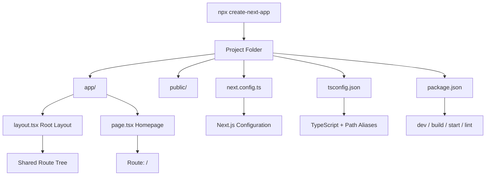

# Day 2 [Beginner]: Installation and Project Setup

## Goal

Set up a fully functional Next.js project with TypeScript, understand the generated folder structure, and run the development server confidently.

## Prerequisites

- Completed Day 1: What is Next.js and Why Use It
- Node.js 20.9+ recommended for current Next.js releases
- npm, pnpm, yarn, or another supported package manager available

## Explanation

Creating a Next.js project is straightforward using the official CLI tool `create-next-app`. It scaffolds a working application and lets you choose options such as TypeScript, ESLint, Tailwind CSS, and the App Router. For a new application, the App Router is the modern approach and is used throughout this tutorial.

The generated project typically contains an `app/` directory for routes, layouts, loading and error UI, and Route Handlers. The `public/` directory is for static files that should be referenced from the site root. Configuration files such as `next.config.ts`, `tsconfig.json`, and `package.json` control framework, TypeScript, and dependency settings.

A useful distinction is that the generated files are conventions, not a requirement that every project must contain exactly the same folders. For example, a `components/` directory is commonly created by the developer; it is not an automatically required Next.js directory. Likewise, Tailwind configuration files depend on the Tailwind setup/version selected during project creation.

TypeScript can be enabled during project creation. The generated `tsconfig.json` normally includes a path alias such as `@/*`, but the exact configuration should be treated as project configuration rather than a special Next.js language feature. Use aliases consistently, but do not assume every project uses the same alias.

## Topic by Topic

### Topic 1: create-next-app CLI

Theory:
`create-next-app` is the official scaffolding tool for starting a Next.js application. It can create the project interactively or accept command-line options for repeatable setup.

Practical:
Run `npx create-next-app@latest` and choose TypeScript and the App Router. Current projects may also use ESLint and Tailwind CSS depending on the project's needs.

Code Example:

```bash
# Create a new Next.js project with the official CLI
npx create-next-app@latest my-app

# Typical choices for this tutorial:
# TypeScript → Yes
# ESLint → Yes
# Tailwind CSS → optional, Yes if following the styling track
# App Router → Yes
# src/ directory → either choice is valid; this tutorial uses the root app/
```

**Explanation:** `create-next-app` creates the initial project structure and installs the selected dependencies. The exact prompts can change between Next.js releases, so follow the current CLI prompts rather than memorising a fixed list. For this course, TypeScript and App Router are the important choices.
**Key Points:**
- Understand the purpose of create-next-app.
- Prefer the App Router for new applications in this course.
- Treat CLI prompts as version-dependent rather than permanent.

### Topic 2: Folder Structure Overview

Theory:
The generated project has a clear structure. `app/` contains App Router route files and special files, `public/` holds static assets, and a `components/` directory can be created by you for reusable UI. Configuration files live at the project root.

Practical:
Recognise each file's role so you know where to put new code.

Code Example:

```text
my-app/
├── app/
│   ├── layout.tsx      ← Root layout
│   ├── page.tsx        ← Homepage at /
│   └── globals.css     ← Global styles
├── public/             ← Static files served from the site root
├── components/         ← Optional developer-created reusable UI
├── next.config.ts      ← Next.js configuration
├── tsconfig.json       ← TypeScript configuration
├── package.json        ← Dependencies and scripts
└── eslint.config.mjs   ← ESLint configuration in current setups
```

**Explanation:** `app/` is the core routing area for the App Router. `layout.tsx` provides shared UI and document structure, while `page.tsx` makes a route accessible. `public/` is for files such as images that you want to reference directly by URL. `components/` is a convention, not a special Next.js directory.
**Key Points:**
- Understand the purpose of the generated directories and configuration files.
- Do not assume every optional directory or configuration file is generated in every Next.js release.
- Learn the special App Router files before adding custom abstractions.

### Topic 3: app/layout.tsx — The Root Layout

Theory:
`app/layout.tsx` is the required root layout for an App Router application. It wraps the application's routes and normally renders the `<html>` and `<body>` elements. Layouts can preserve shared UI during navigation and can define metadata.

Practical:
Use the root layout for global styles, fonts, site-wide navigation, providers, and metadata that applies broadly to the application.

Code Example:

```tsx
// app/layout.tsx
import type { Metadata } from "next";
import "./globals.css";

export const metadata: Metadata = {
  title: "My Next.js App",
  description: "A learning project built with Next.js",
};

export default function RootLayout({
  children,
}: Readonly<{
  children: React.ReactNode;
}>) {
  return (
    <html lang="en">
      <body>{children}</body>
    </html>
  );
}
```

**Explanation:** The root layout is a Server Component by default and can export static metadata. It should not be turned into a Client Component just to add ordinary server-rendered layout UI. If a small interactive part needs browser APIs or state, isolate that part into a Client Component instead.

**Key Points:**
- The root layout wraps the application's route tree.
- The root layout normally owns `<html>` and `<body>`.
- Keep the layout server-rendered unless client-only behaviour is genuinely required.

### Topic 4: app/page.tsx — The Homepage

Theory:
`app/page.tsx` is the page component for the `/` route. In the App Router, pages are Server Components by default, although their rendering and data behaviour can vary based on the code used by the route.

Practical:
Replace the starter page with your own content and keep it server-rendered when it does not need browser-only APIs, event handlers, or client hooks.

Code Example:

```tsx
// app/page.tsx
export default function HomePage() {
  return (
    <main>
      <h1>Hello, Next.js!</h1>
      <p>Welcome to Day 2 of the Next.js tutorial.</p>
    </main>
  );
}
```

**Explanation:** `page.tsx` defines the UI for a route. Being a Server Component by default does not mean the route is always rendered with one fixed strategy such as SSR; Next.js can statically render or dynamically render routes depending on their data, APIs, configuration, and runtime requirements.

**Key Points:**
- `app/page.tsx` maps to `/`.
- Server Components are the default in the App Router.
- Component type and rendering strategy are related concepts, but they are not identical.

### Topic 5: next.config.ts

Theory:
`next.config.ts` is the project's Next.js configuration file. It can configure framework behaviour such as image remote patterns, redirects, rewrites, headers, and other supported options. Environment secrets should not be placed directly in this file or committed to source control.

Practical:
Start with the defaults and add configuration only when a real application requirement calls for it. Prefer the documented current option names for the installed Next.js version.

Code Example:

```ts
// next.config.ts
import type { NextConfig } from "next";

const nextConfig: NextConfig = {
  images: {
    remotePatterns: [
      {
        protocol: "https",
        hostname: "images.unsplash.com",
      },
    ],
  },
};

export default nextConfig;
```

**Explanation:** `remotePatterns` restricts which remote image sources the Next.js Image component can optimise. Configuration should be as specific as practical. Avoid allowing broad wildcard sources unless the application genuinely requires them.

**Key Points:**
- Use `next.config.ts` for supported Next.js configuration.
- Prefer `remotePatterns` for explicitly allowed remote image sources.
- Never commit API keys or other secrets to configuration files.

### Topic 6: Scripts in package.json

Theory:
A typical project has `dev` for local development, `build` for creating a production build, and `start` for serving that production build. A current Next.js project should use a direct ESLint command for linting; `next lint` is not the current approach in Next.js 16.

Practical:
Use `npm run dev` while developing. Before deployment, run `npm run build` and test the production server with `npm start` when using a Node.js deployment that supports `next start`.

Code Example:

```json
{
  "scripts": {
    "dev": "next dev",
    "build": "next build",
    "start": "next start",
    "lint": "eslint"
  }
}
```

**Explanation:** Development and production commands have different purposes. A production build can expose problems that are not obvious during development. In current Next.js releases, linting is handled directly through ESLint rather than the removed `next lint` command.

**Key Points:**
- `next dev` starts development mode.
- `next build` creates the production build.
- `next start` serves a production build in a Node.js deployment.
- Use the current ESLint CLI instead of `next lint` in Next.js 16.

### Topic 7: TypeScript Path Aliases

Theory:
The generated `tsconfig.json` commonly defines `@/*` as an alias for the project root. The alias is configured through TypeScript's `paths` option and can make imports easier to maintain.

Practical:
Use the alias consistently if your project has it configured. Do not say that every Next.js project must use `@/*`; aliases are a project choice.

Code Example:

```tsx
// Without alias — relative path
import Button from "../../../components/Button";

// With a project-configured alias
import Button from "@/components/Button";
```

**Explanation:** Path aliases reduce the number of `../` segments and make refactoring easier. The exact alias depends on `tsconfig.json` or `jsconfig.json`, so verify the project's configuration before using it.

**Key Points:**
- Path aliases are configured in TypeScript/JavaScript project configuration.
- `@/*` is common, but it is not mandatory.
- Keep imports consistent throughout the project.

### Topic 8: ESLint Configuration

Theory:
Current Next.js projects can use ESLint directly with `eslint-config-next`. Next.js 16 removed the `next lint` command, so linting should be configured and run through ESLint itself.

Practical:
Keep an ESLint configuration file at the project root and run `npm run lint`. The exact generated configuration can vary with the Next.js version and whether TypeScript is enabled.

Code Example:

```js
// eslint.config.mjs
import { defineConfig, globalIgnores } from "eslint/config";
import nextVitals from "eslint-config-next/core-web-vitals";
import nextTs from "eslint-config-next/typescript";

export default defineConfig([
  ...nextVitals,
  ...nextTs,
  globalIgnores([
    ".next/**",
    "out/**",
    "build/**",
    "next-env.d.ts",
  ]),
]);
```

**Explanation:** ESLint analyses source code and reports problems according to the project's configuration. The configuration above follows the current flat-config style and combines Next.js Core Web Vitals and TypeScript rules. If `create-next-app` generates a slightly different configuration for your installed version, keep the generated version unless you have a specific reason to customise it.

**Key Points:**
- ESLint is a separate linting tool; Next.js integrates with it through configuration.
- Do not use the removed `next lint` command with Next.js 16.
- Keep generated configuration aligned with the installed Next.js/ESLint versions.

## Key Concepts

- **create-next-app**: The official CLI for scaffolding a new Next.js project.
- **App Router**: The modern routing architecture based on the `app/` directory and React Server Components.
- **Root Layout**: The `app/layout.tsx` file that provides shared structure for the route tree.
- **next.config.ts**: The configuration file for supported Next.js behaviour such as image sources, redirects, rewrites, and headers.
- **Path Alias**: A configured import shortcut such as `@/*`; the exact alias is project-specific.
- **TypeScript**: A typed superset of JavaScript supported directly by Next.js.
- **ESLint**: A static analysis tool used to identify code-quality and framework-specific issues.
- **Development Server**: The server started with `npm run dev` for local development.
- **Production Build**: The optimised output created by `next build` for a supported deployment target.

## Visual Concept Map



## End-to-End Practical

1. Open a terminal and run `npx create-next-app@latest learning-nextjs`.
2. Choose TypeScript and the App Router. Choose ESLint and Tailwind CSS if you want them for this tutorial.
3. `cd learning-nextjs` and open the project in VS Code with `code .`.
4. Open `app/layout.tsx` and read through the root layout structure.
5. Open `app/page.tsx` and replace its contents with a simple `<h1>Hello World</h1>`.
6. Run `npm run dev` and visit `http://localhost:3000`.
7. Inspect `package.json`, `tsconfig.json`, and `next.config.ts` to understand their roles.
8. Run `npm run lint` and fix any reported issues.
9. Run `npm run build` to create a production build.
10. Run `npm start` and test the production build locally.

## Hands-on Coding

### Example 1: Custom Root Layout with Navigation

Add a shared navigation bar in the root layout. Use `Link` for internal navigation so Next.js can provide client-side navigation behaviour.

```tsx
// app/layout.tsx
import type { Metadata } from "next";
import Link from "next/link";
import "./globals.css";

export const metadata: Metadata = {
  title: "Learning Next.js",
  description: "Day 2 - Project Setup",
};

export default function RootLayout({
  children,
}: Readonly<{
  children: React.ReactNode;
}>) {
  return (
    <html lang="en">
      <body>
        <header style={{ padding: "1rem" }}>
          <nav>
            <Link href="/" style={{ marginRight: "1rem" }}>
              Home
            </Link>
            <Link href="/about">About</Link>
          </nav>
        </header>
        <main style={{ padding: "2rem" }}>{children}</main>
      </body>
    </html>
  );
}
```

### Example 2: Homepage with Metadata

```tsx
// app/page.tsx
import type { Metadata } from "next";

export const metadata: Metadata = {
  title: "Home | Learning Next.js",
};

export default function HomePage() {
  return (
    <main>
      <h1>Welcome to My Next.js App</h1>
      <p>This page is a Server Component by default.</p>
    </main>
  );
}
```

### Example 3: next.config.ts with Multiple Settings

```ts
// next.config.ts
import type { NextConfig } from "next";

const nextConfig: NextConfig = {
  images: {
    remotePatterns: [
      { protocol: "https", hostname: "images.unsplash.com" },
      { protocol: "https", hostname: "avatars.githubusercontent.com" },
    ],
  },
  async headers() {
    return [
      {
        source: "/(.*)",
        headers: [{ key: "X-Frame-Options", value: "DENY" }],
      },
    ];
  },
};

export default nextConfig;
```

## Mini Exercise

Scenario:
You need to add a new route `/services` to your app and share a common header across all pages.

Steps:

1. Create the folder `app/services/` and add a `page.tsx` file inside it.
2. Add an `<h1>Our Services</h1>` heading to that page.
3. Open `app/layout.tsx` and add a `Link` to `/services`.
4. Run `npm run dev` and visit `http://localhost:3000/services`.
5. Confirm the header from the layout appears on the services page.

Expected output:

- Visiting `/services` renders the "Our Services" heading.
- The shared navigation from the layout is visible on all pages.
- No separate router configuration was needed because the App Router uses file-system conventions.

## Assessment Quiz

### Quiz Questions

1. What command do you run to create a new Next.js project?
2. What is the purpose of `app/layout.tsx`?
3. What does the `@/*` path alias usually map to?
4. Which scripts are used for development and production?
5. Where do you configure allowed external image sources?

### Quiz Answers

1. `npx create-next-app@latest` (or the equivalent command for another supported package manager).
2. It is the root layout that wraps the application's route tree and normally renders `<html>` and `<body>`.
3. In the common generated configuration, `@/*` maps to the project root, but the exact alias is determined by `tsconfig.json`.
4. `npm run dev` starts development mode; `npm run build` creates a production build; `npm start` serves that build in a Node.js deployment.
5. In `next.config.ts` under `images.remotePatterns` for the Next.js Image optimisation configuration.

## Task

- Create a new Next.js project with TypeScript, ESLint, and the App Router.
- Customise the root layout with a navigation header using `next/link`.
- Create three pages: Home, About, and Contact.
- Inspect the generated `tsconfig.json` and use the configured path alias in at least one import.
- Run `npm run lint` and fix any issues.
- Run the production build and inspect the output.

## Self Check

- Can you scaffold a new Next.js project from scratch?
- Do you understand the role of each top-level file and folder?
- Can you explain what the root layout does?
- Do you know how to add a new page to the App Router?
- Can you explain why `next lint` should not be used in a current Next.js 16 project?
- Have you run both the development and production builds?

## Interview Questions and Answers

### Beginner

**Question:** What does `create-next-app` generate?
**Answer:** It scaffolds a Next.js application with the selected options, such as the App Router, TypeScript, ESLint, and styling tools. The exact generated files can vary by Next.js release and CLI choices.

**Question:** What is the `app/layout.tsx` file and why is it required?
**Answer:** It is the root layout for an App Router application. It wraps the route tree and normally renders the `<html>` and `<body>` elements. It is also a natural place for global styles, fonts, shared UI, and metadata.

### Middle

**Question:** How do you share UI across all pages in the App Router?
**Answer:** Put shared UI such as navigation or a footer in an appropriate layout, commonly `app/layout.tsx` for application-wide UI. The layout renders its `children` so the active route appears inside it.

**Question:** What is the difference between `npm run dev` and `npm run build && npm start`?
**Answer:** `npm run dev` starts development mode with development tooling and fast feedback. `npm run build` creates the production build, and `npm start` serves that build in a Node.js deployment. Production behaviour can differ from development, so testing the production build is valuable.

### Advanced

**Question:** How would you configure Next.js to allow images from a new external source?
**Answer:** Add a specific `remotePatterns` entry in `next.config.ts` under `images`, including the required protocol and hostname. Keep the pattern as narrow as practical rather than allowing arbitrary remote hosts.

**Question:** What is the significance of the `"use client"` directive and when does it appear in a fresh Next.js project?
**Answer:** `"use client"` marks a module as a Client Component entry point, allowing React client features such as state, effects, event handlers, and browser APIs. It is not required for ordinary pages or layouts because App Router components are Server Components by default. Add it only where client-side behaviour is needed.

## Day 2 Outcome

- You can create a new Next.js project using `create-next-app`.
- You understand the purpose of the main generated files and folders.
- You know how to customise the root layout for shared UI and metadata.
- You understand that Server Components and rendering strategy are related but distinct concepts.
- You can run development, lint, and production build commands using current Next.js conventions.
- You are ready to explore file-based routing in Day 3.
