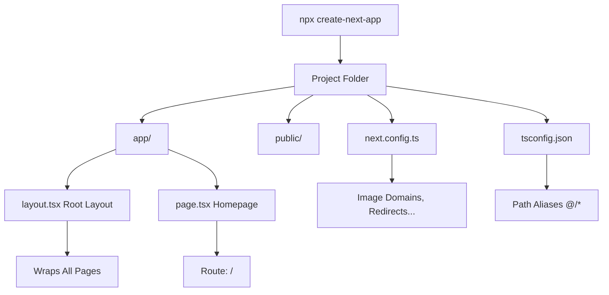

# Day 2 [Beginner]: Installation and Project Setup

## Index

- [Goal](#goal)
- [Prerequisites](#prerequisites)
- [Explanation](#explanation)
- [Topic by Topic](#topic-by-topic)
- [Key Concepts](#key-concepts)
- [Visual Concept Map](#visual-concept-map)
- [End-to-End Practical](#end-to-end-practical)
- [Hands-on Coding](#hands-on-coding)
- [Mini Exercise](#mini-exercise)
- [Assessment Quiz](#assessment-quiz)
- [Task](#task)
- [Self Check](#self-check)
- [Interview Questions and Answers](#interview-questions-and-answers)
- [Day 2 Outcome](#day-2-outcome)

## Goal

Set up a fully functional Next.js project with TypeScript, understand the generated folder structure, and run the development server confidently.

## Prerequisites

- Completed Day 1: What is Next.js and Why Use It
- Node.js v18+ installed
- npm or pnpm available

## Explanation

Creating a Next.js project is straightforward using the official CLI tool `create-next-app`. This command scaffolds everything you need: the folder structure, TypeScript configuration, ESLint, and a sample homepage. Understanding what each generated file does will help you navigate and customise your project confidently.

The project you get after running the CLI is a working Next.js application. The `app/` directory is the heart of the App Router — every page, layout, and API route lives here. The `public/` directory holds static assets like images and fonts that are served directly at the root URL. The `next.config.js` (or `.ts`) file is where you tweak Next.js behaviour.

TypeScript is configured automatically when you choose it during setup. The `tsconfig.json` file comes pre-configured with path aliases (`@/*` pointing to the root) so you can import files with `@/components/Button` instead of `../../components/Button`. This is a small but very developer-friendly touch.

## Topic by Topic

### Topic 1: create-next-app CLI

Theory:
`create-next-app` is the official scaffolding tool. It asks a series of questions to customise the setup, then creates all the files you need.

Practical:
Run `npx create-next-app@latest` (or `pnpm create next-app`) and answer the prompts.

Code Example:

```bash
# Create a new Next.js project with the official CLI
npx create-next-app@latest my-app

# The CLI asks questions:
# ✔ TypeScript? → Yes (recommended for learning)
# ✔ ESLint? → Yes (catches bugs)
# ✔ Tailwind CSS? → Yes (styling framework)
# ✔ App Router? → Yes (modern routing)
```

**Explanation:** `create-next-app` is the official scaffolding tool. It asks setup questions and creates a complete project. Each option (TypeScript, Tailwind, etc.) adds useful tools. Saying "Yes" to App Router gets the modern routing system.
**Key Points:**
- Understand the core concept behind create-next-app CLI.
- Apply it with the right Next.js feature and defaults.
- Watch for common mistakes that affect performance, SEO, or maintainability.


### Topic 2: Folder Structure Overview

Theory:
The generated project has a clear structure. `app/` contains routing files, `public/` holds static files, `components/` is where you create reusable UI (you create this yourself).

Practical:
Recognise each file's role so you know where to put new code.

Code Example:

```
my-app/
├── app/
│   ├── layout.tsx      ← Root layout, wraps all pages
│   ├── page.tsx        ← Homepage at /
│   └── globals.css     ← Global styles
├── public/             ← Static files (images, fonts)
│   └── next.svg
├── next.config.ts      ← Next.js configuration
├── tsconfig.json       ← TypeScript configuration
├── package.json        ← Dependencies and scripts
└── tailwind.config.ts  ← Tailwind CSS config (if chosen)
```

**Explanation:** `app/` is the core of your app. `layout.tsx` wraps every page. `page.tsx` is the route component. `public/` holds static files accessible at root URL. Config files set up TypeScript and Tailwind.
**Key Points:**
- Understand the core concept behind Folder Structure Overview.
- Apply it with the right Next.js feature and defaults.
- Watch for common mistakes that affect performance, SEO, or maintainability.


### Topic 3: app/layout.tsx — The Root Layout

Theory:
`layout.tsx` at the root of `app/` is the root layout. It wraps every page in your app. It must export an HTML structure with `<html>` and `<body>` tags.

Practical:
Add global navigation or a font provider here so it appears on every page.

Code Example:

```tsx
// app/layout.tsx
import type { Metadata } from "next";
import "./globals.css";

export const metadata: Metadata = {
  title: "My Next.js App",
  description: "Built with Next.js 14",
};

export default function RootLayout({
  children,
}: {
  children: React.ReactNode;
}) {
  return (
    <html lang="en">
      <body>{children}</body>
    </html>
  );
}
```
**Explanation:**
This topic explains app/layout.tsx — The Root Layout in practical Next.js terms so you can build correct routing, rendering, and data flow patterns in real applications.

**Key Points:**
- Understand the core concept behind app/layout.tsx — The Root Layout.
- Apply it with the right Next.js feature and defaults.
- Watch for common mistakes that affect performance, SEO, or maintainability.


### Topic 4: app/page.tsx — The Homepage

Theory:
`app/page.tsx` is the homepage component rendered at the `/` route. It is a Server Component by default — it runs on the server.

Practical:
Replace the default content with your own to start building.

Code Example:

```tsx
// app/page.tsx
export default function HomePage() {
  return (
    <main>
      <h1>Hello, Next.js!</h1>
      <p>Welcome to Day 2 of the Next.js tutorial.</p>
    </main>
  );
}
```
**Explanation:**
This topic explains app/page.tsx — The Homepage in practical Next.js terms so you can build correct routing, rendering, and data flow patterns in real applications.

**Key Points:**
- Understand the core concept behind app/page.tsx — The Homepage.
- Apply it with the right Next.js feature and defaults.
- Watch for common mistakes that affect performance, SEO, or maintainability.


### Topic 5: next.config.ts

Theory:
`next.config.ts` is where you configure Next.js behaviour: allowed image domains, redirects, rewrites, environment variables, experimental features, etc.

Practical:
Start simple — only add to this file when you need to change default behaviour.

Code Example:

```tsx
// next.config.ts
import type { NextConfig } from "next";

const nextConfig: NextConfig = {
  images: {
    remotePatterns: [
      {
        protocol: "https",
        hostname: "images.unsplash.com",
      },
    ],
  },
};

export default nextConfig;
```
**Explanation:**
This topic explains next.config.ts in practical Next.js terms so you can build correct routing, rendering, and data flow patterns in real applications.

**Key Points:**
- Understand the core concept behind next.config.ts.
- Apply it with the right Next.js feature and defaults.
- Watch for common mistakes that affect performance, SEO, or maintainability.


### Topic 6: Scripts in package.json

Theory:
The `package.json` ships with four key scripts: `dev` (start dev server), `build` (production build), `start` (serve the production build), and `lint` (run ESLint).

Practical:
Use `npm run dev` during development and `npm run build && npm start` to test production locally.

Code Example:

```json
{
  "scripts": {
    "dev": "next dev",
    "build": "next build",
    "start": "next start",
    "lint": "next lint"
  }
}
```
**Explanation:**
This topic explains Scripts in package.json in practical Next.js terms so you can build correct routing, rendering, and data flow patterns in real applications.

**Key Points:**
- Understand the core concept behind Scripts in package.json.
- Apply it with the right Next.js feature and defaults.
- Watch for common mistakes that affect performance, SEO, or maintainability.


### Topic 7: TypeScript Path Aliases

Theory:
The default `tsconfig.json` sets up `@/*` as an alias for the project root. This lets you write clean imports like `@/components/Button` from anywhere in the project.

Practical:
Always use `@/` imports instead of relative `../../` imports for files outside the current folder.

Code Example:

```tsx
// Without alias — fragile relative path
import Button from "../../../components/Button";

// With alias — clean and unambiguous
import Button from "@/components/Button";
```
**Explanation:**
This topic explains TypeScript Path Aliases in practical Next.js terms so you can build correct routing, rendering, and data flow patterns in real applications.

**Key Points:**
- Understand the core concept behind TypeScript Path Aliases.
- Apply it with the right Next.js feature and defaults.
- Watch for common mistakes that affect performance, SEO, or maintainability.


### Topic 8: ESLint Configuration

Theory:
Next.js ships with a built-in ESLint config via `eslint-config-next` that enforces Next.js best practices, accessibility rules, and React hooks rules.

Practical:
Run `npm run lint` to check for issues. Fix them before committing code.

Code Example:

```json
// .eslintrc.json (auto-generated)
{
  "extends": ["next/core-web-vitals", "next/typescript"]
}
```
**Explanation:**
This topic explains ESLint Configuration in practical Next.js terms so you can build correct routing, rendering, and data flow patterns in real applications.

**Key Points:**
- Understand the core concept behind ESLint Configuration.
- Apply it with the right Next.js feature and defaults.
- Watch for common mistakes that affect performance, SEO, or maintainability.


## Key Concepts

- **create-next-app**: The official CLI for scaffolding a new Next.js project with sensible defaults.
- **Root Layout**: The `app/layout.tsx` file that wraps every page in the application with shared UI and metadata.
- **next.config.ts**: The configuration file for customising Next.js behaviour such as image domains and redirects.
- **Path Alias**: A shortcut like `@/*` that maps to a project directory, making imports cleaner and refactoring easier.
- **TypeScript**: A statically typed superset of JavaScript; Next.js supports it with zero extra configuration.
- **ESLint**: A static code analysis tool that catches bugs and enforces coding conventions.
- **dev server**: The local development server started with `npm run dev` that supports Hot Module Replacement (HMR).
- **HMR (Hot Module Replacement)**: A feature of the dev server that updates changed modules in the browser without a full page reload.

## Visual Concept Map



## End-to-End Practical

1. Open a terminal and run `npx create-next-app@latest learning-nextjs --typescript --eslint --tailwind --app --no-src-dir`.
2. `cd learning-nextjs` and open in VS Code with `code .`.
3. Open `app/layout.tsx` and read through the root layout structure.
4. Open `app/page.tsx` and replace its contents with a simple `<h1>Hello World</h1>`.
5. Run `npm run dev` and visit `http://localhost:3000` — see your change instantly (HMR).
6. Open `next.config.ts` and read the existing config.
7. Run `npm run build` to see the production build output and understand the page size report.
8. Run `npm start` to serve the production build locally.

## Hands-on Coding

### Example 1: Custom Root Layout with Navigation

Add a shared navigation bar in the root layout.

```tsx
// app/layout.tsx
import type { Metadata } from "next";
import "./globals.css";

export const metadata: Metadata = {
  title: "Learning Next.js",
  description: "Day 2 - Project Setup",
};

export default function RootLayout({
  children,
}: {
  children: React.ReactNode;
}) {
  return (
    <html lang="en">
      <body>
        <header
          style={{ background: "#0070f3", color: "#fff", padding: "1rem" }}
        >
          <nav>
            <a href="/" style={{ color: "#fff", marginRight: "1rem" }}>
              Home
            </a>
            <a href="/about" style={{ color: "#fff" }}>
              About
            </a>
          </nav>
        </header>
        <main style={{ padding: "2rem" }}>{children}</main>
      </body>
    </html>
  );
}
```

### Example 2: Homepage with Metadata

```tsx
// app/page.tsx
import type { Metadata } from "next";

export const metadata: Metadata = {
  title: "Home | Learning Next.js",
};

export default function HomePage() {
  return (
    <div>
      <h1>Welcome to My Next.js App</h1>
      <p>This is a statically generated page. Check the build output!</p>
    </div>
  );
}
```

### Example 3: next.config.ts with Multiple Settings

```tsx
// next.config.ts
import type { NextConfig } from "next";

const nextConfig: NextConfig = {
  // Allow images from external sources
  images: {
    remotePatterns: [
      { protocol: "https", hostname: "images.unsplash.com" },
      { protocol: "https", hostname: "avatars.githubusercontent.com" },
    ],
  },
  // Add custom response headers
  async headers() {
    return [
      {
        source: "/(.*)",
        headers: [{ key: "X-Frame-Options", value: "DENY" }],
      },
    ];
  },
};

export default nextConfig;
```

## Mini Exercise

Scenario:
You need to add a new route `/services` to your app and share a common header across all pages.

Steps:

1. Create the folder `app/services/` and add a `page.tsx` file inside it.
2. Add an `<h1>Our Services</h1>` heading to that page.
3. Open `app/layout.tsx` and add a navigation link to `/services`.
4. Run `npm run dev` and visit `http://localhost:3000/services`.
5. Confirm the header from the layout appears on the services page.

Expected output:

- Visiting `/services` renders the "Our Services" heading.
- The shared navigation from the layout is visible on all pages.
- No separate router configuration was needed — file structure defines the route.

## Assessment Quiz

### Quiz Questions

1. What command do you run to create a new Next.js project?
2. What is the purpose of `app/layout.tsx`?
3. What does the `@/*` path alias map to?
4. Which script do you run to start the development server?
5. Where do you configure allowed external image domains?

### Quiz Answers

1. `npx create-next-app@latest` (or `pnpm create next-app`).
2. It is the root layout that wraps all pages — it must include `<html>` and `<body>` tags and renders `children`.
3. `@/*` maps to the project root directory (e.g. `@/components/Button` → `./components/Button`).
4. `npm run dev` starts the development server at `http://localhost:3000`.
5. In `next.config.ts` under the `images.remotePatterns` array.

## Task

- Create a new Next.js project with TypeScript, ESLint, and Tailwind CSS.
- Customise the root layout with a navigation header.
- Create three pages: Home, About, and Contact.
- Set up path aliases and use them in at least one import.
- Run the production build and inspect the output sizes.

## Self Check

- Can you scaffold a new Next.js project from scratch?
- Do you understand the role of each top-level file and folder?
- Can you explain what the root layout does?
- Do you know how to add a new page to the app?
- Have you run both the dev and production builds?

## Interview Questions and Answers

### Beginner

**Question:** What does `create-next-app` generate?
**Answer:** It generates a complete Next.js project with the `app/` directory, `public/` folder, `next.config.ts`, `tsconfig.json`, `package.json` with scripts, and an optional Tailwind/ESLint setup.

**Question:** What is the `app/layout.tsx` file and why is it required?
**Answer:** It is the root layout component that wraps every page. It must render `<html>` and `<body>` tags and accept a `children` prop. Without it, Next.js cannot render pages.

### Middle

**Question:** How do you share UI across all pages in the App Router?
**Answer:** By adding the shared UI (like navigation or a footer) inside `app/layout.tsx`. The `children` prop renders the current page inside the layout, so any surrounding UI appears on every page.

**Question:** What is the difference between `npm run dev` and `npm run build && npm start`?
**Answer:** `npm run dev` starts a development server with HMR and source maps. `npm run build && npm start` creates an optimised production build and serves it — this reflects real production performance.

### Advanced

**Question:** How would you configure Next.js to allow images from a new external domain?
**Answer:** Add a `remotePatterns` entry in `next.config.ts` under the `images` key, specifying the `protocol` and `hostname` of the external domain.

**Question:** What is the significance of the `"use client"` directive and when does it appear in a fresh Next.js project?
**Answer:** `"use client"` marks a component as a Client Component, meaning it runs in the browser and can use hooks and browser APIs. In a fresh project, it only appears when you need interactivity — all default components are Server Components.

## Day 2 Outcome

- You can create a new Next.js project using `create-next-app`.
- You understand the purpose of every top-level file and folder.
- You know how to customise the root layout for shared UI.
- You can run both the development and production builds.
- You are ready to explore file-based routing in Day 3.
