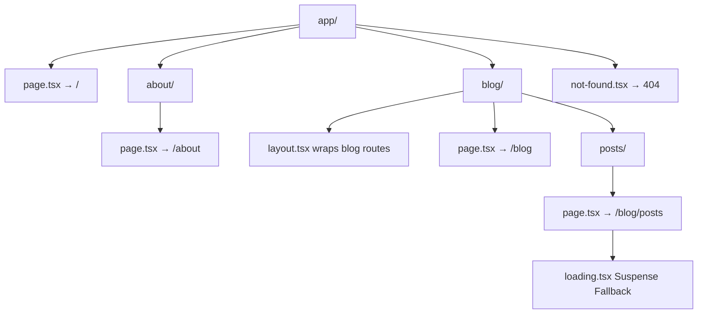

# Day 3 [Beginner]: File-based Routing Basics

## Index

- [Goal](#goal)
- [Prerequisites](#prerequisites)
- [Explanation](#explanation)
- [Topic by Topic](#topic-by-topic)
- [Key Concepts](#key-concepts)
- [Visual Concept Map](#visual-concept-map)
- [End-to-End Practical](#end-to-end-practical)
- [Hands-on Coding](#hands-on-coding)
- [Mini Exercise](#mini-exercise)
- [Assessment Quiz](#assessment-quiz)
- [Task](#task)
- [Self Check](#self-check)
- [Interview Questions and Answers](#interview-questions-and-answers)
- [Day 3 Outcome](#day-3-outcome)

## Goal

Understand how the Next.js App Router maps folder and file structure to URL routes, and create multiple routes without any router configuration.

## Prerequisites

- Completed Day 2: Installation and Project Setup
- A working Next.js project with the App Router

## Explanation

In traditional React apps, you configure routes manually using a library like React Router — you create a `<Routes>` component, list each `<Route path="..." element={...} />`, and maintain this mapping yourself. In Next.js, routing is file-based: the folder and file names inside the `app/` directory determine the URL structure automatically. This means less configuration and a structure that is easy to understand at a glance.

The key file in the App Router is `page.tsx`. When Next.js sees a `page.tsx` inside a folder, it treats that folder as a URL segment and the `page.tsx` as the component to render. So `app/blog/page.tsx` becomes accessible at `/blog`, `app/blog/posts/page.tsx` becomes `/blog/posts`, and so on. This nesting mirrors the URL hierarchy naturally.

There are other special files too: `layout.tsx` wraps children with shared UI, `loading.tsx` shows a loading skeleton while data fetches, `error.tsx` catches errors in that segment, and `not-found.tsx` renders when a route is not found. Today we focus on the basics — understanding routes and the `page.tsx` convention.

## Topic by Topic

### Topic 1: The page.tsx Convention

Theory:
Any folder inside `app/` with a `page.tsx` file becomes a publicly accessible URL route. The folder name is the URL segment.

Practical:
Create `app/contact/page.tsx` → visit `http://localhost:3000/contact`.

Code Example:

```tsx
// File: app/contact/page.tsx
export default function ContactPage() {
  return (
    <main>
      <h1>Contact Us</h1>
      <p>Send us a message at hello@example.com</p>
    </main>
  );
}

// Automatic routing: This file creates the /contact route
// No router config needed - the folder structure does it!
```

**Explanation:** Just create a folder `contact/` with a `page.tsx` file, and Next.js automatically creates the `/contact` route. No configuration. This is file-based routing - the simplest approach.
**Key Points:**
- Understand the core concept behind The page.tsx Convention.
- Apply it with the right Next.js feature and defaults.
- Watch for common mistakes that affect performance, SEO, or maintainability.


### Topic 2: Nested Routes

Theory:
Folders can be nested to create nested URL paths. Each folder in the path is one URL segment.

Practical:
`app/blog/posts/page.tsx` maps to the URL `/blog/posts`.

Code Example:

```tsx
// Folder structure:
// app/
//   blog/
//     page.tsx        → /blog
//     posts/
//       page.tsx      → /blog/posts

// app/blog/posts/page.tsx
export default function BlogPostsPage() {
  return <h1>All Blog Posts</h1>;
}
```

**Explanation:** Nested folders create nested routes. The file structure directly maps to URLs. This is intuitive - you can predict the route just by looking at the folder structure.
**Key Points:**
- Understand the core concept behind Nested Routes.
- Apply it with the right Next.js feature and defaults.
- Watch for common mistakes that affect performance, SEO, or maintainability.


### Topic 3: The Root Route

Theory:
`app/page.tsx` is the root route — it renders at `/`. There must be a `page.tsx` at the top level of `app/` to serve the homepage.

Practical:
This is the first thing visitors see when they arrive at your site.

Code Example:

```tsx
// app/page.tsx
export default function HomePage() {
  return (
    <main>
      <h1>Home Page</h1>
      <p>Welcome to the root route.</p>
    </main>
  );
}
```
**Explanation:**
This topic explains The Root Route in practical Next.js terms so you can build correct routing, rendering, and data flow patterns in real applications.

**Key Points:**
- Understand the core concept behind The Root Route.
- Apply it with the right Next.js feature and defaults.
- Watch for common mistakes that affect performance, SEO, or maintainability.


### Topic 4: Special Files — layout.tsx

Theory:
`layout.tsx` at any level wraps the `page.tsx` and all child routes at that level. It persists between route changes — React does not unmount it when navigating.

Practical:
Add a sidebar to all blog pages by creating `app/blog/layout.tsx`.

Code Example:

```tsx
// app/blog/layout.tsx
export default function BlogLayout({
  children,
}: {
  children: React.ReactNode;
}) {
  return (
    <div style={{ display: "flex", gap: "2rem" }}>
      <aside style={{ width: "200px" }}>
        <h3>Categories</h3>
        <ul>
          <li>Next.js</li>
          <li>React</li>
        </ul>
      </aside>
      <section>{children}</section>
    </div>
  );
}
```
**Explanation:**
This topic explains Special Files — layout.tsx in practical Next.js terms so you can build correct routing, rendering, and data flow patterns in real applications.

**Key Points:**
- Understand the core concept behind Special Files — layout.tsx.
- Apply it with the right Next.js feature and defaults.
- Watch for common mistakes that affect performance, SEO, or maintainability.


### Topic 5: Special Files — loading.tsx

Theory:
`loading.tsx` is automatically shown while the `page.tsx` in the same folder is loading data. It uses React Suspense under the hood.

Practical:
Add a spinner or skeleton UI inside `loading.tsx` to improve perceived performance.

Code Example:

```tsx
// app/blog/loading.tsx
export default function BlogLoading() {
  return (
    <div>
      <div
        style={{
          background: "#eee",
          height: "1.5rem",
          borderRadius: 4,
          marginBottom: "0.5rem",
        }}
      />
      <div
        style={{
          background: "#eee",
          height: "1.5rem",
          borderRadius: 4,
          width: "60%",
        }}
      />
    </div>
  );
}
```
**Explanation:**
This topic explains Special Files — loading.tsx in practical Next.js terms so you can build correct routing, rendering, and data flow patterns in real applications.

**Key Points:**
- Understand the core concept behind Special Files — loading.tsx.
- Apply it with the right Next.js feature and defaults.
- Watch for common mistakes that affect performance, SEO, or maintainability.


### Topic 6: Special Files — not-found.tsx

Theory:
`not-found.tsx` renders when a resource is not found in a route segment. Call the `notFound()` function from `next/navigation` to trigger it programmatically.

Practical:
Provide a helpful message instead of the default "404 Not Found" page.

Code Example:

```tsx
// app/not-found.tsx
export default function NotFound() {
  return (
    <main>
      <h1>404 — Page Not Found</h1>
      <p>Sorry, the page you are looking for does not exist.</p>
      <a href="/">Go Home</a>
    </main>
  );
}
```
**Explanation:**
This topic explains Special Files — not-found.tsx in practical Next.js terms so you can build correct routing, rendering, and data flow patterns in real applications.

**Key Points:**
- Understand the core concept behind Special Files — not-found.tsx.
- Apply it with the right Next.js feature and defaults.
- Watch for common mistakes that affect performance, SEO, or maintainability.


### Topic 7: Folder Structure Best Practices

Theory:
Keep route folders lean — only routing files (page, layout, loading, error) inside `app/`. Move reusable components to a top-level `components/` folder.

Practical:
Use a structure that separates routing concerns from component logic.

Code Example:

```
app/
  page.tsx
  layout.tsx
  about/
    page.tsx
  blog/
    layout.tsx
    page.tsx
    posts/
      page.tsx
components/
  Navbar.tsx
  Footer.tsx
  Card.tsx
lib/
  utils.ts
  db.ts
```
**Explanation:**
This topic explains Folder Structure Best Practices in practical Next.js terms so you can build correct routing, rendering, and data flow patterns in real applications.

**Key Points:**
- Understand the core concept behind Folder Structure Best Practices.
- Apply it with the right Next.js feature and defaults.
- Watch for common mistakes that affect performance, SEO, or maintainability.


### Topic 8: URL Segments and Path Matching

Theory:
Each folder segment in `app/` maps directly to a URL segment. Only `page.tsx` (and `route.ts` for APIs) make a segment publicly accessible — other files in the folder are not exposed.

Practical:
You can put helper files, types, and utilities alongside route files without them becoming routes.

Code Example:

```
app/
  dashboard/
    page.tsx        ← PUBLIC: /dashboard
    helpers.ts      ← NOT a route (no page.tsx)
    types.ts        ← NOT a route
    settings/
      page.tsx      ← PUBLIC: /dashboard/settings
```
**Explanation:**
This topic explains URL Segments and Path Matching in practical Next.js terms so you can build correct routing, rendering, and data flow patterns in real applications.

**Key Points:**
- Understand the core concept behind URL Segments and Path Matching.
- Apply it with the right Next.js feature and defaults.
- Watch for common mistakes that affect performance, SEO, or maintainability.


## Key Concepts

- **File-based Routing**: Routes are automatically derived from the folder and file structure inside `app/`.
- **page.tsx**: The special file that makes a folder segment a publicly accessible route.
- **Segment**: One URL path component separated by slashes (e.g. `blog` and `posts` are segments of `/blog/posts`).
- **layout.tsx**: A component that wraps child routes and persists across navigations within its subtree.
- **loading.tsx**: A Suspense fallback shown while a route segment loads.
- **not-found.tsx**: Rendered when `notFound()` is called or a route segment has no match.
- **Nested Routes**: Child folders create nested URL paths; layouts nest too.
- **Co-location**: Non-route files (components, utilities) can live inside route folders and won't become routes.

## Visual Concept Map



## End-to-End Practical

1. Inside your existing Next.js project, create `app/about/page.tsx` with an About heading.
2. Create `app/services/page.tsx` with a Services heading.
3. Create `app/services/web/page.tsx` with a Web Services heading.
4. Visit each URL in the browser to confirm the routes.
5. Create `app/blog/layout.tsx` with a sidebar and `app/blog/page.tsx`.
6. Visit `/blog` and confirm the sidebar from the layout wraps the blog page.
7. Create `app/not-found.tsx` and trigger it by visiting a non-existent URL like `/xyz`.

## Hands-on Coding

### Example 1: A Multi-page App with Nested Routes

```tsx
// app/page.tsx
export default function Home() {
  return <h1>Home — /</h1>;
}

// app/about/page.tsx
export default function About() {
  return <h1>About — /about</h1>;
}

// app/about/team/page.tsx
export default function Team() {
  return <h1>Our Team — /about/team</h1>;
}
```

### Example 2: Blog Section with Layout

```tsx
// app/blog/layout.tsx
export default function BlogLayout({
  children,
}: {
  children: React.ReactNode;
}) {
  return (
    <div className="blog-container">
      <nav className="blog-nav">
        <a href="/blog">All Posts</a>
        <a href="/blog/categories">Categories</a>
      </nav>
      <div className="blog-content">{children}</div>
    </div>
  );
}

// app/blog/page.tsx
export default function BlogIndex() {
  return <h1>Blog — /blog</h1>;
}

// app/blog/categories/page.tsx
export default function BlogCategories() {
  return <h1>Blog Categories — /blog/categories</h1>;
}
```

### Example 3: Custom Not Found Page

```tsx
// app/not-found.tsx
import Link from "next/link";

export default function NotFoundPage() {
  return (
    <div style={{ textAlign: "center", padding: "4rem" }}>
      <h1 style={{ fontSize: "6rem", margin: 0 }}>404</h1>
      <h2>Page not found</h2>
      <p>
        The page you are looking for might have been removed or does not exist.
      </p>
      <Link href="/" style={{ color: "#0070f3" }}>
        Return to Homepage
      </Link>
    </div>
  );
}
```

## Mini Exercise

Scenario:
Build the routing structure for a simple company website with the following pages: Home, About, Team (nested under About), Services, and Contact.

Steps:

1. Create `app/page.tsx` for the home page.
2. Create `app/about/page.tsx` for the about page.
3. Create `app/about/team/page.tsx` for the team page.
4. Create `app/services/page.tsx` for the services page.
5. Create `app/contact/page.tsx` for the contact page.
6. Visit each URL in the browser to confirm routing works.

Expected output:

- `/` renders the home page.
- `/about` renders the about page.
- `/about/team` renders the team page (nested under about).
- `/services` renders the services page.
- `/contact` renders the contact page.

## Assessment Quiz

### Quiz Questions

1. What filename must a folder have to become a publicly accessible route?
2. What does `app/about/team/page.tsx` map to as a URL?
3. What is the difference between `layout.tsx` and `page.tsx`?
4. How do you display a custom 404 page in Next.js App Router?
5. Can you put non-route files (like utilities) inside route folders?

### Quiz Answers

1. A folder needs a `page.tsx` file to become a publicly accessible route.
2. It maps to the URL `/about/team`.
3. `page.tsx` is the route content (unique per URL), while `layout.tsx` wraps page content with shared UI and persists across navigations.
4. Create `app/not-found.tsx` with your custom component — it renders for 404 errors automatically.
5. Yes — only files named `page.tsx` or `route.ts` create public routes. Other files in the folder are not exposed as routes.

## Task

- Create a five-page app: Home, About, Team (nested under About), Blog, and Contact.
- Add a shared layout for the Blog section with a sidebar.
- Create a custom not-found page.
- Add a loading skeleton for the Blog page.
- Test that each route works in the browser.

## Self Check

- Can you explain how file structure maps to URL routes?
- Do you know the difference between `page.tsx` and `layout.tsx`?
- Can you create nested routes by nesting folders?
- Do you understand what `loading.tsx` and `not-found.tsx` do?
- Have you confirmed that non-route files in route folders do NOT become URLs?

## Interview Questions and Answers

### Beginner

**Question:** How does Next.js know what to render for a given URL?
**Answer:** It looks at the `app/` directory — the folder structure maps to the URL path. It finds the `page.tsx` in the matching folder and renders it.

**Question:** What happens if you visit a URL that has no matching `page.tsx`?
**Answer:** Next.js renders the `not-found.tsx` component (if you've defined one) or its built-in 404 page.

### Middle

**Question:** Why does `layout.tsx` persist between route navigations but `page.tsx` does not?
**Answer:** React does not unmount the layout component when navigating between child routes — it only re-renders the `page.tsx` content. This is efficient because shared UI like navigation or sidebars does not need to re-mount.

**Question:** Can you have multiple layouts at different levels in the app directory?
**Answer:** Yes. Each folder can have its own `layout.tsx` that wraps only the routes within that subtree. Layouts nest — a child layout wraps its page inside the parent layout.

### Advanced

**Question:** What is route co-location and why is it useful?
**Answer:** Route co-location means placing components, utilities, or tests alongside their route files without exposing them as routes. It improves organisation by keeping closely related code together. Only `page.tsx` and `route.ts` create public routes, so other files are safe.

**Question:** How does Next.js implement streaming for routes with `loading.tsx`?
**Answer:** It uses React Suspense. The page component is wrapped in a Suspense boundary automatically. While the async Server Component (page) resolves data, the `loading.tsx` fallback is streamed to the browser immediately, giving users instant feedback.

## Day 3 Outcome

- You understand how the App Router's file-based routing works.
- You can create nested routes by creating nested folders with `page.tsx`.
- You know the role of `layout.tsx`, `loading.tsx`, and `not-found.tsx`.
- You have created a multi-page app with nested routes.
- You are ready to explore pages and layouts in depth on Day 4.
