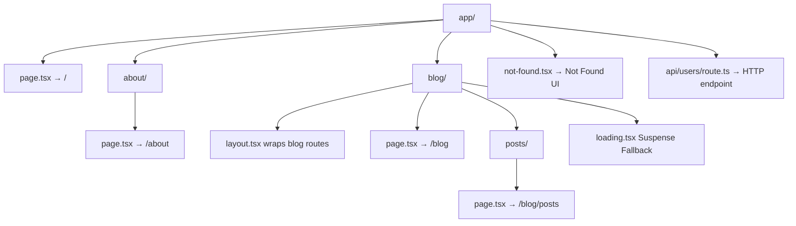

# Day 3 [Beginner]: File-based Routing Basics

## Goal

Understand how the Next.js App Router maps folder and file structure to URL routes, and create multiple routes without manually configuring a client-side router.

## Prerequisites

- Completed Day 2: Installation and Project Setup
- A working Next.js project with the App Router

## Explanation

In traditional React apps, you may configure routes manually using a library such as React Router. In the Next.js App Router, routing is primarily file-system based: folders represent URL segments and special files such as `page.tsx` define the UI for those segments. This reduces routing configuration and makes the URL hierarchy visible in the project structure.

The key file in the App Router is `page.tsx`. When Next.js finds a `page.tsx` inside a route folder, that folder becomes a URL segment and the page component is rendered for that route. For example, `app/blog/page.tsx` maps to `/blog`, while `app/blog/posts/page.tsx` maps to `/blog/posts`. The folder hierarchy mirrors the URL hierarchy.

There are other special files too: `layout.tsx` provides shared UI around a route subtree, `loading.tsx` provides a Suspense fallback during navigation or while the relevant route segment is waiting to render, `error.tsx` provides error UI for a route segment, and `not-found.tsx` handles not-found states. Today we focus on the routing fundamentals while introducing these conventions in context.

## Topic by Topic

### Topic 1: The page.tsx Convention

Theory:
A folder inside `app/` becomes a UI route when it contains a `page.tsx` file. The folder name becomes the URL segment. The root `app/page.tsx` maps to `/`.

Practical:
Create `app/contact/page.tsx` → visit `http://localhost:3000/contact`.

Code Example:

```tsx
// File: app/contact/page.tsx
export default function ContactPage() {
  return (
    <main>
      <h1>Contact Us</h1>
      <p>Send us a message at hello@example.com</p>
    </main>
  );
}

// This file creates the /contact route.
// No manual route configuration is required.
```

**Explanation:** Create a `contact/` folder under `app/` and place a `page.tsx` inside it. Next.js maps that segment to `/contact`. The component is a Server Component by default unless the file or an imported boundary requires client behavior.
**Key Points:**
- Understand the core concept behind The page.tsx Convention.
- Apply it with the right Next.js feature and defaults.
- Watch for common mistakes that affect performance, SEO, or maintainability.


### Topic 2: Nested Routes

Theory:
Folders can be nested to create nested URL paths. Each folder in the path represents one URL segment.

Practical:
`app/blog/posts/page.tsx` maps to the URL `/blog/posts`.

Code Example:

```tsx
// Folder structure:
// app/
//   blog/
//     page.tsx        → /blog
//     posts/
//       page.tsx      → /blog/posts

// app/blog/posts/page.tsx
export default function BlogPostsPage() {
  return <h1>All Blog Posts</h1>;
}
```

**Explanation:** Nested folders create nested routes. The file structure directly maps to URL segments, so you can usually predict a route by looking at its location in the `app/` directory.
**Key Points:**
- Understand the core concept behind Nested Routes.
- Apply it with the right Next.js feature and defaults.
- Watch for common mistakes that affect performance, SEO, or maintainability.


### Topic 3: The Root Route

Theory:
`app/page.tsx` is the root route — it renders at `/`. It is the App Router equivalent of the application's homepage route.

Practical:
This is the page visitors see when they navigate to the root URL of your application.

Code Example:

```tsx
// app/page.tsx
export default function HomePage() {
  return (
    <main>
      <h1>Home Page</h1>
      <p>Welcome to the root route.</p>
    </main>
  );
}
```
**Explanation:** The root `page.tsx` is special because it represents `/`. Other routes are created by placing `page.tsx` inside named folders.

**Key Points:**
- Understand the core concept behind The Root Route.
- Apply it with the right Next.js feature and defaults.
- Watch for common mistakes that affect performance, SEO, or maintainability.


### Topic 4: Special Files — layout.tsx

Theory:
`layout.tsx` at any level wraps the page and child routes in that route subtree. Layouts are preserved across navigations between child routes, which allows shared UI and client state in a layout to persist rather than being recreated for every navigation.

Practical:
Add a sidebar to all blog pages by creating `app/blog/layout.tsx`.

Code Example:

```tsx
// app/blog/layout.tsx
export default function BlogLayout({
  children,
}: {
  children: React.ReactNode;
}) {
  return (
    <div style={{ display: "flex", gap: "2rem" }}>
      <aside style={{ width: "200px" }}>
        <h3>Categories</h3>
        <ul>
          <li>Next.js</li>
          <li>React</li>
        </ul>
      </aside>
      <section>{children}</section>
    </div>
  );
}
```
**Explanation:** A layout is shared UI around a route subtree. The `children` prop receives the currently active page or child layout. Layouts can be nested, so a page can be rendered inside multiple layout levels.

**Key Points:**
- Understand the core concept behind Special Files — layout.tsx.
- Apply it with the right Next.js feature and defaults.
- Watch for common mistakes that affect performance, SEO, or maintainability.


### Topic 5: Special Files — loading.tsx

Theory:
`loading.tsx` defines a Suspense fallback for a route segment. Next.js can show it during navigation while the relevant segment is waiting to render, which is especially useful when the route contains asynchronous Server Components or other work that delays the segment.

Practical:
Add a spinner or skeleton UI inside `loading.tsx` to improve perceived performance while a route is pending.

Code Example:

```tsx
// app/blog/loading.tsx
export default function BlogLoading() {
  return (
    <div aria-label="Loading blog" role="status">
      <div
        style={{
          background: "#eee",
          height: "1.5rem",
          borderRadius: 4,
          marginBottom: "0.5rem",
        }}
      />
      <div
        style={{
          background: "#eee",
          height: "1.5rem",
          borderRadius: 4,
          width: "60%",
        }}
      />
    </div>
  );
}
```
**Explanation:** Next.js uses React Suspense around the route segment so the fallback can be displayed while the segment is pending. `loading.tsx` is therefore a UI convention for handling pending navigation/rendering; it is not a definition of a particular rendering strategy such as SSR or SSG.

**Key Points:**
- Understand the core concept behind Special Files — loading.tsx.
- Apply it with the right Next.js feature and defaults.
- Watch for common mistakes that affect performance, SEO, or maintainability.


### Topic 6: Special Files — not-found.tsx

Theory:
`not-found.tsx` defines UI for a not-found state in a route segment. You can call `notFound()` from `next/navigation` when a requested resource does not exist. A root `app/not-found.tsx` can provide a custom not-found experience for unmatched routes, while nested `not-found.tsx` files can handle not-found states within their segment.

Practical:
Provide a helpful message instead of relying only on the default not-found page.

Code Example:

```tsx
// app/not-found.tsx
import Link from "next/link";

export default function NotFound() {
  return (
    <main>
      <h1>404 — Page Not Found</h1>
      <p>Sorry, the page you are looking for does not exist.</p>
      <Link href="/">Go Home</Link>
    </main>
  );
}
```
**Explanation:** `not-found.tsx` is used when Next.js needs to render a not-found state. For data-driven routes, calling `notFound()` is a common pattern after determining that the requested resource does not exist. `Link` is preferred for internal navigation.

**Key Points:**
- Understand the core concept behind Special Files — not-found.tsx.
- Apply it with the right Next.js feature and defaults.
- Watch for common mistakes that affect performance, SEO, or maintainability.


### Topic 7: Folder Structure Best Practices

Theory:
Organize route folders so the routing hierarchy is easy to understand, while taking advantage of Next.js route co-location. Files that are not special route files do not automatically become public URLs, so related components, types, and utilities can be colocated when that improves maintainability. Shared components can also live in a top-level `components/` folder.

Practical:
Choose a structure that separates shared application concerns from route-specific code without assuming that every helper must live outside `app/`.

Code Example:

```
app/
  page.tsx
  layout.tsx
  about/
    page.tsx
  blog/
    layout.tsx
    page.tsx
    posts/
      page.tsx
    components/
      PostCard.tsx
components/
  Navbar.tsx
  Footer.tsx
lib/
  utils.ts
  db.ts
```
**Explanation:** Route folders can contain more than just `page.tsx`. Co-location is supported because ordinary files such as `PostCard.tsx`, `types.ts`, and `utils.ts` do not create routes by themselves. A consistent project convention is still important for discoverability and reuse.

**Key Points:**
- Understand the core concept behind Folder Structure Best Practices.
- Apply it with the right Next.js feature and defaults.
- Watch for common mistakes that affect performance, SEO, or maintainability.


### Topic 8: URL Segments and Path Matching

Theory:
Each folder segment in `app/` maps to a URL segment. A `page.tsx` defines the UI for a route, while a `route.ts` defines an HTTP endpoint for a Route Handler. Other files in the folder are not automatically exposed as URLs. A `page.tsx` and `route.ts` cannot represent two different public resources at the exact same route segment.

Practical:
You can put helper files, types, and utilities alongside route files without them becoming routes. Use `route.ts` when the segment should expose an HTTP API rather than a page UI.

Code Example:

```
app/
  dashboard/
    page.tsx        ← UI route: /dashboard
    helpers.ts      ← NOT a route
    types.ts        ← NOT a route
    settings/
      page.tsx      ← UI route: /dashboard/settings
  api/
    users/
      route.ts      ← Route Handler endpoint: /api/users
```
**Explanation:** The App Router separates UI routes from Route Handlers. `app/dashboard/page.tsx` renders the dashboard UI, while `app/api/users/route.ts` handles HTTP requests such as GET or POST for `/api/users`. This distinction is important when learning routing and APIs together.

**Key Points:**
- Understand the core concept behind URL Segments and Path Matching.
- Apply it with the right Next.js feature and defaults.
- Watch for common mistakes that affect performance, SEO, or maintainability.


## Key Concepts

- **File-based Routing**: Routes are derived from the folder and special-file structure inside `app/`.
- **page.tsx**: The special file that defines the UI for a URL route.
- **Segment**: One URL path component separated by slashes (e.g. `blog` and `posts` are segments of `/blog/posts`).
- **layout.tsx**: A component that wraps child routes and provides shared UI for its subtree.
- **loading.tsx**: A Suspense fallback used while a route segment is pending.
- **not-found.tsx**: UI for a not-found state, including states triggered with `notFound()`.
- **Nested Routes**: Child folders create nested URL paths; layouts can nest too.
- **Co-location**: Non-special files can live inside route folders without automatically becoming public routes.
- **Route Handler**: A `route.ts` file that handles HTTP requests in the App Router.

## Visual Concept Map



## End-to-End Practical

1. Inside your existing Next.js project, create `app/about/page.tsx` with an About heading.
2. Create `app/services/page.tsx` with a Services heading.
3. Create `app/services/web/page.tsx` with a Web Services heading.
4. Visit each URL in the browser to confirm the routes.
5. Create `app/blog/layout.tsx` with a sidebar and `app/blog/page.tsx`.
6. Visit `/blog` and confirm the sidebar from the layout wraps the blog page.
7. Create `app/not-found.tsx` and trigger it by visiting a non-existent URL like `/xyz`.

## Hands-on Coding

### Example 1: A Multi-page App with Nested Routes

```tsx
// app/page.tsx
export default function Home() {
  return <h1>Home — /</h1>;
}

// app/about/page.tsx
export default function About() {
  return <h1>About — /about</h1>;
}

// app/about/team/page.tsx
export default function Team() {
  return <h1>Our Team — /about/team</h1>;
}
```

### Example 2: Blog Section with Layout

```tsx
// app/blog/layout.tsx
import Link from "next/link";

export default function BlogLayout({
  children,
}: {
  children: React.ReactNode;
}) {
  return (
    <div className="blog-container">
      <nav className="blog-nav">
        <Link href="/blog">All Posts</Link>
        <Link href="/blog/categories">Categories</Link>
      </nav>
      <div className="blog-content">{children}</div>
    </div>
  );
}

// app/blog/page.tsx
export default function BlogIndex() {
  return <h1>Blog — /blog</h1>;
}

// app/blog/categories/page.tsx
export default function BlogCategories() {
  return <h1>Blog Categories — /blog/categories</h1>;
}
```

### Example 3: Custom Not Found Page

```tsx
// app/not-found.tsx
import Link from "next/link";

export default function NotFoundPage() {
  return (
    <div style={{ textAlign: "center", padding: "4rem" }}>
      <h1 style={{ fontSize: "6rem", margin: 0 }}>404</h1>
      <h2>Page not found</h2>
      <p>
        The page you are looking for might have been removed or does not exist.
      </p>
      <Link href="/" style={{ color: "#0070f3" }}>
        Return to Homepage
      </Link>
    </div>
  );
}
```

## Mini Exercise

Scenario:
Build the routing structure for a simple company website with the following pages: Home, About, Team (nested under About), Services, and Contact.

Steps:

1. Create `app/page.tsx` for the home page.
2. Create `app/about/page.tsx` for the about page.
3. Create `app/about/team/page.tsx` for the team page.
4. Create `app/services/page.tsx` for the services page.
5. Create `app/contact/page.tsx` for the contact page.
6. Visit each URL in the browser to confirm routing works.

Expected output:

- `/` renders the home page.
- `/about` renders the about page.
- `/about/team` renders the team page (nested under about).
- `/services` renders the services page.
- `/contact` renders the contact page.

## Assessment Quiz

### Quiz Questions

1. What filename must a folder have to define a UI route?
2. What does `app/about/team/page.tsx` map to as a URL?
3. What is the difference between `layout.tsx` and `page.tsx`?
4. How do you display a custom not-found page in the Next.js App Router?
5. Can you put non-route files such as utilities inside route folders?

### Quiz Answers

1. A folder needs a `page.tsx` file to define a UI route.
2. It maps to the URL `/about/team`.
3. `page.tsx` defines the UI for a route, while `layout.tsx` wraps the page and child routes with shared UI and can persist across navigations within its subtree.
4. Create `app/not-found.tsx` for a root-level not-found experience, or place `not-found.tsx` in a route segment for a segment-specific not-found state. You can also call `notFound()` from `next/navigation` when a resource is missing.
5. Yes. Ordinary files do not automatically become routes, so components, utilities, and types can be colocated with route files when that organization is useful.

## Task

- Create a five-page app: Home, About, Team (nested under About), Blog, and Contact.
- Add a shared layout for the Blog section with a sidebar.
- Create a custom not-found page.
- Add a loading skeleton for the Blog page.
- Test that each route works in the browser.

## Self Check

- Can you explain how file structure maps to URL routes?
- Do you know the difference between `page.tsx` and `layout.tsx`?
- Can you create nested routes by nesting folders?
- Do you understand what `loading.tsx` and `not-found.tsx` do?
- Have you confirmed that non-route files in route folders do NOT become URLs?

## Interview Questions and Answers

### Beginner

**Question:** How does Next.js know what to render for a given URL?
**Answer:** In the App Router, Next.js uses the `app/` file-system conventions. It matches the URL segments to the route folders and uses the relevant `page.tsx` to render the UI.

**Question:** What happens if you visit a URL that has no matching page?
**Answer:** Next.js renders the appropriate not-found UI. A root `app/not-found.tsx` can customize the application-level not-found experience, while nested `not-found.tsx` files can customize not-found states for their segments.

### Middle

**Question:** Why does `layout.tsx` persist between route navigations but `page.tsx` represents the changing route content?
**Answer:** Layouts define shared UI for a route subtree and are preserved across navigations between child routes. This allows shared UI and client state inside a layout to remain mounted while the active page changes.

**Question:** Can you have multiple layouts at different levels in the app directory?
**Answer:** Yes. Each folder can have its own `layout.tsx` that wraps routes within that subtree. Layouts nest, so a child page can be rendered through the root layout and any applicable nested layouts.

### Advanced

**Question:** What is route co-location and why is it useful?
**Answer:** Route co-location means placing components, utilities, types, or tests alongside related route files. Ordinary files do not become routes automatically, so co-location can keep feature-specific code together while shared code can remain in common folders.

**Question:** How does Next.js use streaming for routes with `loading.tsx`?
**Answer:** `loading.tsx` provides a Suspense fallback for the route segment. When the segment is pending, Next.js can stream the fallback to the browser while the actual route content becomes ready. This improves perceived responsiveness without defining the route as SSR, SSG, or any other single rendering strategy.

## Day 3 Outcome

- You understand how the App Router's file-based routing works.
- You can create nested routes by creating nested folders with `page.tsx`.
- You know the role of `layout.tsx`, `loading.tsx`, and `not-found.tsx`.
- You understand that ordinary files can be colocated without automatically becoming routes.
- You can distinguish UI routes (`page.tsx`) from Route Handlers (`route.ts`).
- You are ready to explore pages and layouts in depth on Day 4.
