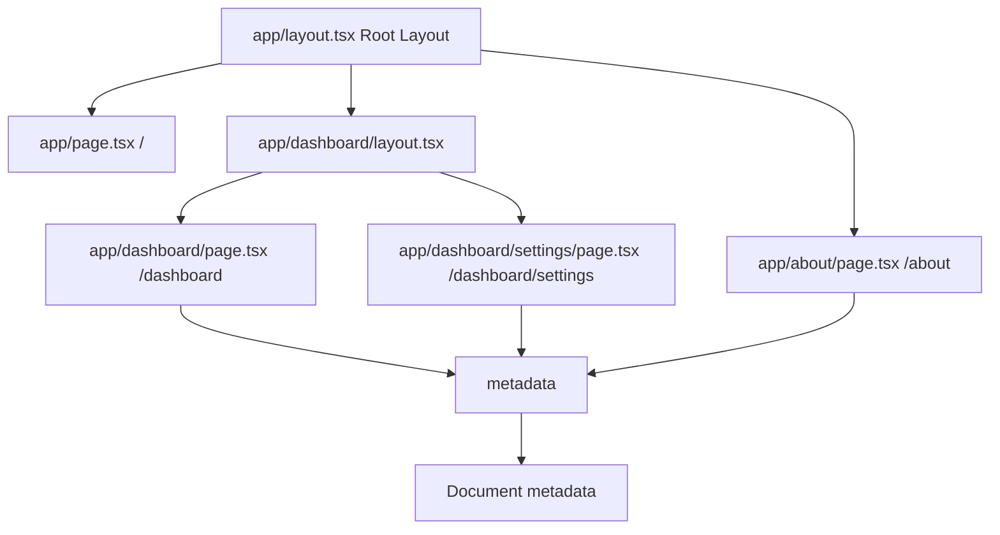

# Day 4 [Beginner]: Pages and Layouts

## Goal

Master the relationship between pages and layouts in the App Router, including how layouts nest, how metadata is exported from pages, and how to build multi-level UI shells.

## Prerequisites

- Completed Day 3: File-based Routing Basics
- Understanding of the `page.tsx` and `layout.tsx` conventions

## Explanation

Pages and layouts work as a team in the Next.js App Router. A page is the unique UI for a specific URL. A layout is shared UI around that route segment and its children — for example, navigation, a sidebar, or a footer. Layouts compose through the route tree, so you can have a root layout, a `/dashboard` layout, and deeper layouts for subsections.

During client-side navigation, active layouts can be preserved while the page content changes. This is the idea behind persistent layouts. It does **not** mean that layout code can never render again: rendering, data fetching, caching, revalidation, and hard navigations are separate concerns. Avoid treating layout persistence as a guarantee that server code runs only once.

Pages and layouts can export a `metadata` object or a `generateMetadata` function to define document metadata such as titles, descriptions, and Open Graph information. Metadata is resolved through the layout tree and is separate from the page's rendering or caching strategy.

## Topic by Topic

### Topic 1: Page Components

Theory:
A page component is the default export from `page.tsx`. It represents the UI for that route and is a Server Component by default in the App Router.

Practical:
Keep pages focused on route-level composition. They can fetch data on the server and pass serializable data to Client Components when interactivity is needed.

Code Example:

```tsx
// app/dashboard/page.tsx - Server Component by default
import StatsCard from "@/components/StatsCard";

export default async function DashboardPage() {
  const stats = await fetchStats();

  return (
    <div>
      <h1>Dashboard</h1>
      <StatsCard data={stats} />
    </div>
  );
}

async function fetchStats() {
  return { visits: 1200, signups: 45 };
}
```

**Explanation:** Pages are Server Components by default. They can perform server-side work and compose other components. A page is not required to be a Client Component just because it contains a Client Component somewhere below it.
**Key Points:**
- Understand the core concept behind Page Components.
- Apply it with the right Next.js feature and defaults.
- Watch for common mistakes that affect performance, SEO, or maintainability.


### Topic 2: Root Layout

Theory:
`app/layout.tsx` is the root layout. It wraps the application's route tree and must contain the `<html>` and `<body>` elements. It is a Server Component by default.

Practical:
Put global document structure, fonts, metadata, and shared UI here. If a provider needs client-side state, keep the provider itself as a Client Component instead of unnecessarily marking the entire root layout with `"use client"`.

Code Example:

```tsx
// app/layout.tsx
import type { Metadata } from "next";
import { Inter } from "next/font/google";

const inter = Inter({ subsets: ["latin"] });

export const metadata: Metadata = {
  title: { default: "My App", template: "%s | My App" },
  description: "A Next.js application",
};

export default function RootLayout({
  children,
}: Readonly<{
  children: React.ReactNode;
}>) {
  return (
    <html lang="en" className={inter.className}>
      <body>
        <header className="global-header">Global Nav</header>
        {children}
        <footer className="global-footer">© 2026 My App</footer>
      </body>
    </html>
  );
}
```

**Explanation:** The root layout establishes the document shell. Every route in this App Router tree is rendered through `{children}`. The root layout is also a natural place for global fonts and providers, while browser-only logic should remain in smaller Client Components.
**Key Points:**
- Understand the core concept behind Root Layout.
- Apply it with the right Next.js feature and defaults.
- Watch for common mistakes that affect performance, SEO, or maintainability.


### Topic 3: Nested Layouts

Theory:
A route folder can have its own `layout.tsx`. The child layout wraps the page and child routes in that subtree and composes with parent layouts.

Practical:
Use a nested layout for sections such as `/dashboard` that need a sidebar without applying that sidebar to the rest of the site.

Code Example:

```tsx
// app/dashboard/layout.tsx
import Link from "next/link";

export default function DashboardLayout({
  children,
}: Readonly<{
  children: React.ReactNode;
}>) {
  return (
    <div style={{ display: "flex" }}>
      <aside style={{ width: 200, padding: "1rem" }}>
        <nav>
          <Link href="/dashboard">Overview</Link>{" "}
          <Link href="/dashboard/settings">Settings</Link>
        </nav>
      </aside>
      <main style={{ flex: 1, padding: "1rem" }}>{children}</main>
    </div>
  );
}
```
**Explanation:** Nested layouts are scoped to their route subtree. During client-side navigation between child routes, an active layout can remain mounted while child page content changes.

**Key Points:**
- Understand the core concept behind Nested Layouts.
- Apply it with the right Next.js feature and defaults.
- Watch for common mistakes that affect performance, SEO, or maintainability.


### Topic 4: Exporting Metadata from Pages

Theory:
A `page.tsx` or `layout.tsx` can export a static `metadata` object. Next.js resolves metadata from the active layout/page hierarchy.

Practical:
Set a unique title and description for each page. A title template in the root layout can provide consistent site branding.

Code Example:

```tsx
// app/about/page.tsx
import type { Metadata } from "next";

export const metadata: Metadata = {
  title: "About",
  description: "Learn about our company and team.",
};

export default function AboutPage() {
  return <h1>About Us</h1>;
}
```
**Explanation:** Static metadata is appropriate when the values are known from the source code. Metadata is a document/SEO concern and should not be confused with whether a page is statically or dynamically rendered.

**Key Points:**
- Understand the core concept behind Exporting Metadata from Pages.
- Apply it with the right Next.js feature and defaults.
- Watch for common mistakes that affect performance, SEO, or maintainability.


### Topic 5: generateMetadata for Dynamic Pages

Theory:
For dynamic routes, `generateMetadata` can produce metadata from route parameters and fetched data. In current App Router examples, route `params` are asynchronous and should be awaited.

Practical:
Fetch a blog post's title and description to generate route-specific metadata.

Code Example:

```tsx
// app/blog/[slug]/page.tsx
import type { Metadata } from "next";

type Props = {
  params: Promise<{ slug: string }>;
};

async function getPost(slug: string) {
  return { title: `Post: ${slug}`, excerpt: "A great post." };
}

export async function generateMetadata({ params }: Props): Promise<Metadata> {
  const { slug } = await params;
  const post = await getPost(slug);

  return {
    title: post.title,
    description: post.excerpt,
  };
}

export default async function BlogPostPage({ params }: Props) {
  const { slug } = await params;
  const post = await getPost(slug);

  return (
    <article>
      <h1>{post.title}</h1>
    </article>
  );
}
```
**Explanation:** `generateMetadata` is useful when metadata depends on route parameters or asynchronous data. Data access used for metadata should follow the same authentication, authorization, caching, and error-handling requirements as other server-side data access.

**Key Points:**
- Understand the core concept behind generateMetadata for Dynamic Pages.
- Apply it with the right Next.js feature and defaults.
- Watch for common mistakes that affect performance, SEO, or maintainability.


### Topic 6: Template Files

Theory:
`template.tsx` is similar to `layout.tsx`, but it creates a new template instance when its route segment is navigated. Use it when remounting/reset behavior is intentional.

Practical:
Use `layout.tsx` for persistent UI such as navigation and sidebars, and `template.tsx` when a section should receive a fresh component instance on navigation.

Code Example:

```tsx
// app/dashboard/template.tsx
"use client";

import { useEffect } from "react";

export default function DashboardTemplate({
  children,
}: Readonly<{
  children: React.ReactNode;
}>) {
  useEffect(() => {
    console.log("Dashboard template mounted");
  }, []);

  return <>{children}</>;
}
```
**Explanation:** Templates are useful when you intentionally want remounting behavior, such as resetting local client state or triggering entry animations. Do not use a template merely because server data needs to be fresh; data freshness is a separate rendering/caching concern.

**Key Points:**
- Understand the core concept behind Template Files.
- Apply it with the right Next.js feature and defaults.
- Watch for common mistakes that affect performance, SEO, or maintainability.


### Topic 7: Passing Data from Layout to Page

Theory:
A layout receives `children`; Next.js does not provide a normal prop for a layout to directly inject arbitrary data into a child page. For shared client state, a Context Provider can be placed in a layout. For server data, prefer appropriate server-side data access instead of forcing everything through client context.

Practical:
Use a Context Provider in the layout when multiple interactive descendants need shared client state. For protected data, authorization must be enforced on the server and not by client context.

Code Example:

```tsx
// app/dashboard/layout.tsx
import { UserProvider } from "@/context/UserContext";

export default function DashboardLayout({
  children,
}: Readonly<{
  children: React.ReactNode;
}>) {
  return (
    <UserProvider>
      <div className="dashboard">{children}</div>
    </UserProvider>
  );
}
```
**Explanation:** A Provider can make shared client state available to descendants. However, a Context value is not a security boundary. Authentication and authorization must be checked where protected data or mutations are accessed.

**Key Points:**
- Understand the core concept behind Passing Data from Layout to Page.
- Apply it with the right Next.js feature and defaults.
- Watch for common mistakes that affect performance, SEO, or maintainability.


### Topic 8: Page vs Layout Rendering

Theory:
Layouts can persist across client-side navigation when their route segments remain active, while the page content for the changed segment is replaced. This should not be simplified to “layouts render once” and “pages render on every navigation.” Server rendering, client navigation, caching, revalidation, and hard reloads can all affect when rendering work occurs.

Practical:
Use layouts for persistent UI, but do not assume that putting data fetching in a layout makes the data permanently cached or permanently fresh.

Code Example:

```tsx
// app/layout.tsx
export default function RootLayout({
  children,
}: Readonly<{
  children: React.ReactNode;
}>) {
  return (
    <html lang="en">
      <body>{children}</body>
    </html>
  );
}

// app/about/page.tsx
export default function AboutPage() {
  return <h1>About</h1>;
}
```
**Explanation:** Layout persistence is a routing/UI behavior. It is different from SSR, static rendering, dynamic rendering, caching, and revalidation. Avoid using a console log as proof that a component “never renders again,” because server execution and client navigation can involve different rendering work.

**Key Points:**
- Understand the core concept behind Page vs Layout Rendering.
- Apply it with the right Next.js feature and defaults.
- Watch for common mistakes that affect performance, SEO, or maintainability.


## Key Concepts

- **Page**: The unique UI for a route, exported as the default component from `page.tsx`.
- **Layout**: Shared UI around a route segment and its children, exported from `layout.tsx`.
- **Root Layout**: The top-level `app/layout.tsx`; it defines the root document structure with `<html>` and `<body>`.
- **Nested Layout**: A layout inside a route subtree that composes with parent layouts.
- **Metadata**: Document metadata such as title, description, and Open Graph information.
- **generateMetadata**: An async API for metadata that depends on route parameters or data.
- **Template**: A special file whose component is recreated for navigation instead of being preserved like a layout.
- **Persistent Layout**: A layout whose UI can be preserved during client-side navigation while its route segment remains active.

## Visual Concept Map



## End-to-End Practical

1. In your Next.js project, update `app/layout.tsx` with a global header and footer.
2. Create `app/dashboard/layout.tsx` with a left sidebar navigation using `Link`.
3. Create `app/dashboard/page.tsx` as the dashboard overview.
4. Create `app/dashboard/settings/page.tsx` for settings.
5. Navigate between `/dashboard` and `/dashboard/settings` and observe that the dashboard shell can persist during client-side navigation.
6. Add `metadata` exports to pages with unique titles.
7. Inspect the browser tab as you navigate to confirm the active page metadata.
8. Remember that layout persistence does not by itself determine whether data is cached, dynamically rendered, or revalidated.

## Hands-on Coding

### Example 1: Dashboard with Nested Layout

```tsx
// app/dashboard/layout.tsx
import Link from "next/link";

export default function DashboardLayout({
  children,
}: Readonly<{
  children: React.ReactNode;
}>) {
  return (
    <div style={{ display: "flex", minHeight: "100vh" }}>
      <aside
        style={{
          width: 220,
          padding: "1.5rem",
        }}
      >
        <h2>Dashboard</h2>
        <nav style={{ display: "flex", flexDirection: "column", gap: "0.5rem" }}>
          <Link href="/dashboard">Overview</Link>
          <Link href="/dashboard/analytics">Analytics</Link>
          <Link href="/dashboard/settings">Settings</Link>
        </nav>
      </aside>
      <div style={{ flex: 1, padding: "2rem" }}>{children}</div>
    </div>
  );
}
```

### Example 2: Page with Static Metadata

```tsx
// app/dashboard/page.tsx
import type { Metadata } from "next";

export const metadata: Metadata = {
  title: "Dashboard Overview",
  description: "View your key metrics and activity.",
};

export default function DashboardPage() {
  return (
    <div>
      <h1>Overview</h1>
      <div
        style={{
          display: "grid",
          gridTemplateColumns: "repeat(3, 1fr)",
          gap: "1rem",
        }}
      >
        <div style={{ padding: "1.5rem", borderRadius: 8 }}>
          <p>Total Users</p>
          <h2>1,204</h2>
        </div>
        <div style={{ padding: "1.5rem", borderRadius: 8 }}>
          <p>Revenue</p>
          <h2>$4,800</h2>
        </div>
        <div style={{ padding: "1.5rem", borderRadius: 8 }}>
          <p>Orders</p>
          <h2>320</h2>
        </div>
      </div>
    </div>
  );
}
```

### Example 3: Dynamic Metadata with generateMetadata

```tsx
// app/products/[id]/page.tsx
import type { Metadata } from "next";

type Props = { params: Promise<{ id: string }> };

export async function generateMetadata({ params }: Props): Promise<Metadata> {
  const { id } = await params;
  const product = await fetchProduct(id);

  return {
    title: product.name,
    description: product.description,
    openGraph: {
      images: [product.imageUrl],
    },
  };
}

export default async function ProductPage({ params }: Props) {
  const { id } = await params;
  const product = await fetchProduct(id);

  return (
    <div>
      <h1>{product.name}</h1>
      <p>{product.description}</p>
      <p>${product.price}</p>
    </div>
  );
}

async function fetchProduct(id: string) {
  return {
    name: `Product ${id}`,
    description: "A great product.",
    price: 49.99,
    imageUrl: "/img.jpg",
  };
}
```

## Mini Exercise

Scenario:
Build a two-level layout for an e-commerce site: a global layout with top navigation, and a `/shop` section layout with a category filter sidebar.

Steps:

1. Update `app/layout.tsx` with a top navigation bar containing links to `/`, `/shop`, and `/about`.
2. Create `app/shop/layout.tsx` with a sidebar listing product categories.
3. Create `app/shop/page.tsx` showing all products.
4. Create `app/shop/shoes/page.tsx` showing only shoes.
5. Navigate between `/shop` and `/shop/shoes` and confirm the sidebar persists during client-side navigation.

Expected output:

- The global top nav appears on all pages.
- The category sidebar appears only inside `/shop` and `/shop/shoes`.
- Navigating between shop pages preserves the shared layout where the route segment remains active.

## Assessment Quiz

### Quiz Questions

1. What must the root layout include that no other layout needs?
2. How do you set a unique title for each page?
3. What is the difference between `layout.tsx` and `template.tsx`?
4. Can you pass props directly from a layout to its child pages?
5. When can a layout remain mounted during navigation?

### Quiz Answers

1. The root layout must include `<html>` and `<body>` elements. Other layouts wrap their children within the root document structure.
2. Export a `metadata` object from `page.tsx` with a `title`, or use `generateMetadata` when the title depends on parameters or fetched data.
3. A layout is designed for shared UI that can persist across navigation within its subtree. A template intentionally creates a new instance for navigation, which is useful when reset/remount behavior is required.
4. Not as ordinary page props. The layout receives `children`; use appropriate server data access or a Client Component/Context Provider when shared client state is needed.
5. A layout can remain mounted during client-side navigation when its route segment remains active. This persistence should not be confused with caching or a guarantee that server code executes only once.

## Task

- Build a full shell with a root layout (header/footer), a `/dashboard` nested layout (sidebar), and at least three dashboard pages.
- Export meaningful `metadata` from each page.
- Use `generateMetadata` on one dynamic page.
- Verify that navigating between dashboard pages keeps the sidebar UI persistent where expected.
- Document which data is static, dynamic, cached, or revalidated rather than assuming layout persistence controls data freshness.

## Self Check

- Can you explain the nesting relationship between layouts and pages?
- Do you know how to export metadata from a page?
- Can you explain why layouts can persist during client-side navigation?
- Do you understand when to use `template.tsx` instead of `layout.tsx`?
- Can you distinguish layout persistence from rendering and caching strategy?
- Have you built a multi-level layout structure in your project?

## Interview Questions and Answers

### Beginner

**Question:** What is a layout in Next.js App Router?
**Answer:** A layout is a component that wraps a route segment and its children with shared UI. It is defined in `layout.tsx` and can persist across client-side navigation within its subtree.

**Question:** How do you set the page title in Next.js?
**Answer:** Export a `metadata` object from `page.tsx` with a `title`, or use `generateMetadata` for dynamic titles. Next.js resolves the metadata into the document metadata.

### Middle

**Question:** How do layout nesting and route nesting relate?
**Answer:** A `layout.tsx` in a folder applies to that route subtree. Child layouts and pages compose inside the parent layout, so the UI hierarchy follows the route hierarchy.

**Question:** Why can't you pass arbitrary props directly from a layout to a child page?
**Answer:** The App Router supplies the page through the layout's `children` prop. For shared state, use appropriate patterns such as a Client Component Context Provider; for server data, prefer server-side data access rather than forcing protected data through client context.

### Advanced

**Question:** Why is “layouts render only once” an inaccurate statement?
**Answer:** Layout persistence during client-side navigation is different from server rendering and data fetching. Rendering, caching, revalidation, and navigation behavior determine when work occurs. A layout should be thought of as preserved UI, not code that can never render again.

**Question:** How would you implement a theme toggle that persists across all pages?
**Answer:** Put a theme provider implemented as a Client Component in the root layout and wrap `children` with it. The provider can maintain client-side theme state. The provider is a UI state mechanism, not an authorization boundary.

## Day 4 Outcome

- You understand how pages and layouts work together in the App Router.
- You can build root and nested layout structures for different sections of an app.
- You know how to export static metadata and dynamic metadata with `generateMetadata`.
- You understand template remounting and layout persistence.
- You understand why rendering, caching, revalidation, and layout persistence are related but distinct concepts.
- You are ready to learn navigation with Link and useRouter on Day 5.
