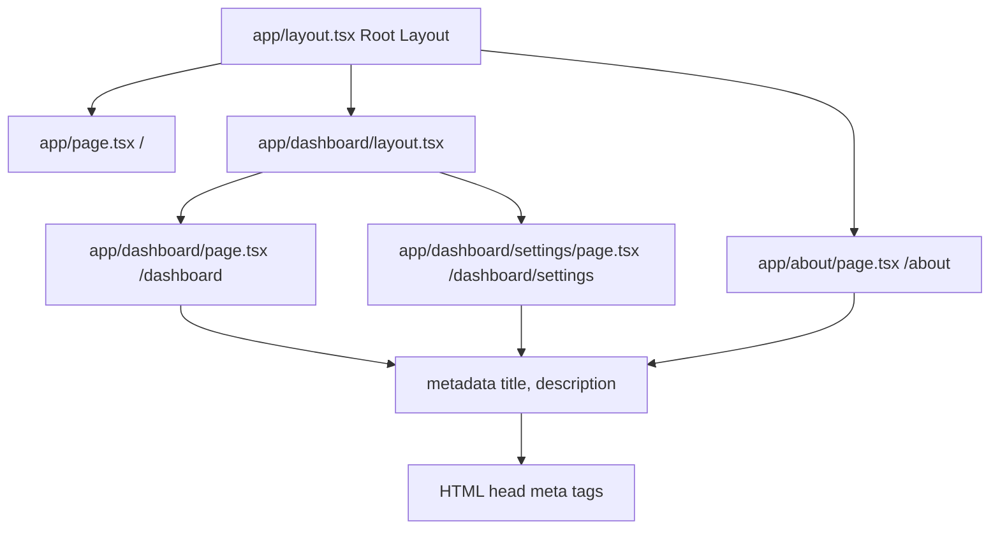

# Day 4 [Beginner]: Pages and Layouts

## Index

- [Goal](#goal)
- [Prerequisites](#prerequisites)
- [Explanation](#explanation)
- [Topic by Topic](#topic-by-topic)
- [Key Concepts](#key-concepts)
- [Visual Concept Map](#visual-concept-map)
- [End-to-End Practical](#end-to-end-practical)
- [Hands-on Coding](#hands-on-coding)
- [Mini Exercise](#mini-exercise)
- [Assessment Quiz](#assessment-quiz)
- [Task](#task)
- [Self Check](#self-check)
- [Interview Questions and Answers](#interview-questions-and-answers)
- [Day 4 Outcome](#day-4-outcome)

## Goal

Master the relationship between pages and layouts in the App Router, including how layouts nest, how metadata is exported from pages, and how to build multi-level UI shells.

## Prerequisites

- Completed Day 3: File-based Routing Basics
- Understanding of the `page.tsx` and `layout.tsx` conventions

## Explanation

Pages and layouts work as a team in the Next.js App Router. A page is the unique content for a specific URL. A layout is the persistent shell around that content — the navigation, sidebar, or footer that does not change between routes. The power comes from how they compose: layouts nest naturally, just like folders nest, so you can have a global layout at the root, a section layout for a whole area like `/dashboard`, and a subsection layout for something like `/dashboard/settings`.

When a user navigates from `/dashboard` to `/dashboard/settings`, Next.js re-renders only the page component. The layout components higher up in the tree stay mounted — React does not tear them down and recreate them. This is called "persistent layouts" and it gives you smooth navigation without costly re-mounts of heavy navigation UIs.

Pages can also export a `metadata` object or a `generateMetadata` async function to set the page title, description, Open Graph tags, and more. This metadata flows through the layout tree and ends up in the `<head>` of the HTML response, which is essential for SEO.

## Topic by Topic

### Topic 1: Page Components

Theory:
A page component is a default export from `page.tsx`. It represents the unique content for that URL. It is a Server Component by default.

Practical:
Keep pages thin — they orchestrate data fetching and pass results to smaller components.

Code Example:

```tsx
// app/dashboard/page.tsx - A page component (Server Component by default)
import StatsCard from "@/components/StatsCard";

export default async function DashboardPage() {
  // Fetch data on the server before rendering
  const stats = await fetchStats();

  return (
    <div>
      <h1>Dashboard</h1>
      <StatsCard data={stats} /> {/* Pass data to child */}
    </div>
  );
}

async function fetchStats() {
  return { visits: 1200, signups: 45 };
}
```

**Explanation:** Pages are Server Components by default in Next.js. They can fetch data, then pass it to smaller client components. Pages orchestrate the layout - they coordinate data, not display everything.
**Key Points:**
- Understand the core concept behind Page Components.
- Apply it with the right Next.js feature and defaults.
- Watch for common mistakes that affect performance, SEO, or maintainability.


### Topic 2: Root Layout

Theory:
`app/layout.tsx` is the root layout. It wraps every single page in your application. It must contain `<html>` and `<body>` elements. It is a Server Component.

Practical:
Put global providers, fonts, and shared navigation here.

Code Example:

```tsx
// app/layout.tsx - Root layout wraps EVERY page
import type { Metadata } from "next";
import { Inter } from "next/font/google";

const inter = Inter({ subsets: ["latin"] });

export const metadata: Metadata = {
  title: { default: "My App", template: "%s | My App" },
  description: "A Next.js application",
};

export default function RootLayout({
  children,
}: {
  children: React.ReactNode;
}) {
  return (
    <html lang="en" className={inter.className}>
      <body>
        <header className="global-header">Global Nav</header>
        {children} {/* All page content renders here */}
        <footer className="global-footer">© 2025</footer>
      </body>
    </html>
  );
}
```

**Explanation:** The root layout is mandatory. It must contain `<html>` and `<body>` elements. Every page in your app renders inside `{children}`. This is where you add global fonts, providers, and shared navigation.
**Key Points:**
- Understand the core concept behind Root Layout.
- Apply it with the right Next.js feature and defaults.
- Watch for common mistakes that affect performance, SEO, or maintainability.


### Topic 3: Nested Layouts

Theory:
Any folder can have its own `layout.tsx`. Child layouts wrap only the routes inside that folder. They are nested inside the parent layout.

Practical:
Use a nested layout for sections like `/dashboard` that need a sidebar, without affecting the rest of the site.

Code Example:

```tsx
// app/dashboard/layout.tsx
export default function DashboardLayout({
  children,
}: {
  children: React.ReactNode;
}) {
  return (
    <div style={{ display: "flex" }}>
      <aside style={{ width: 200, background: "#f5f5f5", padding: "1rem" }}>
        <nav>
          <a href="/dashboard">Overview</a>
          <a href="/dashboard/settings">Settings</a>
        </nav>
      </aside>
      <main style={{ flex: 1, padding: "1rem" }}>{children}</main>
    </div>
  );
}
```
**Explanation:**
This topic explains Nested Layouts in practical Next.js terms so you can build correct routing, rendering, and data flow patterns in real applications.

**Key Points:**
- Understand the core concept behind Nested Layouts.
- Apply it with the right Next.js feature and defaults.
- Watch for common mistakes that affect performance, SEO, or maintainability.


### Topic 4: Exporting Metadata from Pages

Theory:
Each `page.tsx` (or `layout.tsx`) can export a `metadata` object or a `generateMetadata` async function. Next.js merges metadata through the layout tree.

Practical:
Set a unique title for each page. Use the `template` in the root layout to append the site name.

Code Example:

```tsx
// app/about/page.tsx
import type { Metadata } from "next";

export const metadata: Metadata = {
  title: "About", // renders as "About | My App" via root layout template
  description: "Learn about our company and team.",
};

export default function AboutPage() {
  return <h1>About Us</h1>;
}
```
**Explanation:**
This topic explains Exporting Metadata from Pages in practical Next.js terms so you can build correct routing, rendering, and data flow patterns in real applications.

**Key Points:**
- Understand the core concept behind Exporting Metadata from Pages.
- Apply it with the right Next.js feature and defaults.
- Watch for common mistakes that affect performance, SEO, or maintainability.


### Topic 5: generateMetadata for Dynamic Pages

Theory:
For dynamic routes, use `generateMetadata` (an async function) to fetch data and produce metadata based on route parameters.

Practical:
Fetch a blog post's title and description to set the `<title>` and `<meta description>` tags dynamically.

Code Example:

```tsx
// app/blog/[slug]/page.tsx
import type { Metadata } from "next";

type Props = { params: Promise<{ slug: string }> };

export async function generateMetadata({ params }: Props): Promise<Metadata> {
  const { slug } = await params;
  const post = await getPost(slug);
  return {
    title: post.title,
    description: post.excerpt,
  };
}

export default async function BlogPostPage({ params }: Props) {
  const { slug } = await params;
  const post = await getPost(slug);
  return (
    <article>
      <h1>{post.title}</h1>
    </article>
  );
}

async function getPost(slug: string) {
  return { title: `Post: ${slug}`, excerpt: "A great post." };
}
```
**Explanation:**
This topic explains generateMetadata for Dynamic Pages in practical Next.js terms so you can build correct routing, rendering, and data flow patterns in real applications.

**Key Points:**
- Understand the core concept behind generateMetadata for Dynamic Pages.
- Apply it with the right Next.js feature and defaults.
- Watch for common mistakes that affect performance, SEO, or maintainability.


### Topic 6: Template Files

Theory:
`template.tsx` is similar to `layout.tsx` but it is remounted on each navigation. Use it when you need a fresh component instance per route change (e.g. page-entry animations, analytics tracking).

Practical:
Use `layout.tsx` for persistent UI (navigation, sidebars) and `template.tsx` for UI that should reset on navigation.

Code Example:

```tsx
// app/dashboard/template.tsx
"use client";
import { useEffect } from "react";

export default function DashboardTemplate({
  children,
}: {
  children: React.ReactNode;
}) {
  useEffect(() => {
    console.log("Dashboard route changed — analytics fired.");
  }, []);
  return <>{children}</>;
}
```
**Explanation:**
This topic explains Template Files in practical Next.js terms so you can build correct routing, rendering, and data flow patterns in real applications.

**Key Points:**
- Understand the core concept behind Template Files.
- Apply it with the right Next.js feature and defaults.
- Watch for common mistakes that affect performance, SEO, or maintainability.


### Topic 7: Passing Data from Layout to Page

Theory:
You cannot pass props directly from a layout to a page — the layout renders `children` which Next.js fills with the page. Instead, share data via React Context, `fetch` in both, or route params.

Practical:
Use a Context Provider in the layout to share data with deeply nested pages and components.

Code Example:

```tsx
// app/dashboard/layout.tsx
import { UserProvider } from "@/context/UserContext";

export default function DashboardLayout({
  children,
}: {
  children: React.ReactNode;
}) {
  return (
    <UserProvider>
      <div className="dashboard">{children}</div>
    </UserProvider>
  );
}
```
**Explanation:**
This topic explains Passing Data from Layout to Page in practical Next.js terms so you can build correct routing, rendering, and data flow patterns in real applications.

**Key Points:**
- Understand the core concept behind Passing Data from Layout to Page.
- Apply it with the right Next.js feature and defaults.
- Watch for common mistakes that affect performance, SEO, or maintainability.


### Topic 8: Page vs Layout Rendering

Theory:
Layouts are rendered once and kept alive across navigations. Pages are rendered per navigation. Both are Server Components by default unless marked with `'use client'`.

Practical:
Avoid putting heavy real-time logic in layouts — they do not re-render on navigation.

Code Example:

```tsx
// Layout renders ONCE per app load (persists)
// app/layout.tsx
export default function RootLayout({
  children,
}: {
  children: React.ReactNode;
}) {
  console.log("Root layout rendered"); // Only once per hard reload
  return (
    <html>
      <body>{children}</body>
    </html>
  );
}

// Page renders on EVERY navigation to this route
// app/about/page.tsx
export default function About() {
  console.log("About page rendered"); // On every visit to /about
  return <h1>About</h1>;
}
```
**Explanation:**
This topic explains Page vs Layout Rendering in practical Next.js terms so you can build correct routing, rendering, and data flow patterns in real applications.

**Key Points:**
- Understand the core concept behind Page vs Layout Rendering.
- Apply it with the right Next.js feature and defaults.
- Watch for common mistakes that affect performance, SEO, or maintainability.


## Key Concepts

- **Page**: The unique content component for a route, exported as default from `page.tsx`.
- **Layout**: A persistent wrapper component that surrounds one or more route segments, exported from `layout.tsx`.
- **Root Layout**: The top-level layout in `app/layout.tsx` that must include `<html>` and `<body>` tags.
- **Nested Layout**: A layout inside a subfolder that wraps only routes in that subtree.
- **Metadata**: SEO-related data (title, description, Open Graph) exported from `page.tsx` or `layout.tsx`.
- **generateMetadata**: An async function for producing metadata that depends on fetched data.
- **Template**: Like a layout but remounts on each navigation; useful for animations or analytics.
- **Persistent Layout**: A layout that stays mounted and does not re-render during client-side navigation.

## Visual Concept Map



## End-to-End Practical

1. In your Next.js project, update `app/layout.tsx` with a global header and footer.
2. Create `app/dashboard/layout.tsx` with a left sidebar navigation.
3. Create `app/dashboard/page.tsx` as the dashboard overview.
4. Create `app/dashboard/settings/page.tsx` for settings.
5. Navigate between `/dashboard` and `/dashboard/settings` — observe the sidebar persists.
6. Add `metadata` exports to each page with unique titles.
7. Inspect the `<title>` in the browser tab as you navigate to confirm metadata works.
8. Use browser DevTools to verify the root layout's `<header>` and `<footer>` appear on all pages.

## Hands-on Coding

### Example 1: Dashboard with Nested Layout

```tsx
// app/dashboard/layout.tsx
import Link from "next/link";

export default function DashboardLayout({
  children,
}: {
  children: React.ReactNode;
}) {
  return (
    <div style={{ display: "flex", minHeight: "100vh" }}>
      <aside
        style={{
          width: 220,
          background: "#1a1a2e",
          color: "#fff",
          padding: "1.5rem",
        }}
      >
        <h2 style={{ fontSize: "1rem", marginBottom: "1rem" }}>Dashboard</h2>
        <nav
          style={{ display: "flex", flexDirection: "column", gap: "0.5rem" }}
        >
          <Link href="/dashboard" style={{ color: "#aaa" }}>
            Overview
          </Link>
          <Link href="/dashboard/analytics" style={{ color: "#aaa" }}>
            Analytics
          </Link>
          <Link href="/dashboard/settings" style={{ color: "#aaa" }}>
            Settings
          </Link>
        </nav>
      </aside>
      <div style={{ flex: 1, padding: "2rem" }}>{children}</div>
    </div>
  );
}
```

### Example 2: Page with Static Metadata

```tsx
// app/dashboard/page.tsx
import type { Metadata } from "next";

export const metadata: Metadata = {
  title: "Dashboard Overview",
  description: "View your key metrics and activity.",
};

export default function DashboardPage() {
  return (
    <div>
      <h1>Overview</h1>
      <div
        style={{
          display: "grid",
          gridTemplateColumns: "repeat(3, 1fr)",
          gap: "1rem",
        }}
      >
        <div
          style={{ padding: "1.5rem", background: "#f0f4ff", borderRadius: 8 }}
        >
          <p>Total Users</p>
          <h2>1,204</h2>
        </div>
        <div
          style={{ padding: "1.5rem", background: "#f0fff4", borderRadius: 8 }}
        >
          <p>Revenue</p>
          <h2>$4,800</h2>
        </div>
        <div
          style={{ padding: "1.5rem", background: "#fff8f0", borderRadius: 8 }}
        >
          <p>Orders</p>
          <h2>320</h2>
        </div>
      </div>
    </div>
  );
}
```

### Example 3: Dynamic Metadata with generateMetadata

```tsx
// app/products/[id]/page.tsx
import type { Metadata } from "next";

type Props = { params: Promise<{ id: string }> };

export async function generateMetadata({ params }: Props): Promise<Metadata> {
  const { id } = await params;
  const product = await fetchProduct(id);
  return {
    title: product.name,
    description: product.description,
    openGraph: {
      images: [product.imageUrl],
    },
  };
}

export default async function ProductPage({ params }: Props) {
  const { id } = await params;
  const product = await fetchProduct(id);
  return (
    <div>
      <h1>{product.name}</h1>
      <p>{product.description}</p>
      <p>${product.price}</p>
    </div>
  );
}

async function fetchProduct(id: string) {
  return {
    name: `Product ${id}`,
    description: "A great product.",
    price: 49.99,
    imageUrl: "/img.jpg",
  };
}
```

## Mini Exercise

Scenario:
Build a two-level layout for an e-commerce site: a global layout with top navigation, and a `/shop` section layout with a category filter sidebar.

Steps:

1. Update `app/layout.tsx` with a top navigation bar containing links to `/`, `/shop`, and `/about`.
2. Create `app/shop/layout.tsx` with a sidebar listing product categories.
3. Create `app/shop/page.tsx` showing all products.
4. Create `app/shop/shoes/page.tsx` showing only shoes.
5. Navigate between `/shop` and `/shop/shoes` and confirm the sidebar persists.

Expected output:

- The global top nav appears on all pages.
- The category sidebar appears only inside `/shop` and `/shop/shoes`.
- Navigating between shop pages does not re-render the sidebar.

## Assessment Quiz

### Quiz Questions

1. What must the root layout include that no other layout needs?
2. How do you set a unique title for each page?
3. What is the difference between `layout.tsx` and `template.tsx`?
4. Can you pass props directly from a layout to its child pages?
5. When does a layout component re-render?

### Quiz Answers

1. The root layout must include `<html>` and `<body>` elements. Other layouts only wrap their children.
2. Export a `metadata` object from `page.tsx` with a `title` property. Use a title template in the root layout to append the site name.
3. A layout persists and does not unmount on navigation. A template remounts on every navigation to its routes.
4. No — layouts render `children` opaquely. Share data via React Context, re-fetching in both, or URL params.
5. A layout component only re-renders if its own props or state changes — it does not re-render when child routes navigate.

## Task

- Build a full shell with a root layout (header/footer), a `/dashboard` nested layout (sidebar), and at least three dashboard pages.
- Export meaningful `metadata` from each page.
- Use `generateMetadata` on one dynamic page.
- Verify that navigating between dashboard pages keeps the sidebar mounted.

## Self Check

- Can you explain the nesting relationship between layouts and pages?
- Do you know how to export metadata from a page?
- Can you explain why layouts persist during navigation?
- Do you understand when to use `template.tsx` instead of `layout.tsx`?
- Have you built a multi-level layout structure in your project?

## Interview Questions and Answers

### Beginner

**Question:** What is a layout in Next.js App Router?
**Answer:** A layout is a component that wraps one or more routes with shared UI. It is defined in `layout.tsx` and persists across navigations within its subtree without remounting.

**Question:** How do you set the page title in Next.js?
**Answer:** Export a `metadata` object from `page.tsx` with a `title` property, or use `generateMetadata` for dynamic titles. Next.js places the title in the `<title>` tag of the HTML head.

### Middle

**Question:** How do layout nesting and route nesting relate?
**Answer:** They mirror each other. A `layout.tsx` in a folder wraps all `page.tsx` files and child layouts inside that folder. The UI nests just as deeply as the folder structure.

**Question:** Why can't you pass props from a layout to a child page?
**Answer:** The App Router passes pages as `children` to layouts automatically — you don't control this invocation. To share data, use Context, fetch the same data in both, or use route search params.

### Advanced

**Question:** How does metadata inheritance work in the App Router?
**Answer:** Metadata is merged from the root layout down to the current page. Properties set in a child page override those set in a parent layout. This allows a root layout to set site-wide defaults while individual pages override `title` and `description`.

**Question:** How would you implement a theme toggle that persists across all pages?
**Answer:** Place a `ThemeProvider` (a Client Component using Context) in the root layout and wrap `children` with it. The provider holds theme state and is persistent. Child components access the theme via the context hook.

## Day 4 Outcome

- You understand how pages and layouts work together in the App Router.
- You can build multi-level layout structures for different sections of your app.
- You know how to export metadata (static and dynamic) from pages.
- You understand why layouts persist and when to use templates instead.
- You are ready to learn navigation with Link and useRouter on Day 5.
