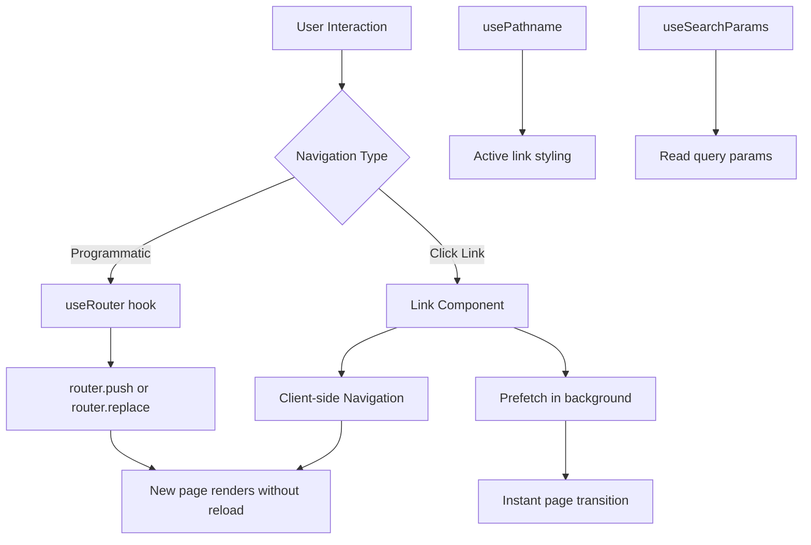

# Day 5 [Beginner]: Navigation with Link and useRouter

## Index

- [Goal](#goal)
- [Prerequisites](#prerequisites)
- [Explanation](#explanation)
- [Topic by Topic](#topic-by-topic)
- [Key Concepts](#key-concepts)
- [Visual Concept Map](#visual-concept-map)
- [End-to-End Practical](#end-to-end-practical)
- [Hands-on Coding](#hands-on-coding)
- [Mini Exercise](#mini-exercise)
- [Assessment Quiz](#assessment-quiz)
- [Task](#task)
- [Self Check](#self-check)
- [Interview Questions and Answers](#interview-questions-and-answers)
- [Day 5 Outcome](#day-5-outcome)

## Goal

Use the `<Link>` component for declarative navigation and the `useRouter` hook for programmatic navigation in Next.js App Router.

## Prerequisites

- Completed Day 4: Pages and Layouts
- Understanding of React hooks basics

## Explanation

Navigating between pages in Next.js should use the built-in `<Link>` component from `next/link`, not plain HTML `<a>` tags. The reason is that `<Link>` performs client-side navigation — it updates the URL and renders the new page without a full browser reload. This keeps your app fast and preserves client state like scroll position and open modals.

Under the hood, `<Link>` prefetches the linked route in the background when the link is visible in the viewport. By the time the user clicks, the page data is already cached and the transition feels instant. This is one of the biggest performance advantages of Next.js.

For navigation that needs to happen in response to events (like after a form submission or a button click), you use the `useRouter` hook from `next/navigation`. It gives you methods like `router.push('/route')`, `router.replace('/route')`, and `router.back()`. Since `useRouter` is a hook, it requires the component to be a Client Component (`'use client'`).

## Topic by Topic

### Topic 1: The Link Component

Theory:
`<Link href="/about">` renders an anchor tag that performs client-side navigation. It replaces the need for `<a href="/about">`.

Practical:
Always use `<Link>` for internal navigation to get prefetching and client-side routing.

Code Example:

```tsx
// app/components/Navbar.tsx
import Link from "next/link"; // Import from next/link, not HTML <a>

export default function Navbar() {
  return (
    <nav style={{ display: "flex", gap: "1rem", padding: "1rem" }}>
      <Link href="/">Home</Link> {/* Prefetches route in background */}
      <Link href="/about">About</Link>
      <Link href="/blog">Blog</Link>
      <Link href="/contact">Contact</Link>
    </nav>
  );
}
```

**Explanation:** Always use `<Link>` for internal navigation - it prefetches pages in the background so clicks feel instant. Don't use plain `<a href>` as it causes full page reloads and loses client state.
**Key Points:**
- Understand the core concept behind The Link Component.
- Apply it with the right Next.js feature and defaults.
- Watch for common mistakes that affect performance, SEO, or maintainability.


### Topic 2: Active Link Styling

Theory:
Use the `usePathname` hook from `next/navigation` inside a Client Component to detect the current route and apply active styles to the matching link.

Practical:
Highlight the current page's link in the navigation bar to improve UX.

Code Example:

```tsx
"use client"; // This component runs in the browser
import Link from "next/link";
import { usePathname } from "next/navigation";

const links = [
  { href: "/", label: "Home" },
  { href: "/about", label: "About" },
  { href: "/blog", label: "Blog" },
];

export default function NavLinks() {
  const pathname = usePathname(); // Get current URL path

  return (
    <nav style={{ display: "flex", gap: "1rem" }}>
      {links.map((link) => (
        <Link
          key={link.href}
          href={link.href}
          // Highlight link if it's the current page
          style={{
            fontWeight: pathname === link.href ? "bold" : "normal",
            color: pathname === link.href ? "#0070f3" : "inherit",
          }}
        >
          {link.label}
        </Link>
      ))}
    </nav>
  );
}
```

**Explanation:** To detect the current route and style the active link, use `usePathname()` from a Client Component (marked with `"use client"`). This hook returns the current URL, allowing you to compare and highlight the active link.
**Key Points:**
- Understand the core concept behind Active Link Styling.
- Apply it with the right Next.js feature and defaults.
- Watch for common mistakes that affect performance, SEO, or maintainability.


### Topic 3: useRouter for Programmatic Navigation

Theory:
`useRouter` from `next/navigation` gives you `push`, `replace`, `back`, `forward`, and `refresh` methods for navigating programmatically.

Practical:
Redirect users after a form submit or login without a link click.

Code Example:

```tsx
"use client";
import { useRouter } from "next/navigation";

export default function LoginButton() {
  const router = useRouter();

  function handleLogin() {
    // Simulate login
    const success = true;
    if (success) {
      router.push("/dashboard");
    }
  }

  return <button onClick={handleLogin}>Log In</button>;
}
```
**Explanation:**
This topic explains useRouter for Programmatic Navigation in practical Next.js terms so you can build correct routing, rendering, and data flow patterns in real applications.

**Key Points:**
- Understand the core concept behind useRouter for Programmatic Navigation.
- Apply it with the right Next.js feature and defaults.
- Watch for common mistakes that affect performance, SEO, or maintainability.


### Topic 4: router.replace vs router.push

Theory:
`router.push` adds a new entry to the browser history stack. `router.replace` replaces the current history entry — pressing Back will skip over the replaced URL.

Practical:
Use `replace` after login/logout so users can't press Back to return to the login page.

Code Example:

```tsx
"use client";
import { useRouter } from "next/navigation";

export default function LogoutButton() {
  const router = useRouter();

  function handleLogout() {
    // Clear session...
    router.replace("/login"); // User can't navigate back after logout
  }

  return <button onClick={handleLogout}>Log Out</button>;
}
```
**Explanation:**
This topic explains router.replace vs router.push in practical Next.js terms so you can build correct routing, rendering, and data flow patterns in real applications.

**Key Points:**
- Understand the core concept behind router.replace vs router.push.
- Apply it with the right Next.js feature and defaults.
- Watch for common mistakes that affect performance, SEO, or maintainability.


### Topic 5: Link with Dynamic Segments

Theory:
You can build dynamic link `href` values using template literals or string concatenation. This is useful for generating links to dynamic routes.

Practical:
Generate a list of blog post links from an array of posts.

Code Example:

```tsx
// app/blog/page.tsx
import Link from "next/link";

const posts = [
  { slug: "nextjs-routing", title: "Next.js Routing Guide" },
  { slug: "react-server-components", title: "React Server Components" },
];

export default function BlogPage() {
  return (
    <ul>
      {posts.map((post) => (
        <li key={post.slug}>
          <Link href={`/blog/${post.slug}`}>{post.title}</Link>
        </li>
      ))}
    </ul>
  );
}
```
**Explanation:**
This topic explains Link with Dynamic Segments in practical Next.js terms so you can build correct routing, rendering, and data flow patterns in real applications.

**Key Points:**
- Understand the core concept behind Link with Dynamic Segments.
- Apply it with the right Next.js feature and defaults.
- Watch for common mistakes that affect performance, SEO, or maintainability.


### Topic 6: Link Prefetching

Theory:
By default, Next.js prefetches linked pages when they enter the viewport in production. You can opt out with `prefetch={false}` for links that are rarely clicked.

Practical:
Disable prefetching for admin-only links to avoid wasted bandwidth.

Code Example:

```tsx
import Link from "next/link";

export default function AdminLink() {
  return (
    // Prefetch disabled — don't load admin bundle for all users
    <Link href="/admin" prefetch={false}>
      Admin Panel
    </Link>
  );
}
```
**Explanation:**
This topic explains Link Prefetching in practical Next.js terms so you can build correct routing, rendering, and data flow patterns in real applications.

**Key Points:**
- Understand the core concept behind Link Prefetching.
- Apply it with the right Next.js feature and defaults.
- Watch for common mistakes that affect performance, SEO, or maintainability.


### Topic 7: useSearchParams and URLSearchParams

Theory:
`useSearchParams` from `next/navigation` reads query string parameters. Use it in Client Components to react to `?page=2&filter=recent` style URLs.

Practical:
Read and update search/filter parameters without a full navigation.

Code Example:

```tsx
"use client";
import { useSearchParams, useRouter } from "next/navigation";

export default function FilterBar() {
  const searchParams = useSearchParams();
  const router = useRouter();
  const filter = searchParams.get("filter") ?? "all";

  function setFilter(value: string) {
    const params = new URLSearchParams(searchParams.toString());
    params.set("filter", value);
    router.push(`?${params.toString()}`);
  }

  return (
    <div>
      <button
        onClick={() => setFilter("all")}
        style={{ fontWeight: filter === "all" ? "bold" : "normal" }}
      >
        All
      </button>
      <button
        onClick={() => setFilter("recent")}
        style={{ fontWeight: filter === "recent" ? "bold" : "normal" }}
      >
        Recent
      </button>
    </div>
  );
}
```
**Explanation:**
This topic explains useSearchParams and URLSearchParams in practical Next.js terms so you can build correct routing, rendering, and data flow patterns in real applications.

**Key Points:**
- Understand the core concept behind useSearchParams and URLSearchParams.
- Apply it with the right Next.js feature and defaults.
- Watch for common mistakes that affect performance, SEO, or maintainability.


### Topic 8: Scroll Behaviour

Theory:
By default, `<Link>` scrolls to the top of the page on navigation. You can disable this with `scroll={false}` on the `<Link>` component.

Practical:
Use `scroll={false}` when you want to navigate without losing the current scroll position — useful for tab-style UIs.

Code Example:

```tsx
import Link from "next/link";

export default function Tabs() {
  return (
    <div>
      <Link href="/dashboard?tab=overview" scroll={false}>
        Overview
      </Link>
      <Link href="/dashboard?tab=stats" scroll={false}>
        Stats
      </Link>
    </div>
  );
}
```
**Explanation:**
This topic explains Scroll Behaviour in practical Next.js terms so you can build correct routing, rendering, and data flow patterns in real applications.

**Key Points:**
- Understand the core concept behind Scroll Behaviour.
- Apply it with the right Next.js feature and defaults.
- Watch for common mistakes that affect performance, SEO, or maintainability.


## Key Concepts

- **Link**: The Next.js component for client-side navigation with automatic prefetching.
- **useRouter**: A hook that provides methods for programmatic navigation (`push`, `replace`, `back`, `refresh`).
- **usePathname**: A hook that returns the current URL pathname; used for active link styling.
- **useSearchParams**: A hook that reads query string parameters from the current URL.
- **Prefetching**: Next.js automatically loads linked pages in the background for instant navigation.
- **Client-side Navigation**: Navigating between routes without a full browser reload, preserving client state.
- **router.push**: Navigates to a new route and adds it to the browser history stack.
- **router.replace**: Navigates to a new route but replaces the current history entry.

## Visual Concept Map



## End-to-End Practical

1. Build a `<Navbar>` component with `<Link>` components for Home, About, Blog, and Contact.
2. Add the Navbar to your root layout.
3. Use `usePathname` to highlight the active link in the Navbar.
4. Create a login form page with a submit button that uses `useRouter.push` to go to `/dashboard` on success.
5. Create a logout button that uses `router.replace('/login')`.
6. Add a blog page that lists posts with dynamic `<Link href={\`/blog/\${slug}\`}>` links.
7. Test that navigating between pages is smooth (no full reload).

## Hands-on Coding

### Example 1: Full Navbar with Active Links

```tsx
"use client";
import Link from "next/link";
import { usePathname } from "next/navigation";

const navItems = [
  { href: "/", label: "Home" },
  { href: "/about", label: "About" },
  { href: "/blog", label: "Blog" },
  { href: "/contact", label: "Contact" },
];

export default function Navbar() {
  const pathname = usePathname();
  return (
    <header
      style={{
        background: "#fff",
        boxShadow: "0 1px 3px rgba(0,0,0,0.1)",
        padding: "0 2rem",
      }}
    >
      <nav
        style={{
          display: "flex",
          gap: "2rem",
          height: 60,
          alignItems: "center",
        }}
      >
        {navItems.map((item) => (
          <Link
            key={item.href}
            href={item.href}
            style={{
              textDecoration: "none",
              color: pathname === item.href ? "#0070f3" : "#333",
              borderBottom:
                pathname === item.href
                  ? "2px solid #0070f3"
                  : "2px solid transparent",
              paddingBottom: "2px",
            }}
          >
            {item.label}
          </Link>
        ))}
      </nav>
    </header>
  );
}
```

### Example 2: Login Page with Programmatic Redirect

```tsx
"use client";
import { useState } from "react";
import { useRouter } from "next/navigation";

export default function LoginPage() {
  const [email, setEmail] = useState("");
  const router = useRouter();

  async function handleSubmit(e: React.FormEvent) {
    e.preventDefault();
    // Simulate auth
    await new Promise((r) => setTimeout(r, 500));
    router.replace("/dashboard");
  }

  return (
    <form
      onSubmit={handleSubmit}
      style={{
        maxWidth: 400,
        margin: "4rem auto",
        display: "flex",
        flexDirection: "column",
        gap: "1rem",
      }}
    >
      <h1>Login</h1>
      <input
        type="email"
        placeholder="Email"
        value={email}
        onChange={(e) => setEmail(e.target.value)}
        style={{ padding: "0.5rem", fontSize: "1rem" }}
      />
      <button
        type="submit"
        style={{
          padding: "0.5rem",
          background: "#0070f3",
          color: "#fff",
          border: "none",
          borderRadius: 4,
        }}
      >
        Log In
      </button>
    </form>
  );
}
```

### Example 3: Dynamic Blog Post Links

```tsx
// app/blog/page.tsx
import Link from "next/link";

async function getPosts() {
  return [
    { slug: "intro-to-nextjs", title: "Intro to Next.js", date: "2025-01-01" },
    {
      slug: "server-components",
      title: "Understanding Server Components",
      date: "2025-01-05",
    },
    {
      slug: "app-router-routing",
      title: "App Router Routing Deep Dive",
      date: "2025-01-10",
    },
  ];
}

export default async function BlogPage() {
  const posts = await getPosts();
  return (
    <div>
      <h1>Blog</h1>
      <ul style={{ listStyle: "none", padding: 0 }}>
        {posts.map((post) => (
          <li key={post.slug} style={{ marginBottom: "1rem" }}>
            <Link href={`/blog/${post.slug}`} style={{ fontSize: "1.2rem" }}>
              {post.title}
            </Link>
            <p style={{ color: "#666", fontSize: "0.875rem" }}>{post.date}</p>
          </li>
        ))}
      </ul>
    </div>
  );
}
```

## Mini Exercise

Scenario:
You have a product listing page at `/products`. Each product has an "Add to Cart" button that redirects to `/cart` after adding.

Steps:

1. Create `app/products/page.tsx` with a list of 3 products, each with an "Add to Cart" button.
2. Make the component a Client Component (`'use client'`).
3. On button click, use `useRouter.push('/cart')` to navigate to the cart.
4. Create `app/cart/page.tsx` with "Your Cart" heading.
5. Test that clicking the button navigates to `/cart`.

Expected output:

- Clicking "Add to Cart" on any product navigates to `/cart`.
- The navigation is client-side (no full page reload).
- The cart page renders "Your Cart".

## Assessment Quiz

### Quiz Questions

1. Why should you use `<Link>` instead of `<a>` for internal navigation?
2. Which hook gives you the current URL pathname?
3. What is the difference between `router.push` and `router.replace`?
4. What does link prefetching do?
5. Which hook reads query string parameters from the URL?

### Quiz Answers

1. `<Link>` performs client-side navigation without a full browser reload and automatically prefetches linked pages. `<a>` causes a full page reload and loses client state.
2. `usePathname()` from `next/navigation` returns the current pathname.
3. `router.push` adds the new route to the browser history. `router.replace` replaces the current history entry — pressing Back skips the replaced URL.
4. Prefetching loads the linked page's code and data in the background when the link is visible, so the navigation feels instant when the user clicks.
5. `useSearchParams()` from `next/navigation` reads query string parameters like `?page=2&filter=recent`.

## Task

- Build a full navigation system: a Navbar with active link highlighting, a blog listing with dynamic links, and programmatic redirects after simulated login/logout.
- Use `scroll={false}` on tab-style navigation within a page.
- Use `useSearchParams` to implement a simple filter bar.

## Self Check

- Can you explain why `<Link>` is better than `<a>` for internal navigation?
- Do you know how to highlight the currently active navigation link?
- Can you perform programmatic navigation in a Client Component?
- Do you understand the difference between `push` and `replace`?
- Have you used `useSearchParams` to read URL query parameters?

## Interview Questions and Answers

### Beginner

**Question:** How do you navigate to a different page on a button click in Next.js?
**Answer:** Import `useRouter` from `next/navigation` in a Client Component and call `router.push('/target-route')` inside the click handler.

**Question:** What is the purpose of the `<Link>` component in Next.js?
**Answer:** It enables client-side navigation between routes without full page reloads and automatically prefetches linked pages for faster transitions.

### Middle

**Question:** How would you implement active link highlighting in a navigation bar?
**Answer:** Use the `usePathname` hook (in a Client Component) to get the current path, then compare it to each link's `href`. Apply bold/colour styles when they match.

**Question:** When would you use `router.replace` instead of `router.push`?
**Answer:** After login or logout flows where you don't want the user to press Back and land on a page that would be confusing or insecure (like going back to the login page while authenticated).

### Advanced

**Question:** How does Next.js implement link prefetching and what are the performance benefits?
**Answer:** In production, when a `<Link>` enters the viewport, Next.js loads the target route's JavaScript chunks and optionally runs the page's data fetch. When the user clicks, the transition is nearly instant because assets are already cached. This results in sub-100ms navigations.

**Question:** How do you update URL query parameters without a full navigation?
**Answer:** Use `useSearchParams` to read current params, create a new `URLSearchParams` object, set/delete params, then call `router.push('?' + params.toString())` with `scroll={false}` if you want to stay at the same scroll position.

## Day 5 Outcome

- You can navigate between pages using `<Link>` for instant client-side transitions.
- You can highlight active links using `usePathname`.
- You can navigate programmatically using `useRouter`.
- You understand when to use `push` vs `replace`.
- You are ready to learn dynamic routes on Day 6.
