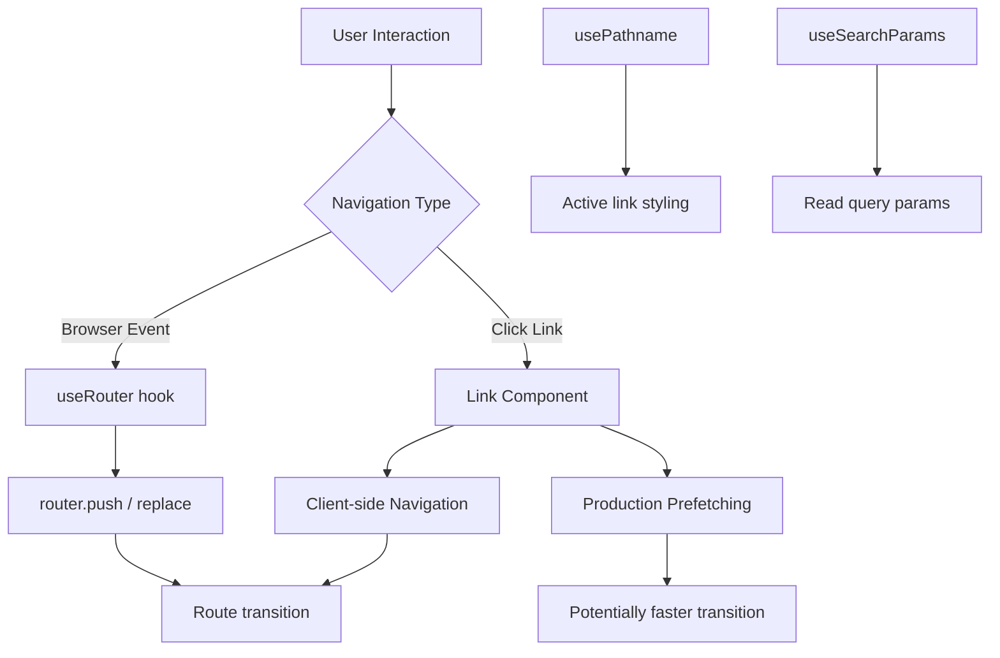

# Day 5 [Beginner]: Navigation with Link and useRouter

## Goal

Use the `<Link>` component for declarative navigation and the `useRouter` hook for programmatic navigation in Next.js App Router.

## Prerequisites

- Completed Day 4: Pages and Layouts
- Understanding of React hooks basics

## Explanation

Navigating between pages in Next.js should normally use the built-in `<Link>` component from `next/link` for internal navigation. `<Link>` renders an accessible anchor and enables Next.js client-side navigation when appropriate, avoiding a full browser document reload for normal internal route transitions. Plain `<a>` elements are still correct for external URLs, downloads, or cases where a normal browser navigation is intentionally required.

In production, Next.js can prefetch linked routes when `<Link>` enters the viewport. Prefetching is an optimization, not a guarantee that every byte of the destination is already cached. The amount of prefetched route information depends on the route and the current Next.js navigation/rendering model.

For navigation that needs to happen in response to an event, such as after a successful client-side form interaction, you can use the `useRouter` hook from `next/navigation`. It provides methods such as `router.push()`, `router.replace()`, `router.back()`, `router.forward()`, and `router.refresh()`. Because `useRouter` is a React hook that operates in the browser, the component using it must be a Client Component (`"use client"`). For server-side redirects, prefer the `redirect()` function from `next/navigation` instead of moving navigation logic into a Client Component unnecessarily.

## Topic by Topic

### Topic 1: The Link Component

Theory:
`<Link href="/about">` renders an anchor element and enables client-side navigation for an internal route. It is the preferred component for normal internal navigation.

Practical:
Use `<Link>` for internal application routes. Use a normal `<a>` when the destination is external or when a full browser navigation is intentional.

Code Example:

```tsx
// app/components/Navbar.tsx
import Link from "next/link";

export default function Navbar() {
  return (
    <nav style={{ display: "flex", gap: "1rem", padding: "1rem" }}>
      <Link href="/">Home</Link>
      <Link href="/about">About</Link>
      <Link href="/blog">Blog</Link>
      <a href="https://nextjs.org">Next.js Docs</a>
    </nav>
  );
}
```

**Explanation:** `<Link>` is preferred for internal navigation because Next.js can handle the route transition without a full document reload and can prefetch the destination in production. A plain `<a>` is not inherently wrong; it is appropriate for external navigation and other intentional full-page navigations.
**Key Points:**
- Understand the core concept behind The Link Component.
- Apply it with the right Next.js feature and defaults.
- Watch for common mistakes that affect performance, SEO, or maintainability.


### Topic 2: Active Link Styling

Theory:
Use the `usePathname` hook from `next/navigation` inside a Client Component to detect the current pathname and apply active styles to the matching link.

Practical:
Highlight the current page's link in the navigation bar to improve UX. For nested routes, consider checking whether the pathname starts with a section prefix rather than using only exact equality.

Code Example:

```tsx
"use client";

import Link from "next/link";
import { usePathname } from "next/navigation";

const links = [
  { href: "/", label: "Home" },
  { href: "/about", label: "About" },
  { href: "/blog", label: "Blog" },
];

export default function NavLinks() {
  const pathname = usePathname();

  return (
    <nav style={{ display: "flex", gap: "1rem" }}>
      {links.map((link) => {
        const isActive =
          link.href === "/"
            ? pathname === "/"
            : pathname === link.href || pathname.startsWith(`${link.href}/`);

        return (
          <Link
            key={link.href}
            href={link.href}
            aria-current={isActive ? "page" : undefined}
            style={{ fontWeight: isActive ? "bold" : "normal" }}
          >
            {link.label}
          </Link>
        );
      })}
    </nav>
  );
}
```

**Explanation:** `usePathname()` returns the current URL pathname. Because it is a client hook, the component using it must be marked with `"use client"`. Adding `aria-current="page"` also communicates the active state to assistive technology.
**Key Points:**
- Understand the core concept behind Active Link Styling.
- Apply it with the right Next.js feature and defaults.
- Watch for common mistakes that affect performance, SEO, or maintainability.


### Topic 3: useRouter for Programmatic Navigation

Theory:
`useRouter` from `next/navigation` gives Client Components methods such as `push`, `replace`, `back`, `forward`, and `refresh` for programmatic navigation.

Practical:
Use it when navigation is a consequence of a browser-side interaction. If a server-side condition determines whether the user may continue, use server-side authorization and `redirect()` rather than trusting client navigation.

Code Example:

```tsx
"use client";

import { useRouter } from "next/navigation";

export default function LoginButton() {
  const router = useRouter();

  function handleLogin() {
    const success = true;
    if (success) {
      router.push("/dashboard");
    }
  }

  return <button onClick={handleLogin}>Log In</button>;
}
```
**Explanation:** `useRouter` is useful for client-side navigation triggered by events. It should not be treated as an authentication or authorization mechanism. Protected resources must be checked on the server.

**Key Points:**
- Understand the core concept behind useRouter for Programmatic Navigation.
- Apply it with the right Next.js feature and defaults.
- Watch for common mistakes that affect performance, SEO, or maintainability.


### Topic 4: router.replace vs router.push

Theory:
`router.push` adds a new entry to the browser history stack. `router.replace` replaces the current history entry. Both can perform client-side navigation.

Practical:
Use `replace` when the current URL is an intermediate state that the user normally should not return to with the Back button, such as after a successful login or when applying a canonical filter state.

Code Example:

```tsx
"use client";

import { useRouter } from "next/navigation";

export default function LogoutButton() {
  const router = useRouter();

  function handleLogout() {
    // Session invalidation must happen through the appropriate auth mechanism.
    router.replace("/login");
  }

  return <button onClick={handleLogout}>Log Out</button>;
}
```
**Explanation:** `replace()` changes browser history behavior; it does not clear authentication state or provide security by itself. Authentication/session invalidation must happen through the appropriate server-side mechanism.

**Key Points:**
- Understand the core concept behind router.replace vs router.push.
- Apply it with the right Next.js feature and defaults.
- Watch for common mistakes that affect performance, SEO, or maintainability.


### Topic 5: Link with Dynamic Segments

Theory:
You can build dynamic `href` values with template literals. This is useful for generating links to dynamic routes such as `app/blog/[slug]/page.tsx`.

Practical:
Generate a list of blog post links from an array of posts.

Code Example:

```tsx
// app/blog/page.tsx
import Link from "next/link";

const posts = [
  { slug: "nextjs-routing", title: "Next.js Routing Guide" },
  { slug: "react-server-components", title: "React Server Components" },
];

export default function BlogPage() {
  return (
    <ul>
      {posts.map((post) => (
        <li key={post.slug}>
          <Link href={`/blog/${post.slug}`}>{post.title}</Link>
        </li>
      ))}
    </ul>
  );
}
```
**Explanation:** Dynamic links are ordinary `Link` components whose `href` contains a value from application data. Validate or constrain values when constructing URLs from untrusted input.

**Key Points:**
- Understand the core concept behind Link with Dynamic Segments.
- Apply it with the right Next.js feature and defaults.
- Watch for common mistakes that affect performance, SEO, or maintainability.


### Topic 6: Link Prefetching

Theory:
In production, Next.js can prefetch a linked route when the `<Link>` enters the viewport. You can opt out with `prefetch={false}`. Prefetching is an optimization and its behavior can vary with route structure and navigation state.

Practical:
Disable prefetching when a destination is rarely used or when prefetching would create unnecessary work or bandwidth usage.

Code Example:

```tsx
import Link from "next/link";

export default function AdminLink() {
  return (
    <Link href="/admin" prefetch={false}>
      Admin Panel
    </Link>
  );
}
```
**Explanation:** Do not describe prefetching as a guarantee that all destination data is already downloaded. It is a performance optimization. Authentication and authorization for `/admin` must still be enforced on the server.

**Key Points:**
- Understand the core concept behind Link Prefetching.
- Apply it with the right Next.js feature and defaults.
- Watch for common mistakes that affect performance, SEO, or maintainability.


### Topic 7: useSearchParams and URLSearchParams

Theory:
`useSearchParams` from `next/navigation` reads query string parameters in a Client Component. It is useful when client UI needs to react to values such as `?page=2&filter=recent`.

Practical:
Read and update search/filter parameters while keeping application state represented in the URL.

Code Example:

```tsx
"use client";

import { usePathname, useRouter, useSearchParams } from "next/navigation";

export default function FilterBar() {
  const searchParams = useSearchParams();
  const pathname = usePathname();
  const router = useRouter();
  const filter = searchParams.get("filter") ?? "all";

  function setFilter(value: string) {
    const params = new URLSearchParams(searchParams.toString());
    params.set("filter", value);
    router.push(`${pathname}?${params.toString()}`, { scroll: false });
  }

  return (
    <div>
      <button onClick={() => setFilter("all")}>All</button>
      <button onClick={() => setFilter("recent")}>Recent</button>
      <p>Current filter: {filter}</p>
    </div>
  );
}
```
**Explanation:** `useSearchParams` is read-only. Create a new `URLSearchParams` instance when changing values, then navigate with `router.push()` or `router.replace()`. If the page also reads search parameters on the server, changing the query string can cause the route to render with the new parameters.

**Key Points:**
- Understand the core concept behind useSearchParams and URLSearchParams.
- Apply it with the right Next.js feature and defaults.
- Watch for common mistakes that affect performance, SEO, or maintainability.


### Topic 8: Scroll Behaviour

Theory:
Next.js can manage scroll position during navigation. `<Link>` supports `scroll={false}` when you want to preserve the current scroll position. Router navigation methods also accept options such as `{ scroll: false }`.

Practical:
Use `scroll={false}` for tab/filter-style navigation where keeping the user's current position is desirable.

Code Example:

```tsx
import Link from "next/link";

export default function Tabs() {
  return (
    <div>
      <Link href="/dashboard?tab=overview" scroll={false}>
        Overview
      </Link>
      <Link href="/dashboard?tab=stats" scroll={false}>
        Stats
      </Link>
    </div>
  );
}
```
**Explanation:** `scroll={false}` tells the navigation not to reset the scroll position. Without it, Next.js normally manages scrolling for navigation, including scrolling to the top when appropriate.

**Key Points:**
- Understand the core concept behind Scroll Behaviour.
- Apply it with the right Next.js feature and defaults.
- Watch for common mistakes that affect performance, SEO, or maintainability.


## Key Concepts

- **Link**: The Next.js component for internal navigation with client-side routing and production prefetching.
- **useRouter**: A Client Component hook that provides methods for programmatic navigation (`push`, `replace`, `back`, `forward`, `refresh`).
- **usePathname**: A Client Component hook that returns the current URL pathname; useful for active link styling.
- **useSearchParams**: A Client Component hook that reads the current URL query parameters.
- **Prefetching**: A navigation optimization that can load route resources before the user clicks a link.
- **Client-side Navigation**: Navigation handled by the Next.js router without a normal full document reload.
- **router.push**: Navigates to a route and adds a browser history entry.
- **router.replace**: Navigates to a route while replacing the current browser history entry.

## Visual Concept Map



## End-to-End Practical

1. Build a `<Navbar>` component with `<Link>` components for Home, About, Blog, and Contact.
2. Add the Navbar to your root layout.
3. Use `usePathname` to highlight the active link in the Navbar.
4. Create a login form page with a submit button that uses `useRouter.push` to go to `/dashboard` on success.
5. Create a logout button that uses `router.replace('/login')` for the desired history behavior.
6. Add a blog page that lists posts with dynamic `<Link href={\`/blog/\${slug}\`}>` links.
7. Add a filter bar using `useSearchParams` and `URLSearchParams`.
8. Test internal navigation and observe that it does not normally perform a full document reload.

## Hands-on Coding

### Example 1: Full Navbar with Active Links

```tsx
"use client";

import Link from "next/link";
import { usePathname } from "next/navigation";

const navItems = [
  { href: "/", label: "Home" },
  { href: "/about", label: "About" },
  { href: "/blog", label: "Blog" },
  { href: "/contact", label: "Contact" },
];

export default function Navbar() {
  const pathname = usePathname();

  return (
    <header>
      <nav style={{ display: "flex", gap: "2rem", alignItems: "center" }}>
        {navItems.map((item) => {
          const isActive =
            item.href === "/"
              ? pathname === "/"
              : pathname === item.href || pathname.startsWith(`${item.href}/`);

          return (
            <Link
              key={item.href}
              href={item.href}
              aria-current={isActive ? "page" : undefined}
              style={{ fontWeight: isActive ? "bold" : "normal" }}
            >
              {item.label}
            </Link>
          );
        })}
      </nav>
    </header>
  );
}
```

### Example 2: Login Page with Programmatic Redirect

```tsx
"use client";

import { useState } from "react";
import { useRouter } from "next/navigation";

export default function LoginPage() {
  const [email, setEmail] = useState("");
  const router = useRouter();

  async function handleSubmit(e: React.FormEvent<HTMLFormElement>) {
    e.preventDefault();

    // Replace this with a real authentication request.
    await new Promise((resolve) => setTimeout(resolve, 500));
    router.replace("/dashboard");
  }

  return (
    <form onSubmit={handleSubmit} style={{ maxWidth: 400, margin: "4rem auto" }}>
      <h1>Login</h1>
      <input
        type="email"
        placeholder="Email"
        value={email}
        onChange={(e) => setEmail(e.target.value)}
        required
      />
      <button type="submit">Log In</button>
    </form>
  );
}
```

### Example 3: Dynamic Blog Post Links

```tsx
// app/blog/page.tsx
import Link from "next/link";

async function getPosts() {
  return [
    { slug: "intro-to-nextjs", title: "Intro to Next.js", date: "2026-01-01" },
    { slug: "server-components", title: "Understanding Server Components", date: "2026-01-05" },
    { slug: "app-router-routing", title: "App Router Routing Deep Dive", date: "2026-01-10" },
  ];
}

export default async function BlogPage() {
  const posts = await getPosts();

  return (
    <div>
      <h1>Blog</h1>
      <ul>
        {posts.map((post) => (
          <li key={post.slug}>
            <Link href={`/blog/${post.slug}`}>{post.title}</Link>
            <p>{post.date}</p>
          </li>
        ))}
      </ul>
    </div>
  );
}
```

## Mini Exercise

Scenario:
You have a product listing page at `/products`. Each product has an "Add to Cart" button that redirects to `/cart` after adding.

Steps:

1. Create `app/products/page.tsx` with a list of 3 products, each with an "Add to Cart" button.
2. Make the interactive product component a Client Component (`"use client"`).
3. On button click, use `useRouter.push('/cart')` to navigate to the cart.
4. Create `app/cart/page.tsx` with a "Your Cart" heading.
5. Remember that client navigation is not the same as implementing the actual cart mutation; persist cart state through an appropriate server or client data layer.
6. Test that clicking the button navigates to `/cart`.

Expected output:

- Clicking "Add to Cart" on any product navigates to `/cart`.
- The navigation is handled by the Next.js router without a normal full document reload.
- The cart page renders "Your Cart".

## Assessment Quiz

### Quiz Questions

1. Why should you normally use `<Link>` instead of `<a>` for internal navigation?
2. Which hook gives you the current URL pathname?
3. What is the difference between `router.push` and `router.replace`?
4. What does link prefetching do?
5. Which hook reads query string parameters from the URL?
6. When should you use `redirect()` instead of `useRouter()`?

### Quiz Answers

1. `<Link>` enables Next.js client-side navigation and can prefetch routes in production. A plain `<a>` performs normal browser navigation and is still appropriate for external URLs or intentional full-page navigations.
2. `usePathname()` from `next/navigation` returns the current pathname.
3. `router.push` adds a new route to browser history. `router.replace` replaces the current history entry.
4. Prefetching is a performance optimization that can load route resources before the user clicks a link. It is not a guarantee that all destination data is already available.
5. `useSearchParams()` from `next/navigation` reads query string parameters.
6. Use `redirect()` in server-side code when a server-side condition requires a redirect. Use `useRouter()` for browser-side event-driven navigation.

## Task

- Build a full navigation system: a Navbar with active link highlighting, a blog listing with dynamic links, and programmatic redirects after simulated login/logout.
- Use `scroll={false}` on tab-style navigation within a page.
- Use `useSearchParams` to implement a simple filter bar.
- Explain why client-side navigation is not an authentication or authorization boundary.

## Self Check

- Can you explain why `<Link>` is preferred for internal navigation?
- Do you know how to highlight the currently active navigation link?
- Can you perform programmatic navigation in a Client Component?
- Do you understand the difference between `push` and `replace`?
- Have you used `useSearchParams` to read URL query parameters?
- Do you know when server-side `redirect()` is more appropriate than `useRouter()`?

## Interview Questions and Answers

### Beginner

**Question:** How do you navigate to a different page on a button click in Next.js?
**Answer:** In a Client Component, import `useRouter` from `next/navigation` and call `router.push('/target-route')` inside the event handler. If the decision is made on the server, use `redirect()` instead.

**Question:** What is the purpose of the `<Link>` component in Next.js?
**Answer:** It enables Next.js client-side navigation between internal routes and supports route prefetching in production.

### Middle

**Question:** How would you implement active link highlighting in a navigation bar?
**Answer:** Use `usePathname` in a Client Component, compare the current pathname with each link's route, and expose the active state visually and with `aria-current` where appropriate.

**Question:** When would you use `router.replace` instead of `router.push`?
**Answer:** Use `replace` when the current history entry represents an intermediate state that the user normally should not return to with Back, such as certain post-login or filter transitions. It does not itself provide security.

### Advanced

**Question:** How does Next.js link prefetching work and what should developers avoid assuming about it?
**Answer:** In production, Next.js can prefetch linked routes as links become visible. The exact amount of route information prefetched depends on the route and navigation architecture. Developers should treat prefetching as an optimization rather than a guarantee that all destination data is already cached.

**Question:** How do you update URL query parameters from a Client Component?
**Answer:** Read them with `useSearchParams`, create a new `URLSearchParams` instance, set or delete values, and navigate with `router.push()` or `router.replace()`. Pass `{ scroll: false }` when preserving the current scroll position is desired.

## Day 5 Outcome

- You can navigate between internal pages using `<Link>`.
- You can highlight active links using `usePathname`.
- You can navigate programmatically using `useRouter` in Client Components.
- You understand when to use `push` vs `replace`.
- You can read and update URL query parameters.
- You understand the purpose and limitations of link prefetching.
- You are ready to learn dynamic routes on Day 6.
