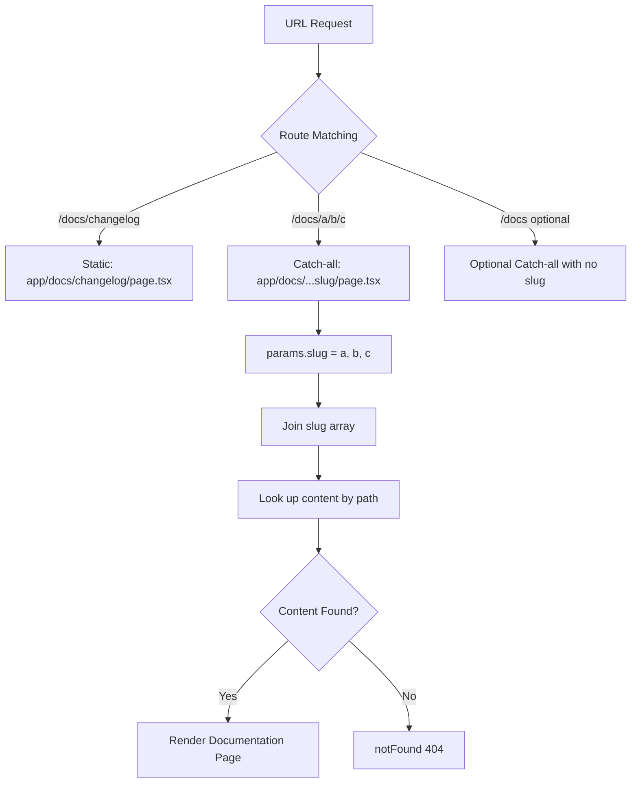

# Day 7 [Beginner]: Catch-all Routes

## Index

- [Goal](#goal)
- [Prerequisites](#prerequisites)
- [Explanation](#explanation)
- [Topic by Topic](#topic-by-topic)
- [Key Concepts](#key-concepts)
- [Visual Concept Map](#visual-concept-map)
- [End-to-End Practical](#end-to-end-practical)
- [Hands-on Coding](#hands-on-coding)
- [Mini Exercise](#mini-exercise)
- [Assessment Quiz](#assessment-quiz)
- [Task](#task)
- [Self Check](#self-check)
- [Interview Questions and Answers](#interview-questions-and-answers)
- [Day 7 Outcome](#day-7-outcome)

## Goal

Use catch-all routes (`[...slug]`) and optional catch-all routes (`[[...slug]]`) to match multiple URL segments with a single page file.

## Prerequisites

- Completed Day 6: Dynamic Routes
- Understanding of dynamic route segments with brackets

## Explanation

Sometimes you need a single page to handle routes with an unknown number of segments. For example, a documentation site might have URLs like `/docs/getting-started`, `/docs/guides/deployment`, and `/docs/guides/advanced/docker`. All of these could be handled by one page file if you use a catch-all route.

A catch-all route is created by using three dots inside the brackets: `[...slug]`. This matches any number of segments after the parent path, and the `params.slug` value is an array of strings representing each segment. For `/docs/guides/deployment`, `slug` would be `['guides', 'deployment']`.

An optional catch-all route uses double brackets: `[[...slug]]`. The difference is that this also matches the parent path with no additional segments. So `[[...slug]]` in `app/docs/` matches both `/docs` and `/docs/anything/here`.

These patterns are perfect for documentation sites, wikis, CMS-driven pages, and any content tree with arbitrary depth.

## Topic by Topic

### Topic 1: Catch-all Syntax [...slug]

Theory:
Name a folder with three dots inside brackets — `[...slug]` — to catch any number of URL segments. The matched segments arrive as an array in `params.slug`.

Practical:
Use this for documentation or wiki pages where the depth of nesting varies.

Code Example:

```tsx
// File: app/docs/[...slug]/page.tsx
// Matches: /docs/intro, /docs/guide/setup, /docs/guide/advanced/docker

type Props = { params: Promise<{ slug: string[] }> };

export default async function DocsPage({ params }: Props) {
  const { slug } = await params; // Extract slug array from params
  const path = slug.join(" / "); // Convert array to readable path
  return (
    <div>
      <h1>Documentation</h1>
      <p>Path: {path}</p>
    </div>
  );
}
```

**Explanation:** The `[...slug]` syntax captures all remaining URL segments as an array. `/docs/guide/setup` results in `slug = ['guide', 'setup']`. This single page handles unlimited nested paths without creating separate files.
**Key Points:**
- Understand the core concept behind Catch-all Syntax [...slug].
- Apply it with the right Next.js feature and defaults.
- Watch for common mistakes that affect performance, SEO, or maintainability.


### Topic 2: Optional Catch-all [[...slug]]

Theory:
Double brackets `[[...slug]]` make the segments optional. The page also matches the base route (no extra segments). `params.slug` is `undefined` when no segments are present.

Practical:
Use this when the base route and nested routes should render in the same component with different behaviour.

Code Example:

```tsx
// File: app/docs/[[...slug]]/page.tsx
// Matches: /docs (slug = undefined), /docs/intro (slug = ['intro']), /docs/guide/setup

type Props = { params: Promise<{ slug?: string[] }> };

export default async function DocsPage({ params }: Props) {
  const { slug } = await params;
  if (!slug) {
    return <h1>Documentation Home</h1>;
  }
  return <h1>Doc: {slug.join(" → ")}</h1>;
}
```
**Explanation:**
This topic explains Optional Catch-all [[...slug]] in practical Next.js terms so you can build correct routing, rendering, and data flow patterns in real applications.

**Key Points:**
- Understand the core concept behind Optional Catch-all [[...slug]].
- Apply it with the right Next.js feature and defaults.
- Watch for common mistakes that affect performance, SEO, or maintainability.


### Topic 3: Building a Breadcrumb from slug Array

Theory:
Since `slug` is an array of path segments, you can build a breadcrumb trail by mapping over the array and constructing partial paths.

Practical:
Show a breadcrumb like `Docs > Guide > Setup` at the top of each doc page.

Code Example:

```tsx
// app/docs/[...slug]/page.tsx
import Link from "next/link";

type Props = { params: Promise<{ slug: string[] }> };

export default async function DocsPage({ params }: Props) {
  const { slug } = await params;

  const breadcrumbs = slug.map((segment, index) => ({
    label: segment.replace(/-/g, " "),
    href: "/docs/" + slug.slice(0, index + 1).join("/"),
  }));

  return (
    <div>
      <nav
        style={{
          display: "flex",
          gap: "0.5rem",
          marginBottom: "1rem",
          color: "#666",
        }}
      >
        <Link href="/docs">Docs</Link>
        {breadcrumbs.map((crumb) => (
          <span key={crumb.href}>
            <span> / </span>
            <Link href={crumb.href} style={{ textTransform: "capitalize" }}>
              {crumb.label}
            </Link>
          </span>
        ))}
      </nav>
      <h1 style={{ textTransform: "capitalize" }}>
        {slug[slug.length - 1].replace(/-/g, " ")}
      </h1>
    </div>
  );
}
```
**Explanation:**
This topic explains Building a Breadcrumb from slug Array in practical Next.js terms so you can build correct routing, rendering, and data flow patterns in real applications.

**Key Points:**
- Understand the core concept behind Building a Breadcrumb from slug Array.
- Apply it with the right Next.js feature and defaults.
- Watch for common mistakes that affect performance, SEO, or maintainability.


### Topic 4: Fetching Content for Catch-all Routes

Theory:
Use the `slug` array to construct a file path or database key to look up the correct content for each URL.

Practical:
In a documentation system, map `['guide', 'setup']` to a markdown file at `content/guide/setup.md`.

Code Example:

```tsx
// app/docs/[...slug]/page.tsx
import { notFound } from "next/navigation";

type Props = { params: Promise<{ slug: string[] }> };

const content: Record<string, { title: string; body: string }> = {
  intro: { title: "Introduction", body: "Welcome to the docs." },
  "guide/setup": { title: "Setup Guide", body: "Install Node.js and Next.js." },
  "guide/deployment": { title: "Deployment", body: "Deploy to Vercel." },
};

export default async function DocsPage({ params }: Props) {
  const { slug } = await params;
  const key = slug.join("/");
  const page = content[key];
  if (!page) notFound();
  return (
    <article>
      <h1>{page.title}</h1>
      <p>{page.body}</p>
    </article>
  );
}
```
**Explanation:**
This topic explains Fetching Content for Catch-all Routes in practical Next.js terms so you can build correct routing, rendering, and data flow patterns in real applications.

**Key Points:**
- Understand the core concept behind Fetching Content for Catch-all Routes.
- Apply it with the right Next.js feature and defaults.
- Watch for common mistakes that affect performance, SEO, or maintainability.


### Topic 5: generateStaticParams for Catch-all Routes

Theory:
`generateStaticParams` for catch-all routes returns an array of objects where each object has the `slug` key set to an array of strings.

Practical:
Pre-render all known documentation pages at build time.

Code Example:

```tsx
// app/docs/[...slug]/page.tsx
export async function generateStaticParams() {
  return [
    { slug: ["intro"] },
    { slug: ["guide", "setup"] },
    { slug: ["guide", "deployment"] },
    { slug: ["reference", "api", "routes"] },
  ];
}
```
**Explanation:**
This topic explains generateStaticParams for Catch-all Routes in practical Next.js terms so you can build correct routing, rendering, and data flow patterns in real applications.

**Key Points:**
- Understand the core concept behind generateStaticParams for Catch-all Routes.
- Apply it with the right Next.js feature and defaults.
- Watch for common mistakes that affect performance, SEO, or maintainability.


### Topic 6: Combining Catch-all with Static Segments

Theory:
You can mix static and dynamic segments in a route. A static segment has a literal name; a catch-all segment handles the variable part. The most specific match wins.

Practical:
`app/docs/changelog/page.tsx` (static) takes priority over `app/docs/[...slug]/page.tsx` for `/docs/changelog`.

Code Example:

```tsx
// app/docs/changelog/page.tsx — handles /docs/changelog specifically
export default function ChangelogPage() {
  return <h1>Changelog</h1>;
}

// app/docs/[...slug]/page.tsx — handles all other /docs/... paths
// Next.js prefers the more specific static route
```
**Explanation:**
This topic explains Combining Catch-all with Static Segments in practical Next.js terms so you can build correct routing, rendering, and data flow patterns in real applications.

**Key Points:**
- Understand the core concept behind Combining Catch-all with Static Segments.
- Apply it with the right Next.js feature and defaults.
- Watch for common mistakes that affect performance, SEO, or maintainability.


### Topic 7: Error Handling in Catch-all Routes

Theory:
Wrap your catch-all page logic in try/catch and use `notFound()` or `error.tsx` to handle errors gracefully.

Practical:
If loading the doc content fails (e.g., file not found), show a friendly error page.

Code Example:

```tsx
// app/docs/[...slug]/page.tsx
import { notFound } from "next/navigation";

type Props = { params: Promise<{ slug: string[] }> };

export default async function DocsPage({ params }: Props) {
  const { slug } = await params;
  try {
    const content = await loadDocContent(slug.join("/"));
    if (!content) notFound();
    return (
      <article>
        <h1>{content.title}</h1>
        <p>{content.body}</p>
      </article>
    );
  } catch {
    notFound();
  }
}

async function loadDocContent(path: string) {
  const db: Record<string, { title: string; body: string }> = {
    intro: { title: "Introduction", body: "Welcome." },
  };
  return db[path] ?? null;
}
```
**Explanation:**
This topic explains Error Handling in Catch-all Routes in practical Next.js terms so you can build correct routing, rendering, and data flow patterns in real applications.

**Key Points:**
- Understand the core concept behind Error Handling in Catch-all Routes.
- Apply it with the right Next.js feature and defaults.
- Watch for common mistakes that affect performance, SEO, or maintainability.


### Topic 8: When to Use Catch-all vs Dynamic Routes

Theory:
Use a regular dynamic segment `[id]` when you have exactly one variable part per URL level. Use catch-all `[...slug]` when the depth is variable (1 or more segments).

Practical:
Blog posts → `[slug]` (one level). Documentation → `[...slug]` (variable depth).

Code Example:

```
// Fixed depth — use [slug]
app/blog/[slug]/page.tsx     → /blog/hello-world

// Variable depth — use [...slug]
app/docs/[...slug]/page.tsx  → /docs/a
                             → /docs/a/b
                             → /docs/a/b/c
```
**Explanation:**
This topic explains When to Use Catch-all vs Dynamic Routes in practical Next.js terms so you can build correct routing, rendering, and data flow patterns in real applications.

**Key Points:**
- Understand the core concept behind When to Use Catch-all vs Dynamic Routes.
- Apply it with the right Next.js feature and defaults.
- Watch for common mistakes that affect performance, SEO, or maintainability.


## Key Concepts

- **Catch-all Route**: A route using `[...slug]` that matches one or more URL segments after the parent.
- **Optional Catch-all Route**: A route using `[[...slug]]` that also matches the parent path with no extra segments.
- **slug Array**: The `params.slug` value for catch-all routes is an array of the matched URL segments.
- **Breadcrumb**: A navigational component built from the `slug` array that shows the current path hierarchy.
- **Specificity**: Next.js prefers more specific (static or regular dynamic) routes over catch-all routes when both match.
- **generateStaticParams for catch-all**: Returns objects with `slug` as an array of strings to pre-render catch-all paths.
- **Content Lookup by Path**: Using the joined `slug` array as a key to look up CMS or filesystem content.
- **notFound()**: Should be called when the catch-all path does not correspond to valid content.

## Visual Concept Map



## End-to-End Practical

1. Create `app/docs/[...slug]/page.tsx` with a breadcrumb and content lookup.
2. Create a mock content database with 5 entries at different depths.
3. Add `generateStaticParams` returning the 5 content paths.
4. Visit each URL and confirm the breadcrumb and content render.
5. Visit an unknown URL and confirm the 404 appears.
6. Create `app/docs/page.tsx` (or change to `[[...slug]]`) to handle the `/docs` base route.
7. Create a static `app/docs/changelog/page.tsx` and confirm it takes priority over the catch-all.

## Hands-on Coding

### Example 1: Full Documentation System

```tsx
// app/docs/[...slug]/page.tsx
import Link from "next/link";
import { notFound } from "next/navigation";
import type { Metadata } from "next";

type DocPage = { title: string; content: string };

const docs: Record<string, DocPage> = {
  "getting-started": {
    title: "Getting Started",
    content: "Install Node.js v18+ and run npx create-next-app.",
  },
  "guides/routing": {
    title: "Routing Guide",
    content: "Next.js uses file-based routing.",
  },
  "guides/data-fetching": {
    title: "Data Fetching",
    content: "Use async Server Components to fetch data.",
  },
  "reference/api": {
    title: "API Reference",
    content: "Full list of Next.js APIs.",
  },
  "reference/api/route-handlers": {
    title: "Route Handlers",
    content: "Create API endpoints with route.ts files.",
  },
};

type Props = { params: Promise<{ slug: string[] }> };

export async function generateStaticParams() {
  return Object.keys(docs).map((key) => ({ slug: key.split("/") }));
}

export async function generateMetadata({ params }: Props): Promise<Metadata> {
  const { slug } = await params;
  const page = docs[slug.join("/")];
  return { title: page?.title ?? "Not Found" };
}

export default async function DocPage({ params }: Props) {
  const { slug } = await params;
  const key = slug.join("/");
  const page = docs[key];
  if (!page) notFound();

  const crumbs = slug.map((s, i) => ({
    label: s.replace(/-/g, " "),
    href: "/docs/" + slug.slice(0, i + 1).join("/"),
  }));

  return (
    <div>
      <nav
        style={{
          display: "flex",
          gap: "0.5rem",
          marginBottom: "1.5rem",
          fontSize: "0.875rem",
          color: "#666",
        }}
      >
        <Link href="/docs" style={{ color: "#0070f3" }}>
          Docs
        </Link>
        {crumbs.map((c) => (
          <span key={c.href}>
            {" "}
            /{" "}
            <Link
              href={c.href}
              style={{ color: "#0070f3", textTransform: "capitalize" }}
            >
              {c.label}
            </Link>
          </span>
        ))}
      </nav>
      <h1>{page.title}</h1>
      <p style={{ lineHeight: 1.8 }}>{page.content}</p>
    </div>
  );
}
```

### Example 2: Optional Catch-all for Wiki

```tsx
// app/wiki/[[...slug]]/page.tsx
import { notFound } from "next/navigation";

type Props = { params: Promise<{ slug?: string[] }> };

const wiki: Record<string, { title: string; body: string }> = {
  "": { title: "Wiki Home", body: "Welcome to the wiki." },
  javascript: { title: "JavaScript", body: "JS is a dynamic language." },
  "javascript/closures": {
    title: "Closures",
    body: "A closure is a function that remembers its outer scope.",
  },
};

export default async function WikiPage({ params }: Props) {
  const { slug } = await params;
  const key = slug ? slug.join("/") : "";
  const page = wiki[key];
  if (!page) notFound();
  return (
    <article>
      <h1>{page.title}</h1>
      <p>{page.body}</p>
    </article>
  );
}
```

### Example 3: CMS-driven Page Builder

```tsx
// app/pages/[...slug]/page.tsx
type CmsPage = { heading: string; sections: string[] };

async function fetchCmsPage(path: string): Promise<CmsPage | null> {
  const pages: Record<string, CmsPage> = {
    about: { heading: "About Us", sections: ["Our mission", "Our team"] },
    "about/culture": {
      heading: "Our Culture",
      sections: ["Values", "Work-life balance"],
    },
    "services/web": {
      heading: "Web Services",
      sections: ["Design", "Development", "SEO"],
    },
  };
  return pages[path] ?? null;
}

type Props = { params: Promise<{ slug: string[] }> };

export default async function CmsPage({ params }: Props) {
  const { slug } = await params;
  const page = await fetchCmsPage(slug.join("/"));
  if (!page) return <h1>404 — Content not found</h1>;
  return (
    <div>
      <h1>{page.heading}</h1>
      {page.sections.map((s) => (
        <p key={s}>{s}</p>
      ))}
    </div>
  );
}
```

## Mini Exercise

Scenario:
Build a simple help centre with catch-all routing for articles at different depths: `/help/account`, `/help/billing/payments`, `/help/billing/refunds`.

Steps:

1. Create `app/help/[...slug]/page.tsx`.
2. Create a content map with 4 articles at varying depths.
3. Display the article title and content.
4. Show a breadcrumb navigation from the slug array.
5. Return 404 for unrecognised paths.

Expected output:

- `/help/account` shows the account article.
- `/help/billing/payments` shows the payments article.
- `/help/billing/unknown` shows the 404 page.
- Breadcrumbs render correctly for each path.

## Assessment Quiz

### Quiz Questions

1. What folder name syntax creates a catch-all route?
2. What type is `params.slug` in a catch-all route?
3. What is the difference between `[...slug]` and `[[...slug]]`?
4. How do you provide pre-rendered paths for catch-all routes in `generateStaticParams`?
5. What happens when both a static route and a catch-all route match a URL?

### Quiz Answers

1. `[...slug]` — three dots inside brackets. For example, the folder `app/docs/[...slug]/` creates a catch-all.
2. `params.slug` is a `string[]` — an array of the URL segments after the parent path.
3. `[...slug]` requires at least one extra segment. `[[...slug]]` is optional — it also matches the base URL with no extra segments.
4. Return an array of objects where each object has the slug key set to an array: `[{ slug: ['a', 'b'] }, { slug: ['c'] }]`.
5. Next.js prefers the more specific match. A static route or regular dynamic route takes priority over a catch-all for the same URL.

## Task

- Build a documentation site with `[...slug]` routing for variable-depth pages.
- Add breadcrumb navigation built from the slug array.
- Pre-render 5 pages using `generateStaticParams`.
- Use a static route for `/docs/changelog` that takes priority.
- Show a 404 for unrecognised paths.

## Self Check

- Can you write the folder name for a catch-all route?
- Do you understand the difference between `[...slug]` and `[[...slug]]`?
- Can you build a breadcrumb from the slug array?
- Do you know how to write `generateStaticParams` for catch-all routes?
- Have you confirmed that static routes take priority over catch-all routes?

## Interview Questions and Answers

### Beginner

**Question:** What is a catch-all route in Next.js and when would you use it?
**Answer:** A catch-all route (`[...slug]`) matches any number of URL segments with a single file. Use it for documentation, wikis, or any content tree with variable depth.

**Question:** What value does `params.slug` have for a catch-all route matching `/docs/guide/setup`?
**Answer:** It is `['guide', 'setup']` — an array of the segments after the parent `/docs/` path.

### Middle

**Question:** How does an optional catch-all differ from a regular catch-all?
**Answer:** `[[...slug]]` also matches the parent route with no additional segments. `params.slug` is `undefined` in that case. Use it when the base path and nested paths should use the same component.

**Question:** How do you handle deeply nested content in `generateStaticParams` for catch-all routes?
**Answer:** Return an array of objects where each `slug` value is an array representing the path segments: `{ slug: ['a', 'b', 'c'] }` represents the path `/parent/a/b/c`.

### Advanced

**Question:** How would you implement a CMS-driven page builder with a catch-all route?
**Answer:** Use `[[...slug]]` to match all CMS page paths including the root. In the page component, join the slug array to form a path key, fetch the matching CMS page object, and render the content using a flexible component system (e.g., block renderer for different content types).

**Question:** What performance considerations exist for catch-all routes with many possible paths?
**Answer:** `generateStaticParams` with thousands of paths increases build time. Use ISR (`revalidate`) to build pages on demand and cache them, rather than pre-rendering every possible path at build time.

## Day 7 Outcome

- You understand when and why to use catch-all routes.
- You can create both required and optional catch-all segments.
- You can build breadcrumbs from the slug array.
- You know how to write `generateStaticParams` for catch-all paths.
- You are ready to learn about static assets and the public folder on Day 8.
