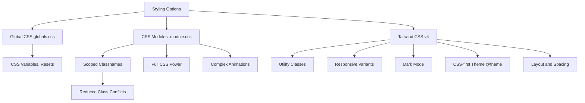

# Day 9 [Beginner]: Styling CSS Modules and Tailwind

## Goal

Apply styles to Next.js components using CSS Modules for scoped styles and Tailwind CSS for utility-first styling, and understand when to choose each approach.

## Prerequisites

- Completed Day 8: Static Assets and Public Folder
- Basic CSS knowledge

## Explanation

Styling in Next.js supports several approaches, including global CSS, CSS Modules, and Tailwind CSS. CSS Modules are built into Next.js — you create a `.module.css` file, import it into a component, and reference styles through the imported object. Class names are locally scoped, which helps prevent accidental naming collisions between components.

Tailwind CSS is a utility-first framework. Instead of creating a separate CSS rule for every component style, you compose small utility classes directly in JSX, such as `flex`, `items-center`, `p-4`, and `bg-blue-500`. Tailwind CSS v4 uses a CSS-first configuration model and can be integrated with Next.js through the `@tailwindcss/postcss` PostCSS plugin. Current Tailwind versions automatically detect source files in typical projects, so the older `content` array is not required for the normal v4 setup.

Both approaches are valid. CSS Modules are useful when a component needs normal CSS features, custom selectors, or styles that are easier to maintain in a dedicated stylesheet. Tailwind is useful for utility-driven layouts, responsive design, and consistent design tokens. A project can use both without a problem.

## Topic by Topic

### Topic 1: Global Styles with globals.css

Theory:
`app/globals.css` is imported by the root layout and provides styles that can apply across the application. Use it for global defaults, CSS resets, CSS custom properties, and other truly global styles.

Practical:
Keep global CSS focused. Component-specific styles should normally live in CSS Modules or be expressed with Tailwind utilities.

Code Example:

```css
/* app/globals.css */
*,
*::before,
*::after {
  box-sizing: border-box;
  margin: 0;
  padding: 0;
}

:root {
  --color-primary: #0070f3;
  --color-background: #ffffff;
  --color-text: #111827;
  --font-sans: "Inter", system-ui, sans-serif;
}

body {
  font-family: var(--font-sans);
  color: var(--color-text);
  background: var(--color-background);
  line-height: 1.6;
}
```

**Explanation:** Global styles in `app/globals.css` can affect the whole application. Use them for resets, root-level variables, and other styles that genuinely need global scope. Keep component-specific rules out of this file when possible.

**Key Points:**
- Global CSS is appropriate for application-wide styles and CSS custom properties.
- CSS Modules provide local scoping for component-specific CSS.
- Tailwind utilities can be used alongside global CSS.

### Topic 2: CSS Modules — Creating and Importing

Theory:
Create a file named `ComponentName.module.css`. Import it as a default object and apply classes using `styles.className`. CSS Modules transform local class names so they do not collide with the same class name used by another module.

Practical:
Use CSS Modules for component-specific styles that require normal CSS features such as pseudo-classes, custom selectors, or animations.

Code Example:

```css
/* components/Card.module.css */
.card {
  background: #fff;
  border: 1px solid #e5e7eb;
  border-radius: 8px;
  padding: 1.5rem;
  transition: box-shadow 0.2s;
}

.card:hover {
  box-shadow: 0 4px 12px rgba(0, 0, 0, 0.1);
}

.title {
  font-size: 1.25rem;
  font-weight: 600;
  margin-bottom: 0.5rem;
}
```

```tsx
// components/Card.tsx
import styles from "./Card.module.css";

type CardProps = {
  title: string;
  description: string;
};

export default function Card({ title, description }: CardProps) {
  return (
    <div className={styles.card}>
      <h2 className={styles.title}>{title}</h2>
      <p>{description}</p>
    </div>
  );
}
```

**Explanation:** CSS Modules keep component styles locally scoped while still giving you the full CSS language. They are especially useful when a component needs selectors or styles that are clearer in a dedicated stylesheet.

**Key Points:**
- Use the `.module.css` naming convention.
- Import the module and access classes through the imported object.
- Local scoping reduces class-name collisions.

### Topic 3: CSS Modules — Composing Classes

Theory:
Use template literals or a utility such as `clsx` to combine multiple module classes or apply conditional classes. `clsx` is optional; CSS Modules themselves do not require it.

Practical:
Install `clsx` with `npm install clsx` when conditional class composition becomes useful.

Code Example:

```css
/* components/Button.module.css */
.btn {
  padding: 0.75rem 1rem;
  border-radius: 0.5rem;
}

.primary {
  background: #2563eb;
  color: white;
}

.secondary {
  background: #e5e7eb;
  color: #111827;
}

.disabled {
  opacity: 0.5;
  cursor: not-allowed;
}
```

```tsx
import { clsx } from "clsx";
import styles from "./Button.module.css";
import type { ReactNode } from "react";

type ButtonProps = {
  children: ReactNode;
  variant?: "primary" | "secondary";
  disabled?: boolean;
};

export default function Button({
  children,
  variant = "primary",
  disabled = false,
}: ButtonProps) {
  return (
    <button
      className={clsx(
        styles.btn,
        styles[variant],
        disabled && styles.disabled,
      )}
      disabled={disabled}
    >
      {children}
    </button>
  );
}
```

**Explanation:** `clsx` makes conditional class composition readable. It does not generate CSS or replace CSS Modules; it only combines class-name strings.

**Key Points:**
- CSS Modules and `clsx` solve different problems.
- `clsx` is useful for conditional classes.
- Keep the actual styles in the CSS Module.

### Topic 4: Tailwind CSS Setup

Theory:
For a current Tailwind CSS v4 setup, Next.js can use Tailwind through PostCSS. Install `tailwindcss`, `@tailwindcss/postcss`, and `postcss`, then configure the Tailwind PostCSS plugin. Tailwind v4 uses CSS-first configuration and normally does not require a `tailwind.config.ts` file or a manual `content` array.

Practical:
If Tailwind was selected while creating the Next.js project, the setup may already be generated for you. If you are adding it manually, the essential setup is:

Code Example:

```bash
npm install tailwindcss @tailwindcss/postcss postcss
```

```ts
// postcss.config.mjs
const config = {
  plugins: {
    "@tailwindcss/postcss": {},
  },
};

export default config;
```

```css
/* app/globals.css */
@import "tailwindcss";
```

```tsx
// app/page.tsx
export default function HeroSection() {
  return (
    <section className="flex min-h-screen flex-col items-center justify-center bg-gradient-to-br from-blue-600 to-purple-600 px-4 text-white">
      <h1 className="mb-4 text-center text-5xl font-bold">
        Build Faster with Next.js
      </h1>
      <p className="mb-8 max-w-lg text-center text-xl text-blue-100">
        The React framework for production-grade web applications.
      </p>
      <a
        href="/get-started"
        className="rounded-lg bg-white px-8 py-3 font-semibold text-blue-600 transition-colors hover:bg-blue-50"
      >
        Get Started
      </a>
    </section>
  );
}
```

**Explanation:** Tailwind v4 generates utilities from the classes used in your source files and uses CSS-first configuration. The `@tailwindcss/postcss` plugin is the current PostCSS integration. Older projects may still contain a `tailwind.config.js/ts` and v3-style directives; those should be identified as Tailwind v3/legacy configuration rather than presented as the default v4 setup.

**Key Points:**
- Tailwind v4 uses `@import "tailwindcss"`.
- The current PostCSS integration uses `@tailwindcss/postcss`.
- A normal v4 project does not need a `content` array for source detection.

### Topic 5: Tailwind Responsive Design

Theory:
Tailwind uses breakpoint prefixes such as `sm:`, `md:`, `lg:`, and `xl:`. The responsive system is mobile-first: an unprefixed utility applies by default, while a prefixed utility applies at that breakpoint and above unless overridden.

Practical:
Build a card grid that is one column by default, two columns from the `sm` breakpoint, and three columns from the `lg` breakpoint.

Code Example:

```tsx
type Card = {
  id: number;
  title: string;
};

type CardGridProps = {
  cards: Card[];
};

export default function CardGrid({ cards }: CardGridProps) {
  return (
    <div className="grid grid-cols-1 gap-6 p-6 sm:grid-cols-2 lg:grid-cols-3">
      {cards.map((card) => (
        <div
          key={card.id}
          className="rounded-xl border border-gray-100 bg-white p-6 shadow-sm transition-shadow hover:shadow-md"
        >
          <h3 className="text-lg font-semibold text-gray-900">
            {card.title}
          </h3>
        </div>
      ))}
    </div>
  );
}
```

**Explanation:** Responsive utilities are CSS rules generated from the class names. The default mobile-first approach means you normally start with the smallest-screen layout and progressively add breakpoint-specific changes.

**Key Points:**
- Unprefixed utilities form the base/mobile style.
- `sm:`, `md:`, `lg:`, and other prefixes apply styles at their breakpoints and above.
- Responsive behavior is handled by CSS; it does not require a Client Component.

### Topic 6: Tailwind Dark Mode

Theory:
Tailwind provides the `dark:` variant. In Tailwind v4, the default dark mode follows the user's `prefers-color-scheme` setting. If your application needs manual theme switching with a `.dark` class, define a custom `dark` variant in CSS.

Practical:
Use the system-preference approach when no manual theme switch is required. For an application-controlled theme, place the `dark` class on an appropriate ancestor such as `<html>` and define the custom variant.

Code Example:

```css
/* app/globals.css */
@import "tailwindcss";

/* Use this only when your application controls dark mode with a .dark class. */
@custom-variant dark (&:where(.dark, .dark *));
```

```tsx
// Example component
export default function ThemedCard() {
  return (
    <div className="rounded-xl bg-white p-6 text-gray-900 dark:bg-gray-800 dark:text-gray-100">
      <h2 className="text-xl font-bold">Card Title</h2>
      <p className="text-gray-600 dark:text-gray-400">
        Card description text.
      </p>
    </div>
  );
}
```

**Explanation:** The `dark:` variant applies styles when Tailwind considers the page to be in dark mode. Tailwind v4 defaults to the user's color-scheme preference. A `.dark`-class strategy requires an explicit custom variant such as the one above and application code that controls the class.

**Key Points:**
- `dark:` is a variant, not a separate CSS framework.
- Tailwind v4 defaults to system color preference.
- Manual theme switching needs an explicit `.dark` selector strategy.

### Topic 7: Mixing CSS Modules and Tailwind

Theory:
CSS Modules and Tailwind can be used in the same project and even in the same component. Use Tailwind for utility-driven layout and CSS Modules for custom rules that are clearer in normal CSS.

Practical:
Apply Tailwind utilities for layout and a CSS Module class for a custom animation.

Code Example:

```css
/* components/Spinner.module.css */
.spin {
  animation: spin 1s linear infinite;
}

@keyframes spin {
  from {
    transform: rotate(0deg);
  }
  to {
    transform: rotate(360deg);
  }
}
```

```tsx
import styles from "./Spinner.module.css";

export default function LoadingSpinner() {
  return (
    <div className="flex items-center justify-center p-8">
      <div
        className={`h-8 w-8 rounded-full border-4 border-blue-500 border-t-transparent ${styles.spin}`}
        aria-label="Loading"
        role="status"
      />
    </div>
  );
}
```

**Explanation:** There is no requirement to choose only one styling method. Combining them can be useful, but keep a clear responsibility for each approach so the component does not become difficult to maintain.

**Key Points:**
- Tailwind and CSS Modules can coexist.
- Prefer one primary styling approach per component when possible.
- Use CSS Modules when normal CSS is clearer than a long utility list.

### Topic 8: Tailwind Custom Theme

Theory:
Tailwind CSS v4 uses CSS-first theme configuration. Use the `@theme` directive to define design tokens such as custom colours, fonts, and breakpoints. These theme variables can generate corresponding Tailwind utilities.

Practical:
Define a custom brand palette and font family in `app/globals.css`, then use the generated utilities in your components.

Code Example:

```css
/* app/globals.css */
@import "tailwindcss";

@theme {
  --color-brand-50: #eff6ff;
  --color-brand-100: #dbeafe;
  --color-brand-500: #3b82f6;
  --color-brand-700: #1d4ed8;
  --color-brand-900: #1e3a8a;
  --font-heading: "Poppins", sans-serif;
}
```

```tsx
export default function BrandHeading() {
  return (
    <h1 className="font-heading text-3xl font-bold text-brand-700">
      CodingTerminals
    </h1>
  );
}
```

**Explanation:** The `@theme` directive is the Tailwind v4 approach for defining design tokens that become available to utilities. A legacy JavaScript configuration file can still be loaded in v4 when needed for migration, but it should not be presented as the default configuration model for a new v4 project.

**Key Points:**
- Use `@theme` for Tailwind v4 design tokens.
- Custom colour tokens can generate utilities such as `bg-brand-500` and `text-brand-700`.
- Keep design tokens centralized so the UI remains consistent.

## Key Concepts

- **CSS Modules**: CSS files that locally scope class names to reduce naming collisions.
- **Utility-first CSS**: The Tailwind approach of applying small, single-purpose classes directly in JSX.
- **Global Styles**: Styles applied site-wide via `app/globals.css`, useful for resets and CSS custom properties.
- **Responsive Utilities**: Tailwind breakpoint variants such as `sm:` and `lg:` for mobile-first responsive design.
- **Dark Mode**: Styling with the `dark:` variant, using system preference by default in Tailwind v4 or an explicit custom selector for manual themes.
- **clsx**: A utility for conditionally combining class names.
- **Tailwind v4 Theme**: CSS-first design-token configuration using `@theme`.
- **Scoped CSS**: Styles that are locally scoped to a component through CSS Modules.

## Visual Concept Map



## End-to-End Practical

1. Open `app/globals.css` and add CSS custom properties for application-wide values.
2. Create a `Button.module.css` with primary and secondary button styles.
3. Build a `Button.tsx` component that uses CSS Modules.
4. Rebuild the same Button using Tailwind CSS utilities.
5. Create a card grid using Tailwind responsive grid utilities.
6. Add dark mode support to the card component using the `dark:` variant.
7. Define a custom brand colour with Tailwind v4's `@theme` directive and use the generated utility in the UI.

## Hands-on Coding

### Example 1: Responsive Navbar with Tailwind

```tsx
// app/components/Navbar.tsx
"use client";

import Link from "next/link";
import { useState } from "react";

export default function Navbar() {
  const [isOpen, setIsOpen] = useState(false);
  const links = [
    { href: "/", label: "Home" },
    { href: "/about", label: "About" },
    { href: "/blog", label: "Blog" },
    { href: "/contact", label: "Contact" },
  ];

  return (
    <header className="border-b border-gray-200 bg-white">
      <div className="mx-auto flex h-16 max-w-6xl items-center justify-between px-4">
        <Link href="/" className="text-xl font-bold text-gray-900">
          MyApp
        </Link>

        <nav className="hidden gap-6 md:flex">
          {links.map((link) => (
            <Link
              key={link.href}
              href={link.href}
              className="text-gray-600 transition-colors hover:text-blue-600"
            >
              {link.label}
            </Link>
          ))}
        </nav>

        <button
          type="button"
          className="md:hidden"
          onClick={() => setIsOpen((open) => !open)}
          aria-expanded={isOpen}
          aria-controls="mobile-navigation"
          aria-label="Toggle menu"
        >
          <span className="mb-1 block h-0.5 w-6 bg-gray-800" />
          <span className="mb-1 block h-0.5 w-6 bg-gray-800" />
          <span className="block h-0.5 w-6 bg-gray-800" />
        </button>
      </div>

      {isOpen && (
        <nav
          id="mobile-navigation"
          className="flex flex-col gap-3 px-4 pb-4 md:hidden"
        >
          {links.map((link) => (
            <Link
              key={link.href}
              href={link.href}
              className="text-gray-700 hover:text-blue-600"
            >
              {link.label}
            </Link>
          ))}
        </nav>
      )}
    </header>
  );
}
```

### Example 2: Product Card with CSS Modules

```css
/* components/ProductCard.module.css */
.card {
  background: white;
  border-radius: 12px;
  overflow: hidden;
  box-shadow: 0 1px 3px rgba(0, 0, 0, 0.08);
  transition: transform 0.2s, box-shadow 0.2s;
}

.card:hover {
  transform: translateY(-2px);
  box-shadow: 0 4px 16px rgba(0, 0, 0, 0.12);
}

.image {
  width: 100%;
  aspect-ratio: 16 / 9;
  object-fit: cover;
}

.body {
  padding: 1.25rem;
}

.name {
  font-size: 1rem;
  font-weight: 600;
  margin-bottom: 0.25rem;
}

.price {
  color: #0070f3;
  font-weight: 700;
  font-size: 1.125rem;
}
```

```tsx
// components/ProductCard.tsx
import styles from "./ProductCard.module.css";

type Props = {
  name: string;
  price: number;
  image: string;
};

export default function ProductCard({ name, price, image }: Props) {
  return (
    <div className={styles.card}>
      
      <div className={styles.body}>
        <h3 className={styles.name}>{name}</h3>
        <p className={styles.price}>${price}</p>
      </div>
    </div>
  );
}
```

### Example 3: Alert Component — Both Approaches

```tsx
// Using Tailwind
export function TailwindAlert({
  type,
  message,
}: {
  type: "info" | "success" | "error";
  message: string;
}) {
  const styles = {
    info: "bg-blue-50 border-blue-200 text-blue-800",
    success: "bg-green-50 border-green-200 text-green-800",
    error: "bg-red-50 border-red-200 text-red-800",
  } as const;

  return (
    <div
      className={`flex items-start gap-3 rounded-lg border p-4 ${styles[type]}`}
      role="alert"
    >
      <p className="text-sm font-medium">{message}</p>
    </div>
  );
}
```

## Mini Exercise

Scenario:
Create a pricing card component that has a "Popular" badge and shows different styles for the highlighted plan.

Steps:

1. Create `PricingCard.module.css` with base card, highlighted card, badge, and price styles.
2. Create `PricingCard.tsx` with a `highlighted` boolean prop.
3. Use `clsx` to apply the highlighted style conditionally.
4. Create a pricing page that renders three cards: Basic, Pro (highlighted), Enterprise.
5. Add hover effects to each card.

Expected output:

- Three pricing cards side by side on larger screens.
- The Pro card has a distinct background/border and a "Popular" badge.
- Hovering any card lifts it with a shadow.

## Assessment Quiz

### Quiz Questions

1. How do CSS Modules prevent class name conflicts?
2. What file extension do CSS Modules use?
3. What does the `md:` prefix mean in Tailwind CSS?
4. What is the default Tailwind v4 dark-mode behavior?
5. What is the purpose of `clsx`?
6. How does Tailwind v4 define custom design tokens?

### Quiz Answers

1. CSS Modules locally scope class names so the same source class name can be used in different modules without creating the same global selector.
2. CSS Module files use `.module.css` (or `.module.scss` for Sass).
3. `md:` applies the utility at the medium breakpoint and above in Tailwind's mobile-first responsive system.
4. Tailwind v4 uses the user's `prefers-color-scheme` setting by default. A manual `.dark` class strategy requires an explicit custom variant.
5. `clsx` conditionally combines class-name strings. It does not generate CSS.
6. Tailwind v4 uses the CSS-first `@theme` directive for design tokens such as colours, fonts, and breakpoints.

## Task

- Build a complete UI kit: Button (primary/secondary/disabled), Card, Alert (info/success/error), and Badge components using either CSS Modules or Tailwind (or both).
- Implement a responsive layout for a landing page.
- Add dark mode support for at least two components.
- Define at least one custom brand colour using Tailwind v4's `@theme` directive.

## Self Check

- Can you create and use a CSS Module?
- Do you understand how Tailwind utilities replace many traditional CSS rules?
- Can you implement a responsive grid with Tailwind breakpoints?
- Do you understand Tailwind v4's default dark-mode behavior?
- Can you explain how a manual `.dark` selector strategy differs from the default system preference?
- Have you used `clsx` for conditional class application?
- Can you define a custom Tailwind v4 theme token with `@theme`?

## Interview Questions and Answers

### Beginner

**Question:** What is a CSS Module in Next.js?
**Answer:** A CSS Module is a CSS file ending in `.module.css`. Its class names are locally scoped to the module, which helps prevent naming collisions with styles from other components.

**Question:** How does Tailwind CSS differ from writing traditional CSS?
**Answer:** Tailwind provides utility classes such as `p-4`, `flex`, and `bg-blue-500` that can be composed directly in JSX. You can still write custom CSS when a utility approach is not the clearest solution.

### Middle

**Question:** When would you choose CSS Modules over Tailwind?
**Answer:** Choose CSS Modules when normal CSS is clearer for complex selectors, pseudo-elements, animations, or component-specific styling. Tailwind is often convenient for layout, spacing, responsive behavior, and design-system utilities. The two approaches can coexist.

**Question:** How do you extend the Tailwind theme in Tailwind CSS v4?
**Answer:** Use the CSS-first `@theme` directive. For example, `@theme { --color-brand-500: #3b82f6; }` makes the `brand-500` colour available to utilities such as `bg-brand-500` and `text-brand-500`.

### Advanced

**Question:** How does Tailwind v4 detect classes and generate CSS?
**Answer:** Tailwind v4 automatically detects source files in typical projects and generates CSS for the utilities it finds. This differs from the older v3 workflow, where developers commonly configured a `content` array in `tailwind.config.js` or `tailwind.config.ts`.

**Question:** How would you implement a themeable design system in Next.js?
**Answer:** Define semantic design tokens with CSS custom properties and Tailwind v4 `@theme` where appropriate. For multiple themes, keep theme values separate from component markup and switch the relevant selector or attributes at the application root. This keeps colours and other design decisions centralized and makes components easier to maintain.

## Day 9 Outcome

- You can style Next.js components using CSS Modules with locally scoped class names.
- You can apply Tailwind utility classes for rapid, responsive styling.
- You know when to use CSS Modules, Tailwind, or both.
- You can implement responsive layouts and understand Tailwind dark mode.
- You understand the current Tailwind v4 CSS-first setup and `@theme` customization.
- You are ready to learn next/image optimisation on Day 10.
