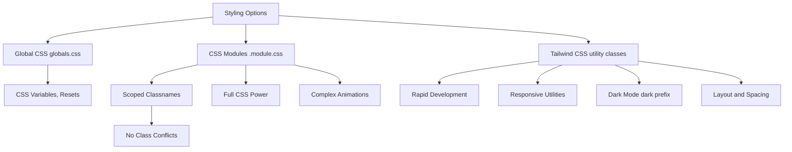

# Day 9 [Beginner]: Styling CSS Modules and Tailwind

## Index

- [Goal](#goal)
- [Prerequisites](#prerequisites)
- [Explanation](#explanation)
- [Topic by Topic](#topic-by-topic)
- [Key Concepts](#key-concepts)
- [Visual Concept Map](#visual-concept-map)
- [End-to-End Practical](#end-to-end-practical)
- [Hands-on Coding](#hands-on-coding)
- [Mini Exercise](#mini-exercise)
- [Assessment Quiz](#assessment-quiz)
- [Task](#task)
- [Self Check](#self-check)
- [Interview Questions and Answers](#interview-questions-and-answers)
- [Day 9 Outcome](#day-9-outcome)

## Goal

Apply styles to Next.js components using CSS Modules for scoped styles and Tailwind CSS for utility-first styling, and understand when to choose each approach.

## Prerequisites

- Completed Day 8: Static Assets and Public Folder
- Basic CSS knowledge

## Explanation

Styling in Next.js supports several approaches, but the two most popular are CSS Modules and Tailwind CSS. CSS Modules are built into Next.js with no extra setup — you create a `.module.css` file alongside your component, import the styles, and reference them using the imported object. The class names are automatically made unique at build time, so styles from one component never bleed into another. This is "scoped CSS" and it solves the global naming collision problem.

Tailwind CSS is a utility-first framework — instead of writing CSS classes, you apply small utility classes directly in your JSX: `className="flex items-center p-4 bg-blue-500 text-white rounded"`. This approach keeps styles co-located with markup, eliminates the need to context-switch between files, and makes responsive design concise with breakpoint prefixes like `md:`, `lg:`. Tailwind is installed during `create-next-app` if you opt in.

Both approaches are valid. CSS Modules give you full CSS power with scoping. Tailwind gives you speed and consistency. Many teams use both: Tailwind for layout and spacing utilities, CSS Modules for complex animations or component-specific rules that are hard to express with utilities.

## Topic by Topic

### Topic 1: Global Styles with globals.css

Theory:
`app/globals.css` is imported in the root layout and applies styles globally. Use it for CSS resets, font declarations, and global design tokens.

Practical:
Keep globals minimal — use it for root-level variables and resets, not component styles.

Code Example:

```css
/* app/globals.css */
*,
*::before,
*::after {
  box-sizing: border-box; /* Ensure padding is included in width */
  margin: 0; /* Remove default margins */
  padding: 0; /* Remove default paddings */
}

:root {
  --color-primary: #0070f3; /* Define color variables at root */
  --color-background: #ffffff;
  --color-text: #111827;
  --font-sans: "Inter", system-ui, sans-serif;
}

body {
  font-family: var(--font-sans); /* Use CSS variable */
  color: var(--color-text);
  background: var(--color-background);
  line-height: 1.6; /* Improve readability */
}
```

**Explanation:** Global styles in `app/globals.css` apply to every page. Use it for CSS resets, font definitions, and color variables. Keep it minimal - component-specific styles belong in CSS Modules.
**Key Points:**
- Understand the core concept behind Global Styles with globals.css.
- Apply it with the right Next.js feature and defaults.
- Watch for common mistakes that affect performance, SEO, or maintainability.


### Topic 2: CSS Modules — Creating and Importing

Theory:
Create a file named `ComponentName.module.css`. Import it as a default object and apply classes using `styles.className`. Class names are auto-scoped.

Practical:
Use CSS Modules for component-specific styles that require complex CSS rules.

Code Example:

```css
/* components/Card.module.css */
.card {
  background: #fff;
  border: 1px solid #e5e7eb;
  border-radius: 8px;
  padding: 1.5rem;
  transition: box-shadow 0.2s;
}

.card:hover {
  box-shadow: 0 4px 12px rgba(0, 0, 0, 0.1);
}

.title {
  font-size: 1.25rem;
  font-weight: 600;
  margin-bottom: 0.5rem;
}
```

```tsx
// components/Card.tsx
import styles from "./Card.module.css";

export default function Card({
  title,
  description,
}: {
  title: string;
  description: string;
}) {
  return (
    <div className={styles.card}>
      <h2 className={styles.title}>{title}</h2>
      <p>{description}</p>
    </div>
  );
}
```
**Explanation:**
This topic explains CSS Modules — Creating and Importing in practical Next.js terms so you can build correct routing, rendering, and data flow patterns in real applications.

**Key Points:**
- Understand the core concept behind CSS Modules — Creating and Importing.
- Apply it with the right Next.js feature and defaults.
- Watch for common mistakes that affect performance, SEO, or maintainability.


### Topic 3: CSS Modules — Composing Classes

Theory:
Use template literals or the `clsx`/`classnames` utility to combine multiple module classes or apply conditional classes.

Practical:
Install `clsx` for clean class composition: `className={clsx(styles.btn, isActive && styles.active)}`.

Code Example:

```tsx
import clsx from "clsx";
import styles from "./Button.module.css";

type ButtonProps = {
  children: React.ReactNode;
  variant?: "primary" | "secondary";
  disabled?: boolean;
};

export default function Button({
  children,
  variant = "primary",
  disabled,
}: ButtonProps) {
  return (
    <button
      className={clsx(styles.btn, styles[variant], disabled && styles.disabled)}
      disabled={disabled}
    >
      {children}
    </button>
  );
}
```
**Explanation:**
This topic explains CSS Modules — Composing Classes in practical Next.js terms so you can build correct routing, rendering, and data flow patterns in real applications.

**Key Points:**
- Understand the core concept behind CSS Modules — Composing Classes.
- Apply it with the right Next.js feature and defaults.
- Watch for common mistakes that affect performance, SEO, or maintainability.


### Topic 4: Tailwind CSS Setup

Theory:
When you run `create-next-app` and choose Tailwind, it installs `tailwindcss`, `postcss`, and configures them automatically. Tailwind utility classes are available in all JSX files.

Practical:
Use Tailwind for layout, spacing, typography, and colours without writing any CSS.

Code Example:

```tsx
// No CSS file needed — styles applied inline with Tailwind classes
export default function HeroSection() {
  return (
    <section className="flex flex-col items-center justify-center min-h-screen bg-gradient-to-br from-blue-600 to-purple-600 text-white px-4">
      <h1 className="text-5xl font-bold mb-4 text-center">
        Build Faster with Next.js
      </h1>
      <p className="text-xl text-blue-100 mb-8 max-w-lg text-center">
        The React framework for production-grade web applications.
      </p>
      <a
        href="/get-started"
        className="bg-white text-blue-600 px-8 py-3 rounded-lg font-semibold hover:bg-blue-50 transition-colors"
      >
        Get Started
      </a>
    </section>
  );
}
```
**Explanation:**
This topic explains Tailwind CSS Setup in practical Next.js terms so you can build correct routing, rendering, and data flow patterns in real applications.

**Key Points:**
- Understand the core concept behind Tailwind CSS Setup.
- Apply it with the right Next.js feature and defaults.
- Watch for common mistakes that affect performance, SEO, or maintainability.


### Topic 5: Tailwind Responsive Design

Theory:
Tailwind uses breakpoint prefixes (`sm:`, `md:`, `lg:`, `xl:`) to apply styles at specific screen sizes. The default is mobile-first.

Practical:
A card grid that is 1 column on mobile, 2 on tablet, 3 on desktop.

Code Example:

```tsx
export default function CardGrid({
  cards,
}: {
  cards: { id: number; title: string }[];
}) {
  return (
    <div className="grid grid-cols-1 sm:grid-cols-2 lg:grid-cols-3 gap-6 p-6">
      {cards.map((card) => (
        <div
          key={card.id}
          className="bg-white rounded-xl shadow-sm border border-gray-100 p-6 hover:shadow-md transition-shadow"
        >
          <h3 className="text-lg font-semibold text-gray-900">{card.title}</h3>
        </div>
      ))}
    </div>
  );
}
```
**Explanation:**
This topic explains Tailwind Responsive Design in practical Next.js terms so you can build correct routing, rendering, and data flow patterns in real applications.

**Key Points:**
- Understand the core concept behind Tailwind Responsive Design.
- Apply it with the right Next.js feature and defaults.
- Watch for common mistakes that affect performance, SEO, or maintainability.


### Topic 6: Tailwind Dark Mode

Theory:
Tailwind supports dark mode with the `dark:` prefix. Set `darkMode: 'class'` in `tailwind.config.ts` to toggle dark mode by adding the `dark` class to the `<html>` element.

Practical:
Apply light and dark colours to the same element using `text-gray-900 dark:text-white`.

Code Example:

```tsx
// tailwind.config.ts
import type { Config } from "tailwindcss";
const config: Config = {
  darkMode: "class",
  content: ["./app/**/*.{ts,tsx}", "./components/**/*.{ts,tsx}"],
  theme: { extend: {} },
  plugins: [],
};
export default config;

// Component
export default function ThemedCard() {
  return (
    <div className="bg-white dark:bg-gray-800 text-gray-900 dark:text-gray-100 p-6 rounded-xl">
      <h2 className="text-xl font-bold">Card Title</h2>
      <p className="text-gray-600 dark:text-gray-400">Card description text.</p>
    </div>
  );
}
```
**Explanation:**
This topic explains Tailwind Dark Mode in practical Next.js terms so you can build correct routing, rendering, and data flow patterns in real applications.

**Key Points:**
- Understand the core concept behind Tailwind Dark Mode.
- Apply it with the right Next.js feature and defaults.
- Watch for common mistakes that affect performance, SEO, or maintainability.


### Topic 7: Mixing CSS Modules and Tailwind

Theory:
CSS Modules and Tailwind can be used in the same project and even the same component. Use Tailwind for utility-driven layout and CSS Modules for complex custom styles.

Practical:
Apply Tailwind utilities for layout and a CSS Module class for a custom animation.

Code Example:

```css
/* components/Spinner.module.css */
.spin {
  animation: spin 1s linear infinite;
}
@keyframes spin {
  from {
    transform: rotate(0deg);
  }
  to {
    transform: rotate(360deg);
  }
}
```

```tsx
import styles from "./Spinner.module.css";

export default function LoadingSpinner() {
  return (
    <div className="flex items-center justify-center p-8">
      <div
        className={`w-8 h-8 border-4 border-blue-500 border-t-transparent rounded-full ${styles.spin}`}
      />
    </div>
  );
}
```
**Explanation:**
This topic explains Mixing CSS Modules and Tailwind in practical Next.js terms so you can build correct routing, rendering, and data flow patterns in real applications.

**Key Points:**
- Understand the core concept behind Mixing CSS Modules and Tailwind.
- Apply it with the right Next.js feature and defaults.
- Watch for common mistakes that affect performance, SEO, or maintainability.


### Topic 8: Tailwind Custom Theme

Theory:
Extend the default Tailwind theme in `tailwind.config.ts` to add custom colours, fonts, spacing values, and more.

Practical:
Add brand colours so you can use `bg-brand-500` and `text-brand-700` throughout the project.

Code Example:

```tsx
// tailwind.config.ts
import type { Config } from "tailwindcss";
const config: Config = {
  darkMode: "class",
  content: ["./app/**/*.{ts,tsx}", "./components/**/*.{ts,tsx}"],
  theme: {
    extend: {
      colors: {
        brand: {
          50: "#eff6ff",
          100: "#dbeafe",
          500: "#3b82f6",
          700: "#1d4ed8",
          900: "#1e3a8a",
        },
      },
      fontFamily: {
        heading: ["Poppins", "sans-serif"],
      },
    },
  },
  plugins: [],
};
export default config;
```
**Explanation:**
This topic explains Tailwind Custom Theme in practical Next.js terms so you can build correct routing, rendering, and data flow patterns in real applications.

**Key Points:**
- Understand the core concept behind Tailwind Custom Theme.
- Apply it with the right Next.js feature and defaults.
- Watch for common mistakes that affect performance, SEO, or maintainability.


## Key Concepts

- **CSS Modules**: CSS files that auto-scope class names to the component that imports them, preventing global naming collisions.
- **Utility-first CSS**: The Tailwind approach of applying small, single-purpose classes directly in JSX rather than writing custom CSS.
- **Global Styles**: Styles applied site-wide via `app/globals.css`, useful for resets and CSS variables.
- **Responsive Utilities**: Tailwind breakpoint prefixes (`sm:`, `md:`, `lg:`) for responsive design using a mobile-first approach.
- **Dark Mode**: Styling for dark themes using the `dark:` prefix in Tailwind or media queries in CSS Modules.
- **clsx**: A lightweight utility for conditionally combining CSS class names.
- **Tailwind Config**: `tailwind.config.ts` where you extend the default theme with custom colours, fonts, and spacing.
- **Scoped CSS**: Styles that only apply to the component they are imported in, avoiding side effects.

## Visual Concept Map



## End-to-End Practical

1. Open `app/globals.css` and add CSS custom properties for your brand colours.
2. Create a `Button.module.css` with primary and secondary button styles.
3. Build a `Button.tsx` component that uses CSS Modules.
4. Rebuild the same Button using Tailwind CSS classes.
5. Create a card grid using Tailwind's responsive `grid-cols` utilities.
6. Add dark mode support to the card component using `dark:` prefixes.
7. Extend `tailwind.config.ts` with a custom brand colour and use it in the UI.

## Hands-on Coding

### Example 1: Responsive Navbar with Tailwind

```tsx
// app/components/Navbar.tsx
"use client";
import Link from "next/link";
import { useState } from "react";

export default function Navbar() {
  const [isOpen, setIsOpen] = useState(false);
  const links = [
    { href: "/", label: "Home" },
    { href: "/about", label: "About" },
    { href: "/blog", label: "Blog" },
    { href: "/contact", label: "Contact" },
  ];
  return (
    <header className="bg-white border-b border-gray-200">
      <div className="max-w-6xl mx-auto px-4 h-16 flex items-center justify-between">
        <Link href="/" className="font-bold text-xl text-gray-900">
          MyApp
        </Link>
        <nav className="hidden md:flex gap-6">
          {links.map((l) => (
            <Link
              key={l.href}
              href={l.href}
              className="text-gray-600 hover:text-blue-600 transition-colors"
            >
              {l.label}
            </Link>
          ))}
        </nav>
        <button
          className="md:hidden"
          onClick={() => setIsOpen(!isOpen)}
          aria-label="Toggle menu"
        >
          <span className="block w-6 h-0.5 bg-gray-800 mb-1" />
          <span className="block w-6 h-0.5 bg-gray-800 mb-1" />
          <span className="block w-6 h-0.5 bg-gray-800" />
        </button>
      </div>
      {isOpen && (
        <nav className="md:hidden px-4 pb-4 flex flex-col gap-3">
          {links.map((l) => (
            <Link
              key={l.href}
              href={l.href}
              className="text-gray-700 hover:text-blue-600"
            >
              {l.label}
            </Link>
          ))}
        </nav>
      )}
    </header>
  );
}
```

### Example 2: Product Card with CSS Modules

```css
/* components/ProductCard.module.css */
.card {
  background: white;
  border-radius: 12px;
  overflow: hidden;
  box-shadow: 0 1px 3px rgba(0, 0, 0, 0.08);
  transition:
    transform 0.2s,
    box-shadow 0.2s;
}
.card:hover {
  transform: translateY(-2px);
  box-shadow: 0 4px 16px rgba(0, 0, 0, 0.12);
}
.image {
  width: 100%;
  aspect-ratio: 16/9;
  object-fit: cover;
}
.body {
  padding: 1.25rem;
}
.name {
  font-size: 1rem;
  font-weight: 600;
  margin-bottom: 0.25rem;
}
.price {
  color: #0070f3;
  font-weight: 700;
  font-size: 1.125rem;
}
```

```tsx
// components/ProductCard.tsx
import styles from "./ProductCard.module.css";

type Props = { name: string; price: number; image: string };

export default function ProductCard({ name, price, image }: Props) {
  return (
    <div className={styles.card}>
      
      <div className={styles.body}>
        <h3 className={styles.name}>{name}</h3>
        <p className={styles.price}>${price}</p>
      </div>
    </div>
  );
}
```

### Example 3: Alert Component — Both Approaches

```tsx
// Using Tailwind
export function TailwindAlert({
  type,
  message,
}: {
  type: "info" | "success" | "error";
  message: string;
}) {
  const styles = {
    info: "bg-blue-50 border-blue-200 text-blue-800",
    success: "bg-green-50 border-green-200 text-green-800",
    error: "bg-red-50 border-red-200 text-red-800",
  };
  return (
    <div
      className={`p-4 rounded-lg border ${styles[type]} flex items-start gap-3`}
    >
      <p className="text-sm font-medium">{message}</p>
    </div>
  );
}
```

## Mini Exercise

Scenario:
Create a pricing card component that has a "Popular" badge and shows different styles for the highlighted plan.

Steps:

1. Create `PricingCard.module.css` with base card, highlighted card, badge, and price styles.
2. Create `PricingCard.tsx` with a `highlighted` boolean prop.
3. Use `clsx` to apply the highlighted style conditionally.
4. Create a pricing page that renders three cards: Basic, Pro (highlighted), Enterprise.
5. Add hover effects to each card.

Expected output:

- Three pricing cards side by side.
- The Pro card has a distinct background/border and a "Popular" badge.
- Hovering any card lifts it with a shadow.

## Assessment Quiz

### Quiz Questions

1. How do CSS Modules prevent class name conflicts?
2. What file extension do CSS Modules use?
3. What does the `md:` prefix mean in Tailwind CSS?
4. How do you apply a dark mode style in Tailwind?
5. What is the purpose of `clsx`?

### Quiz Answers

1. CSS Modules auto-generate unique class names at build time by appending a hash. The same class name in two different modules becomes two different selectors.
2. CSS Module files use `.module.css` (or `.module.scss` for Sass).
3. `md:` applies the style at the medium breakpoint (768px and above) in Tailwind's mobile-first system.
4. Prefix the utility with `dark:`, e.g. `dark:bg-gray-800`. This works when `darkMode: 'class'` is configured and the `dark` class is on `<html>`.
5. `clsx` is a utility for conditionally combining class names, making it easy to apply conditional CSS Module classes or Tailwind classes.

## Task

- Build a complete UI kit: Button (primary/secondary/disabled), Card, Alert (info/success/error), and Badge components using either CSS Modules or Tailwind (or both).
- Implement responsive layout for a landing page.
- Add dark mode support for at least two components.

## Self Check

- Can you create and use a CSS Module?
- Do you understand how Tailwind utilities replace traditional CSS?
- Can you implement a responsive grid with Tailwind breakpoints?
- Do you know how to enable and use Tailwind dark mode?
- Have you used `clsx` for conditional class application?

## Interview Questions and Answers

### Beginner

**Question:** What is a CSS Module in Next.js?
**Answer:** A CSS Module is a CSS file ending in `.module.css`. Class names in it are auto-scoped to the importing component — the same class name in different modules never conflicts.

**Question:** How does Tailwind CSS differ from writing traditional CSS?
**Answer:** Tailwind provides small utility classes (like `p-4`, `flex`, `bg-blue-500`) that you apply directly in HTML/JSX. You don't write separate CSS files for most styling; instead you compose utilities inline.

### Middle

**Question:** When would you choose CSS Modules over Tailwind?
**Answer:** Choose CSS Modules for complex animations, custom selectors, pseudo-elements, or when Tailwind utilities become too verbose. Use Tailwind for rapid development, consistent design systems, and responsive layouts.

**Question:** How do you extend the Tailwind theme with custom brand colours?
**Answer:** In `tailwind.config.ts`, add your colours under `theme.extend.colors`. For example, `brand: { 500: '#0070f3' }` lets you use `bg-brand-500` and `text-brand-500` in your JSX.

### Advanced

**Question:** How does Tailwind CSS purge unused styles and why is it important for production?
**Answer:** Tailwind uses its `content` config to scan files for class names and removes all unused utilities in the production build. This reduces the CSS bundle from megabytes to a few kilobytes, dramatically improving performance.

**Question:** How would you implement a themeable design system in Next.js?
**Answer:** Define CSS custom properties in `:root` (in `globals.css`) for each theme variable (colours, spacing). Toggle themes by adding a class to `<html>` and re-define the variables for that class. Tailwind can consume CSS variables via `var(--color-primary)` in the config.

## Day 9 Outcome

- You can style Next.js components using CSS Modules with scoped class names.
- You can apply Tailwind utility classes for rapid, responsive styling.
- You know when to use each approach and how to mix them.
- You can implement responsive layouts and dark mode with Tailwind.
- You are ready to learn next/image optimisation on Day 10.
