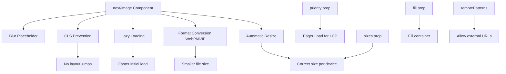

# Day 10 [Beginner]: next/image Optimization

## Index

- [Goal](#goal)
- [Prerequisites](#prerequisites)
- [Explanation](#explanation)
- [Topic by Topic](#topic-by-topic)
- [Key Concepts](#key-concepts)
- [Visual Concept Map](#visual-concept-map)
- [End-to-End Practical](#end-to-end-practical)
- [Hands-on Coding](#hands-on-coding)
- [Mini Exercise](#mini-exercise)
- [Assessment Quiz](#assessment-quiz)
- [Task](#task)
- [Self Check](#self-check)
- [Interview Questions and Answers](#interview-questions-and-answers)
- [Day 10 Outcome](#day-10-outcome)

## Goal

Use the `<Image>` component from `next/image` to deliver automatically optimised, responsive, and lazy-loaded images in a Next.js application.

## Prerequisites

- Completed Day 9: Styling CSS Modules and Tailwind
- Understanding of the `public/` folder and basic HTML image concepts

## Explanation

Images are often the largest assets on a web page and a major cause of slow load times and poor Core Web Vitals scores. Next.js provides the `<Image>` component as a drop-in replacement for the HTML `` tag, and it does a remarkable amount of work for you automatically.

When you use `<Image>`, Next.js resizes the image to exactly the size needed, converts it to modern formats like WebP or AVIF (which are much smaller than JPEG or PNG), lazy-loads images that are off-screen (so the browser only downloads them when they scroll into view), and prevents Cumulative Layout Shift (CLS) by reserving the correct space in the layout before the image loads.

These optimisations are performed by Next.js's built-in image optimisation server. For local images (imported from the `public/` folder or the file system), Next.js knows the dimensions automatically. For remote images (from external URLs), you must declare the allowed domains in `next.config.ts` and provide explicit `width` and `height` props.

## Topic by Topic

### Topic 1: Basic Image Usage

Theory:
Import `Image` from `next/image` and use it like an `` tag. For local images from `public/`, provide the `/` path. Always include `alt` text.

Practical:
Replace every `` in your project with `<Image>` to get automatic optimisation.

Code Example:

```tsx
import Image from "next/image";

export default function HeroImage() {
  return (
    <Image
      src="/hero.jpg" // from public/hero.jpg
      alt="Hero background"
      width={1200}
      height={600}
      priority // Load eagerly (above the fold, don't lazy-load)
      quality={85} // Compress image to 85% quality
    />
  );
}
```

**Explanation:** The `<Image>` component automatically optimizes images: resizes to screen size, converts to WebP, lazy-loads off-screen images, and prevents layout shift. `priority` loads immediately for above-fold images. `quality={85}` reduces file size while maintaining visual fidelity.
**Key Points:**
- Understand the core concept behind Basic Image Usage.
- Apply it with the right Next.js feature and defaults.
- Watch for common mistakes that affect performance, SEO, or maintainability.


### Topic 2: Importing Local Images

Theory:
You can import images as modules from anywhere in the project. Next.js automatically infers the `width` and `height` from the imported image file — no need to specify them.

Practical:
Import from `app/assets/` or `public/` for co-located images.

Code Example:

```tsx
import Image from "next/image";
import profilePic from "@/assets/profile.jpg"; // TypeScript auto-detects dimensions

export default function Profile() {
  return (
    <Image
      src={profilePic}
      alt="Profile photo"
      // width and height are inferred from the import!
      className="rounded-full"
    />
  );
}
```
**Explanation:**
This topic explains Importing Local Images in practical Next.js terms so you can build correct routing, rendering, and data flow patterns in real applications.

**Key Points:**
- Understand the core concept behind Importing Local Images.
- Apply it with the right Next.js feature and defaults.
- Watch for common mistakes that affect performance, SEO, or maintainability.


### Topic 3: Remote Images with remotePatterns

Theory:
For images from external URLs (like a CDN or user avatars), configure the allowed hostnames in `next.config.ts`. Then provide explicit `width` and `height` on the `<Image>` component.

Practical:
Allow images from your image CDN by adding its hostname to `remotePatterns`.

Code Example:

```tsx
// next.config.ts
const nextConfig = {
  images: {
    remotePatterns: [
      { protocol: "https", hostname: "images.unsplash.com" },
      { protocol: "https", hostname: "avatars.githubusercontent.com" },
    ],
  },
};

// Component usage
import Image from "next/image";

export default function UserAvatar({ url }: { url: string }) {
  return (
    <Image
      src={url}
      alt="User avatar"
      width={48}
      height={48}
      className="rounded-full"
    />
  );
}
```
**Explanation:**
This topic explains Remote Images with remotePatterns in practical Next.js terms so you can build correct routing, rendering, and data flow patterns in real applications.

**Key Points:**
- Understand the core concept behind Remote Images with remotePatterns.
- Apply it with the right Next.js feature and defaults.
- Watch for common mistakes that affect performance, SEO, or maintainability.


### Topic 4: fill Layout for Responsive Images

Theory:
The `fill` prop makes the image fill its parent container. The parent must have `position: relative` and defined dimensions. Use this for hero images or background-style images.

Practical:
Combine `fill` with `object-fit: cover` to fill a container without distortion.

Code Example:

```tsx
import Image from "next/image";

export default function HeroBanner() {
  return (
    <div style={{ position: "relative", width: "100%", height: "400px" }}>
      <Image
        src="/hero.jpg"
        alt="Hero"
        fill
        style={{ objectFit: "cover" }}
        priority
      />
      <div
        style={{
          position: "relative",
          zIndex: 1,
          color: "#fff",
          padding: "2rem",
        }}
      >
        <h1>Welcome</h1>
      </div>
    </div>
  );
}
```
**Explanation:**
This topic explains fill Layout for Responsive Images in practical Next.js terms so you can build correct routing, rendering, and data flow patterns in real applications.

**Key Points:**
- Understand the core concept behind fill Layout for Responsive Images.
- Apply it with the right Next.js feature and defaults.
- Watch for common mistakes that affect performance, SEO, or maintainability.


### Topic 5: priority Prop and LCP

Theory:
Images above the fold (visible without scrolling) should use the `priority` prop to load eagerly. All other images are lazy-loaded by default. The largest image above the fold is the LCP (Largest Contentful Paint) element.

Practical:
Add `priority` to hero images, product hero shots, and any image likely to be the LCP element.

Code Example:

```tsx
import Image from "next/image";

// Hero image — above the fold, affects LCP
export function HeroImage() {
  return (
    <Image src="/hero.jpg" alt="Hero" width={1200} height={600} priority />
  );
}

// Product list image — below the fold, lazy-loaded
export function ProductThumbnail({ src }: { src: string }) {
  return <Image src={src} alt="Product" width={300} height={300} />;
  // No priority — lazy-loaded automatically
}
```
**Explanation:**
This topic explains priority Prop and LCP in practical Next.js terms so you can build correct routing, rendering, and data flow patterns in real applications.

**Key Points:**
- Understand the core concept behind priority Prop and LCP.
- Apply it with the right Next.js feature and defaults.
- Watch for common mistakes that affect performance, SEO, or maintainability.


### Topic 6: sizes Prop for Responsive Images

Theory:
The `sizes` prop tells the browser how wide the image will be at different viewport sizes, enabling it to download the correct sized image variant. This prevents downloading a 1200px image for a 300px thumbnail.

Practical:
Set `sizes` when the image width changes across breakpoints.

Code Example:

```tsx
import Image from "next/image";

export default function ResponsiveCard({
  src,
  alt,
}: {
  src: string;
  alt: string;
}) {
  return (
    <Image
      src={src}
      alt={alt}
      fill
      sizes="(max-width: 640px) 100vw, (max-width: 1024px) 50vw, 33vw"
      style={{ objectFit: "cover" }}
    />
  );
  // The browser downloads:
  // - Full viewport width on mobile
  // - Half viewport width on tablet
  // - 1/3 viewport width on desktop
}
```
**Explanation:**
This topic explains sizes Prop for Responsive Images in practical Next.js terms so you can build correct routing, rendering, and data flow patterns in real applications.

**Key Points:**
- Understand the core concept behind sizes Prop for Responsive Images.
- Apply it with the right Next.js feature and defaults.
- Watch for common mistakes that affect performance, SEO, or maintainability.


### Topic 7: placeholder and blurDataURL

Theory:
Use `placeholder="blur"` to show a blurred placeholder while the full image loads. For local imports, Next.js generates the blur placeholder automatically. For remote images, provide a `blurDataURL`.

Practical:
Blur placeholders improve perceived performance — users see something immediately instead of an empty space.

Code Example:

```tsx
import Image from "next/image";
import localImage from "@/assets/photo.jpg"; // Blur placeholder auto-generated

export function LocalWithBlur() {
  return <Image src={localImage} alt="Photo" placeholder="blur" />;
}

// For remote images — generate a tiny base64 placeholder
export function RemoteWithBlur({ src }: { src: string }) {
  const blurPlaceholder =
    "data:image/png;base64,iVBORw0KGgoAAAANSUhEUgAAAAEAAAABCAYAAAAfFcSJAAAADUlEQVR42mNkYPhfDwAChwGA60e6kgAAAABJRU5ErkJggg==";
  return (
    <Image
      src={src}
      alt="Remote"
      width={800}
      height={500}
      placeholder="blur"
      blurDataURL={blurPlaceholder}
    />
  );
}
```
**Explanation:**
This topic explains placeholder and blurDataURL in practical Next.js terms so you can build correct routing, rendering, and data flow patterns in real applications.

**Key Points:**
- Understand the core concept behind placeholder and blurDataURL.
- Apply it with the right Next.js feature and defaults.
- Watch for common mistakes that affect performance, SEO, or maintainability.


### Topic 8: Image in a Card Grid

Theory:
Combining `<Image>` with CSS or Tailwind to build image cards is one of the most common patterns. Use `fill` with a relative-positioned container for uniform card image areas.

Practical:
Use an `aspect-ratio` container with `fill` to give all card images the same proportions.

Code Example:

```tsx
import Image from "next/image";

type Article = { id: number; title: string; image: string; excerpt: string };

export default function ArticleGrid({ articles }: { articles: Article[] }) {
  return (
    <div className="grid grid-cols-1 md:grid-cols-2 lg:grid-cols-3 gap-6">
      {articles.map((article) => (
        <div
          key={article.id}
          className="bg-white rounded-xl overflow-hidden shadow-sm border border-gray-100"
        >
          <div className="relative aspect-video">
            <Image
              src={article.image}
              alt={article.title}
              fill
              sizes="(max-width: 768px) 100vw, (max-width: 1200px) 50vw, 33vw"
              style={{ objectFit: "cover" }}
            />
          </div>
          <div className="p-4">
            <h3 className="font-semibold text-gray-900 mb-2">
              {article.title}
            </h3>
            <p className="text-gray-600 text-sm">{article.excerpt}</p>
          </div>
        </div>
      ))}
    </div>
  );
}
```
**Explanation:**
This topic explains Image in a Card Grid in practical Next.js terms so you can build correct routing, rendering, and data flow patterns in real applications.

**Key Points:**
- Understand the core concept behind Image in a Card Grid.
- Apply it with the right Next.js feature and defaults.
- Watch for common mistakes that affect performance, SEO, or maintainability.


## Key Concepts

- **next/image**: The Next.js built-in image component that provides automatic optimisation, lazy loading, and CLS prevention.
- **Image Optimisation**: Automatic resizing, format conversion (WebP/AVIF), and compression performed by Next.js's image server.
- **Lazy Loading**: Images off-screen are not downloaded until they scroll into the viewport, reducing initial page load.
- **priority**: A prop that makes an image load eagerly — use on above-the-fold images that are the LCP element.
- **fill**: A prop that makes the image fill its parent container. Parent must have `position: relative`.
- **sizes**: A prop describing the image's rendered width at different viewport sizes, enabling optimal image variant selection.
- **remotePatterns**: Configuration in `next.config.ts` that whitelists external image hostnames.
- **CLS (Cumulative Layout Shift)**: A Core Web Vitals metric measuring unexpected layout shifts. `<Image>` prevents this by reserving space.

## Visual Concept Map



## End-to-End Practical

1. Add three local images to `public/` and display them on a page using `<Image>`.
2. Replace the hero image with `priority` to mark it as above-the-fold.
3. Configure `remotePatterns` in `next.config.ts` for `images.unsplash.com`.
4. Fetch a list of Unsplash images and display them using `<Image>` with `fill`.
5. Add `sizes` to the grid images for responsive optimisation.
6. Test lazy loading: scroll through the page and watch Network tab — images should only load when they enter the viewport.
7. Add `placeholder="blur"` to a local imported image.

## Hands-on Coding

### Example 1: Hero Section with Optimised Image

```tsx
// app/page.tsx
import Image from "next/image";

export default function HomePage() {
  return (
    <main>
      {/* Hero */}
      <section className="relative h-[500px] overflow-hidden">
        <Image
          src="/hero.jpg"
          alt="Hero background"
          fill
          priority
          style={{ objectFit: "cover" }}
          quality={85}
        />
        <div className="absolute inset-0 bg-black/40 flex flex-col items-center justify-center text-white text-center px-4">
          <h1 className="text-4xl md:text-6xl font-bold mb-4">
            Build Something Great
          </h1>
          <p className="text-lg md:text-xl text-gray-200">Powered by Next.js</p>
        </div>
      </section>
    </main>
  );
}
```

### Example 2: Team Member Cards

```tsx
// app/team/page.tsx
import Image from "next/image";

const team = [
  { name: "Alice Chen", role: "CEO", avatar: "/team/alice.jpg" },
  { name: "Bob Kim", role: "CTO", avatar: "/team/bob.jpg" },
  { name: "Carol James", role: "Design Lead", avatar: "/team/carol.jpg" },
];

export default function TeamPage() {
  return (
    <div className="max-w-4xl mx-auto py-12 px-4">
      <h1 className="text-3xl font-bold text-center mb-10">Our Team</h1>
      <div className="grid grid-cols-1 sm:grid-cols-3 gap-8">
        {team.map((member) => (
          <div
            key={member.name}
            className="flex flex-col items-center text-center gap-3"
          >
            <div className="relative w-24 h-24">
              <Image
                src={member.avatar}
                alt={member.name}
                fill
                className="rounded-full"
                style={{ objectFit: "cover" }}
              />
            </div>
            <div>
              <h3 className="font-semibold text-gray-900">{member.name}</h3>
              <p className="text-gray-500 text-sm">{member.role}</p>
            </div>
          </div>
        ))}
      </div>
    </div>
  );
}
```

### Example 3: Blog Card with Responsive Image

```tsx
import Image from "next/image";
import Link from "next/link";

type Post = { slug: string; title: string; cover: string; date: string };

export default function BlogCard({ post }: { post: Post }) {
  return (
    <Link
      href={`/blog/${post.slug}`}
      className="group block bg-white rounded-2xl overflow-hidden shadow-sm hover:shadow-lg transition-shadow border border-gray-100"
    >
      <div className="relative aspect-[16/9]">
        <Image
          src={post.cover}
          alt={post.title}
          fill
          sizes="(max-width: 768px) 100vw, 50vw"
          style={{ objectFit: "cover" }}
          className="group-hover:scale-105 transition-transform duration-300"
        />
      </div>
      <div className="p-5">
        <p className="text-sm text-gray-400 mb-2">{post.date}</p>
        <h2 className="text-lg font-semibold text-gray-900 group-hover:text-blue-600 transition-colors">
          {post.title}
        </h2>
      </div>
    </Link>
  );
}
```

## Mini Exercise

Scenario:
Build a photo gallery page that displays 6 photos in a responsive grid with blur placeholders while loading.

Steps:

1. Add 6 images to your `public/gallery/` folder (or use placeholders from picsum.photos).
2. If using external URLs, add `picsum.photos` to `remotePatterns` in `next.config.ts`.
3. Create `app/gallery/page.tsx` with a responsive 3-column grid.
4. Use `<Image>` with `fill` and `sizes` for each photo.
5. Add hover scale effect with Tailwind `hover:scale-105`.

Expected output:

- 6 photos displayed in a 1→2→3 column responsive grid.
- Images load lazily as user scrolls.
- Each image smoothly scales on hover.

## Assessment Quiz

### Quiz Questions

1. What are three automatic optimisations provided by next/image?
2. When should you use the `priority` prop?
3. What must you configure in `next.config.ts` to use remote images?
4. What does the `fill` prop do?
5. What is the `sizes` prop used for?

### Quiz Answers

1. Automatic resizing to the displayed size, format conversion to WebP/AVIF, and lazy loading (plus CLS prevention and blur placeholders).
2. Use `priority` on images above the fold (visible without scrolling), especially the LCP element, to load them eagerly for better performance.
3. You must add the image hostname to `images.remotePatterns` in `next.config.ts` specifying the `protocol` and `hostname`.
4. `fill` makes the image fill its parent container. The parent must have `position: relative` and defined dimensions. Use with `objectFit: 'cover'` to avoid distortion.
5. `sizes` tells the browser how wide the image will be at different viewport sizes, enabling it to select the optimal image variant size to download.

## Task

- Replace all `` tags in your project with `<Image>` from `next/image`.
- Add `priority` to your above-the-fold hero image.
- Configure `remotePatterns` for an external image CDN.
- Build a responsive photo gallery using `fill` and `sizes`.
- Add `placeholder="blur"` to local images.

## Self Check

- Can you use `<Image>` for both local and remote images?
- Do you know when to use `priority` vs default lazy loading?
- Can you configure `remotePatterns` for external images?
- Do you understand what `fill` does and its CSS requirements?
- Have you used `sizes` to optimise responsive image loading?

## Interview Questions and Answers

### Beginner

**Question:** Why use next/image instead of a regular img tag?
**Answer:** `next/image` automatically optimises images: it resizes them, converts to WebP/AVIF, lazy-loads off-screen images, and prevents layout shift. A regular `` does none of this.

**Question:** What happens if you use a remote image URL without configuring `remotePatterns`?
**Answer:** Next.js throws an error and refuses to serve the image, to protect against unexpected image usage. You must whitelist the hostname in `next.config.ts`.

### Middle

**Question:** How does next/image prevent Cumulative Layout Shift (CLS)?
**Answer:** By requiring `width` and `height` props (or using the `fill` layout with a sized container), Next.js can reserve the exact space for the image in the layout before it loads. This prevents other content from jumping when the image appears.

**Question:** When would you use `fill` vs explicit `width` and `height`?
**Answer:** Use explicit dimensions when the image size is fixed (avatars, logos, icons). Use `fill` when the image should adapt to a fluid container (hero banners, card thumbnails, gallery images).

### Advanced

**Question:** How does the `sizes` prop improve image performance?
**Answer:** `sizes` gives the browser a hint about the image's rendered width at different viewport sizes. Next.js generates multiple sized variants (100px, 200px, 400px, etc.) and the browser picks the best one. Without `sizes`, the browser might download a 1200px image for a 300px thumbnail — wasting bandwidth.

**Question:** How does Next.js's image optimisation work in serverless deployments like Vercel?
**Answer:** Vercel runs the Next.js image optimisation API as a serverless function. When an image is requested, the function resizes and converts it on-demand and caches the result on the CDN edge. Subsequent requests for the same image at the same size are served from cache.

## Day 10 Outcome

- You can use next/image for automatic image optimisation.
- You know how to handle local and remote images correctly.
- You understand priority, fill, and sizes for performance tuning.
- You can build responsive image galleries and cards.
- You are ready to learn next/font optimisation on Day 11.
