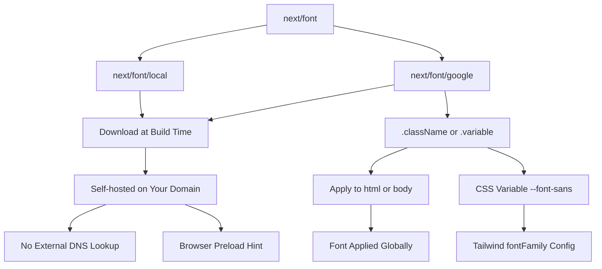

# Day 11 [Beginner]: next/font Optimization

## Index

- [Goal](#goal)
- [Prerequisites](#prerequisites)
- [Explanation](#explanation)
- [Topic by Topic](#topic-by-topic)
- [Key Concepts](#key-concepts)
- [Visual Concept Map](#visual-concept-map)
- [End-to-End Practical](#end-to-end-practical)
- [Hands-on Coding](#hands-on-coding)
- [Mini Exercise](#mini-exercise)
- [Assessment Quiz](#assessment-quiz)
- [Task](#task)
- [Self Check](#self-check)
- [Interview Questions and Answers](#interview-questions-and-answers)
- [Day 11 Outcome](#day-11-outcome)

## Goal

Use `next/font` to load Google Fonts and local fonts with zero layout shift, optimal caching, and no external network requests from the browser.

## Prerequisites

- Completed Day 10: next/image Optimization
- Understanding of the root layout and CSS variables

## Explanation

Fonts are a significant source of web performance issues. When browsers load fonts from Google Fonts, they first have to make a DNS lookup, establish a connection, and download the CSS file before they can download the actual font files. This causes a Flash of Unstyled Text (FOUT) or Flash of Invisible Text (FOIT), and it can hurt your Core Web Vitals score.

`next/font` solves all of this. It downloads Google Fonts at build time, hosts them on your own domain (no external request from the browser), inlines the `@font-face` CSS into your styles, and uses the `font-display: swap` strategy by default to prevent invisible text. The result is zero layout shift from fonts and faster load times.

For local fonts (fonts you own), `next/font/local` gives you the same benefits — optimal subsets, correct preloading, and zero runtime network requests for the font file.

## Topic by Topic

### Topic 1: Loading a Google Font

Theory:
Import a font from `next/font/google`, call it as a function with options, and access the `.className` property to apply it to an element.

Practical:
Apply a Google Font to your entire app by setting it on the `<body>` in the root layout.

Code Example:

```tsx
// app/layout.tsx
import { Inter } from "next/font/google";

const inter = Inter({
  subsets: ["latin"],
  display: "swap",
});

export default function RootLayout({
  children,
}: {
  children: React.ReactNode;
}) {
  return (
    <html lang="en" className={inter.className}>
      <body>{children}</body>
    </html>
  );
}
```
**Explanation:**
This topic explains Loading a Google Font in practical Next.js terms so you can build correct routing, rendering, and data flow patterns in real applications.

**Key Points:**
- Understand the core concept behind Loading a Google Font.
- Apply it with the right Next.js feature and defaults.
- Watch for common mistakes that affect performance, SEO, or maintainability.


### Topic 2: Font Weights and Subsets

Theory:
Specify only the weights you need to reduce file size. Specify subsets to only download the character sets used by your language.

Practical:
For an English-only site, `subsets: ['latin']` reduces the font download by excluding Cyrillic, Greek, etc.

Code Example:

```tsx
import { Roboto } from "next/font/google";

const roboto = Roboto({
  subsets: ["latin"],
  weight: ["400", "500", "700"], // Only load needed weights
  style: ["normal", "italic"],
});

export default function Layout({ children }: { children: React.ReactNode }) {
  return (
    <html lang="en">
      <body className={roboto.className}>{children}</body>
    </html>
  );
}
```
**Explanation:**
This topic explains Font Weights and Subsets in practical Next.js terms so you can build correct routing, rendering, and data flow patterns in real applications.

**Key Points:**
- Understand the core concept behind Font Weights and Subsets.
- Apply it with the right Next.js feature and defaults.
- Watch for common mistakes that affect performance, SEO, or maintainability.


### Topic 3: Using CSS Variables for Fonts

Theory:
Instead of using `.className`, you can generate a CSS variable using the `variable` option. This lets you use the font anywhere in CSS, including Tailwind's `fontFamily` config.

Practical:
Define `variable: '--font-sans'` and reference it as `var(--font-sans)` in your CSS or Tailwind config.

Code Example:

```tsx
// app/layout.tsx
import { Inter, Playfair_Display } from "next/font/google";

const inter = Inter({ subsets: ["latin"], variable: "--font-sans" });
const playfair = Playfair_Display({
  subsets: ["latin"],
  variable: "--font-heading",
});

export default function RootLayout({
  children,
}: {
  children: React.ReactNode;
}) {
  return (
    <html lang="en" className={`${inter.variable} ${playfair.variable}`}>
      <body style={{ fontFamily: "var(--font-sans)" }}>{children}</body>
    </html>
  );
}
```
**Explanation:**
This topic explains Using CSS Variables for Fonts in practical Next.js terms so you can build correct routing, rendering, and data flow patterns in real applications.

**Key Points:**
- Understand the core concept behind Using CSS Variables for Fonts.
- Apply it with the right Next.js feature and defaults.
- Watch for common mistakes that affect performance, SEO, or maintainability.


### Topic 4: Multiple Fonts

Theory:
You can define multiple font instances at the module level and combine their class names or CSS variables on the `<html>` element.

Practical:
Use one font for body text and a different one for headings.

Code Example:

```tsx
import { Inter, Merriweather } from "next/font/google";
import clsx from "clsx";

const inter = Inter({ subsets: ["latin"], variable: "--font-body" });
const merriweather = Merriweather({
  subsets: ["latin"],
  weight: ["400", "700"],
  variable: "--font-heading",
});

export default function RootLayout({
  children,
}: {
  children: React.ReactNode;
}) {
  return (
    <html lang="en" className={clsx(inter.variable, merriweather.variable)}>
      <body className={inter.className}>{children}</body>
    </html>
  );
}
```
**Explanation:**
This topic explains Multiple Fonts in practical Next.js terms so you can build correct routing, rendering, and data flow patterns in real applications.

**Key Points:**
- Understand the core concept behind Multiple Fonts.
- Apply it with the right Next.js feature and defaults.
- Watch for common mistakes that affect performance, SEO, or maintainability.


### Topic 5: Local Fonts

Theory:
Use `next/font/local` for fonts you own (proprietary, purchased, or brand fonts). Point it to the font file in your project.

Practical:
Host your brand font locally for legal compliance and optimal performance.

Code Example:

```tsx
import localFont from "next/font/local";

const brandFont = localFont({
  src: [
    {
      path: "../public/fonts/BrandFont-Regular.woff2",
      weight: "400",
      style: "normal",
    },
    {
      path: "../public/fonts/BrandFont-Bold.woff2",
      weight: "700",
      style: "normal",
    },
  ],
  variable: "--font-brand",
  display: "swap",
});

export default function RootLayout({
  children,
}: {
  children: React.ReactNode;
}) {
  return (
    <html lang="en" className={brandFont.variable}>
      <body className={brandFont.className}>{children}</body>
    </html>
  );
}
```
**Explanation:**
This topic explains Local Fonts in practical Next.js terms so you can build correct routing, rendering, and data flow patterns in real applications.

**Key Points:**
- Understand the core concept behind Local Fonts.
- Apply it with the right Next.js feature and defaults.
- Watch for common mistakes that affect performance, SEO, or maintainability.


### Topic 6: Fonts with Tailwind CSS

Theory:
Define CSS variables via `next/font` and configure Tailwind to use them under custom font family names. Then apply them with Tailwind classes like `font-sans` and `font-heading`.

Practical:
This setup means your font choice is centralised in one place.

Code Example:

```tsx
// tailwind.config.ts
const config = {
  theme: {
    extend: {
      fontFamily: {
        sans: ["var(--font-inter)", "sans-serif"],
        heading: ["var(--font-playfair)", "serif"],
        mono: ["var(--font-mono)", "monospace"],
      },
    },
  },
};
export default config;

// Usage in components
// <h1 className="font-heading text-4xl">Title</h1>
// <p className="font-sans text-base">Body text</p>
```
**Explanation:**
This topic explains Fonts with Tailwind CSS in practical Next.js terms so you can build correct routing, rendering, and data flow patterns in real applications.

**Key Points:**
- Understand the core concept behind Fonts with Tailwind CSS.
- Apply it with the right Next.js feature and defaults.
- Watch for common mistakes that affect performance, SEO, or maintainability.


### Topic 7: Font Performance and Preloading

Theory:
`next/font` automatically preloads fonts and adds the correct `<link rel="preload">` tags. You don't need to manage this manually. The font files are served from the same domain, eliminating DNS lookup time.

Practical:
Use `preload: false` for fonts that are not needed on the initial render (e.g. icon fonts loaded later).

Code Example:

```tsx
import { Nunito } from "next/font/google";

// Preloaded by default — good for above-the-fold fonts
const nunito = Nunito({ subsets: ["latin"] });

// Disable preloading for non-critical fonts
const iconFont = Nunito({ subsets: ["latin"], preload: false });
```
**Explanation:**
This topic explains Font Performance and Preloading in practical Next.js terms so you can build correct routing, rendering, and data flow patterns in real applications.

**Key Points:**
- Understand the core concept behind Font Performance and Preloading.
- Apply it with the right Next.js feature and defaults.
- Watch for common mistakes that affect performance, SEO, or maintainability.


### Topic 8: Font Fallbacks and font-display

Theory:
`font-display: 'swap'` shows a system fallback font immediately and swaps it for the custom font when it loads. `'optional'` only uses the custom font if it loads very quickly (good for performance-first approaches).

Practical:
Use `swap` for most fonts. Use `optional` if you want to guarantee no layout shift at the cost of sometimes not showing the custom font.

Code Example:

```tsx
import { Inter } from "next/font/google";

// swap: Show fallback immediately, swap when loaded (some FOUT acceptable)
const inter = Inter({ subsets: ["latin"], display: "swap" });

// optional: Only show custom font if it loads within 100ms
const interOptional = Inter({ subsets: ["latin"], display: "optional" });

// fallback: Like swap but with a longer window
const interFallback = Inter({ subsets: ["latin"], display: "fallback" });
```
**Explanation:**
This topic explains Font Fallbacks and font-display in practical Next.js terms so you can build correct routing, rendering, and data flow patterns in real applications.

**Key Points:**
- Understand the core concept behind Font Fallbacks and font-display.
- Apply it with the right Next.js feature and defaults.
- Watch for common mistakes that affect performance, SEO, or maintainability.


## Key Concepts

- **next/font**: The built-in Next.js font optimisation system that self-hosts fonts and eliminates external font requests.
- **Google Fonts**: A popular library of free fonts; `next/font/google` downloads them at build time.
- **Local Fonts**: Fonts you host yourself; loaded via `next/font/local`.
- **font-display**: A CSS property controlling how fonts display during loading. `swap` shows a fallback immediately.
- **CSS Variable**: A custom property like `--font-sans` that can be referenced anywhere in CSS.
- **Subset**: A reduced version of a font file containing only the characters needed for a specific language.
- **Preload**: A hint to the browser to fetch the font file early, reducing the chance of a font loading delay.
- **FOUT (Flash of Unstyled Text)**: When text appears in a fallback font before the custom font loads and then "flashes" to the new style.

## Visual Concept Map



## End-to-End Practical

1. Open `app/layout.tsx` and import `Inter` from `next/font/google`.
2. Create the font instance with `subsets: ['latin']` and `variable: '--font-sans'`.
3. Apply `inter.variable` to the `<html>` element.
4. Add a second font (e.g. `Playfair_Display`) for headings with `variable: '--font-heading'`.
5. Update `tailwind.config.ts` to map `fontFamily.sans` and `fontFamily.heading` to the CSS variables.
6. Apply `font-heading` to all `<h1>` elements via Tailwind.
7. Test in the browser — confirm the font loads without FOUT.
8. Check the Network tab — confirm the font files are served from `localhost` (not fonts.googleapis.com).

## Hands-on Coding

### Example 1: Complete Font Setup for a Blog

```tsx
// app/layout.tsx
import { Inter, Merriweather } from "next/font/google";
import type { Metadata } from "next";
import "./globals.css";

const inter = Inter({
  subsets: ["latin"],
  variable: "--font-inter",
  display: "swap",
});

const merriweather = Merriweather({
  subsets: ["latin"],
  weight: ["400", "700"],
  variable: "--font-merriweather",
  display: "swap",
});

export const metadata: Metadata = { title: "My Blog" };

export default function RootLayout({
  children,
}: {
  children: React.ReactNode;
}) {
  return (
    <html lang="en" className={`${inter.variable} ${merriweather.variable}`}>
      <body style={{ fontFamily: "var(--font-inter)" }}>{children}</body>
    </html>
  );
}
```

### Example 2: Blog Article Typography

```tsx
// app/blog/[slug]/page.tsx
export default function BlogPost() {
  return (
    <article className="max-w-prose mx-auto py-12 px-4">
      <h1
        style={{
          fontFamily: "var(--font-merriweather)",
          fontSize: "2.25rem",
          lineHeight: 1.3,
          marginBottom: "1rem",
        }}
      >
        Understanding Next.js Fonts
      </h1>
      <p style={{ color: "#6b7280", marginBottom: "2rem" }}>
        January 15, 2025 · 5 min read
      </p>
      <div
        style={{
          fontFamily: "var(--font-inter)",
          fontSize: "1.125rem",
          lineHeight: 1.8,
        }}
      >
        <p>
          Next.js font optimisation is one of the easiest performance wins
          available...
        </p>
        <h2
          style={{
            fontFamily: "var(--font-merriweather)",
            fontSize: "1.5rem",
            marginTop: "2rem",
            marginBottom: "0.75rem",
          }}
        >
          Why Fonts Matter
        </h2>
        <p>
          Fonts directly affect Cumulative Layout Shift and Largest Contentful
          Paint...
        </p>
      </div>
    </article>
  );
}
```

### Example 3: Local Font Setup

```tsx
// app/layout.tsx
import localFont from "next/font/local";
import "./globals.css";

const geistSans = localFont({
  src: [
    {
      path: "../public/fonts/GeistVF.woff",
      variable: "--font-geist-sans",
    } as never,
  ],
  variable: "--font-geist-sans",
  display: "swap",
});

const geistMono = localFont({
  src: "../public/fonts/GeistMonoVF.woff",
  variable: "--font-geist-mono",
  display: "swap",
});

export default function RootLayout({
  children,
}: {
  children: React.ReactNode;
}) {
  return (
    <html lang="en" className={`${geistSans.variable} ${geistMono.variable}`}>
      <body style={{ fontFamily: "var(--font-geist-sans)" }}>{children}</body>
    </html>
  );
}
```

## Mini Exercise

Scenario:
Set up a professional typography system with a sans-serif body font and a display font for headings.

Steps:

1. In `app/layout.tsx`, load `Inter` for body and `Poppins` for headings (weight 600, 700) from `next/font/google`.
2. Use CSS variables (`--font-body`, `--font-display`) instead of direct class names.
3. Set `body { font-family: var(--font-body) }` in `globals.css`.
4. Set `h1, h2, h3 { font-family: var(--font-display) }` in `globals.css`.
5. Create a test page with headings and body text to verify both fonts apply.

Expected output:

- All headings use the Poppins font.
- All body text uses Inter.
- No external requests to fonts.googleapis.com in the Network tab.

## Assessment Quiz

### Quiz Questions

1. What problem does `next/font` solve compared to loading fonts from Google Fonts directly?
2. What is the difference between `.className` and `.variable` on a font object?
3. How do you apply a font to the entire application?
4. What does `display: 'swap'` mean?
5. How do you use local (self-hosted) font files with next/font?

### Quiz Answers

1. `next/font` downloads fonts at build time and self-hosts them, eliminating external DNS lookups and network requests from the browser. It also adds preload hints and prevents layout shift.
2. `.className` is a CSS class that applies the font directly. `.variable` creates a CSS custom property you can reference anywhere in CSS (including Tailwind config).
3. Set the font's `.className` or `.variable` on the `<html>` or `<body>` element in `app/layout.tsx`.
4. `display: 'swap'` means the browser shows a system fallback font immediately and swaps it for the custom font when it finishes loading.
5. Use `next/font/local`, pointing `src` to the font file path(s) in your project.

## Task

- Set up two Google Fonts (body and heading) using CSS variables in the root layout.
- Configure Tailwind to use the CSS variables for `fontFamily.sans` and `fontFamily.heading`.
- Add a local font for a code/monospace display.
- Verify in DevTools that fonts are served from localhost (no googleapis.com requests).

## Self Check

- Can you load a Google Font using `next/font/google`?
- Do you understand the difference between `.className` and `.variable`?
- Can you configure Tailwind to use font CSS variables?
- Do you know how to use a local font file with `next/font/local`?
- Have you verified that no external font requests appear in the Network tab?

## Interview Questions and Answers

### Beginner

**Question:** Why does Next.js have its own font system instead of using a regular `<link>` tag?
**Answer:** A `<link>` to Google Fonts requires an external DNS lookup and network request at runtime, causing delays and potential layout shift. `next/font` downloads fonts at build time, self-hosts them, and adds preload hints — resulting in zero external requests and no layout shift.

**Question:** How do you apply a next/font font to all text in the app?
**Answer:** Import and initialise the font in `app/layout.tsx`, then add `inter.className` or `inter.variable` to the `<html>` element. Every component will inherit the font.

### Middle

**Question:** What is the advantage of using `variable` over `className` for fonts?
**Answer:** CSS variables can be referenced anywhere in CSS, including Tailwind's config. You can configure Tailwind's `fontFamily` to use `var(--font-sans)`, giving you a semantic Tailwind class (`font-sans`) that maps to your chosen font.

**Question:** How do you load a variable font file with next/font/local?
**Answer:** Set `src` to the path of the variable font file and provide a `variable` property to set the CSS custom property name. The single file handles all weights without multiple `src` entries.

### Advanced

**Question:** How does next/font handle font subsets to minimise file size?
**Answer:** When you specify `subsets: ['latin']`, next/font only downloads the Unicode ranges for Latin characters. The generated `@font-face` includes only those ranges, so the browser downloads a smaller file — especially important for CJK or multi-script fonts.

**Question:** What happens to font loading during streaming SSR in Next.js?
**Answer:** Since `next/font` inlines the CSS (including `@font-face` rules) into the rendered HTML, the font CSS is available immediately when the initial HTML chunk streams to the browser. The browser can start downloading fonts before all server-rendered content has arrived.

## Day 11 Outcome

- You can load Google Fonts efficiently using `next/font/google`.
- You know how to use CSS variables for flexible font application.
- You can configure Tailwind to use next/font variables.
- You can use local font files with `next/font/local`.
- You are ready to learn environment variables on Day 12.
