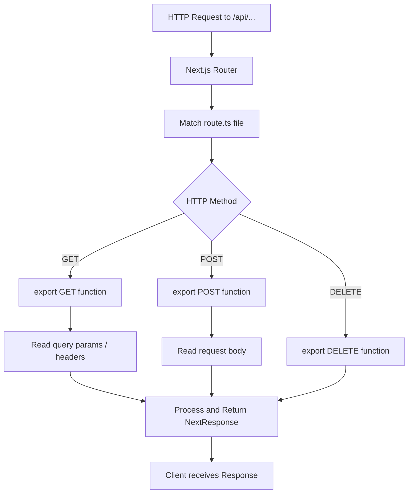

# Day 13 [Beginner]: API Route Handlers Basics

## Index

- [Goal](#goal)
- [Prerequisites](#prerequisites)
- [Explanation](#explanation)
- [Topic by Topic](#topic-by-topic)
- [Key Concepts](#key-concepts)
- [Visual Concept Map](#visual-concept-map)
- [End-to-End Practical](#end-to-end-practical)
- [Hands-on Coding](#hands-on-coding)
- [Mini Exercise](#mini-exercise)
- [Assessment Quiz](#assessment-quiz)
- [Task](#task)
- [Self Check](#self-check)
- [Interview Questions and Answers](#interview-questions-and-answers)
- [Day 13 Outcome](#day-13-outcome)

## Goal

Create API endpoints inside your Next.js application using Route Handlers, and handle GET, POST, and other HTTP methods.

## Prerequisites

- Completed Day 12: Environment Variables
- Basic understanding of REST APIs and HTTP methods

## Explanation

Route Handlers are Next.js's way of building API endpoints inside the App Router. Instead of running a separate Express server, you can define HTTP endpoints directly in your Next.js project. A Route Handler is a `route.ts` file inside a folder in `app/` — typically under `app/api/`. You export named functions corresponding to HTTP methods: `GET`, `POST`, `PUT`, `PATCH`, `DELETE`, `HEAD`, and `OPTIONS`.

When a request comes in, Next.js finds the matching `route.ts` file and calls the appropriate exported function. You receive a `Request` object (the Web API `Request`, not Node's `IncomingMessage`) and return a `Response` object. Next.js provides `NextRequest` and `NextResponse` as enhanced versions with extra utilities.

Route Handlers run on the server — they have access to environment variables, databases, and other server-side resources. They are great for webhooks, form submissions, data mutations, and integrating with third-party services. For simple data fetching in pages, you can often fetch data directly in Server Components without needing a Route Handler at all.

## Topic by Topic

### Topic 1: Creating a Route Handler

Theory:
Create a `route.ts` file in any folder under `app/`. Export named functions for each HTTP method you want to support. The function receives a `Request` and returns a `Response`.

Practical:
Create `app/api/hello/route.ts` and test it at `http://localhost:3000/api/hello`.

Code Example:

```tsx
// app/api/hello/route.ts
import { NextResponse } from "next/server";

export async function GET() {
  return NextResponse.json({
    message: "Hello from Next.js Route Handler!",
    timestamp: new Date().toISOString(),
  });
}
```
**Explanation:**
This topic explains Creating a Route Handler in practical Next.js terms so you can build correct routing, rendering, and data flow patterns in real applications.

**Key Points:**
- Understand the core concept behind Creating a Route Handler.
- Apply it with the right Next.js feature and defaults.
- Watch for common mistakes that affect performance, SEO, or maintainability.


### Topic 2: Reading Request Body (POST)

Theory:
For POST requests, read the request body using `request.json()`. This parses the JSON body into a JavaScript object.

Practical:
Build a POST handler that receives data, validates it, and returns a success response.

Code Example:

```tsx
// app/api/contact/route.ts
import { NextRequest, NextResponse } from "next/server";

export async function POST(request: NextRequest) {
  const body = await request.json();
  const { name, email, message } = body;

  if (!name || !email || !message) {
    return NextResponse.json(
      { error: "Missing required fields" },
      { status: 400 },
    );
  }

  // Process the contact form (e.g. send email, save to DB)
  console.log("Contact form:", { name, email, message });

  return NextResponse.json(
    { success: true, message: "Message received!" },
    { status: 201 },
  );
}
```
**Explanation:**
This topic explains Reading Request Body (POST) in practical Next.js terms so you can build correct routing, rendering, and data flow patterns in real applications.

**Key Points:**
- Understand the core concept behind Reading Request Body (POST).
- Apply it with the right Next.js feature and defaults.
- Watch for common mistakes that affect performance, SEO, or maintainability.


### Topic 3: HTTP Status Codes

Theory:
Return appropriate HTTP status codes: 200 (OK), 201 (Created), 400 (Bad Request), 401 (Unauthorised), 404 (Not Found), 500 (Server Error). Pass `{ status: N }` as the second argument to `NextResponse.json`.

Practical:
Always return meaningful status codes to help clients handle responses correctly.

Code Example:

```tsx
// app/api/users/[id]/route.ts
import { NextRequest, NextResponse } from "next/server";

const users = [
  { id: "1", name: "Alice" },
  { id: "2", name: "Bob" },
];

export async function GET(
  _request: NextRequest,
  { params }: { params: Promise<{ id: string }> },
) {
  const { id } = await params;
  const user = users.find((u) => u.id === id);

  if (!user) {
    return NextResponse.json({ error: "User not found" }, { status: 404 });
  }

  return NextResponse.json(user); // Default: 200 OK
}
```
**Explanation:**
This topic explains HTTP Status Codes in practical Next.js terms so you can build correct routing, rendering, and data flow patterns in real applications.

**Key Points:**
- Understand the core concept behind HTTP Status Codes.
- Apply it with the right Next.js feature and defaults.
- Watch for common mistakes that affect performance, SEO, or maintainability.


### Topic 4: Reading URL Parameters and Query Strings

Theory:
Use `params` (from the second argument) for route parameters. Use `request.nextUrl.searchParams` for query string parameters.

Practical:
Build a search endpoint that reads a `q` query parameter.

Code Example:

```tsx
// app/api/search/route.ts
import { NextRequest, NextResponse } from "next/server";

const posts = [
  { id: 1, title: "Next.js Routing" },
  { id: 2, title: "React Server Components" },
  { id: 3, title: "TypeScript Basics" },
];

export async function GET(request: NextRequest) {
  const { searchParams } = request.nextUrl;
  const query = searchParams.get("q")?.toLowerCase() ?? "";

  const results = posts.filter((p) => p.title.toLowerCase().includes(query));

  return NextResponse.json({ results, total: results.length });
}
// Usage: GET /api/search?q=next
```
**Explanation:**
This topic explains Reading URL Parameters and Query Strings in practical Next.js terms so you can build correct routing, rendering, and data flow patterns in real applications.

**Key Points:**
- Understand the core concept behind Reading URL Parameters and Query Strings.
- Apply it with the right Next.js feature and defaults.
- Watch for common mistakes that affect performance, SEO, or maintainability.


### Topic 5: Setting Response Headers

Theory:
Pass a `headers` object in the response options or use `NextResponse.headers.set()` to add response headers like CORS, caching, or content-type headers.

Practical:
Add CORS headers to allow cross-origin API calls from a frontend on a different domain.

Code Example:

```tsx
// app/api/public/data/route.ts
import { NextResponse } from "next/server";

export async function GET() {
  const data = { items: ["a", "b", "c"] };

  return NextResponse.json(data, {
    status: 200,
    headers: {
      "Access-Control-Allow-Origin": "*",
      "Cache-Control": "public, max-age=60",
    },
  });
}

export async function OPTIONS() {
  return new Response(null, {
    status: 204,
    headers: {
      "Access-Control-Allow-Origin": "*",
      "Access-Control-Allow-Methods": "GET, POST, OPTIONS",
      "Access-Control-Allow-Headers": "Content-Type",
    },
  });
}
```
**Explanation:**
This topic explains Setting Response Headers in practical Next.js terms so you can build correct routing, rendering, and data flow patterns in real applications.

**Key Points:**
- Understand the core concept behind Setting Response Headers.
- Apply it with the right Next.js feature and defaults.
- Watch for common mistakes that affect performance, SEO, or maintainability.


### Topic 6: Reading Request Headers

Theory:
Use `request.headers.get('header-name')` to read request headers. This is useful for reading `Authorization` tokens, `Content-Type`, or custom headers.

Practical:
Extract a Bearer token from the `Authorization` header for authentication.

Code Example:

```tsx
// app/api/protected/route.ts
import { NextRequest, NextResponse } from "next/server";

export async function GET(request: NextRequest) {
  const authHeader = request.headers.get("Authorization");

  if (!authHeader?.startsWith("Bearer ")) {
    return NextResponse.json({ error: "Unauthorized" }, { status: 401 });
  }

  const token = authHeader.slice(7); // Remove "Bearer " prefix

  // Verify token...
  if (token !== "valid-token") {
    return NextResponse.json({ error: "Invalid token" }, { status: 401 });
  }

  return NextResponse.json({ data: "Protected content" });
}
```
**Explanation:**
This topic explains Reading Request Headers in practical Next.js terms so you can build correct routing, rendering, and data flow patterns in real applications.

**Key Points:**
- Understand the core concept behind Reading Request Headers.
- Apply it with the right Next.js feature and defaults.
- Watch for common mistakes that affect performance, SEO, or maintainability.


### Topic 7: Handling Multiple Methods in One File

Theory:
Export multiple named functions in one `route.ts` file to handle different HTTP methods for the same URL.

Practical:
Build a full CRUD resource: GET to fetch, POST to create, PUT to update, DELETE to remove.

Code Example:

```tsx
// app/api/notes/route.ts
import { NextRequest, NextResponse } from "next/server";

const notes: { id: number; text: string }[] = [];
let nextId = 1;

export async function GET() {
  return NextResponse.json(notes);
}

export async function POST(request: NextRequest) {
  const { text } = await request.json();
  if (!text)
    return NextResponse.json({ error: "text required" }, { status: 400 });
  const note = { id: nextId++, text };
  notes.push(note);
  return NextResponse.json(note, { status: 201 });
}

export async function DELETE(request: NextRequest) {
  const { id } = await request.json();
  const index = notes.findIndex((n) => n.id === id);
  if (index === -1)
    return NextResponse.json({ error: "Not found" }, { status: 404 });
  notes.splice(index, 1);
  return NextResponse.json({ deleted: id });
}
```
**Explanation:**
This topic explains Handling Multiple Methods in One File in practical Next.js terms so you can build correct routing, rendering, and data flow patterns in real applications.

**Key Points:**
- Understand the core concept behind Handling Multiple Methods in One File.
- Apply it with the right Next.js feature and defaults.
- Watch for common mistakes that affect performance, SEO, or maintainability.


### Topic 8: Error Handling in Route Handlers

Theory:
Wrap handler logic in try/catch and return appropriate error responses. Never let unhandled errors reach the client with stack traces.

Practical:
Return a generic 500 response when an unexpected error occurs.

Code Example:

```tsx
// app/api/data/route.ts
import { NextResponse } from "next/server";

async function fetchFromDatabase() {
  // Simulate a potential error
  throw new Error("Database connection failed");
}

export async function GET() {
  try {
    const data = await fetchFromDatabase();
    return NextResponse.json(data);
  } catch (error) {
    console.error("API Error:", error);
    return NextResponse.json(
      { error: "Internal server error" },
      { status: 500 },
    );
  }
}
```
**Explanation:**
This topic explains Error Handling in Route Handlers in practical Next.js terms so you can build correct routing, rendering, and data flow patterns in real applications.

**Key Points:**
- Understand the core concept behind Error Handling in Route Handlers.
- Apply it with the right Next.js feature and defaults.
- Watch for common mistakes that affect performance, SEO, or maintainability.


## Key Concepts

- **Route Handler**: A `route.ts` file in the `app/` directory that exports HTTP method functions.
- **NextRequest**: An enhanced Web API `Request` with Next.js-specific utilities like `nextUrl.searchParams`.
- **NextResponse**: An enhanced `Response` with `NextResponse.json()`, cookies, and headers utilities.
- **HTTP Method Export**: Named exports like `GET`, `POST`, `PUT`, `DELETE` in `route.ts` handle corresponding HTTP methods.
- **Status Code**: The numeric HTTP response code indicating success (2xx), client errors (4xx), or server errors (5xx).
- **Request Body**: JSON data sent in a POST/PUT request, read with `request.json()`.
- **Route Parameters**: Dynamic segments in the route path, accessible via the second argument's `params` Promise.
- **CORS**: Cross-Origin Resource Sharing headers that allow or restrict cross-domain API access.

## Visual Concept Map



## End-to-End Practical

1. Create `app/api/products/route.ts` with a GET handler returning a product list.
2. Add a POST handler to create a new product (in-memory).
3. Create `app/api/products/[id]/route.ts` with GET (by ID) and DELETE handlers.
4. Test each endpoint using the browser or a tool like curl/HTTPie.
5. Add query string support: `GET /api/products?category=electronics`.
6. Add error handling with try/catch and 500 responses.
7. Verify 404 is returned when a product ID doesn't exist.

## Hands-on Coding

### Example 1: Full Products CRUD API

```tsx
// app/api/products/route.ts
import { NextRequest, NextResponse } from "next/server";

type Product = { id: number; name: string; price: number; category: string };

const products: Product[] = [
  { id: 1, name: "Laptop", price: 999, category: "electronics" },
  { id: 2, name: "Desk Chair", price: 299, category: "furniture" },
  { id: 3, name: "Headphones", price: 149, category: "electronics" },
];
let nextId = 4;

export async function GET(request: NextRequest) {
  const category = request.nextUrl.searchParams.get("category");
  const filtered = category
    ? products.filter((p) => p.category === category)
    : products;
  return NextResponse.json({ products: filtered, total: filtered.length });
}

export async function POST(request: NextRequest) {
  try {
    const { name, price, category } = await request.json();
    if (!name || !price) {
      return NextResponse.json(
        { error: "name and price are required" },
        { status: 400 },
      );
    }
    const product: Product = {
      id: nextId++,
      name,
      price,
      category: category ?? "other",
    };
    products.push(product);
    return NextResponse.json(product, { status: 201 });
  } catch {
    return NextResponse.json(
      { error: "Invalid request body" },
      { status: 400 },
    );
  }
}
```

### Example 2: Product by ID

```tsx
// app/api/products/[id]/route.ts
import { NextRequest, NextResponse } from "next/server";

const products = [
  { id: 1, name: "Laptop", price: 999 },
  { id: 2, name: "Desk Chair", price: 299 },
];

type Params = { params: Promise<{ id: string }> };

export async function GET(_req: NextRequest, { params }: Params) {
  const { id } = await params;
  const product = products.find((p) => p.id === Number(id));
  if (!product)
    return NextResponse.json({ error: "Not found" }, { status: 404 });
  return NextResponse.json(product);
}

export async function DELETE(_req: NextRequest, { params }: Params) {
  const { id } = await params;
  const index = products.findIndex((p) => p.id === Number(id));
  if (index === -1)
    return NextResponse.json({ error: "Not found" }, { status: 404 });
  const deleted = products.splice(index, 1)[0];
  return NextResponse.json({ deleted });
}
```

### Example 3: Contact Form Handler

```tsx
// app/api/contact/route.ts
import { NextRequest, NextResponse } from "next/server";

export async function POST(request: NextRequest) {
  try {
    const body = await request.json();
    const { name, email, subject, message } = body;

    const errors: string[] = [];
    if (!name) errors.push("name");
    if (!email || !email.includes("@")) errors.push("valid email");
    if (!message) errors.push("message");

    if (errors.length > 0) {
      return NextResponse.json(
        { error: `Missing or invalid: ${errors.join(", ")}` },
        { status: 400 },
      );
    }

    // In production: send email, save to DB, etc.
    console.log("Contact submission:", { name, email, subject, message });

    return NextResponse.json({
      success: true,
      message: `Thank you ${name}, we'll respond to ${email} soon.`,
    });
  } catch {
    return NextResponse.json({ error: "Invalid request" }, { status: 400 });
  }
}
```

## Mini Exercise

Scenario:
Build a simple to-do list API with GET (list all), POST (create), and DELETE (by ID) endpoints.

Steps:

1. Create `app/api/todos/route.ts` with GET and POST handlers.
2. GET returns all todos. POST creates a new todo with `{ text: string }`.
3. Create `app/api/todos/[id]/route.ts` with DELETE handler.
4. Test with `fetch` from a client component or browser console.
5. Return 400 if POST body is missing the `text` field.

Expected output:

- `GET /api/todos` returns `[]` initially.
- `POST /api/todos` with `{ text: "Buy groceries" }` returns `{ id: 1, text: "Buy groceries", done: false }`.
- `DELETE /api/todos/1` removes the todo.

## Assessment Quiz

### Quiz Questions

1. What file name is used to create a Route Handler?
2. How do you handle a POST request in a Route Handler?
3. How do you read a query string parameter like `?q=search`?
4. What status code should you return for a missing resource?
5. Where in the project should you put Route Handler files?

### Quiz Answers

1. `route.ts` (or `route.js`) — this is the special filename Next.js uses for Route Handlers.
2. Export an async function named `POST` that receives the `request` object. Use `await request.json()` to read the body.
3. Use `request.nextUrl.searchParams.get('q')`.
4. 404 — `NextResponse.json({ error: 'Not found' }, { status: 404 })`.
5. Typically under `app/api/` by convention, but Route Handlers can technically be placed anywhere in the `app/` directory (as long as they don't conflict with page routes).

## Task

- Build a simple notes API: GET all, POST create, GET by ID, PUT update, DELETE by ID.
- Add query string filtering to the GET all endpoint.
- Add basic validation with appropriate 400 responses.
- Wrap all handlers in try/catch with 500 error responses.
- Test all endpoints from a client-side component using `fetch`.

## Self Check

- Can you create a Route Handler for GET and POST requests?
- Do you know how to read route params and query strings?
- Can you return correct status codes for success and error cases?
- Do you know how to handle errors in Route Handlers?
- Have you tested your endpoints with the browser or a tool?

## Interview Questions and Answers

### Beginner

**Question:** What is a Route Handler in Next.js and how do you create one?
**Answer:** A Route Handler is an API endpoint defined in a `route.ts` file inside the `app/` directory. Export functions named after HTTP methods (GET, POST, etc.) to handle those request types.

**Question:** How is a Route Handler different from a Server Component?
**Answer:** A Server Component renders UI (HTML) for a page. A Route Handler returns data (JSON, XML, etc.) for an API endpoint. Server Components use `page.tsx`; Route Handlers use `route.ts`.

### Middle

**Question:** How do you read both route parameters and query strings in a Route Handler?
**Answer:** Route parameters come from the second argument's `params` Promise (e.g. `params.id`). Query strings come from `request.nextUrl.searchParams.get('key')`.

**Question:** Can a folder have both a `page.tsx` and a `route.ts`?
**Answer:** No — a folder can have either a `page.tsx` (for a UI route) or a `route.ts` (for an API route), but not both. They would conflict at the same URL.

### Advanced

**Question:** How would you add rate limiting to a Route Handler?
**Answer:** Implement a rate limiting check at the start of the handler — read the client's IP from `request.ip` or headers, check a Redis-backed counter, and return 429 Too Many Requests if the limit is exceeded. Libraries like `upstash/ratelimit` simplify this.

**Question:** What is the difference between Route Handlers and Server Actions?
**Answer:** Route Handlers are explicit HTTP endpoints called with `fetch`. Server Actions are async functions called directly from Client Components via form submissions or `startTransition`. Server Actions are better for form mutations; Route Handlers are better for external API consumers (mobile apps, webhooks, third-party integrations).

## Day 13 Outcome

- You can create Route Handlers for multiple HTTP methods.
- You know how to read request bodies, headers, params, and query strings.
- You return correct HTTP status codes for different scenarios.
- You handle errors gracefully with try/catch.
- You are ready to understand Server vs Client Components on Day 14.
