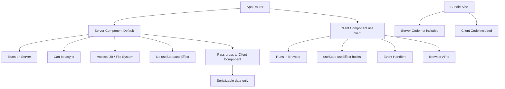

# Day 14 [Beginner]: Server Components vs Client Components

## Index

- [Goal](#goal)
- [Prerequisites](#prerequisites)
- [Explanation](#explanation)
- [Topic by Topic](#topic-by-topic)
- [Key Concepts](#key-concepts)
- [Visual Concept Map](#visual-concept-map)
- [End-to-End Practical](#end-to-end-practical)
- [Hands-on Coding](#hands-on-coding)
- [Mini Exercise](#mini-exercise)
- [Assessment Quiz](#assessment-quiz)
- [Task](#task)
- [Self Check](#self-check)
- [Interview Questions and Answers](#interview-questions-and-answers)
- [Day 14 Outcome](#day-14-outcome)

## Goal

Clearly understand the difference between Server Components and Client Components in Next.js and know when to use each.

## Prerequisites

- Completed Day 13: API Route Handlers Basics
- Basic understanding of React hooks and component rendering

## Explanation

In the Next.js App Router, every component is a Server Component by default. A Server Component runs on the server, fetches data, and sends rendered HTML to the browser. It never runs in the browser and cannot use browser-only APIs, event handlers, or React hooks like `useState` and `useEffect`.

A Client Component, marked with the `'use client'` directive at the top of the file, runs in the browser (after being serialised and sent from the server during SSR). It can use hooks, event handlers, and browser APIs. It is what you are used to from traditional React development.

The key mental model is: use Server Components by default. Add `'use client'` only when you need interactivity (hooks, events) or browser APIs. This keeps most of your app's logic on the server where it is secure, efficient, and doesn't inflate the browser's JavaScript bundle.

## Topic by Topic

### Topic 1: Default: Server Components

Theory:
Without any directive, a component in the App Router is a Server Component. It runs on the server, can be async, can fetch data directly, and does not ship its code to the browser.

Practical:
Use Server Components for data fetching, database queries, and rendering static or server-driven content.

Code Example:

```tsx
// app/dashboard/page.tsx — Server Component (no 'use client')
async function getStats() {
  // Runs on server — can access DB, env vars, file system
  return { users: 1204, revenue: 48000, orders: 320 };
}

export default async function DashboardPage() {
  const stats = await getStats();
  return (
    <div>
      <h1>Dashboard</h1>
      <p>Users: {stats.users}</p>
      <p>Revenue: ${stats.revenue}</p>
    </div>
  );
}
```
**Explanation:**
This topic explains Default: Server Components in practical Next.js terms so you can build correct routing, rendering, and data flow patterns in real applications.

**Key Points:**
- Understand the core concept behind Default: Server Components.
- Apply it with the right Next.js feature and defaults.
- Watch for common mistakes that affect performance, SEO, or maintainability.


### Topic 2: When to Use Client Components

Theory:
Use Client Components when you need: `useState`, `useEffect`, `useReducer`, or other hooks; event handlers (`onClick`, `onChange`); browser APIs (`window`, `localStorage`, `navigator`); or third-party libraries that depend on the DOM.

Practical:
Mark only the interactive leaves of your component tree as Client Components.

Code Example:

```tsx
"use client";
// This directive makes it a Client Component

import { useState } from "react";

export default function Counter() {
  const [count, setCount] = useState(0);

  return (
    <div>
      <p>Count: {count}</p>
      <button onClick={() => setCount(count + 1)}>Increment</button>
      <button onClick={() => setCount(count - 1)}>Decrement</button>
    </div>
  );
}
```
**Explanation:**
This topic explains When to Use Client Components in practical Next.js terms so you can build correct routing, rendering, and data flow patterns in real applications.

**Key Points:**
- Understand the core concept behind When to Use Client Components.
- Apply it with the right Next.js feature and defaults.
- Watch for common mistakes that affect performance, SEO, or maintainability.


### Topic 3: Composing Server and Client Components

Theory:
You can nest Client Components inside Server Components. The Server Component fetches data and passes it as props to the Client Component. The Client Component handles the interactive UI.

Practical:
Keep data fetching in the Server Component and interactivity in a small Client Component leaf.

Code Example:

```tsx
// app/products/page.tsx — Server Component
import ProductList from "@/components/ProductList";

async function getProducts() {
  return [
    { id: 1, name: "Laptop", price: 999 },
    { id: 2, name: "Phone", price: 699 },
  ];
}

export default async function ProductsPage() {
  const products = await getProducts();
  // Pass server-fetched data to a Client Component
  return <ProductList products={products} />;
}

// components/ProductList.tsx — Client Component
("use client");
import { useState } from "react";

type Product = { id: number; name: string; price: number };

export default function ProductList({ products }: { products: Product[] }) {
  const [filter, setFilter] = useState("");
  const filtered = products.filter((p) =>
    p.name.toLowerCase().includes(filter),
  );
  return (
    <div>
      <input
        value={filter}
        onChange={(e) => setFilter(e.target.value)}
        placeholder="Filter..."
      />
      <ul>
        {filtered.map((p) => (
          <li key={p.id}>
            {p.name} - ${p.price}
          </li>
        ))}
      </ul>
    </div>
  );
}
```
**Explanation:**
This topic explains Composing Server and Client Components in practical Next.js terms so you can build correct routing, rendering, and data flow patterns in real applications.

**Key Points:**
- Understand the core concept behind Composing Server and Client Components.
- Apply it with the right Next.js feature and defaults.
- Watch for common mistakes that affect performance, SEO, or maintainability.


### Topic 4: Cannot Import Server Component into Client Component

Theory:
You cannot import a Server Component into a Client Component — all imports inside a `'use client'` file are treated as client-side. Instead, pass Server Component output as `children` props.

Practical:
Use the composition pattern (children prop) to include Server Component output inside a Client Component wrapper.

Code Example:

```tsx
// WRONG — ServerComponent imported into ClientComponent
"use client";
import ServerCard from "./ServerCard"; // Won't work correctly

// CORRECT — Pass Server Component as children
// Parent Server Component:
import ClientWrapper from "./ClientWrapper";
import ServerCard from "./ServerCard";

export default function Page() {
  return (
    <ClientWrapper>
      <ServerCard /> {/* Server Component passed as children */}
    </ClientWrapper>
  );
}

// ClientWrapper.tsx
("use client");
import { useState } from "react";

export default function ClientWrapper({
  children,
}: {
  children: React.ReactNode;
}) {
  const [open, setOpen] = useState(true);
  return (
    <div>
      <button onClick={() => setOpen(!open)}>Toggle</button>
      {open && children}
    </div>
  );
}
```
**Explanation:**
This topic explains Cannot Import Server Component into Client Component in practical Next.js terms so you can build correct routing, rendering, and data flow patterns in real applications.

**Key Points:**
- Understand the core concept behind Cannot Import Server Component into Client Component.
- Apply it with the right Next.js feature and defaults.
- Watch for common mistakes that affect performance, SEO, or maintainability.


### Topic 5: Data Fetching Differences

Theory:
Server Components can `await` data directly in the component body. Client Components fetch data using `useEffect`, `SWR`, `TanStack Query`, or Server Actions.

Practical:
Prefer Server Components for initial data loads to reduce client-side waterfalls.

Code Example:

```tsx
// SERVER COMPONENT — Fetch data directly
async function BlogList() {
  const posts = await fetch("https://api.example.com/posts").then((r) =>
    r.json(),
  );
  return (
    <ul>
      {posts.map((p: { id: number; title: string }) => (
        <li key={p.id}>{p.title}</li>
      ))}
    </ul>
  );
}

// CLIENT COMPONENT — Fetch data with useEffect
("use client");
import { useState, useEffect } from "react";

function BlogList() {
  const [posts, setPosts] = useState([]);
  useEffect(() => {
    fetch("/api/posts")
      .then((r) => r.json())
      .then(setPosts);
  }, []);
  return (
    <ul>
      {posts.map((p: { id: number; title: string }) => (
        <li key={p.id}>{p.title}</li>
      ))}
    </ul>
  );
}
```
**Explanation:**
This topic explains Data Fetching Differences in practical Next.js terms so you can build correct routing, rendering, and data flow patterns in real applications.

**Key Points:**
- Understand the core concept behind Data Fetching Differences.
- Apply it with the right Next.js feature and defaults.
- Watch for common mistakes that affect performance, SEO, or maintainability.


### Topic 6: JavaScript Bundle Size

Theory:
Server Component code is never sent to the browser — only the rendered HTML. Client Component code is included in the JavaScript bundle. This is why keeping components server-side reduces bundle size.

Practical:
Large utility libraries used only for rendering (markdown parsers, date formatters) should be used in Server Components to avoid adding them to the client bundle.

Code Example:

```tsx
// GOOD — Markdown rendered server-side, no markdown library in browser bundle
import { marked } from "marked"; // Not in browser JS bundle

export default async function MarkdownPage({ slug }: { slug: string }) {
  const raw = await readMarkdownFile(slug);
  const html = marked(raw);
  return <div dangerouslySetInnerHTML={{ __html: html }} />;
}

async function readMarkdownFile(slug: string) {
  return `# Hello\nThis is **${slug}**`;
}
```
**Explanation:**
This topic explains JavaScript Bundle Size in practical Next.js terms so you can build correct routing, rendering, and data flow patterns in real applications.

**Key Points:**
- Understand the core concept behind JavaScript Bundle Size.
- Apply it with the right Next.js feature and defaults.
- Watch for common mistakes that affect performance, SEO, or maintainability.


### Topic 7: Server Component Restrictions

Theory:
Server Components CANNOT: use `useState`, `useEffect`, or other hooks; attach event handlers; use `window`, `document`, or `localStorage`; use Context (as providers — they can consume context); or use any library that requires browser APIs.

Practical:
If you accidentally use a hook in a Server Component, you'll get a clear build error — Next.js catches this.

Code Example:

```tsx
// This will ERROR — hooks not allowed in Server Components
async function BadServerComponent() {
  const [count, setCount] = useState(0); // ❌ Error!
  return <div>{count}</div>;
}

// FIX — Add 'use client'
("use client");
import { useState } from "react";

function GoodClientComponent() {
  const [count, setCount] = useState(0); // ✅ OK
  return <div>{count}</div>;
}
```
**Explanation:**
This topic explains Server Component Restrictions in practical Next.js terms so you can build correct routing, rendering, and data flow patterns in real applications.

**Key Points:**
- Understand the core concept behind Server Component Restrictions.
- Apply it with the right Next.js feature and defaults.
- Watch for common mistakes that affect performance, SEO, or maintainability.


### Topic 8: Serialization Rules

Theory:
When a Server Component passes props to a Client Component, the props must be serializable (JSON-compatible). Functions, class instances, and non-serializable objects cannot be passed as props across the server/client boundary.

Practical:
Pass plain data objects and primitives. Use Server Actions for callbacks.

Code Example:

```tsx
// Server Component passing props to Client Component
async function Page() {
  const user = await getUser();

  return (
    // CORRECT — plain serializable object
    <ClientCard
      name={user.name} // string ✅
      age={user.age} // number ✅
      tags={user.tags} // string[] ✅
      // WRONG — function cannot be serialised
      // onEdit={() => {}}    // ❌ Functions can't cross the boundary
    />
  );
}
```
**Explanation:**
This topic explains Serialization Rules in practical Next.js terms so you can build correct routing, rendering, and data flow patterns in real applications.

**Key Points:**
- Understand the core concept behind Serialization Rules.
- Apply it with the right Next.js feature and defaults.
- Watch for common mistakes that affect performance, SEO, or maintainability.


## Key Concepts

- **Server Component**: A React component that runs only on the server; can be async, fetch data, and access server-side resources. The default in App Router.
- **Client Component**: Marked with `'use client'`; runs in the browser; can use hooks, events, and browser APIs.
- **use client directive**: The string `'use client'` at the top of a file marks all exports as Client Components.
- **Boundary**: The point in the component tree where execution transitions from server to client.
- **Serialization**: The process of converting data to a JSON-compatible format for transmission from server to client.
- **Bundle Size**: The size of JavaScript sent to the browser. Server Component code doesn't contribute to it.
- **Composition Pattern**: Passing Server Component output as `children` to a Client Component wrapper.
- **Async Component**: A Server Component that uses `async/await` directly in the function body to fetch data.

## Visual Concept Map



## End-to-End Practical

1. Create a page with a Server Component that fetches a list of users.
2. Pass the users to a Client Component that has a search filter input.
3. Add a `Counter` Client Component inside the page.
4. Try using `useState` in a Server Component — observe the error.
5. Use the children composition pattern to include a Server Card inside a Client toggle wrapper.
6. Open DevTools → Network → JS — observe that heavy server-side utilities don't appear in the bundle.

## Hands-on Coding

### Example 1: Server Component with Async Data Fetch

```tsx
// app/users/page.tsx — Server Component
import UserTable from "@/components/UserTable";

type User = { id: number; name: string; email: string; role: string };

async function getUsers(): Promise<User[]> {
  // In production: query database directly
  await new Promise((r) => setTimeout(r, 100)); // Simulate DB latency
  return [
    { id: 1, name: "Alice Chen", email: "alice@example.com", role: "admin" },
    { id: 2, name: "Bob Kim", email: "bob@example.com", role: "user" },
    { id: 3, name: "Carol James", email: "carol@example.com", role: "user" },
  ];
}

export default async function UsersPage() {
  const users = await getUsers();
  return (
    <div className="p-6">
      <h1 className="text-2xl font-bold mb-6">Users</h1>
      <UserTable users={users} />
    </div>
  );
}
```

### Example 2: Client Component with Interactive Filter

```tsx
// components/UserTable.tsx
"use client";
import { useState } from "react";

type User = { id: number; name: string; email: string; role: string };

export default function UserTable({ users }: { users: User[] }) {
  const [search, setSearch] = useState("");
  const [roleFilter, setRoleFilter] = useState("all");

  const filtered = users.filter((u) => {
    const matchesSearch = u.name.toLowerCase().includes(search.toLowerCase());
    const matchesRole = roleFilter === "all" || u.role === roleFilter;
    return matchesSearch && matchesRole;
  });

  return (
    <div>
      <div className="flex gap-4 mb-4">
        <input
          type="text"
          value={search}
          onChange={(e) => setSearch(e.target.value)}
          placeholder="Search users..."
          className="border rounded px-3 py-2 flex-1"
        />
        <select
          value={roleFilter}
          onChange={(e) => setRoleFilter(e.target.value)}
          className="border rounded px-3 py-2"
        >
          <option value="all">All Roles</option>
          <option value="admin">Admin</option>
          <option value="user">User</option>
        </select>
      </div>
      <table className="w-full border-collapse">
        <thead>
          <tr className="bg-gray-50">
            <th className="text-left p-3 border-b">Name</th>
            <th className="text-left p-3 border-b">Email</th>
            <th className="text-left p-3 border-b">Role</th>
          </tr>
        </thead>
        <tbody>
          {filtered.map((u) => (
            <tr key={u.id} className="hover:bg-gray-50">
              <td className="p-3 border-b">{u.name}</td>
              <td className="p-3 border-b">{u.email}</td>
              <td className="p-3 border-b capitalize">{u.role}</td>
            </tr>
          ))}
        </tbody>
      </table>
      <p className="mt-2 text-sm text-gray-500">
        {filtered.length} of {users.length} users
      </p>
    </div>
  );
}
```

### Example 3: Composition Pattern

```tsx
// app/blog/page.tsx — Server Component
import ExpandableSection from "@/components/ExpandableSection";

async function getLatestPost() {
  return {
    title: "Understanding Server Components",
    content: "Server Components run on the server...",
  };
}

export default async function BlogPage() {
  const post = await getLatestPost();
  return (
    <div className="max-w-2xl mx-auto p-6">
      <h1 className="text-3xl font-bold mb-6">Blog</h1>
      {/* Client Component wrapper with Server Component content as children */}
      <ExpandableSection title={post.title}>
        <p className="text-gray-700 leading-relaxed">{post.content}</p>
        <p className="mt-4 text-sm text-gray-500">
          This content was fetched on the server.
        </p>
      </ExpandableSection>
    </div>
  );
}

// components/ExpandableSection.tsx
("use client");
import { useState } from "react";

export default function ExpandableSection({
  title,
  children,
}: {
  title: string;
  children: React.ReactNode;
}) {
  const [isOpen, setIsOpen] = useState(true);
  return (
    <div className="border rounded-xl overflow-hidden">
      <button
        className="w-full flex justify-between items-center p-4 bg-gray-50 hover:bg-gray-100 transition-colors"
        onClick={() => setIsOpen(!isOpen)}
      >
        <span className="font-semibold">{title}</span>
        <span>{isOpen ? "▲" : "▼"}</span>
      </button>
      {isOpen && <div className="p-4">{children}</div>}
    </div>
  );
}
```

## Mini Exercise

Scenario:
Build a product page where product details are fetched server-side but the "Add to Cart" quantity selector is interactive.

Steps:

1. Create `app/shop/[id]/page.tsx` as a Server Component that fetches product data.
2. Create `components/QuantitySelector.tsx` as a Client Component with `useState` for quantity.
3. Pass the product name and price from the Server Component to the page.
4. Include `QuantitySelector` in the Server Component page.
5. Confirm the quantity selector is interactive while the product info is server-rendered.

Expected output:

- Product name and price are in the initial HTML (server-rendered).
- The quantity selector increments and decrements interactively.

## Assessment Quiz

### Quiz Questions

1. What is the default component type in the Next.js App Router?
2. What directive makes a component a Client Component?
3. Can you use `useState` in a Server Component?
4. What is the correct way to include Server Component content inside a Client Component?
5. Why does using Server Components reduce JavaScript bundle size?

### Quiz Answers

1. Server Component — all components are Server Components by default unless marked with `'use client'`.
2. The `'use client'` string directive at the top of the file, before any imports.
3. No — Server Components cannot use React hooks. You'll get a build error if you try.
4. Pass the Server Component as `children` to the Client Component. Never import a Server Component directly inside a Client Component.
5. Server Component code runs only on the server and is never sent to the browser as JavaScript — only the rendered HTML output is sent.

## Task

- Build a page with a Server Component that fetches blog posts and a Client Component that has a filter/search feature.
- Use the composition pattern to embed a Server Component inside a Client toggle wrapper.
- Identify every component in your app and decide if it should be server or client.
- Remove unnecessary `'use client'` directives from components that don't need interactivity.

## Self Check

- Can you explain the key differences between Server and Client Components?
- Do you know which React features require a Client Component?
- Can you use the composition pattern to pass Server Component content into a Client Component?
- Do you understand why Server Components reduce bundle size?
- Have you removed unnecessary `'use client'` directives from your project?

## Interview Questions and Answers

### Beginner

**Question:** What is a React Server Component?
**Answer:** A component that runs only on the server. It can be async, fetch data directly (from DBs, APIs, file system), and sends only rendered HTML to the browser — no JavaScript for the component itself is included in the browser bundle.

**Question:** When should you add `'use client'` to a component?
**Answer:** Only when the component needs: React hooks (useState, useEffect), event handlers (onClick), browser APIs (window, localStorage), or real-time reactivity. Otherwise, keep it as a Server Component.

### Middle

**Question:** How do you share server-fetched data with a Client Component?
**Answer:** Fetch the data in a parent Server Component and pass it as props to the Client Component. Props must be serializable (JSON-compatible) since they cross the server/client boundary.

**Question:** Why can't you import a Server Component directly into a Client Component?
**Answer:** Once a file has `'use client'`, all its imports are bundled for the browser. A Server Component that gets bundled for the browser would lose its server-only capabilities. Use the children prop pattern instead.

### Advanced

**Question:** What happens during hydration for a page with mixed Server and Client Components?
**Answer:** The server renders the full HTML including Client Component output. The browser receives the HTML and displays it immediately. React then hydrates only the Client Component subtrees (attaches event handlers, initialises state) — Server Component subtrees are not re-rendered by React on the client.

**Question:** How does Next.js determine the server/client boundary at the component tree level?
**Answer:** The boundary is at the first `'use client'` component in each branch. Everything above it in the tree is server-rendered. Everything in the subtree of a `'use client'` component is client-rendered. This means you can have a Server Component that renders a Client Component that renders another Server Component — as long as the innermost one is passed as children.

## Day 14 Outcome

- You understand the fundamental difference between Server and Client Components.
- You know which features require `'use client'` and which don't.
- You can compose Server and Client Components correctly.
- You understand how Server Components reduce bundle size.
- You are ready to dive deeper into the `'use client'` directive on Day 15.
