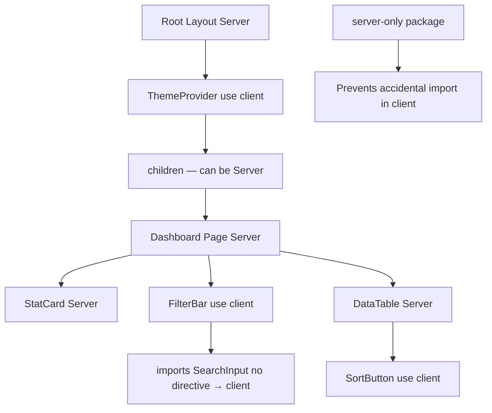

# Day 15 [Beginner]: use client Directive

## Index

- [Goal](#goal)
- [Prerequisites](#prerequisites)
- [Explanation](#explanation)
- [Topic by Topic](#topic-by-topic)
- [Key Concepts](#key-concepts)
- [Visual Concept Map](#visual-concept-map)
- [End-to-End Practical](#end-to-end-practical)
- [Hands-on Coding](#hands-on-coding)
- [Mini Exercise](#mini-exercise)
- [Assessment Quiz](#assessment-quiz)
- [Task](#task)
- [Self Check](#self-check)
- [Interview Questions and Answers](#interview-questions-and-answers)
- [Day 15 Outcome](#day-15-outcome)

## Goal

Understand exactly how `'use client'` works, when to apply it, common patterns for minimising client bundle size, and how to avoid unnecessary client components.

## Prerequisites

- Completed Day 14: Server Components vs Client Components
- Understanding of React hooks and the component tree

## Explanation

The `'use client'` directive is a boundary marker. When placed at the top of a file, it tells Next.js (and React) that this file and all files it imports start a new "client subtree". Everything in that subtree is bundled for and executed in the browser.

A key insight many developers miss: `'use client'` marks the entry point of the client subtree, not individual components. If `ComponentA.tsx` has `'use client'` and imports `ComponentB.tsx`, then `ComponentB` also becomes a client component — even if it doesn't have its own `'use client'` directive.

The best strategy is to push `'use client'` as deep down the component tree as possible — to the smallest, most focused interactive components (buttons, form inputs, counters). Keep the larger data-fetching parent components server-side. This maximises what is rendered on the server and minimises the JavaScript bundle sent to the browser.

## Topic by Topic

### Topic 1: The Directive Syntax

Theory:
`'use client'` must be the very first statement in a file, before any imports. It is a string literal, not a function call.

Practical:
Place it on line 1, before all imports. Even one blank line before it doesn't affect behaviour but is fine.

Code Example:

```tsx
"use client"; // ← Line 1, before any imports

import { useState, useEffect } from "react";
import Link from "next/link";

export default function SearchInput() {
  const [query, setQuery] = useState("");
  return (
    <input
      value={query}
      onChange={(e) => setQuery(e.target.value)}
      placeholder="Search..."
    />
  );
}
```
**Explanation:**
This topic explains The Directive Syntax in practical Next.js terms so you can build correct routing, rendering, and data flow patterns in real applications.

**Key Points:**
- Understand the core concept behind The Directive Syntax.
- Apply it with the right Next.js feature and defaults.
- Watch for common mistakes that affect performance, SEO, or maintainability.


### Topic 2: The Propagation Rule

Theory:
`'use client'` propagates down the import chain. All files imported by a client component are treated as client-side, even without their own directive.

Practical:
Be careful what you import inside a `'use client'` file — server-only modules like database clients will cause errors if imported in client components.

Code Example:

```tsx
// Scenario:
// ClientPage.tsx  ← 'use client'
//   imports ButtonA.tsx (no directive → becomes client-side)
//   imports utils.ts (no directive → becomes client-side)
//     utils.ts imports prisma.ts
//     prisma.ts imports @prisma/client → ERROR! Prisma runs server-only

// FIX: Don't import server modules in the client subtree
// Move database logic out of the client component chain
```
**Explanation:**
This topic explains The Propagation Rule in practical Next.js terms so you can build correct routing, rendering, and data flow patterns in real applications.

**Key Points:**
- Understand the core concept behind The Propagation Rule.
- Apply it with the right Next.js feature and defaults.
- Watch for common mistakes that affect performance, SEO, or maintainability.


### Topic 3: Common Uses for 'use client'

Theory:
The most common reasons to add `'use client'`: `useState`, `useEffect`, `useRef`, `useContext`, `useReducer`, event handlers (`onClick`, `onChange`, `onSubmit`), browser APIs, and third-party libraries requiring browser environment.

Practical:
Use a checklist: if your component uses any of these, it needs `'use client'`.

Code Example:

```tsx
"use client";
import { useState, useEffect, useRef } from "react";

export default function SearchBar() {
  const [query, setQuery] = useState(""); // useState ✓
  const [results, setResults] = useState([]); // useState ✓
  const inputRef = useRef<HTMLInputElement>(null); // useRef ✓

  useEffect(() => {
    // useEffect ✓
    if (query.length >= 2) {
      fetch(`/api/search?q=${query}`)
        .then((r) => r.json())
        .then((data) => setResults(data.results));
    }
  }, [query]);

  useEffect(() => {
    inputRef.current?.focus(); // Browser API ✓
  }, []);

  return (
    <div>
      <input
        ref={inputRef}
        value={query}
        onChange={(e) => setQuery(e.target.value)}
      />
      <ul>
        {results.map((r: { id: number; title: string }) => (
          <li key={r.id}>{r.title}</li>
        ))}
      </ul>
    </div>
  );
}
```
**Explanation:**
This topic explains Common Uses for 'use client' in practical Next.js terms so you can build correct routing, rendering, and data flow patterns in real applications.

**Key Points:**
- Understand the core concept behind Common Uses for 'use client'.
- Apply it with the right Next.js feature and defaults.
- Watch for common mistakes that affect performance, SEO, or maintainability.


### Topic 4: Minimising Client Bundle — Leaf Components

Theory:
Keep `'use client'` at the leaves of the component tree — small, focused interactive components. Large parent components with data fetching should remain server-side.

Practical:
Extract interactive parts into small Client Components and keep the page and layout server-side.

Code Example:

```tsx
// BAD — Entire page is client (unnecessary)
"use client";
import { useState } from "react";

async function Page() {
  // Can't be async in client component anyway
  const posts = await fetch("/api/posts").then((r) => r.json());
  return (
    <div>
      {posts.map((p: { id: number; title: string }) => (
        <p key={p.id}>{p.title}</p>
      ))}
      <LikeButton /> // Only this needs to be client
    </div>
  );
}

// GOOD — Page is server, only LikeButton is client
// app/blog/page.tsx (Server Component)
import LikeButton from "@/components/LikeButton";

async function BlogPage() {
  const posts = await fetch("/api/posts").then((r) => r.json());
  return (
    <div>
      {posts.map((p: { id: number; title: string }) => (
        <div key={p.id}>
          <p>{p.title}</p>
          <LikeButton postId={p.id} /> // Client Component leaf
        </div>
      ))}
    </div>
  );
}
```
**Explanation:**
This topic explains Minimising Client Bundle — Leaf Components in practical Next.js terms so you can build correct routing, rendering, and data flow patterns in real applications.

**Key Points:**
- Understand the core concept behind Minimising Client Bundle — Leaf Components.
- Apply it with the right Next.js feature and defaults.
- Watch for common mistakes that affect performance, SEO, or maintainability.


### Topic 5: Context Providers as Client Components

Theory:
React Context providers use `createContext` and `useState`, which are client-side features. Wrap your context providers in a Client Component that you import into layouts.

Practical:
Create a `Providers.tsx` client component that wraps all your context providers and import it in the root layout.

Code Example:

```tsx
// app/providers.tsx
"use client";
import { createContext, useContext, useState } from "react";

const ThemeContext = createContext<{ theme: string; toggle: () => void }>({
  theme: "light",
  toggle: () => {},
});

export function ThemeProvider({ children }: { children: React.ReactNode }) {
  const [theme, setTheme] = useState("light");
  return (
    <ThemeContext.Provider
      value={{
        theme,
        toggle: () => setTheme((t) => (t === "light" ? "dark" : "light")),
      }}
    >
      {children}
    </ThemeContext.Provider>
  );
}

export const useTheme = () => useContext(ThemeContext);

// app/layout.tsx (Server Component)
import { ThemeProvider } from "./providers";

export default function RootLayout({
  children,
}: {
  children: React.ReactNode;
}) {
  return (
    <html lang="en">
      <body>
        <ThemeProvider>
          {children} {/* children can still be Server Components */}
        </ThemeProvider>
      </body>
    </html>
  );
}
```
**Explanation:**
This topic explains Context Providers as Client Components in practical Next.js terms so you can build correct routing, rendering, and data flow patterns in real applications.

**Key Points:**
- Understand the core concept behind Context Providers as Client Components.
- Apply it with the right Next.js feature and defaults.
- Watch for common mistakes that affect performance, SEO, or maintainability.


### Topic 6: 'use server' vs 'use client'

Theory:
`'use server'` (different from `'use client'`) marks a function or file as a Server Action — a server-side async function callable from client components. Do not confuse these two directives.

Practical:
Use `'use server'` inside async functions for Server Actions (form handling, mutations). Use `'use client'` for interactive UI components.

Code Example:

```tsx
// Server Action in a separate file
"use server";
export async function createPost(formData: FormData) {
  const title = formData.get("title") as string;
  // Save to database...
  console.log("Creating post:", title);
}

// Client Component using the Server Action
("use client");
import { createPost } from "@/actions/post";

export default function CreatePostForm() {
  return (
    <form action={createPost}>
      <input name="title" placeholder="Post title" />
      <button type="submit">Create</button>
    </form>
  );
}
```
**Explanation:**
This topic explains 'use server' vs 'use client' in practical Next.js terms so you can build correct routing, rendering, and data flow patterns in real applications.

**Key Points:**
- Understand the core concept behind 'use server' vs 'use client'.
- Apply it with the right Next.js feature and defaults.
- Watch for common mistakes that affect performance, SEO, or maintainability.


### Topic 7: Server-only Packages

Theory:
Some packages must only run server-side (Prisma, `bcrypt`, `nodemailer`). Use the `server-only` package to throw a build-time error if any of these are accidentally imported in client components.

Practical:
Add `import 'server-only'` at the top of files containing database clients or other server-only utilities.

Code Example:

```tsx
// lib/db.ts
import "server-only"; // Build error if imported in a client component
import { PrismaClient } from "@prisma/client";

const globalForPrisma = globalThis as unknown as { prisma: PrismaClient };
export const prisma = globalForPrisma.prisma ?? new PrismaClient();

if (process.env.NODE_ENV !== "production") globalForPrisma.prisma = prisma;
```
**Explanation:**
This topic explains Server-only Packages in practical Next.js terms so you can build correct routing, rendering, and data flow patterns in real applications.

**Key Points:**
- Understand the core concept behind Server-only Packages.
- Apply it with the right Next.js feature and defaults.
- Watch for common mistakes that affect performance, SEO, or maintainability.


### Topic 8: Testing if a Component is Client or Server

Theory:
Try adding `console.log('Running in:', typeof window)` — `'undefined'` means server-side, a real object means client-side. Or check if the component can use React hooks.

Practical:
In development, look at the terminal (server logs) vs browser console to confirm where code runs.

Code Example:

```tsx
// Server Component — logs appear in terminal
export default async function ServerTest() {
  console.log("typeof window:", typeof window); // Logs in TERMINAL: undefined
  return <p>Server Component</p>;
}

// Client Component — logs appear in browser console
("use client");
export default function ClientTest() {
  console.log("typeof window:", typeof window); // Logs in BROWSER: object
  return <p>Client Component</p>;
}
```
**Explanation:**
This topic explains Testing if a Component is Client or Server in practical Next.js terms so you can build correct routing, rendering, and data flow patterns in real applications.

**Key Points:**
- Understand the core concept behind Testing if a Component is Client or Server.
- Apply it with the right Next.js feature and defaults.
- Watch for common mistakes that affect performance, SEO, or maintainability.


## Key Concepts

- **'use client' directive**: A string literal at the top of a file that marks it and its import subtree as client-side.
- **Client Boundary**: The file with `'use client'` that starts a new client subtree in the component tree.
- **Directive Propagation**: All files imported by a client component are automatically treated as client-side.
- **Leaf Component**: A small, focused component at the bottom of the tree — the ideal place for `'use client'`.
- **server-only**: An npm package that throws a build error if a server-only file is imported in a client component.
- **'use server'**: The directive for Server Actions — async functions callable from client components. Different from `'use client'`.
- **Context Provider Pattern**: Wrapping context providers in a Client Component (`Providers.tsx`) imported in the root layout.
- **Bundle Impact**: Every `'use client'` component and its imports are included in the browser JavaScript bundle.

## Visual Concept Map



## End-to-End Practical

1. Audit your current project: list every component and mark whether it needs `'use client'`.
2. For any component with `'use client'` that has no hooks or event handlers, remove the directive.
3. Extract a small interactive `LikeButton` from a larger page component.
4. Create a `Providers.tsx` with a Theme Context and add it to the root layout.
5. Add `import 'server-only'` to `lib/db.ts` and try importing it in a client component — observe the error.
6. Use `console.log(typeof window)` in both a server and client component to confirm where they run.

## Hands-on Coding

### Example 1: Minimal Client Component Leaf

```tsx
// components/LikeButton.tsx — Smallest possible client component
"use client";
import { useState } from "react";

export default function LikeButton({
  initialCount = 0,
}: {
  initialCount?: number;
}) {
  const [count, setCount] = useState(initialCount);
  const [liked, setLiked] = useState(false);

  function handleClick() {
    setCount(liked ? count - 1 : count + 1);
    setLiked(!liked);
  }

  return (
    <button
      onClick={handleClick}
      className={`flex items-center gap-2 px-4 py-2 rounded-full transition-colors ${liked ? "bg-red-100 text-red-600" : "bg-gray-100 text-gray-600"}`}
    >
      <span>{liked ? "❤️" : "🤍"}</span>
      <span>{count}</span>
    </button>
  );
}
```

### Example 2: Providers.tsx Pattern

```tsx
// app/providers.tsx
"use client";
import { createContext, useContext, useState, ReactNode } from "react";

// Cart Context
type CartItem = { id: number; name: string; qty: number };
type CartContextType = {
  items: CartItem[];
  addItem: (item: Omit<CartItem, "qty">) => void;
  removeItem: (id: number) => void;
  total: number;
};

const CartContext = createContext<CartContextType>({
  items: [],
  addItem: () => {},
  removeItem: () => {},
  total: 0,
});

export function CartProvider({ children }: { children: ReactNode }) {
  const [items, setItems] = useState<CartItem[]>([]);

  function addItem(item: Omit<CartItem, "qty">) {
    setItems((prev) => {
      const existing = prev.find((i) => i.id === item.id);
      if (existing)
        return prev.map((i) =>
          i.id === item.id ? { ...i, qty: i.qty + 1 } : i,
        );
      return [...prev, { ...item, qty: 1 }];
    });
  }

  function removeItem(id: number) {
    setItems((prev) => prev.filter((i) => i.id !== id));
  }

  const total = items.reduce((sum, i) => sum + i.qty, 0);

  return (
    <CartContext.Provider value={{ items, addItem, removeItem, total }}>
      {children}
    </CartContext.Provider>
  );
}

export const useCart = () => useContext(CartContext);
```

### Example 3: Accordion with Composition Pattern

```tsx
// components/Accordion.tsx
"use client";
import { useState } from "react";

export default function Accordion({
  title,
  children,
}: {
  title: string;
  children: React.ReactNode;
}) {
  const [open, setOpen] = useState(false);
  return (
    <div className="border rounded-lg mb-2">
      <button
        className="w-full flex justify-between p-4 font-medium text-left hover:bg-gray-50 transition-colors"
        onClick={() => setOpen(!open)}
        aria-expanded={open}
      >
        {title}
        <span className={`transition-transform ${open ? "rotate-180" : ""}`}>
          ▼
        </span>
      </button>
      {open && <div className="p-4 border-t text-gray-700">{children}</div>}
    </div>
  );
}

// app/faq/page.tsx — Server Component using Client Accordion
import Accordion from "@/components/Accordion";

const faqs = [
  { q: "What is Next.js?", a: "A React framework for production web apps." },
  { q: "Is it free?", a: "Yes, Next.js is open-source and free." },
];

export default function FaqPage() {
  return (
    <div className="max-w-2xl mx-auto py-12 px-4">
      <h1 className="text-3xl font-bold mb-8">FAQ</h1>
      {faqs.map((faq) => (
        <Accordion key={faq.q} title={faq.q}>
          {/* This content renders server-side */}
          <p>{faq.a}</p>
        </Accordion>
      ))}
    </div>
  );
}
```

## Mini Exercise

Scenario:
You have a blog post page. The post content is server-rendered. You need to add a share button that copies the URL to the clipboard (browser API) and a like counter.

Steps:

1. Keep `app/blog/[slug]/page.tsx` as a Server Component.
2. Create `components/ShareButton.tsx` as a Client Component using `navigator.clipboard.writeText`.
3. Create `components/LikeButton.tsx` as a Client Component using `useState`.
4. Import both into the Server Component page.
5. Confirm the post content is in the initial HTML but the buttons are interactive.

Expected output:

- Post content is server-rendered (visible in page source).
- Share button copies URL to clipboard.
- Like button toggles and updates count.

## Assessment Quiz

### Quiz Questions

1. Where must `'use client'` be placed in a file?
2. If `Header.tsx` has `'use client'` and imports `Logo.tsx`, what is `Logo.tsx`'s component type?
3. What is the recommended strategy for using `'use client'`?
4. What package prevents server-only modules from being imported in client components?
5. What is the difference between `'use client'` and `'use server'`?

### Quiz Answers

1. At the very top of the file, before any imports.
2. `Logo.tsx` becomes a client component because it is imported by a client component. The directive propagates down the import chain.
3. Push `'use client'` as deep down the tree as possible — apply it only to small, focused interactive components (leaves). Keep larger data-fetching parents as server components.
4. The `server-only` package — add `import 'server-only'` to any file that should never be used on the client.
5. `'use client'` marks interactive UI components that run in the browser. `'use server'` marks Server Actions — async functions callable from client components that execute on the server.

## Task

- Audit all `'use client'` directives in your project and remove any that are not needed.
- Extract interactive elements into the smallest possible client components.
- Set up a `Providers.tsx` pattern for any context you use.
- Add `server-only` to your database and secrets files.

## Self Check

- Do you know exactly where `'use client'` must be placed?
- Can you explain directive propagation?
- Do you apply `'use client'` only to small leaf components?
- Have you used the `Providers.tsx` pattern for context?
- Do you know the difference between `'use client'` and `'use server'`?

## Interview Questions and Answers

### Beginner

**Question:** What does `'use client'` do in Next.js?
**Answer:** It marks the file as a client component entry point. This file and all files it imports are bundled for the browser and can use React hooks, event handlers, and browser APIs.

**Question:** Can you put `'use client'` on a component deep in the tree, not at the page level?
**Answer:** Yes — and this is the recommended approach. Put it on the smallest, most focused component that actually needs interactivity. Larger parent components stay server-side.

### Middle

**Question:** Why should you avoid putting `'use client'` on large components like a whole page?
**Answer:** Everything in the client subtree is bundled for the browser. A large page component with many imports (database clients, utilities) would all end up in the browser bundle, inflating its size and potentially exposing server-only code.

**Question:** How do you provide React Context in an App Router application?
**Answer:** Create a `Providers.tsx` Client Component that contains the context provider and wraps children. Import this in `app/layout.tsx`. The layout stays a Server Component; the context provider is a small client wrapper.

### Advanced

**Question:** How does Next.js handle a Server Component that imports a Client Component that imports another Server Component?
**Answer:** The innermost Server Component must be passed as `children` (not imported directly) to avoid it being bundled for the client. The correct pattern: Server → Client (import) → Server (passed as children). Direct imports from a Client Component always produce client-side code.

**Question:** What is the impact of `'use client'` on React's reconciliation algorithm?
**Answer:** Server Component trees are opaque to client-side React — they are not re-rendered by the browser. Only Client Component subtrees participate in React's browser-side reconciliation. This means adding `'use client'` to a component increases the scope of what React needs to manage in the browser.

## Day 15 Outcome

- You understand exactly how `'use client'` marks a client boundary.
- You know the propagation rule and its implications.
- You apply `'use client'` only to small, focused interactive components.
- You use the `Providers.tsx` pattern for context.
- You are ready to learn Loading UI on Day 16.
