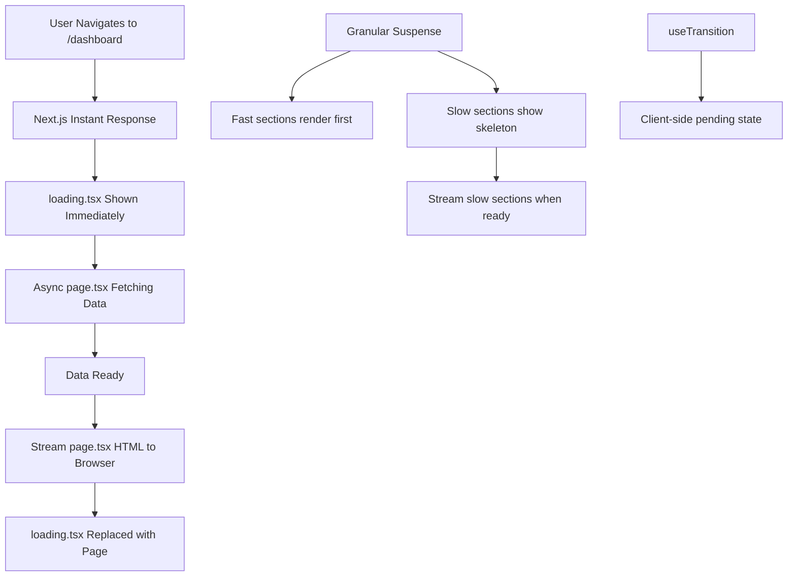

# Day 16 [Beginner]: Loading UI

## Index

- [Goal](#goal)
- [Prerequisites](#prerequisites)
- [Explanation](#explanation)
- [Topic by Topic](#topic-by-topic)
- [Key Concepts](#key-concepts)
- [Visual Concept Map](#visual-concept-map)
- [End-to-End Practical](#end-to-end-practical)
- [Hands-on Coding](#hands-on-coding)
- [Mini Exercise](#mini-exercise)
- [Assessment Quiz](#assessment-quiz)
- [Task](#task)
- [Self Check](#self-check)
- [Interview Questions and Answers](#interview-questions-and-answers)
- [Day 16 Outcome](#day-16-outcome)

## Goal

Implement loading states in Next.js using `loading.tsx`, React Suspense boundaries, and skeleton UI patterns to improve perceived performance.

## Prerequisites

- Completed Day 15: use client Directive
- Understanding of async Server Components and data fetching

## Explanation

When a Server Component fetches data, the response is delayed while the server calls the database or external API. Without loading UI, the browser shows a blank or frozen page during this wait. Next.js solves this elegantly with two tools: the special `loading.tsx` file and React Suspense.

`loading.tsx` is placed in any route segment folder. When the page in that folder is loading (i.e., the async Server Component is fetching data), Next.js automatically shows the `loading.tsx` content as a fallback. Under the hood, this is implemented using a React Suspense boundary wrapping the `page.tsx`.

You can also use Suspense directly with the `<Suspense fallback={...}>` component to create loading states for individual sections of a page. This enables streaming — parts of the page that are ready can be sent to the browser immediately while slower sections show skeletons.

## Topic by Topic

### Topic 1: The loading.tsx File

Theory:
Create `loading.tsx` in any route folder. It renders while the `page.tsx` in the same folder is resolving (waiting for async data). It is shown instantly while the full page loads.

Practical:
Keep `loading.tsx` simple — a spinner or a skeleton that matches the final page layout.

Code Example:

```tsx
// app/dashboard/loading.tsx
export default function DashboardLoading() {
  return (
    <div className="p-6">
      <div className="h-8 bg-gray-200 rounded w-48 mb-6 animate-pulse" />
      <div className="grid grid-cols-3 gap-4">
        {[1, 2, 3].map((i) => (
          <div key={i} className="h-32 bg-gray-200 rounded-xl animate-pulse" />
        ))}
      </div>
    </div>
  );
}
```
**Explanation:**
This topic explains The loading.tsx File in practical Next.js terms so you can build correct routing, rendering, and data flow patterns in real applications.

**Key Points:**
- Understand the core concept behind The loading.tsx File.
- Apply it with the right Next.js feature and defaults.
- Watch for common mistakes that affect performance, SEO, or maintainability.


### Topic 2: Suspense for Granular Loading

Theory:
Wrap specific async components in `<Suspense fallback={...}>` to show loading states for sections while the rest of the page renders. This is more granular than `loading.tsx`.

Practical:
Show the page header instantly and only show a skeleton for the slower data-fetching section.

Code Example:

```tsx
// app/products/page.tsx
import { Suspense } from "react";
import ProductGrid from "@/components/ProductGrid";
import ProductGridSkeleton from "@/components/ProductGridSkeleton";

export default function ProductsPage() {
  return (
    <div className="p-6">
      <h1 className="text-2xl font-bold mb-6">Products</h1>
      {/* Header renders immediately, products load with a skeleton */}
      <Suspense fallback={<ProductGridSkeleton />}>
        <ProductGrid />
      </Suspense>
    </div>
  );
}
```
**Explanation:**
This topic explains Suspense for Granular Loading in practical Next.js terms so you can build correct routing, rendering, and data flow patterns in real applications.

**Key Points:**
- Understand the core concept behind Suspense for Granular Loading.
- Apply it with the right Next.js feature and defaults.
- Watch for common mistakes that affect performance, SEO, or maintainability.


### Topic 3: Skeleton Components

Theory:
A skeleton is a low-fidelity placeholder that mimics the shape of the real content. It is shown while data loads. Use `animate-pulse` in Tailwind or a CSS animation.

Practical:
Create skeletons that match the exact layout of the loaded content to avoid jarring layout shifts.

Code Example:

```tsx
// components/ProductGridSkeleton.tsx
export default function ProductGridSkeleton() {
  return (
    <div className="grid grid-cols-1 sm:grid-cols-2 lg:grid-cols-3 gap-6">
      {Array.from({ length: 6 }).map((_, i) => (
        <div key={i} className="bg-white rounded-xl overflow-hidden shadow-sm">
          <div className="aspect-video bg-gray-200 animate-pulse" />
          <div className="p-4 space-y-2">
            <div className="h-5 bg-gray-200 rounded animate-pulse w-3/4" />
            <div className="h-4 bg-gray-200 rounded animate-pulse w-1/2" />
          </div>
        </div>
      ))}
    </div>
  );
}
```
**Explanation:**
This topic explains Skeleton Components in practical Next.js terms so you can build correct routing, rendering, and data flow patterns in real applications.

**Key Points:**
- Understand the core concept behind Skeleton Components.
- Apply it with the right Next.js feature and defaults.
- Watch for common mistakes that affect performance, SEO, or maintainability.


### Topic 4: Streaming with Suspense

Theory:
When you use Suspense in a Server Component page, Next.js streams HTML to the browser. The non-suspended parts arrive first; suspended parts stream in later when ready. The browser can start displaying content before all data has loaded.

Practical:
Break a page into fast (header, navigation) and slow (data from API) parts and wrap only the slow parts in Suspense.

Code Example:

```tsx
// app/dashboard/page.tsx
import { Suspense } from "react";
import Stats from "@/components/Stats";
import RecentActivity from "@/components/RecentActivity";
import StatsSkeleton from "@/components/StatsSkeleton";
import ActivitySkeleton from "@/components/ActivitySkeleton";

export default function DashboardPage() {
  return (
    <div className="p-6">
      <h1 className="text-2xl font-bold mb-6">Dashboard</h1>
      {/* Each section loads independently */}
      <Suspense fallback={<StatsSkeleton />}>
        <Stats />
      </Suspense>
      <div className="mt-6">
        <Suspense fallback={<ActivitySkeleton />}>
          <RecentActivity />
        </Suspense>
      </div>
    </div>
  );
}
```
**Explanation:**
This topic explains Streaming with Suspense in practical Next.js terms so you can build correct routing, rendering, and data flow patterns in real applications.

**Key Points:**
- Understand the core concept behind Streaming with Suspense.
- Apply it with the right Next.js feature and defaults.
- Watch for common mistakes that affect performance, SEO, or maintainability.


### Topic 5: Async Component That Triggers Suspense

Theory:
Any async Server Component automatically integrates with Suspense. When it's awaiting data, it suspends — which activates the nearest Suspense fallback.

Practical:
You don't need to manually trigger Suspense — just `await` data in your Server Component.

Code Example:

```tsx
// components/Stats.tsx — Async Server Component
async function fetchStats() {
  await new Promise((r) => setTimeout(r, 1500)); // Simulate slow DB query
  return { users: 1204, revenue: 48000, orders: 320 };
}

export default async function Stats() {
  const stats = await fetchStats();
  return (
    <div className="grid grid-cols-3 gap-4">
      {Object.entries(stats).map(([key, value]) => (
        <div key={key} className="bg-white p-6 rounded-xl shadow-sm border">
          <p className="text-sm text-gray-500 capitalize">{key}</p>
          <p className="text-2xl font-bold mt-1">
            {typeof value === "number" && key === "revenue"
              ? `$${value.toLocaleString()}`
              : value.toLocaleString()}
          </p>
        </div>
      ))}
    </div>
  );
}
```
**Explanation:**
This topic explains Async Component That Triggers Suspense in practical Next.js terms so you can build correct routing, rendering, and data flow patterns in real applications.

**Key Points:**
- Understand the core concept behind Async Component That Triggers Suspense.
- Apply it with the right Next.js feature and defaults.
- Watch for common mistakes that affect performance, SEO, or maintainability.


### Topic 6: Loading UI for Nested Routes

Theory:
`loading.tsx` at different levels in the folder hierarchy each create their own Suspense boundary. A parent layout loading state and a child page loading state work independently.

Practical:
Show a section-level loading state (sidebar stays) while only the main content loads.

Code Example:

```
app/
  dashboard/
    layout.tsx         ← Sidebar layout (always visible)
    loading.tsx        ← Dashboard section loading (appears while dashboard page loads)
    page.tsx           ← Dashboard content (async data fetching)
    analytics/
      loading.tsx      ← Analytics-specific loading state
      page.tsx
```
**Explanation:**
This topic explains Loading UI for Nested Routes in practical Next.js terms so you can build correct routing, rendering, and data flow patterns in real applications.

**Key Points:**
- Understand the core concept behind Loading UI for Nested Routes.
- Apply it with the right Next.js feature and defaults.
- Watch for common mistakes that affect performance, SEO, or maintainability.


### Topic 7: useTransition for Client-side Loading

Theory:
For client-side navigations, `useTransition` from React defers state updates and lets you show a loading indicator without blocking the UI. Use it for client-side actions that take time.

Practical:
Show a subtle loading indicator in a form submit button during a server action.

Code Example:

```tsx
"use client";
import { useTransition } from "react";

export default function SubmitButton({
  onSubmit,
}: {
  onSubmit: () => Promise<void>;
}) {
  const [isPending, startTransition] = useTransition();

  return (
    <button
      onClick={() => startTransition(async () => await onSubmit())}
      disabled={isPending}
      className={`px-6 py-2 rounded-lg font-medium transition-all ${
        isPending
          ? "bg-gray-300 cursor-not-allowed"
          : "bg-blue-600 hover:bg-blue-700 text-white"
      }`}
    >
      {isPending ? "Submitting..." : "Submit"}
    </button>
  );
}
```
**Explanation:**
This topic explains useTransition for Client-side Loading in practical Next.js terms so you can build correct routing, rendering, and data flow patterns in real applications.

**Key Points:**
- Understand the core concept behind useTransition for Client-side Loading.
- Apply it with the right Next.js feature and defaults.
- Watch for common mistakes that affect performance, SEO, or maintainability.


### Topic 8: Top Progress Bar (NProgress Pattern)

Theory:
For page-level navigation loading, many apps show a thin progress bar at the top of the page. Implement this using a Client Component that listens to navigation events.

Practical:
Use a library like `nextjs-toploader` or implement a custom one with `usePathname`.

Code Example:

```tsx
// Install: npm install nextjs-toploader
// app/layout.tsx
import NextTopLoader from "nextjs-toploader";

export default function RootLayout({
  children,
}: {
  children: React.ReactNode;
}) {
  return (
    <html lang="en">
      <body>
        <NextTopLoader color="#0070f3" height={3} showSpinner={false} />
        {children}
      </body>
    </html>
  );
}
```
**Explanation:**
This topic explains Top Progress Bar (NProgress Pattern) in practical Next.js terms so you can build correct routing, rendering, and data flow patterns in real applications.

**Key Points:**
- Understand the core concept behind Top Progress Bar (NProgress Pattern).
- Apply it with the right Next.js feature and defaults.
- Watch for common mistakes that affect performance, SEO, or maintainability.


## Key Concepts

- **loading.tsx**: A special file that renders as a Suspense fallback while the `page.tsx` in the same folder resolves.
- **Suspense**: A React component that shows a `fallback` UI while children are loading (suspended).
- **Skeleton UI**: A placeholder component that mimics the shape of loading content, reducing perceived wait time.
- **Streaming**: Sending HTML incrementally — non-suspended parts arrive first, suspended parts stream in later.
- **Animate-pulse**: A Tailwind utility that adds a pulsing animation to skeleton placeholders.
- **useTransition**: A React hook that marks updates as non-urgent, allowing loading indicators during client-side async operations.
- **Top Progress Bar**: A thin loading bar at the top of the page shown during navigation.
- **Granular Suspense**: Wrapping individual slow sections of a page in `<Suspense>` for independent loading states.

## Visual Concept Map



## End-to-End Practical

1. Add a slow `await` (1500ms) to your dashboard page's data fetch to simulate latency.
2. Create `app/dashboard/loading.tsx` with a skeleton layout.
3. Navigate to `/dashboard` and confirm the skeleton appears during loading.
4. Remove the `loading.tsx` and instead wrap the slow component in `<Suspense>` in the page.
5. Build a multi-section page where each section loads independently via separate Suspense boundaries.
6. Create a reusable `Skeleton` component with configurable width and height.
7. Add `nextjs-toploader` to the root layout.

## Hands-on Coding

### Example 1: Dashboard with Multiple Suspense Sections

```tsx
// app/dashboard/page.tsx
import { Suspense } from "react";

// Simulated slow components
async function Stats() {
  await new Promise((r) => setTimeout(r, 800));
  return (
    <div className="grid grid-cols-3 gap-4 mb-6">
      {["Users: 1,204", "Revenue: $48K", "Orders: 320"].map((s) => (
        <div
          key={s}
          className="bg-white p-6 rounded-xl border shadow-sm text-lg font-semibold"
        >
          {s}
        </div>
      ))}
    </div>
  );
}

async function RecentOrders() {
  await new Promise((r) => setTimeout(r, 1500));
  return (
    <div className="bg-white rounded-xl border shadow-sm p-6">
      <h2 className="font-semibold mb-4">Recent Orders</h2>
      <p>Order #1001 — $120.00</p>
      <p>Order #1002 — $80.00</p>
    </div>
  );
}

function StatsSkeleton() {
  return (
    <div className="grid grid-cols-3 gap-4 mb-6">
      {[1, 2, 3].map((i) => (
        <div key={i} className="h-24 bg-gray-200 rounded-xl animate-pulse" />
      ))}
    </div>
  );
}

function OrdersSkeleton() {
  return (
    <div className="bg-white rounded-xl border shadow-sm p-6">
      <div className="h-5 bg-gray-200 rounded w-32 mb-4 animate-pulse" />
      <div className="h-4 bg-gray-200 rounded w-full mb-2 animate-pulse" />
      <div className="h-4 bg-gray-200 rounded w-3/4 animate-pulse" />
    </div>
  );
}

export default function DashboardPage() {
  return (
    <div className="p-6">
      <h1 className="text-2xl font-bold mb-6">Dashboard</h1>
      <Suspense fallback={<StatsSkeleton />}>
        <Stats />
      </Suspense>
      <Suspense fallback={<OrdersSkeleton />}>
        <RecentOrders />
      </Suspense>
    </div>
  );
}
```

### Example 2: Reusable Skeleton Component

```tsx
// components/Skeleton.tsx
import clsx from "clsx";

type SkeletonProps = {
  className?: string;
  width?: string;
  height?: string;
  rounded?: boolean;
  circle?: boolean;
};

export default function Skeleton({
  className,
  width,
  height,
  rounded = true,
  circle = false,
}: SkeletonProps) {
  return (
    <div
      className={clsx(
        "bg-gray-200 animate-pulse",
        rounded && "rounded",
        circle && "rounded-full",
        className,
      )}
      style={{ width, height }}
      aria-hidden="true"
    />
  );
}

// Usage:
// <Skeleton width="200px" height="20px" />
// <Skeleton circle width="48px" height="48px" />
```

### Example 3: Form with useTransition

```tsx
"use client";
import { useTransition, useState } from "react";

async function saveNote(text: string): Promise<void> {
  await new Promise((r) => setTimeout(r, 1000));
  console.log("Note saved:", text);
}

export default function NoteForm() {
  const [text, setText] = useState("");
  const [saved, setSaved] = useState(false);
  const [isPending, startTransition] = useTransition();

  function handleSubmit(e: React.FormEvent) {
    e.preventDefault();
    startTransition(async () => {
      await saveNote(text);
      setSaved(true);
      setText("");
    });
  }

  return (
    <form onSubmit={handleSubmit} className="flex flex-col gap-4 max-w-md">
      <textarea
        value={text}
        onChange={(e) => setText(e.target.value)}
        placeholder="Write a note..."
        rows={4}
        className="border rounded-lg p-3 resize-none"
      />
      {saved && <p className="text-green-600 text-sm">✓ Note saved!</p>}
      <button
        type="submit"
        disabled={isPending || !text.trim()}
        className="bg-blue-600 text-white px-6 py-2 rounded-lg disabled:bg-gray-300 transition-colors"
      >
        {isPending ? "Saving..." : "Save Note"}
      </button>
    </form>
  );
}
```

## Mini Exercise

Scenario:
Build a blog page with an instant-rendering header and a slow-loading post list. Show a skeleton while posts load.

Steps:

1. Create `app/blog/page.tsx` as a Server Component.
2. Render the header (`<h1>Blog</h1>`) outside any Suspense boundary.
3. Create a slow `PostList` Server Component that `await`s 1500ms before returning posts.
4. Create a `PostListSkeleton` component with 3 grey placeholder rows.
5. Wrap `PostList` in `<Suspense fallback={<PostListSkeleton />}>.
6. Navigate to `/blog` and confirm the header shows instantly, then posts appear.

Expected output:

- "Blog" heading appears immediately on navigation.
- Skeleton rows appear while posts load.
- Posts replace the skeleton after 1.5 seconds.

## Assessment Quiz

### Quiz Questions

1. What is `loading.tsx` and where do you create it?
2. How does Suspense work with async Server Components?
3. What is a skeleton component?
4. What is streaming in the context of Next.js?
5. When would you use `useTransition` over `loading.tsx`?

### Quiz Answers

1. `loading.tsx` is a special file in a route folder. It renders as a Suspense fallback while the `page.tsx` in the same folder is fetching data.
2. When an async Server Component awaits data, it suspends — activating the nearest `<Suspense>` fallback. When the data resolves, the content streams to the browser.
3. A skeleton is a placeholder component that shows the shape of the expected content using grey boxes and pulsing animation while the real data loads.
4. Streaming means HTML is sent to the browser incrementally. Non-suspended sections arrive first. Suspended sections stream to the browser as soon as their data is ready.
5. Use `useTransition` for client-side async operations (form submissions, client-initiated actions). Use `loading.tsx`/Suspense for server-side data fetching delays.

## Task

- Add `loading.tsx` to the dashboard and blog sections of your app.
- Create reusable skeleton components that match the layout of each page's content.
- Use granular Suspense boundaries to make different page sections load independently.
- Add a top progress bar to the root layout.
- Test loading states by adding artificial delays to your server components.

## Self Check

- Can you create a `loading.tsx` file and explain what triggers it?
- Can you use `<Suspense>` for individual section loading?
- Have you built skeleton components that match real content layout?
- Do you understand how streaming works?
- Can you use `useTransition` for client-side pending states?

## Interview Questions and Answers

### Beginner

**Question:** What is the purpose of `loading.tsx` in Next.js?
**Answer:** It provides an instant loading state while the page component is fetching data. Next.js wraps the `page.tsx` in a Suspense boundary automatically and shows `loading.tsx` as the fallback.

**Question:** What is a skeleton UI?
**Answer:** A skeleton UI is a placeholder that shows the approximate layout of content with grey boxes, often with a pulsing animation. It reduces perceived loading time by giving users visual feedback about what's coming.

### Middle

**Question:** How does streaming improve page load performance?
**Answer:** Streaming sends the parts of the page that are ready immediately, without waiting for all data to load. The user sees the page structure and fast content right away; slower sections stream in as their data arrives.

**Question:** What is the difference between `loading.tsx` and a `<Suspense>` boundary inside a page?
**Answer:** `loading.tsx` wraps the entire page component automatically and shows during full page loads. A `<Suspense>` inside a page wraps specific components, allowing different sections to load independently while others are already visible.

### Advanced

**Question:** How does Next.js implement streaming HTML responses?
**Answer:** Next.js uses React's streaming renderer with HTTP chunked transfer encoding. The server sends an initial HTML chunk with the non-suspended content, then sends additional chunks as each suspended boundary resolves. The browser processes chunks incrementally.

**Question:** How would you implement a loading indicator for a client-side navigation using the App Router?
**Answer:** Use `useTransition` for programmatic navigation, or add a top progress bar library that listens to navigation events. You can also show a loading state by reading `isPending` from React Router via the `useRouter` transition state.

## Day 16 Outcome

- You can create loading states using `loading.tsx` and Suspense.
- You can build skeleton components that match page layouts.
- You understand how streaming works in Next.js.
- You can use granular Suspense for section-level loading states.
- You are ready to learn Error Boundaries on Day 17.
