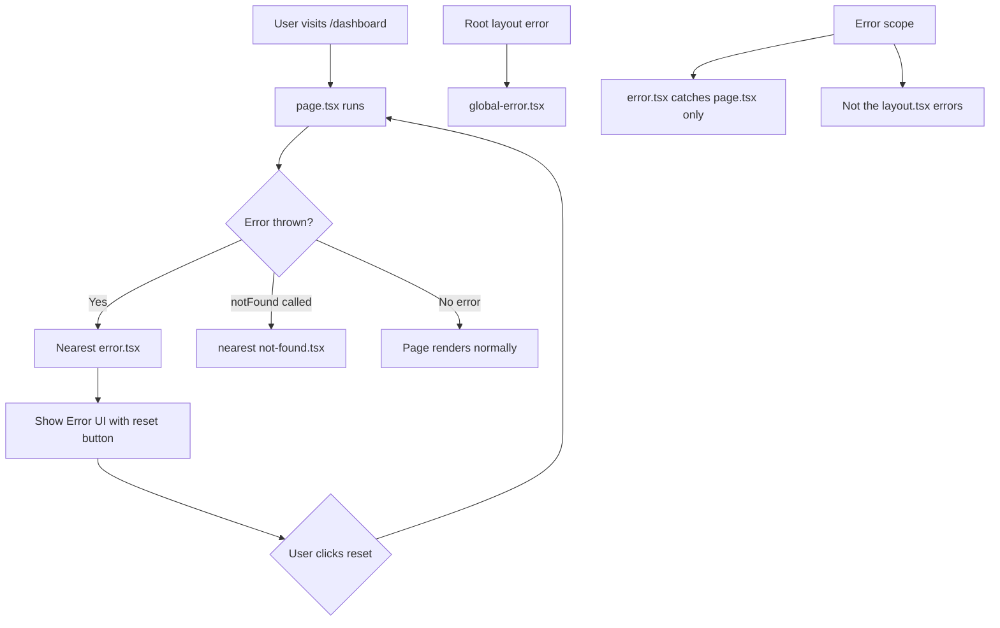

# Day 17 [Beginner]: Error Boundaries

## Index

- [Goal](#goal)
- [Prerequisites](#prerequisites)
- [Explanation](#explanation)
- [Topic by Topic](#topic-by-topic)
- [Key Concepts](#key-concepts)
- [Visual Concept Map](#visual-concept-map)
- [End-to-End Practical](#end-to-end-practical)
- [Hands-on Coding](#hands-on-coding)
- [Mini Exercise](#mini-exercise)
- [Assessment Quiz](#assessment-quiz)
- [Task](#task)
- [Self Check](#self-check)
- [Interview Questions and Answers](#interview-questions-and-answers)
- [Day 17 Outcome](#day-17-outcome)

## Goal

Handle errors gracefully in Next.js using `error.tsx`, global error handling, and understand how error boundaries isolate failures in the App Router.

## Prerequisites

- Completed Day 16: Loading UI
- Understanding of async Server Components and Suspense

## Explanation

In production web apps, errors happen — database connections fail, external APIs go down, and unexpected data causes exceptions. Without error handling, a single failure can crash the entire page and show users an ugly stack trace. Error boundaries are React's mechanism for catching errors in a component subtree and showing a fallback UI instead.

In the Next.js App Router, `error.tsx` is the dedicated file for error boundaries. Place it in any route folder and it catches errors thrown by the `page.tsx` and any components it renders (including async Server Components). It must be a Client Component because it uses React's class component error boundary mechanism under the hood.

The `error.tsx` receives the caught error and a `reset` function. The `reset` function tells Next.js to try re-rendering the errored segment — useful for transient errors like network timeouts. This gives users a way to recover without a full page reload.

## Topic by Topic

### Topic 1: The error.tsx File

Theory:
Create `error.tsx` in any route folder. It catches errors thrown in the `page.tsx` and its child components in that segment. It must have `'use client'`.

Practical:
Always create an `error.tsx` alongside your `loading.tsx` for any route that fetches data.

Code Example:

```tsx
// app/dashboard/error.tsx
"use client";
import { useEffect } from "react";

export default function DashboardError({
  error,
  reset,
}: {
  error: Error & { digest?: string };
  reset: () => void;
}) {
  useEffect(() => {
    // Log error to error tracking service (Sentry, etc.)
    console.error("Dashboard error:", error);
  }, [error]);

  return (
    <div className="p-6 text-center">
      <h2 className="text-xl font-semibold text-red-600 mb-2">
        Something went wrong!
      </h2>
      <p className="text-gray-600 mb-4">{error.message}</p>
      <button
        onClick={reset}
        className="bg-blue-600 text-white px-4 py-2 rounded-lg hover:bg-blue-700"
      >
        Try again
      </button>
    </div>
  );
}
```
**Explanation:**
This topic explains The error.tsx File in practical Next.js terms so you can build correct routing, rendering, and data flow patterns in real applications.

**Key Points:**
- Understand the core concept behind The error.tsx File.
- Apply it with the right Next.js feature and defaults.
- Watch for common mistakes that affect performance, SEO, or maintainability.


### Topic 2: Throwing Errors in Server Components

Theory:
Throw a regular JavaScript `Error` in an async Server Component to trigger the nearest error boundary. Next.js catches it and renders `error.tsx`.

Practical:
Throw errors for unexpected failures (not for expected 404s — use `notFound()` for those).

Code Example:

```tsx
// app/dashboard/page.tsx
async function fetchDashboardData() {
  const res = await fetch("https://api.example.com/dashboard", {
    cache: "no-store",
  });
  if (!res.ok) {
    throw new Error(`API error: ${res.status} ${res.statusText}`);
  }
  return res.json();
}

export default async function DashboardPage() {
  const data = await fetchDashboardData();
  return <div>Dashboard: {data.title}</div>;
}
```
**Explanation:**
This topic explains Throwing Errors in Server Components in practical Next.js terms so you can build correct routing, rendering, and data flow patterns in real applications.

**Key Points:**
- Understand the core concept behind Throwing Errors in Server Components.
- Apply it with the right Next.js feature and defaults.
- Watch for common mistakes that affect performance, SEO, or maintainability.


### Topic 3: The reset Function

Theory:
The `reset` function re-renders the route segment — it tries to render `page.tsx` again. Use it for transient errors that might succeed on retry (network hiccups, rate limits).

Practical:
Show a "Try again" button that calls `reset()` to give users a way to recover.

Code Example:

```tsx
"use client";
import { useState } from "react";

export default function ErrorPage({
  error,
  reset,
}: {
  error: Error;
  reset: () => void;
}) {
  const [retryCount, setRetryCount] = useState(0);

  function handleReset() {
    if (retryCount < 3) {
      setRetryCount((r) => r + 1);
      reset();
    }
  }

  return (
    <div className="flex flex-col items-center justify-center min-h-64 gap-4 text-center p-8">
      <div className="text-5xl">⚠️</div>
      <h2 className="text-xl font-semibold">Failed to load content</h2>
      <p className="text-gray-500 max-w-xs">
        {error.message || "An unexpected error occurred."}
      </p>
      {retryCount < 3 ? (
        <button
          onClick={handleReset}
          className="bg-blue-600 text-white px-6 py-2 rounded-lg hover:bg-blue-700"
        >
          Try again ({3 - retryCount} attempts left)
        </button>
      ) : (
        <p className="text-gray-400 text-sm">
          Please refresh the page or come back later.
        </p>
      )}
    </div>
  );
}
```
**Explanation:**
This topic explains The reset Function in practical Next.js terms so you can build correct routing, rendering, and data flow patterns in real applications.

**Key Points:**
- Understand the core concept behind The reset Function.
- Apply it with the right Next.js feature and defaults.
- Watch for common mistakes that affect performance, SEO, or maintainability.


### Topic 4: Global Error Boundary

Theory:
`app/global-error.tsx` catches errors from the root layout and any component not caught by a nested `error.tsx`. It replaces the entire page including the root layout, so it must include its own `<html>` and `<body>` tags.

Practical:
Create a minimal `global-error.tsx` as a safety net for unexpected catastrophic failures.

Code Example:

```tsx
// app/global-error.tsx
"use client";

export default function GlobalError({
  error,
  reset,
}: {
  error: Error & { digest?: string };
  reset: () => void;
}) {
  return (
    <html>
      <body>
        <div
          style={{
            display: "flex",
            flexDirection: "column",
            alignItems: "center",
            justifyContent: "center",
            minHeight: "100vh",
            fontFamily: "sans-serif",
          }}
        >
          <h1 style={{ color: "#dc2626", fontSize: "2rem" }}>
            Something went very wrong
          </h1>
          <p style={{ color: "#6b7280", marginBottom: "1rem" }}>
            We've been notified and are working on it.
          </p>
          <button
            onClick={reset}
            style={{
              background: "#2563eb",
              color: "white",
              padding: "0.5rem 1.5rem",
              borderRadius: "0.5rem",
              border: "none",
              cursor: "pointer",
            }}
          >
            Try again
          </button>
        </div>
      </body>
    </html>
  );
}
```
**Explanation:**
This topic explains Global Error Boundary in practical Next.js terms so you can build correct routing, rendering, and data flow patterns in real applications.

**Key Points:**
- Understand the core concept behind Global Error Boundary.
- Apply it with the right Next.js feature and defaults.
- Watch for common mistakes that affect performance, SEO, or maintainability.


### Topic 5: Error Boundary Scope

Theory:
`error.tsx` only catches errors in its segment (the folder it's in) and its children. It doesn't catch errors in the layout of the same segment. Use a nested error boundary if you need to protect a layout.

Practical:
Put `error.tsx` in the deepest folder where errors might occur to provide the most specific recovery UI.

Code Example:

```
app/
  layout.tsx          ← NOT protected by dashboard/error.tsx
  global-error.tsx    ← Catches layout errors
  dashboard/
    layout.tsx        ← Sidebar layout
    error.tsx         ← Catches errors in dashboard/page.tsx
    page.tsx          ← Where the error might be thrown
    analytics/
      error.tsx       ← Only catches analytics page errors
      page.tsx
```
**Explanation:**
This topic explains Error Boundary Scope in practical Next.js terms so you can build correct routing, rendering, and data flow patterns in real applications.

**Key Points:**
- Understand the core concept behind Error Boundary Scope.
- Apply it with the right Next.js feature and defaults.
- Watch for common mistakes that affect performance, SEO, or maintainability.


### Topic 6: Using error.digest

Theory:
When an error occurs in production, Next.js attaches a `digest` property — a hash that identifies the error without exposing server details. Use it to look up the error in your logs.

Practical:
Log the `error.digest` in your error tracking service so you can correlate the user-facing message with the full server error in your logs.

Code Example:

```tsx
"use client";
import { useEffect } from "react";

export default function ErrorPage({
  error,
  reset,
}: {
  error: Error & { digest?: string };
  reset: () => void;
}) {
  useEffect(() => {
    // Send to Sentry or similar
    console.error({
      message: error.message,
      digest: error.digest, // Use this to find the full error in server logs
    });
  }, [error]);

  return (
    <div>
      <p>Error Reference: {error.digest ?? "unknown"}</p>
      <button onClick={reset}>Try again</button>
    </div>
  );
}
```
**Explanation:**
This topic explains Using error.digest in practical Next.js terms so you can build correct routing, rendering, and data flow patterns in real applications.

**Key Points:**
- Understand the core concept behind Using error.digest.
- Apply it with the right Next.js feature and defaults.
- Watch for common mistakes that affect performance, SEO, or maintainability.


### Topic 7: Error Boundaries vs notFound()

Theory:
Use `notFound()` when a resource doesn't exist (404 scenario). Use `throw new Error()` when an unexpected failure occurs (500 scenario). These render different UI: `not-found.tsx` vs `error.tsx`.

Practical:
A missing blog post → `notFound()`. A database connection failure → `throw new Error()`.

Code Example:

```tsx
// app/blog/[slug]/page.tsx
import { notFound } from "next/navigation";

export default async function BlogPost({
  params,
}: {
  params: Promise<{ slug: string }>;
}) {
  const { slug } = await params;

  try {
    const post = await fetchPost(slug);
    if (!post) notFound(); // 404: Post doesn't exist → not-found.tsx
    return (
      <article>
        <h1>{post.title}</h1>
      </article>
    );
  } catch (err) {
    // 500: DB failed → error.tsx (rethrow)
    throw new Error(`Failed to load post: ${(err as Error).message}`);
  }
}

async function fetchPost(slug: string) {
  return null;
}
```
**Explanation:**
This topic explains Error Boundaries vs notFound() in practical Next.js terms so you can build correct routing, rendering, and data flow patterns in real applications.

**Key Points:**
- Understand the core concept behind Error Boundaries vs notFound().
- Apply it with the right Next.js feature and defaults.
- Watch for common mistakes that affect performance, SEO, or maintainability.


### Topic 8: Error Recovery Patterns

Theory:
Beyond reset(), consider redirecting to a safe page, showing partial content, or offering a manual refresh. Choose the recovery strategy based on the severity and context of the error.

Practical:
For critical sections, redirect to a dashboard. For optional sections, show a "section unavailable" message.

Code Example:

```tsx
"use client";
import Link from "next/link";

export default function SectionError({ error }: { error: Error }) {
  const isNetworkError = error.message.includes("fetch");

  return (
    <div className="bg-red-50 border border-red-200 rounded-xl p-6 text-center">
      <p className="text-red-700 font-medium mb-3">
        {isNetworkError
          ? "Unable to load data — check your connection."
          : "This section is temporarily unavailable."}
      </p>
      <div className="flex gap-3 justify-center">
        <button
          onClick={() => window.location.reload()}
          className="text-sm text-red-600 underline"
        >
          Refresh page
        </button>
        <Link href="/dashboard" className="text-sm text-blue-600 underline">
          Back to Dashboard
        </Link>
      </div>
    </div>
  );
}
```
**Explanation:**
This topic explains Error Recovery Patterns in practical Next.js terms so you can build correct routing, rendering, and data flow patterns in real applications.

**Key Points:**
- Understand the core concept behind Error Recovery Patterns.
- Apply it with the right Next.js feature and defaults.
- Watch for common mistakes that affect performance, SEO, or maintainability.


## Key Concepts

- **error.tsx**: A Client Component file in a route folder that renders when the `page.tsx` or its children throw an error.
- **Error Boundary**: A React concept of catching rendering errors in a subtree and showing a fallback UI.
- **reset()**: A function passed to `error.tsx` that re-renders the errored route segment.
- **global-error.tsx**: The root-level error boundary at `app/global-error.tsx` that catches errors not handled by nested boundaries.
- **error.digest**: A server-generated hash identifying the error in production, without exposing sensitive server details.
- **notFound() vs throw**: Use `notFound()` for 404 scenarios; throw errors for unexpected failures (500 scenarios).
- **Error Scope**: An `error.tsx` only catches errors in its folder's `page.tsx` and descendants, not in the layout.
- **Transient Error**: A temporary error (network hiccup) that might succeed on retry — ideal for the `reset()` button.

## Visual Concept Map



## End-to-End Practical

1. Add an `error.tsx` to your dashboard route with a friendly error message.
2. Trigger the error by throwing in your data fetch function.
3. Test the `reset()` button — it should retry the data fetch.
4. Create a `global-error.tsx` as a final safety net.
5. Create a blog post page that calls `notFound()` for a missing post and throws an error for a DB failure.
6. Verify that `notFound()` shows `not-found.tsx` and a thrown error shows `error.tsx`.

## Hands-on Coding

### Example 1: Comprehensive Error Page

```tsx
// app/dashboard/error.tsx
"use client";
import { useEffect, useState } from "react";
import Link from "next/link";

export default function DashboardError({
  error,
  reset,
}: {
  error: Error & { digest?: string };
  reset: () => void;
}) {
  const [countdown, setCountdown] = useState(5);

  useEffect(() => {
    console.error("Dashboard error:", {
      message: error.message,
      digest: error.digest,
    });
  }, [error]);

  useEffect(() => {
    if (countdown === 0) reset();
    const timer = setTimeout(
      () => setCountdown((c) => Math.max(0, c - 1)),
      1000,
    );
    return () => clearTimeout(timer);
  }, [countdown, reset]);

  return (
    <div className="flex flex-col items-center justify-center min-h-96 p-8 text-center">
      <div className="bg-red-50 border border-red-100 rounded-2xl p-8 max-w-md">
        <div className="text-4xl mb-4">🔥</div>
        <h2 className="text-xl font-bold text-gray-900 mb-2">
          Dashboard Unavailable
        </h2>
        <p className="text-gray-500 mb-6 text-sm">
          {error.message || "Failed to load dashboard data."}
        </p>
        <div className="flex flex-col gap-3">
          <button
            onClick={reset}
            className="bg-blue-600 text-white px-6 py-2.5 rounded-lg hover:bg-blue-700 font-medium"
          >
            Retry Now (auto in {countdown}s)
          </button>
          <Link href="/" className="text-gray-500 text-sm hover:text-gray-700">
            Go to Home Page
          </Link>
        </div>
        {error.digest && (
          <p className="text-xs text-gray-300 mt-4">Error ID: {error.digest}</p>
        )}
      </div>
    </div>
  );
}
```

### Example 2: Blog Post with Error and 404 Handling

```tsx
// app/blog/[slug]/page.tsx
import { notFound } from "next/navigation";

const posts: Record<string, { title: string; content: string }> = {
  hello: { title: "Hello World", content: "First post." },
};

async function fetchPost(slug: string) {
  await new Promise((r) => setTimeout(r, 500));
  if (slug === "error") throw new Error("Database connection failed");
  return posts[slug] ?? null;
}

type Props = { params: Promise<{ slug: string }> };

export default async function BlogPostPage({ params }: Props) {
  const { slug } = await params;
  const post = await fetchPost(slug);
  if (!post) notFound();
  return (
    <article className="max-w-2xl mx-auto p-6">
      <h1 className="text-3xl font-bold mb-4">{post.title}</h1>
      <p className="text-gray-700">{post.content}</p>
    </article>
  );
}
```

### Example 3: Inline Error Boundary with React

```tsx
"use client";
import { Component, ReactNode } from "react";

type Props = { children: ReactNode; fallback?: ReactNode };
type State = { hasError: boolean; error?: Error };

class InlineErrorBoundary extends Component<Props, State> {
  constructor(props: Props) {
    super(props);
    this.state = { hasError: false };
  }

  static getDerivedStateFromError(error: Error) {
    return { hasError: true, error };
  }

  render() {
    if (this.state.hasError) {
      return (
        this.props.fallback ?? (
          <div className="p-4 bg-red-50 border border-red-200 rounded-lg text-red-700 text-sm">
            Section failed to load.
          </div>
        )
      );
    }
    return this.props.children;
  }
}

export default InlineErrorBoundary;
```

## Mini Exercise

Scenario:
Add error handling to a user profile page that might fail if the user is not found (404) or if the database fails (500).

Steps:

1. Create `app/users/[id]/page.tsx` that fetches a user by ID.
2. Return `notFound()` when user ID `'999'` is requested.
3. Throw an `Error` when user ID `'error'` is requested.
4. Create `app/users/[id]/error.tsx` with a friendly error message and retry button.
5. Create `app/users/[id]/not-found.tsx` with a "User not found" message.
6. Test all three scenarios: valid user, missing user (404), and error (500).

Expected output:

- Valid ID → renders user profile.
- ID `'999'` → shows not-found page.
- ID `'error'` → shows error page with retry button.

## Assessment Quiz

### Quiz Questions

1. What directive must `error.tsx` have?
2. What does the `reset()` function do?
3. What is the difference between `error.tsx` and `global-error.tsx`?
4. What should you use for a missing resource vs an unexpected error?
5. Does `error.tsx` catch errors thrown in `layout.tsx`?

### Quiz Answers

1. `'use client'` — error boundaries must be Client Components.
2. It re-renders the current route segment, effectively retrying the failed operation.
3. `error.tsx` catches errors within its specific route segment. `global-error.tsx` is a fallback for the entire app including the root layout — it replaces the full page.
4. Use `notFound()` (from `next/navigation`) for missing resources → renders `not-found.tsx`. Use `throw new Error()` for unexpected failures → renders `error.tsx`.
5. No — `error.tsx` only catches errors in `page.tsx` and components below it. Errors in `layout.tsx` bubble up to the parent segment's `error.tsx` or to `global-error.tsx`.

## Task

- Add `error.tsx` to each major route segment in your app.
- Create a `global-error.tsx` as the final safety net.
- Differentiate between `notFound()` (missing data) and thrown errors (failures).
- Log errors with `error.digest` for production tracking.
- Test error recovery with the `reset()` function.

## Self Check

- Can you create an `error.tsx` file that catches page errors?
- Do you know why `error.tsx` must be a Client Component?
- Can you explain when to use `notFound()` vs throwing an error?
- Do you understand the scope of `error.tsx` vs `global-error.tsx`?
- Have you tested the `reset()` function to recover from errors?

## Interview Questions and Answers

### Beginner

**Question:** How do you show a friendly error page in Next.js when a server component fails?
**Answer:** Create an `error.tsx` file in the same route folder. It must have `'use client'` and receives `error` and `reset` props. When the page throws, this component renders instead.

**Question:** What is the `error.digest` property?
**Answer:** It's a server-generated hash that uniquely identifies the error without exposing server-side details. Use it to correlate the user-facing error with full details in your server logs.

### Middle

**Question:** Why doesn't `error.tsx` catch errors in the layout?
**Answer:** Error boundaries catch errors in their children. The layout wraps `error.tsx` (which wraps `page.tsx`), so the layout is outside the error boundary. Errors in the layout bubble up to the parent segment's error boundary or `global-error.tsx`.

**Question:** What's the best strategy for retrying a failed network request in an error boundary?
**Answer:** Use the `reset()` function — it re-renders the page component. For better UX, count retries (`useState`) and stop offering retry after a few attempts. Consider implementing exponential backoff for automatic retries.

### Advanced

**Question:** How would you integrate error tracking (e.g., Sentry) with Next.js error boundaries?
**Answer:** In `error.tsx`, use `useEffect` to call Sentry's `captureException(error)` whenever the error prop changes. Include `error.digest` as context. For Next.js, Sentry also offers a `sentry.server.config.ts` and automatic edge function tracing.

**Question:** Can you have multiple error boundaries on the same page?
**Answer:** Yes — use React's `<ErrorBoundary>` component directly in JSX to create inline error boundaries for specific sections. This allows granular error recovery: if one widget fails, the rest of the page still renders.

## Day 17 Outcome

- You can create route-level error boundaries using `error.tsx`.
- You know how to use the `reset()` function for error recovery.
- You understand the scope of `error.tsx` vs `global-error.tsx`.
- You can distinguish between 404 (`notFound()`) and 500 (throw) scenarios.
- You are ready to build the Not Found page on Day 18.
