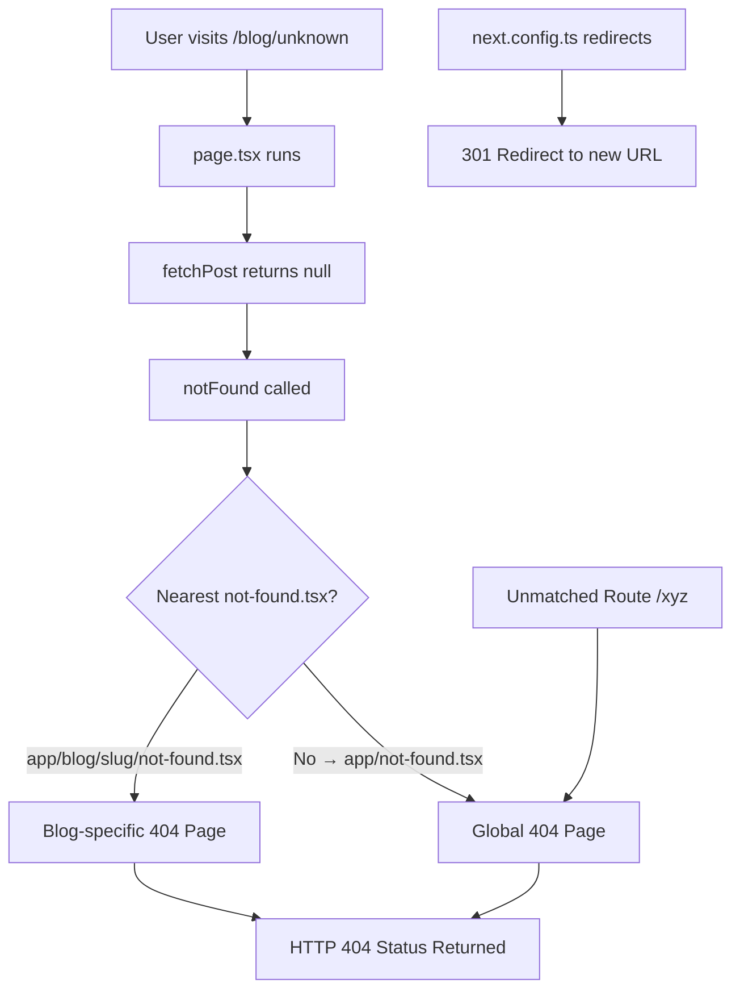

# Day 18 [Beginner]: Not Found Page

## Index

- [Goal](#goal)
- [Prerequisites](#prerequisites)
- [Explanation](#explanation)
- [Topic by Topic](#topic-by-topic)
- [Key Concepts](#key-concepts)
- [Visual Concept Map](#visual-concept-map)
- [End-to-End Practical](#end-to-end-practical)
- [Hands-on Coding](#hands-on-coding)
- [Mini Exercise](#mini-exercise)
- [Assessment Quiz](#assessment-quiz)
- [Task](#task)
- [Self Check](#self-check)
- [Interview Questions and Answers](#interview-questions-and-answers)
- [Day 18 Outcome](#day-18-outcome)

## Goal

Create custom 404 not found pages at the global and route-segment level, and programmatically trigger them using the `notFound()` function.

## Prerequisites

- Completed Day 17: Error Boundaries
- Understanding of route segments and the `notFound()` function

## Explanation

When a user visits a URL that doesn't exist in your app, or when you explicitly call `notFound()` from a Server Component, Next.js renders the not-found page. Without customisation, this is Next.js's built-in "404" text — not very polished.

Creating `app/not-found.tsx` gives you a fully custom 404 page with your site's design. You can add a search bar, helpful links, a friendly illustration, or whatever helps users find what they are looking for. The `not-found.tsx` file is a Server Component by default, so it can also fetch data — for example, to show popular articles or recent content.

There are two levels: `app/not-found.tsx` is the global fallback (shown when any route isn't found). You can also create `not-found.tsx` inside specific route folders to show context-aware 404 pages — a specific "Blog post not found" message when a blog slug doesn't exist.

## Topic by Topic

### Topic 1: Global not-found.tsx

Theory:
`app/not-found.tsx` renders whenever a page is not found globally. It is returned for both unmatched routes and programmatic `notFound()` calls.

Practical:
Design a helpful 404 page that guides users back to useful content.

Code Example:

```tsx
// app/not-found.tsx
import Link from "next/link";

export default function NotFound() {
  return (
    <main className="flex flex-col items-center justify-center min-h-screen text-center px-4">
      <h1 className="text-8xl font-bold text-gray-200">404</h1>
      <h2 className="text-2xl font-semibold text-gray-800 mt-4">
        Page Not Found
      </h2>
      <p className="text-gray-500 mt-2 max-w-md">
        The page you're looking for doesn't exist or has been moved.
      </p>
      <div className="flex gap-4 mt-8">
        <Link
          href="/"
          className="bg-blue-600 text-white px-6 py-2.5 rounded-lg hover:bg-blue-700 font-medium"
        >
          Go Home
        </Link>
        <Link
          href="/blog"
          className="border border-gray-300 text-gray-700 px-6 py-2.5 rounded-lg hover:bg-gray-50"
        >
          Read Blog
        </Link>
      </div>
    </main>
  );
}
```
**Explanation:**
This topic explains Global not-found.tsx in practical Next.js terms so you can build correct routing, rendering, and data flow patterns in real applications.

**Key Points:**
- Understand the core concept behind Global not-found.tsx.
- Apply it with the right Next.js feature and defaults.
- Watch for common mistakes that affect performance, SEO, or maintainability.


### Topic 2: Calling notFound() Programmatically

Theory:
Import and call `notFound()` from `next/navigation` inside a Server Component or Route Handler to immediately trigger the 404 page.

Practical:
Call `notFound()` when a database lookup returns null — when the resource doesn't exist.

Code Example:

```tsx
// app/blog/[slug]/page.tsx
import { notFound } from "next/navigation";

const posts = [
  { slug: "hello", title: "Hello World" },
  { slug: "nextjs", title: "Intro to Next.js" },
];

type Props = { params: Promise<{ slug: string }> };

export default async function BlogPost({ params }: Props) {
  const { slug } = await params;
  const post = posts.find((p) => p.slug === slug);

  if (!post) {
    notFound(); // Renders app/blog/[slug]/not-found.tsx or app/not-found.tsx
  }

  return <h1>{post.title}</h1>;
}
```
**Explanation:**
This topic explains Calling notFound() Programmatically in practical Next.js terms so you can build correct routing, rendering, and data flow patterns in real applications.

**Key Points:**
- Understand the core concept behind Calling notFound() Programmatically.
- Apply it with the right Next.js feature and defaults.
- Watch for common mistakes that affect performance, SEO, or maintainability.


### Topic 3: Segment-specific not-found.tsx

Theory:
Create `not-found.tsx` inside a specific route folder to show a context-specific 404 message for that section.

Practical:
`app/blog/[slug]/not-found.tsx` shows "Post not found" instead of the generic global 404.

Code Example:

```tsx
// app/blog/[slug]/not-found.tsx
import Link from "next/link";

export default function BlogPostNotFound() {
  return (
    <div className="max-w-2xl mx-auto py-16 px-4 text-center">
      <div className="text-6xl mb-4">📝</div>
      <h2 className="text-2xl font-bold text-gray-900 mb-2">Post Not Found</h2>
      <p className="text-gray-500 mb-6">
        The blog post you're looking for doesn't exist or has been removed.
      </p>
      <Link
        href="/blog"
        className="bg-blue-600 text-white px-6 py-2 rounded-lg hover:bg-blue-700"
      >
        Browse All Posts
      </Link>
    </div>
  );
}
```
**Explanation:**
This topic explains Segment-specific not-found.tsx in practical Next.js terms so you can build correct routing, rendering, and data flow patterns in real applications.

**Key Points:**
- Understand the core concept behind Segment-specific not-found.tsx.
- Apply it with the right Next.js feature and defaults.
- Watch for common mistakes that affect performance, SEO, or maintainability.


### Topic 4: Metadata for Not Found Pages

Theory:
Export a `metadata` object from `not-found.tsx` to set the title and description for the 404 page. This helps search engines understand the page is a 404 (though it should also return HTTP 404 status, which Next.js does automatically).

Practical:
Set a clear title like `"Page Not Found | MyApp"` for the 404 page.

Code Example:

```tsx
// app/not-found.tsx
import type { Metadata } from "next";
import Link from "next/link";

export const metadata: Metadata = {
  title: "Page Not Found",
  description: "The requested page could not be found.",
};

export default function NotFound() {
  return (
    <main className="flex flex-col items-center justify-center min-h-screen">
      <h1>404 — Not Found</h1>
      <Link href="/">Go Home</Link>
    </main>
  );
}
```
**Explanation:**
This topic explains Metadata for Not Found Pages in practical Next.js terms so you can build correct routing, rendering, and data flow patterns in real applications.

**Key Points:**
- Understand the core concept behind Metadata for Not Found Pages.
- Apply it with the right Next.js feature and defaults.
- Watch for common mistakes that affect performance, SEO, or maintainability.


### Topic 5: Fetching Suggestions in Not Found Page

Theory:
`not-found.tsx` is a Server Component by default, so it can fetch data. Show search suggestions, popular content, or recommended links based on the URL that wasn't found.

Practical:
Show 3 recent blog posts as suggestions on the 404 page.

Code Example:

```tsx
// app/not-found.tsx
import Link from "next/link";

async function getRecentPosts() {
  return [
    { slug: "nextjs-routing", title: "Next.js Routing Guide" },
    { slug: "typescript-tips", title: "TypeScript Tips" },
    { slug: "react-patterns", title: "React Patterns" },
  ];
}

export default async function NotFound() {
  const posts = await getRecentPosts();
  return (
    <main className="max-w-2xl mx-auto py-16 px-4">
      <h1 className="text-5xl font-bold text-gray-200 text-center">404</h1>
      <p className="text-center text-gray-500 mt-4 mb-10">
        Page not found. Maybe these can help?
      </p>
      <h2 className="text-lg font-semibold mb-4">Recent Posts</h2>
      <ul className="space-y-2">
        {posts.map((p) => (
          <li key={p.slug}>
            <Link
              href={`/blog/${p.slug}`}
              className="text-blue-600 hover:underline"
            >
              {p.title}
            </Link>
          </li>
        ))}
      </ul>
      <div className="text-center mt-8">
        <Link href="/" className="text-gray-500 hover:text-gray-700">
          ← Back to Home
        </Link>
      </div>
    </main>
  );
}
```
**Explanation:**
This topic explains Fetching Suggestions in Not Found Page in practical Next.js terms so you can build correct routing, rendering, and data flow patterns in real applications.

**Key Points:**
- Understand the core concept behind Fetching Suggestions in Not Found Page.
- Apply it with the right Next.js feature and defaults.
- Watch for common mistakes that affect performance, SEO, or maintainability.


### Topic 6: not-found in Route Handlers

Theory:
In Route Handlers, return a 404 response manually using `NextResponse.json({ error: 'Not Found' }, { status: 404 })`. The `notFound()` function works in Server Components and pages, not Route Handlers.

Practical:
Return consistent 404 JSON responses from API endpoints.

Code Example:

```tsx
// app/api/posts/[id]/route.ts
import { NextRequest, NextResponse } from "next/server";

const posts = [{ id: 1, title: "Post 1" }];

export async function GET(
  _req: NextRequest,
  { params }: { params: Promise<{ id: string }> },
) {
  const { id } = await params;
  const post = posts.find((p) => p.id === Number(id));

  if (!post) {
    return NextResponse.json({ error: "Post not found", id }, { status: 404 });
  }

  return NextResponse.json(post);
}
```
**Explanation:**
This topic explains not-found in Route Handlers in practical Next.js terms so you can build correct routing, rendering, and data flow patterns in real applications.

**Key Points:**
- Understand the core concept behind not-found in Route Handlers.
- Apply it with the right Next.js feature and defaults.
- Watch for common mistakes that affect performance, SEO, or maintainability.


### Topic 7: Custom 404 with Animation

Theory:
Enhance the 404 page with animations or interactive elements. Since `not-found.tsx` is a Server Component, interactive elements must be extracted into Client Component children.

Practical:
Add a simple SVG illustration or animation to make the 404 page memorable and on-brand.

Code Example:

```tsx
// app/not-found.tsx
import Link from "next/link";
import AnimatedNumber from "@/components/AnimatedNumber";

export default function NotFound() {
  return (
    <main className="flex flex-col items-center justify-center min-h-screen bg-gradient-to-b from-blue-50 to-white px-4">
      <div className="text-center max-w-lg">
        <AnimatedNumber target={404} />
        <h2 className="text-2xl font-bold text-gray-800 mt-6 mb-3">
          Oops! Lost in Space
        </h2>
        <p className="text-gray-500 mb-8">
          The page you're looking for has drifted off into the void.
        </p>
        <Link
          href="/"
          className="inline-flex items-center gap-2 bg-blue-600 text-white px-8 py-3 rounded-xl hover:bg-blue-700 font-semibold transition-colors"
        >
          Return to Earth
        </Link>
      </div>
    </main>
  );
}
```
**Explanation:**
This topic explains Custom 404 with Animation in practical Next.js terms so you can build correct routing, rendering, and data flow patterns in real applications.

**Key Points:**
- Understand the core concept behind Custom 404 with Animation.
- Apply it with the right Next.js feature and defaults.
- Watch for common mistakes that affect performance, SEO, or maintainability.


### Topic 8: Redirecting Old URLs

Theory:
For URLs that have moved (changed slug, restructured), use redirects in `next.config.ts` instead of letting them 404. This preserves SEO and user experience.

Practical:
Set up permanent (301) redirects for old blog post URLs.

Code Example:

```tsx
// next.config.ts
const nextConfig = {
  async redirects() {
    return [
      {
        source: "/old-blog/:slug",
        destination: "/blog/:slug",
        permanent: true, // 301 redirect
      },
      {
        source: "/about-us",
        destination: "/about",
        permanent: true,
      },
    ];
  },
};
export default nextConfig;
```
**Explanation:**
This topic explains Redirecting Old URLs in practical Next.js terms so you can build correct routing, rendering, and data flow patterns in real applications.

**Key Points:**
- Understand the core concept behind Redirecting Old URLs.
- Apply it with the right Next.js feature and defaults.
- Watch for common mistakes that affect performance, SEO, or maintainability.


## Key Concepts

- **not-found.tsx**: A special file that renders when `notFound()` is called or a route doesn't match.
- **notFound()**: A function from `next/navigation` that throws a 404 response in Server Components.
- **Global 404**: `app/not-found.tsx` — the catch-all not found page for the entire application.
- **Segment 404**: `not-found.tsx` in a route folder — context-specific not found UI for that section.
- **HTTP 404 Status**: Next.js automatically returns a 404 HTTP status code when `notFound()` is called.
- **Server Component 404**: `not-found.tsx` is a Server Component by default — it can fetch data.
- **Redirects**: Configured in `next.config.ts` to redirect moved URLs instead of returning 404.
- **404 Suggestions**: Showing related content on the 404 page to help users find what they're looking for.

## Visual Concept Map



## End-to-End Practical

1. Create `app/not-found.tsx` with a styled 404 page and links to Home and Blog.
2. Add `metadata` export to the not-found page.
3. Create `app/blog/[slug]/not-found.tsx` with a blog-specific message.
4. Update `app/blog/[slug]/page.tsx` to call `notFound()` for missing posts.
5. Set up a redirect in `next.config.ts` for an old URL pattern.
6. Test by visiting an unmatched route, a valid blog post, and a missing blog post.

## Hands-on Coding

### Example 1: Polished Global 404 Page

```tsx
// app/not-found.tsx
import type { Metadata } from "next";
import Link from "next/link";

export const metadata: Metadata = {
  title: "Page Not Found",
  description: "Sorry, this page does not exist.",
};

const suggestions = [
  { href: "/", label: "Home", icon: "🏠" },
  { href: "/blog", label: "Blog", icon: "📝" },
  { href: "/about", label: "About", icon: "👋" },
  { href: "/contact", label: "Contact", icon: "✉️" },
];

export default function NotFoundPage() {
  return (
    <main className="min-h-screen bg-gray-50 flex flex-col items-center justify-center px-4">
      <div className="text-center">
        <p className="text-8xl font-black text-blue-100 select-none leading-none">
          404
        </p>
        <h1 className="text-3xl font-bold text-gray-900 mt-4 mb-2">
          Page Not Found
        </h1>
        <p className="text-gray-500 max-w-sm mx-auto mb-10">
          We can't find the page you're looking for. Try one of these instead:
        </p>
        <div className="grid grid-cols-2 gap-3 max-w-xs mx-auto mb-8">
          {suggestions.map((s) => (
            <Link
              key={s.href}
              href={s.href}
              className="flex items-center gap-2 bg-white border border-gray-200 rounded-xl px-4 py-3 text-sm font-medium text-gray-700 hover:border-blue-300 hover:text-blue-600 transition-colors"
            >
              <span>{s.icon}</span>
              {s.label}
            </Link>
          ))}
        </div>
        <Link href="/" className="text-sm text-gray-400 hover:text-gray-600">
          ← Back to Home
        </Link>
      </div>
    </main>
  );
}
```

### Example 2: Segment-specific Product Not Found

```tsx
// app/shop/[productId]/not-found.tsx
import Link from "next/link";

export default function ProductNotFound() {
  return (
    <div className="max-w-xl mx-auto py-20 px-4 text-center">
      <div className="text-5xl mb-6">🛒</div>
      <h1 className="text-2xl font-bold text-gray-900 mb-3">
        Product Not Found
      </h1>
      <p className="text-gray-500 mb-8">
        This product may have been discontinued or the link may be incorrect.
      </p>
      <div className="flex flex-col sm:flex-row gap-3 justify-center">
        <Link
          href="/shop"
          className="bg-blue-600 text-white px-6 py-2.5 rounded-lg hover:bg-blue-700 font-medium"
        >
          Browse All Products
        </Link>
        <Link
          href="/shop?sale=true"
          className="border border-gray-300 px-6 py-2.5 rounded-lg hover:bg-gray-50"
        >
          View Sale Items
        </Link>
      </div>
    </div>
  );
}
```

### Example 3: 404 with Search Functionality

```tsx
// app/not-found.tsx
"use server"; // This is already a server component by default
import Link from "next/link";
import SearchForm from "@/components/SearchForm";

async function getPopularPosts() {
  return [
    { slug: "nextjs-tutorial", title: "Complete Next.js Tutorial" },
    { slug: "react-hooks", title: "React Hooks Explained" },
    { slug: "typescript-guide", title: "TypeScript for Beginners" },
  ];
}

export default async function NotFound() {
  const popular = await getPopularPosts();
  return (
    <main className="max-w-2xl mx-auto py-16 px-4">
      <h1 className="text-6xl font-black text-gray-100 text-center">404</h1>
      <h2 className="text-2xl font-bold text-center mt-4 mb-2">Not Found</h2>
      <p className="text-gray-500 text-center mb-8">
        Try searching for what you need:
      </p>
      <SearchForm />
      <div className="mt-10">
        <h3 className="font-semibold text-gray-700 mb-3">Popular Articles</h3>
        <ul className="space-y-2">
          {popular.map((p) => (
            <li key={p.slug}>
              <Link
                href={`/blog/${p.slug}`}
                className="text-blue-600 hover:underline"
              >
                {p.title}
              </Link>
            </li>
          ))}
        </ul>
      </div>
    </main>
  );
}
```

## Mini Exercise

Scenario:
Build a complete 404 experience for a documentation site.

Steps:

1. Create `app/not-found.tsx` with a "Docs page not found" message.
2. Show 3 popular documentation links on the page.
3. Create `app/docs/[...slug]/not-found.tsx` with a specific "Documentation not found" message.
4. Update `app/docs/[...slug]/page.tsx` to call `notFound()` for missing docs.
5. Add a redirect in `next.config.ts` from `/documentation` to `/docs`.

Expected output:

- Visiting `/xyz` shows the global 404 with popular docs links.
- Visiting `/docs/nonexistent` shows the docs-specific 404.
- Visiting `/documentation` redirects to `/docs`.

## Assessment Quiz

### Quiz Questions

1. What filename creates a custom not found page?
2. How do you programmatically trigger a 404 response?
3. What is the difference between global and segment-level not-found.tsx?
4. Can not-found.tsx fetch data?
5. How do you handle moved URLs to prevent 404s?

### Quiz Answers

1. `not-found.tsx` — placed in `app/` for global or in a specific route folder for segment-level.
2. Call `notFound()` imported from `next/navigation` in a Server Component or page.
3. Global (`app/not-found.tsx`) handles all unmatched routes. Segment-level (e.g. `app/blog/[slug]/not-found.tsx`) shows contextual 404 UI only for that route section.
4. Yes — `not-found.tsx` is a Server Component by default and can use `async/await` to fetch suggestions or related content.
5. Configure redirects in `next.config.ts` using the `async redirects()` function to permanently (301) redirect old URLs to their new locations.

## Task

- Create a polished global 404 page with helpful navigation links.
- Add a segment-specific 404 for blog posts and product pages.
- Call `notFound()` for all missing resources in dynamic routes.
- Set up at least two redirects in `next.config.ts` for moved pages.
- Add relevant metadata to the 404 page.

## Self Check

- Can you create both global and segment-level not found pages?
- Do you know when to call `notFound()` vs throwing an error?
- Have you added metadata to your 404 page?
- Can you configure redirects for moved URLs?
- Does your not found page fetch and show helpful suggestions?

## Interview Questions and Answers

### Beginner

**Question:** How do you create a custom 404 page in Next.js App Router?
**Answer:** Create `app/not-found.tsx` with a default exported component. Next.js renders it whenever a route is unmatched or `notFound()` is called.

**Question:** What does calling `notFound()` do?
**Answer:** It throws a special Next.js error that triggers the nearest `not-found.tsx`. It also sets the HTTP response status to 404. After calling it, no more code in the current component runs.

### Middle

**Question:** How would you show a different 404 message for blog posts vs product pages?
**Answer:** Create `app/blog/[slug]/not-found.tsx` and `app/shop/[id]/not-found.tsx` with their own messages. When `notFound()` is called inside those routes, Next.js renders the nearest segment-level not-found file.

**Question:** Should you return 404 from a Route Handler or call `notFound()`?
**Answer:** In Route Handlers, return `NextResponse.json({...}, { status: 404 })`. The `notFound()` function works in Server Components and page functions. Route Handlers handle HTTP directly.

### Advanced

**Question:** How does returning a 404 status code impact SEO?
**Answer:** Search engines de-index pages that return 404 status codes. This is the correct behaviour for truly missing pages. For moved pages, use 301 redirects instead — search engines transfer link equity (PageRank) to the destination URL.

**Question:** How would you implement a smart 404 page that suggests similar content?
**Answer:** In `not-found.tsx` (a Server Component), parse the URL using headers() or a URL-based approach to understand what was sought, then fetch similar content (e.g., fuzzy-search blog post slugs, related product categories) and render suggestions.

## Day 18 Outcome

- You can create global and segment-level custom 404 pages.
- You know how to call `notFound()` for missing resources.
- You can add metadata and data fetching to not-found pages.
- You understand how to configure redirects for moved URLs.
- You are ready to build the Mini Project Static Blog on Day 19.
