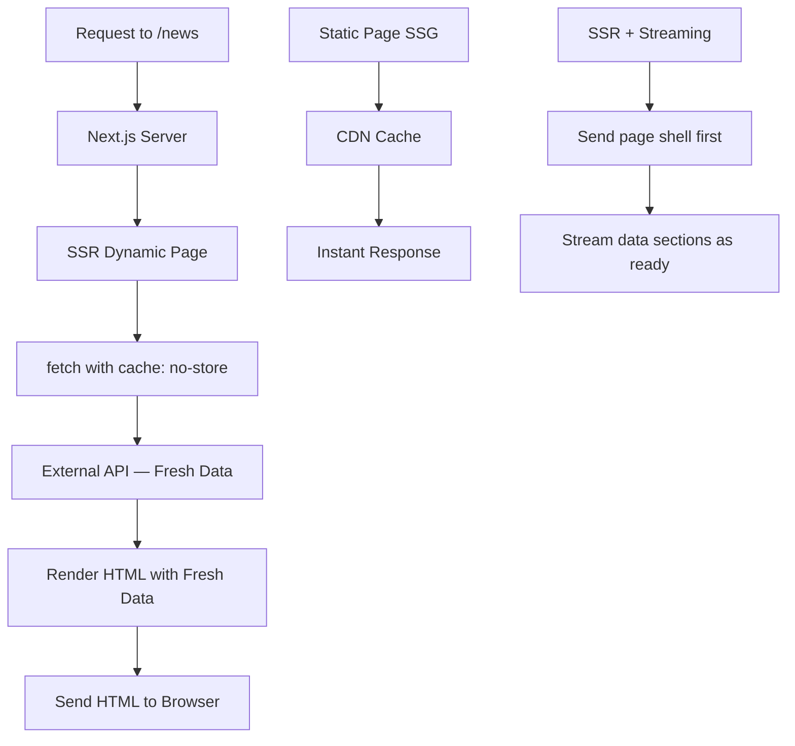

# Day 21 [Intermediate]: SSR with fetch no-store

## Index

- [Goal](#goal)
- [Prerequisites](#prerequisites)
- [Explanation](#explanation)
- [Topic by Topic](#topic-by-topic)
- [Key Concepts](#key-concepts)
- [Visual Concept Map](#visual-concept-map)
- [End-to-End Practical](#end-to-end-practical)
- [Hands-on Coding](#hands-on-coding)
- [Mini Exercise](#mini-exercise)
- [Assessment Quiz](#assessment-quiz)
- [Task](#task)
- [Self Check](#self-check)
- [Interview Questions and Answers](#interview-questions-and-answers)
- [Day 21 Outcome](#day-21-outcome)

## Goal

Implement server-side rendering (SSR) using `fetch` with `cache: 'no-store'` to serve fresh data on every request.

## Prerequisites

- Completed Day 20: Metadata API and SEO Basics
- Understanding of Server Components and async data fetching

## Explanation

Server-Side Rendering (SSR) means generating HTML on the server for every request — the data is fresh each time. In the Next.js App Router, you opt into SSR by using `fetch` with `cache: 'no-store'`. This tells Next.js (and the underlying fetch implementation) to bypass the cache and always fetch fresh data.

This is the right choice when data changes frequently and users need the latest version: news feeds, stock prices, real-time dashboards, personalised content, and shopping carts. Each page request hits the server, which calls the data source (API or DB) and renders fresh HTML.

The trade-off compared to SSG: SSR is slower per request (server work on every hit) but always fresh. This is handled efficiently by CDN edge caching with short TTLs, or by combining SSR at the server with client-side re-fetching for real-time updates.

## Topic by Topic

### Topic 1: cache: 'no-store' Explained

Theory:
Adding `{ cache: 'no-store' }` to a `fetch` call tells Next.js to never cache the response. The data is fetched fresh on every request. This opts the page into dynamic (SSR) rendering.

Practical:
Use `no-store` for any data that changes frequently and must be fresh for every user.

Code Example:

```tsx
// app/news/page.tsx
async function getLatestNews() {
  const res = await fetch("https://api.example.com/news", {
    cache: "no-store", // ← Never use cache; always fresh
  });
  if (!res.ok) throw new Error("Failed to fetch news");
  return res.json();
}

export default async function NewsPage() {
  const articles = await getLatestNews();
  return (
    <div>
      <h1>Latest News</h1>
      <ul>
        {articles.map((a: { id: number; title: string }) => (
          <li key={a.id}>{a.title}</li>
        ))}
      </ul>
    </div>
  );
}
```
**Explanation:**
This topic explains cache: 'no-store' Explained in practical Next.js terms so you can build correct routing, rendering, and data flow patterns in real applications.

**Key Points:**
- Understand the core concept behind cache: 'no-store' Explained.
- Apply it with the right Next.js feature and defaults.
- Watch for common mistakes that affect performance, SEO, or maintainability.


### Topic 2: Dynamic Rendering Opt-in Methods

Theory:
Besides `cache: 'no-store'`, several other things opt a page into dynamic rendering: using `headers()`, `cookies()`, `searchParams`, or accessing request-specific data. Any of these signals to Next.js that the page cannot be statically cached.

Practical:
Be aware of what triggers dynamic rendering so you can make deliberate choices.

Code Example:

```tsx
// These all cause dynamic rendering:
import { headers, cookies } from "next/headers";

// 1. Reading cookies
async function getDynamic1() {
  const cookieStore = await cookies();
  const token = cookieStore.get("auth-token");
  return token;
}

// 2. Reading headers
async function getDynamic2() {
  const headersList = await headers();
  const userAgent = headersList.get("user-agent");
  return userAgent;
}

// 3. fetch with no-store
async function getDynamic3() {
  return fetch("/api/data", { cache: "no-store" });
}

// 4. Explicit declaration
export const dynamic = "force-dynamic";
```
**Explanation:**
This topic explains Dynamic Rendering Opt-in Methods in practical Next.js terms so you can build correct routing, rendering, and data flow patterns in real applications.

**Key Points:**
- Understand the core concept behind Dynamic Rendering Opt-in Methods.
- Apply it with the right Next.js feature and defaults.
- Watch for common mistakes that affect performance, SEO, or maintainability.


### Topic 3: The dynamic Export

Theory:
Export `const dynamic = 'force-dynamic'` from a page to force it into SSR mode regardless of what data fetching strategy you use. This is the nuclear option — use it when you want dynamic behaviour without changing every fetch call.

Practical:
Use `force-dynamic` for pages that use authentication, cookies, or session data.

Code Example:

```tsx
// app/dashboard/page.tsx
export const dynamic = "force-dynamic";

import { cookies } from "next/headers";

export default async function DashboardPage() {
  const cookieStore = await cookies();
  const userId = cookieStore.get("user-id")?.value;

  const userData = await fetch(`https://api.example.com/users/${userId}`, {
    // Even without cache: 'no-store', this page is dynamic due to the export
  });

  return <div>User {userId}</div>;
}
```
**Explanation:**
This topic explains The dynamic Export in practical Next.js terms so you can build correct routing, rendering, and data flow patterns in real applications.

**Key Points:**
- Understand the core concept behind The dynamic Export.
- Apply it with the right Next.js feature and defaults.
- Watch for common mistakes that affect performance, SEO, or maintainability.


### Topic 4: SSR vs SSG Performance Trade-off

Theory:
SSG generates HTML once at build time — serving cached HTML is extremely fast. SSR generates HTML per request — slower but always fresh. Choose based on how often data changes and how much freshness matters.

Practical:
Use a decision framework: if content doesn't change hourly, consider ISR instead of full SSR.

Code Example:

```tsx
// Decision guide:
// Content never changes → SSG (no fetch options / force-static)
// Content changes but slowly (blog posts) → ISR (revalidate = 3600)
// Content changes frequently (news, stock) → SSR (cache: 'no-store')
// Content is user-specific (dashboard, cart) → SSR (dynamic)

// SSG
export async function fetchData1() {
  return fetch("https://api.example.com/data"); // Cached at build time
}

// SSR
export async function fetchData2() {
  return fetch("https://api.example.com/data", { cache: "no-store" }); // Fresh per request
}
```
**Explanation:**
This topic explains SSR vs SSG Performance Trade-off in practical Next.js terms so you can build correct routing, rendering, and data flow patterns in real applications.

**Key Points:**
- Understand the core concept behind SSR vs SSG Performance Trade-off.
- Apply it with the right Next.js feature and defaults.
- Watch for common mistakes that affect performance, SEO, or maintainability.


### Topic 5: Request Memoization

Theory:
In SSR, if the same `fetch` URL is called multiple times during one request (e.g. in a component and its child), Next.js deduplicates them automatically. Only one actual HTTP request is made per unique URL per render.

Practical:
Don't worry about calling the same fetch in multiple components — Next.js handles deduplication.

Code Example:

```tsx
// Both components fetch the same URL
// Next.js only makes ONE actual HTTP request per render cycle

async function ComponentA() {
  const data = await fetch("https://api.example.com/user", {
    cache: "no-store",
  });
  const user = await data.json();
  return <p>Name: {user.name}</p>;
}

async function ComponentB() {
  const data = await fetch("https://api.example.com/user", {
    cache: "no-store",
  });
  const user = await data.json();
  return <p>Email: {user.email}</p>;
}

// In the page — only ONE fetch occurs despite two calls
export default function Page() {
  return (
    <>
      <ComponentA />
      <ComponentB />
    </>
  );
}
```
**Explanation:**
This topic explains Request Memoization in practical Next.js terms so you can build correct routing, rendering, and data flow patterns in real applications.

**Key Points:**
- Understand the core concept behind Request Memoization.
- Apply it with the right Next.js feature and defaults.
- Watch for common mistakes that affect performance, SEO, or maintainability.


### Topic 6: Reading Request Headers in SSR

Theory:
SSR pages can read request headers to personalise content — accept-language for localisation, user-agent for device detection, or custom auth headers.

Practical:
Use `headers()` from `next/headers` to access request headers in Server Components.

Code Example:

```tsx
// app/personalised/page.tsx
import { headers } from "next/headers";

export default async function PersonalisedPage() {
  const headersList = await headers();
  const language = headersList.get("accept-language")?.split(",")[0] ?? "en";
  const isBot = /bot|crawler/i.test(headersList.get("user-agent") ?? "");

  return (
    <div>
      <p>Your preferred language: {language}</p>
      {isBot ? <p>Welcome, crawler!</p> : <p>Welcome, human!</p>}
    </div>
  );
}
```
**Explanation:**
This topic explains Reading Request Headers in SSR in practical Next.js terms so you can build correct routing, rendering, and data flow patterns in real applications.

**Key Points:**
- Understand the core concept behind Reading Request Headers in SSR.
- Apply it with the right Next.js feature and defaults.
- Watch for common mistakes that affect performance, SEO, or maintainability.


### Topic 7: Streaming with SSR

Theory:
SSR can be combined with streaming (Suspense) for a better user experience. Parts of the page that are ready can stream immediately while slower data fetches complete.

Practical:
Wrap slow data fetches in Suspense to start streaming the page shell while data loads.

Code Example:

```tsx
// app/dashboard/page.tsx
import { Suspense } from "react";

async function LiveStats() {
  const stats = await fetch("https://api.example.com/live-stats", {
    cache: "no-store",
  }).then((r) => r.json());
  return <div>Live Stats: {JSON.stringify(stats)}</div>;
}

export default function DashboardPage() {
  return (
    <div>
      <h1>Dashboard</h1> {/* Renders immediately */}
      <Suspense fallback={<p>Loading stats...</p>}>
        <LiveStats /> {/* Streams when ready */}
      </Suspense>
    </div>
  );
}
```
**Explanation:**
This topic explains Streaming with SSR in practical Next.js terms so you can build correct routing, rendering, and data flow patterns in real applications.

**Key Points:**
- Understand the core concept behind Streaming with SSR.
- Apply it with the right Next.js feature and defaults.
- Watch for common mistakes that affect performance, SEO, or maintainability.


### Topic 8: Caching SSR Responses at the CDN Level

Theory:
Even SSR pages can be cached at the CDN level using `Cache-Control` response headers. Setting a short max-age (e.g., 60 seconds) lets the CDN serve cached HTML for 60 seconds before re-fetching from the origin.

Practical:
Use Next.js's response headers configuration for CDN caching of SSR pages.

Code Example:

```tsx
// app/trending/page.tsx — SSR but CDN-cached for 60 seconds
import { headers } from "next/headers";
import { unstable_noStore as noStore } from "next/cache";

export async function generateMetadata() {
  // This makes the page dynamic
  return { title: "Trending" };
}

// Opt into SSR explicitly
export const dynamic = "force-dynamic";

export default async function TrendingPage() {
  const data = await fetch("https://api.example.com/trending", {
    cache: "no-store",
  });
  const items = await data.json();
  return <div>{JSON.stringify(items)}</div>;
}
```
**Explanation:**
This topic explains Caching SSR Responses at the CDN Level in practical Next.js terms so you can build correct routing, rendering, and data flow patterns in real applications.

**Key Points:**
- Understand the core concept behind Caching SSR Responses at the CDN Level.
- Apply it with the right Next.js feature and defaults.
- Watch for common mistakes that affect performance, SEO, or maintainability.


## Key Concepts

- **SSR (Server-Side Rendering)**: HTML is generated on the server for every incoming request, ensuring fresh data.
- **cache: 'no-store'**: A fetch option that bypasses all caching and always fetches fresh data.
- **dynamic export**: `export const dynamic = 'force-dynamic'` forces a page into SSR mode.
- **Request Memoization**: Next.js deduplicates identical fetch calls within a single render pass.
- **Dynamic Rendering Triggers**: `headers()`, `cookies()`, `searchParams`, and `cache: 'no-store'` all trigger dynamic rendering.
- **SSR vs SSG Trade-off**: SSG is faster but static; SSR is slower but always fresh. Choose based on data change frequency.
- **Streaming SSR**: Combining SSR with Suspense to stream parts of the page as they become ready.
- **CDN Caching for SSR**: Setting short-lived CDN cache headers to reduce origin load while still serving reasonably fresh content.

## Visual Concept Map



## End-to-End Practical

1. Create `app/news/page.tsx` that fetches news from a public API with `cache: 'no-store'`.
2. Add `export const dynamic = 'force-dynamic'` to a dashboard page.
3. Use `headers()` to read the `Accept-Language` header and display personalised text.
4. Combine SSR with Suspense: stream the page shell, lazy-load the slow section.
5. Run `npm run build` — SSR pages show `(Dynamic)` in the build output.
6. Compare load times between an SSG page and the SSR page.

## Hands-on Coding

### Example 1: News Feed with SSR

```tsx
// app/news/page.tsx
import type { Metadata } from "next";

export const metadata: Metadata = { title: "Latest News" };

type Article = {
  id: number;
  title: string;
  publishedAt: string;
  source: string;
};

async function fetchNews(): Promise<Article[]> {
  const res = await fetch(
    "https://jsonplaceholder.typicode.com/posts?_limit=10",
    {
      cache: "no-store",
    },
  );
  const posts = await res.json();
  return posts.map((p: { id: number; title: string }) => ({
    id: p.id,
    title: p.title,
    publishedAt: new Date().toISOString(),
    source: "JSONPlaceholder",
  }));
}

export default async function NewsPage() {
  const articles = await fetchNews();
  return (
    <div className="max-w-4xl mx-auto p-6">
      <h1 className="text-3xl font-bold mb-2">Latest News</h1>
      <p className="text-sm text-gray-400 mb-6">
        Fetched at: {new Date().toLocaleTimeString()}
      </p>
      <div className="space-y-4">
        {articles.map((article) => (
          <div
            key={article.id}
            className="bg-white border border-gray-100 rounded-xl p-5 shadow-sm"
          >
            <h2 className="font-semibold text-gray-900 capitalize">
              {article.title}
            </h2>
            <p className="text-xs text-gray-400 mt-1">
              {article.source} · Just now
            </p>
          </div>
        ))}
      </div>
    </div>
  );
}
```

### Example 2: Personalised Page with Headers

```tsx
// app/welcome/page.tsx
import { headers } from "next/headers";

export const dynamic = "force-dynamic";

function getGreeting(lang: string): string {
  const greetings: Record<string, string> = {
    en: "Welcome!",
    fr: "Bienvenue!",
    es: "¡Bienvenido!",
    de: "Willkommen!",
  };
  const code = lang.substring(0, 2).toLowerCase();
  return greetings[code] ?? greetings["en"];
}

export default async function WelcomePage() {
  const headersList = await headers();
  const acceptLanguage = headersList.get("accept-language") ?? "en";
  const primaryLang = acceptLanguage.split(",")[0].trim();
  const greeting = getGreeting(primaryLang);

  return (
    <div className="flex flex-col items-center justify-center min-h-screen text-center">
      <h1 className="text-4xl font-bold mb-4">{greeting}</h1>
      <p className="text-gray-500">Detected language: {primaryLang}</p>
    </div>
  );
}
```

### Example 3: Dashboard with Streamed SSR Sections

```tsx
// app/live-dashboard/page.tsx
import { Suspense } from "react";

async function LiveMetrics() {
  const data = await fetch(
    "https://jsonplaceholder.typicode.com/todos?_limit=5",
    {
      cache: "no-store",
    },
  ).then((r) => r.json());
  return (
    <div className="grid grid-cols-3 gap-4">
      {data.slice(0, 3).map((item: { id: number; title: string }) => (
        <div key={item.id} className="bg-white p-4 rounded-xl border">
          <p className="text-sm font-medium">{item.id}</p>
          <p className="text-xs text-gray-500 truncate">{item.title}</p>
        </div>
      ))}
    </div>
  );
}

function MetricsSkeleton() {
  return (
    <div className="grid grid-cols-3 gap-4">
      {[1, 2, 3].map((i) => (
        <div key={i} className="h-20 bg-gray-200 rounded-xl animate-pulse" />
      ))}
    </div>
  );
}

export default function LiveDashboard() {
  return (
    <div className="max-w-4xl mx-auto p-6">
      <h1 className="text-2xl font-bold mb-6">Live Dashboard</h1>
      <Suspense fallback={<MetricsSkeleton />}>
        <LiveMetrics />
      </Suspense>
    </div>
  );
}
```

## Mini Exercise

Scenario:
Build a "Today's Menu" page for a restaurant that shows different dishes each day (simulated with the current date).

Steps:

1. Create `app/menu/page.tsx` with `export const dynamic = 'force-dynamic'`.
2. Create a `getDailyMenu(date: Date)` function that returns different items based on the day of the week.
3. Display the day of the week and the menu items.
4. Add a "Last updated at" timestamp using `new Date()`.
5. Navigate between this page and a static page — observe the timestamp updates on the SSR page but not the static one.

Expected output:

- The page shows today's menu with the current timestamp.
- Refreshing the page shows an updated timestamp (confirming SSR is working).

## Assessment Quiz

### Quiz Questions

1. What fetch option opts a page into SSR mode?
2. What does `export const dynamic = 'force-dynamic'` do?
3. What is request memoization?
4. Name three things that trigger dynamic rendering in Next.js.
5. What is the main trade-off of SSR compared to SSG?

### Quiz Answers

1. `{ cache: 'no-store' }` — this tells Next.js to bypass caching and always fetch fresh data.
2. It forces the page into dynamic (SSR) rendering mode regardless of what fetch options are used.
3. Request memoization is Next.js's automatic deduplication of identical `fetch` calls within a single render pass — only one actual HTTP request is made.
4. Any of: `cache: 'no-store'`, `headers()`, `cookies()`, reading `searchParams`, `export const dynamic = 'force-dynamic'`.
5. SSR is slower per request (server computation on every hit) but always serves fresh data. SSG is faster (CDN cache) but shows stale data until a rebuild.

## Task

- Build a "Real-time" data page using SSR with `cache: 'no-store'`.
- Use `headers()` to create a personalised greeting.
- Combine SSR with streaming Suspense.
- Compare build output between SSG and SSR pages.

## Self Check

- Do you understand when to use `cache: 'no-store'` vs static fetch?
- Can you force SSR with the `dynamic` export?
- Do you understand request memoization?
- Have you observed the SSR timestamp updating on each page refresh?

## Interview Questions and Answers

### Beginner

**Question:** What is server-side rendering in Next.js?
**Answer:** SSR means the HTML for a page is generated on the server for every incoming request. In Next.js App Router, it's triggered by `cache: 'no-store'`, reading cookies/headers, or `export const dynamic = 'force-dynamic'`.

**Question:** When should you use SSR instead of SSG?
**Answer:** When data changes frequently and users need the most current version — news feeds, stock prices, personalised dashboards, shopping carts.

### Middle

**Question:** How does Next.js avoid duplicate API calls when the same fetch is used in multiple components?
**Answer:** Next.js memoizes fetch calls — if the same URL with the same options is called multiple times during one server render, only the first actual HTTP request is made. Subsequent calls use the memoized result.

**Question:** Can SSR and streaming be used together?
**Answer:** Yes. Wrap slow async components in `<Suspense>`. The page shell renders and streams immediately; suspended components stream when their data is ready. This gives SSR freshness with streaming's perceived performance benefits.

### Advanced

**Question:** How would you implement per-user SSR caching to avoid hitting the origin for every request?
**Answer:** Use a CDN with vary-by-cookie headers to cache different versions of the SSR response per user session. Alternatively, use edge middleware to serve cached personalised responses at the CDN edge, only re-fetching when the cache expires.

**Question:** What is the performance impact of using SSR extensively in a Next.js application?
**Answer:** SSR increases server load and response latency compared to SSG/ISR. Mitigate this by: using Suspense streaming to reduce time to first byte, adding CDN caching with short TTLs, using database connection pooling, and keeping data fetch queries optimised. Reserve SSR for truly dynamic content.

## Day 21 Outcome

- You understand when and how to use SSR with `cache: 'no-store'`.
- You can force dynamic rendering with the `dynamic` export.
- You know about request memoization and how it prevents duplicate fetches.
- You can combine SSR with streaming Suspense.
- You are ready to learn SSG with `force-cache` on Day 22.
