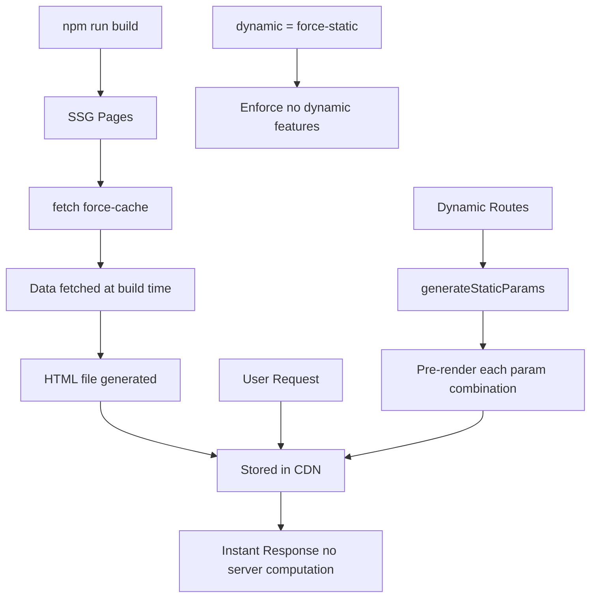

# Day 22 [Intermediate]: SSG with fetch force-cache

## Index

- [Goal](#goal)
- [Prerequisites](#prerequisites)
- [Explanation](#explanation)
- [Topic by Topic](#topic-by-topic)
- [Key Concepts](#key-concepts)
- [Visual Concept Map](#visual-concept-map)
- [End-to-End Practical](#end-to-end-practical)
- [Hands-on Coding](#hands-on-coding)
- [Mini Exercise](#mini-exercise)
- [Assessment Quiz](#assessment-quiz)
- [Task](#task)
- [Self Check](#self-check)
- [Interview Questions and Answers](#interview-questions-and-answers)
- [Day 22 Outcome](#day-22-outcome)

## Goal

Use `fetch` with `force-cache` (or the default fetch behavior) to create statically generated pages that are pre-built at build time for maximum performance.

## Prerequisites

- Completed Day 21: SSR with fetch no-store
- Understanding of the difference between SSR and SSG

## Explanation

Static Site Generation (SSG) builds HTML pages at deploy time and serves them as static files from a CDN. In the Next.js App Router, you get SSG by using the default `fetch` behavior (which caches indefinitely) or by explicitly passing `{ cache: 'force-cache' }`. This tells Next.js to cache the fetch result and reuse it for all subsequent builds or requests until the cache is invalidated.

SSG is the fastest rendering strategy because there is no server computation per request — the CDN serves a pre-built HTML file directly. This is ideal for content that doesn't change often: marketing pages, documentation, pricing pages, and any content that is the same for all users.

The key mental model: `force-cache` means "build this once and serve the cached version forever" (until the next build or revalidation). `no-store` means "always build fresh for every request." ISR (Day 23) is the middle ground.

## Topic by Topic

### Topic 1: Default Fetch Behavior (SSG)

Theory:
In Next.js App Router, `fetch` without any cache option defaults to `force-cache` — meaning the result is cached and the page is statically generated. This is the SSG default.

Practical:
Most documentation pages, pricing pages, and landing pages should use this default for maximum CDN performance.

Code Example:

```tsx
// app/pricing/page.tsx — SSG by default (force-cache)
async function getPricingPlans() {
  const res = await fetch("https://api.example.com/pricing");
  // Default: force-cache — cached at build time
  return res.json();
}

export default async function PricingPage() {
  const plans = await getPricingPlans();
  return (
    <div className="max-w-4xl mx-auto p-6">
      <h1 className="text-3xl font-bold mb-8 text-center">Pricing</h1>
      <div className="grid grid-cols-3 gap-6">
        {plans.map((plan: { name: string; price: number }) => (
          <div
            key={plan.name}
            className="bg-white border rounded-xl p-6 text-center"
          >
            <h2>{plan.name}</h2>
            <p className="text-3xl font-bold">${plan.price}/mo</p>
          </div>
        ))}
      </div>
    </div>
  );
}
```
**Explanation:**
This topic explains Default Fetch Behavior (SSG) in practical Next.js terms so you can build correct routing, rendering, and data flow patterns in real applications.

**Key Points:**
- Understand the core concept behind Default Fetch Behavior (SSG).
- Apply it with the right Next.js feature and defaults.
- Watch for common mistakes that affect performance, SEO, or maintainability.


### Topic 2: Explicit force-cache

Theory:
Pass `{ cache: 'force-cache' }` explicitly to make your intent clear. This is the same as the default but documents that you deliberately chose SSG.

Practical:
Being explicit helps team members understand the caching strategy at a glance.

Code Example:

```tsx
async function getDocumentation() {
  const res = await fetch("https://api.example.com/docs", {
    cache: "force-cache", // Explicit SSG — cached at build time
  });
  return res.json();
}
```
**Explanation:**
This topic explains Explicit force-cache in practical Next.js terms so you can build correct routing, rendering, and data flow patterns in real applications.

**Key Points:**
- Understand the core concept behind Explicit force-cache.
- Apply it with the right Next.js feature and defaults.
- Watch for common mistakes that affect performance, SEO, or maintainability.


### Topic 3: force-static Export

Theory:
Export `const dynamic = 'force-static'` from a page to force static rendering and throw an error if any dynamic feature (cookies, headers) is used — helping you audit your pages.

Practical:
Use `force-static` on marketing pages to ensure they never accidentally become dynamic.

Code Example:

```tsx
// app/features/page.tsx
export const dynamic = "force-static"; // Error if dynamic features used

export default async function FeaturesPage() {
  const features = await fetch("https://api.example.com/features", {
    cache: "force-cache",
  }).then((r) => r.json());

  return (
    <div>
      {features.map((f: { id: number; name: string }) => (
        <div key={f.id}>{f.name}</div>
      ))}
    </div>
  );
}
```
**Explanation:**
This topic explains force-static Export in practical Next.js terms so you can build correct routing, rendering, and data flow patterns in real applications.

**Key Points:**
- Understand the core concept behind force-static Export.
- Apply it with the right Next.js feature and defaults.
- Watch for common mistakes that affect performance, SEO, or maintainability.


### Topic 4: Build Output for SSG Pages

Theory:
After `npm run build`, SSG pages show a `○` (circle) symbol in the build output, indicating they are statically generated and served as HTML files. Dynamic pages show `λ` (lambda).

Practical:
Check the build output to confirm which pages are static vs dynamic.

Code Example:

```
// npm run build output:
// Route (app)                     Size     First Load JS
// ○ /                             142 B          85.3 kB
// ○ /about                        142 B          85.3 kB
// ○ /pricing                      187 B          85.3 kB
// λ /dashboard                    142 B          85.3 kB   ← Dynamic
// ○ /blog/[slug]                   N/A           85.3 kB   ← generateStaticParams
//
// ○ (Static)   prerendered as static content
// λ (Dynamic)  server-rendered on demand
```
**Explanation:**
This topic explains Build Output for SSG Pages in practical Next.js terms so you can build correct routing, rendering, and data flow patterns in real applications.

**Key Points:**
- Understand the core concept behind Build Output for SSG Pages.
- Apply it with the right Next.js feature and defaults.
- Watch for common mistakes that affect performance, SEO, or maintainability.


### Topic 5: SSG with generateStaticParams

Theory:
For dynamic routes, use `generateStaticParams` to specify all possible parameter values. Next.js pre-renders each combination as a static page.

Practical:
Every blog post, product page, and documentation page should use `generateStaticParams` for full SSG.

Code Example:

```tsx
// app/docs/[topic]/page.tsx
export async function generateStaticParams() {
  const topics = await fetch("https://api.example.com/doc-topics", {
    cache: "force-cache",
  }).then((r) => r.json());

  return topics.map((t: { slug: string }) => ({ topic: t.slug }));
}

export default async function DocPage({
  params,
}: {
  params: Promise<{ topic: string }>;
}) {
  const { topic } = await params;
  const doc = await fetch(`https://api.example.com/docs/${topic}`, {
    cache: "force-cache",
  }).then((r) => r.json());

  return (
    <article>
      <h1>{doc.title}</h1>
      <p>{doc.content}</p>
    </article>
  );
}
```
**Explanation:**
This topic explains SSG with generateStaticParams in practical Next.js terms so you can build correct routing, rendering, and data flow patterns in real applications.

**Key Points:**
- Understand the core concept behind SSG with generateStaticParams.
- Apply it with the right Next.js feature and defaults.
- Watch for common mistakes that affect performance, SEO, or maintainability.


### Topic 6: Preloading Critical Static Data

Theory:
Use `unstable_cache` from `next/cache` to cache the result of any async function (not just fetch) with a static key.

Practical:
Cache database queries or complex computations at build time using `unstable_cache`.

Code Example:

```tsx
import { unstable_cache } from "next/cache";

const getCachedFeaturedPosts = unstable_cache(
  async () => {
    // Simulated DB query
    return [
      { id: 1, title: "Featured Post 1", slug: "featured-1" },
      { id: 2, title: "Featured Post 2", slug: "featured-2" },
    ];
  },
  ["featured-posts"], // Cache key
  { revalidate: false }, // Never revalidate (static)
);

export default async function HomePage() {
  const posts = await getCachedFeaturedPosts();
  return (
    <div>
      {posts.map((p) => (
        <p key={p.id}>{p.title}</p>
      ))}
    </div>
  );
}
```
**Explanation:**
This topic explains Preloading Critical Static Data in practical Next.js terms so you can build correct routing, rendering, and data flow patterns in real applications.

**Key Points:**
- Understand the core concept behind Preloading Critical Static Data.
- Apply it with the right Next.js feature and defaults.
- Watch for common mistakes that affect performance, SEO, or maintainability.


### Topic 7: Static Pages with Client Interactivity

Theory:
SSG only pre-renders the initial HTML. Client Components still hydrate in the browser and become fully interactive. SSG + Client Components = best of both worlds: fast initial load + rich interactivity.

Practical:
Pre-render the page structure with SSG, add interactive widgets as Client Components.

Code Example:

```tsx
// app/features/page.tsx — SSG page with interactive demo
import InteractiveDemo from "@/components/InteractiveDemo"; // Client Component

async function getFeatures() {
  const res = await fetch("https://api.example.com/features", {
    cache: "force-cache",
  });
  return res.json();
}

export default async function FeaturesPage() {
  const features = await getFeatures();
  return (
    <div>
      <h1>Features</h1>
      {features.map((f: { id: number; name: string; description: string }) => (
        <div key={f.id}>
          <h2>{f.name}</h2>
          <p>{f.description}</p>
        </div>
      ))}
      {/* Client Component for interactivity */}
      <InteractiveDemo />
    </div>
  );
}
```
**Explanation:**
This topic explains Static Pages with Client Interactivity in practical Next.js terms so you can build correct routing, rendering, and data flow patterns in real applications.

**Key Points:**
- Understand the core concept behind Static Pages with Client Interactivity.
- Apply it with the right Next.js feature and defaults.
- Watch for common mistakes that affect performance, SEO, or maintainability.


### Topic 8: When NOT to Use SSG

Theory:
Don't use SSG for: user-specific data (dashboards, carts), real-time data (stock prices, live chat), or content that changes more often than your deploy frequency. These need SSR or ISR.

Practical:
Apply the "user-specific?" and "how often does this change?" questions before choosing SSG.

Code Example:

```tsx
// WRONG — User-specific data cannot be SSG
// export const dynamic = 'force-static'  // ❌ Don't do this

// app/dashboard/page.tsx — SSR needed for user-specific data
export const dynamic = "force-dynamic";

import { cookies } from "next/headers";

export default async function Dashboard() {
  const cookieStore = await cookies();
  const userId = cookieStore.get("user-id")?.value;
  // Each user has different data — cannot be statically cached
  return <div>Dashboard for user {userId}</div>;
}
```
**Explanation:**
This topic explains When NOT to Use SSG in practical Next.js terms so you can build correct routing, rendering, and data flow patterns in real applications.

**Key Points:**
- Understand the core concept behind When NOT to Use SSG.
- Apply it with the right Next.js feature and defaults.
- Watch for common mistakes that affect performance, SEO, or maintainability.


## Key Concepts

- **SSG (Static Site Generation)**: Pages are pre-built as HTML at deploy time and served from CDN.
- **force-cache**: A fetch option that caches the result indefinitely (until next build or revalidation).
- **Default fetch behavior**: In Next.js App Router, `fetch` without options defaults to `force-cache` (SSG).
- **dynamic = 'force-static'**: A page export that enforces static rendering and errors on dynamic features.
- **generateStaticParams**: Required for dynamic routes to participate in SSG.
- **unstable_cache**: A utility for caching non-fetch async operations (DB queries, computations).
- **Build Output Symbols**: `○` = static, `λ` = dynamic in the Next.js build output.
- **SSG + Hydration**: Static HTML is served instantly; Client Components hydrate for interactivity.

## Visual Concept Map



## End-to-End Practical

1. Create a pricing page that fetches plans with `force-cache`.
2. Create a docs section with `generateStaticParams` pre-rendering all topics.
3. Run `npm run build` and verify pages show `○` (static) in the output.
4. Add an interactive component (counter) to a static page — confirm it hydrates.
5. Try adding `dynamic = 'force-static'` to a page that reads cookies — observe the error.

## Hands-on Coding

### Example 1: Documentation with Full SSG

```tsx
// app/docs/[slug]/page.tsx
import type { Metadata } from "next";
import { notFound } from "next/navigation";

const docs = [
  {
    slug: "getting-started",
    title: "Getting Started",
    content: "Install Next.js with npx create-next-app.",
  },
  {
    slug: "routing",
    title: "Routing",
    content: "File-based routing in the app directory.",
  },
  {
    slug: "data-fetching",
    title: "Data Fetching",
    content: "Server and client data fetching patterns.",
  },
];

export async function generateStaticParams() {
  return docs.map((d) => ({ slug: d.slug }));
}

type Props = { params: Promise<{ slug: string }> };

export async function generateMetadata({ params }: Props): Promise<Metadata> {
  const { slug } = await params;
  const doc = docs.find((d) => d.slug === slug);
  return { title: doc?.title ?? "Not Found" };
}

export default async function DocPage({ params }: Props) {
  const { slug } = await params;
  const doc = docs.find((d) => d.slug === slug);
  if (!doc) notFound();
  return (
    <article className="max-w-3xl mx-auto py-12 px-4">
      <h1 className="text-3xl font-bold mb-6">{doc.title}</h1>
      <p className="text-gray-700">{doc.content}</p>
    </article>
  );
}
```

### Example 2: Marketing Landing Page

```tsx
// app/page.tsx — Static home page
export const dynamic = "force-static";

const features = [
  {
    icon: "⚡",
    title: "Blazing Fast",
    desc: "Built on Next.js for maximum performance.",
  },
  {
    icon: "🔒",
    title: "Secure by Default",
    desc: "Best practices baked in from the start.",
  },
  { icon: "🌍", title: "Global CDN", desc: "Deployed to 200+ edge locations." },
];

export default function HomePage() {
  return (
    <main className="min-h-screen">
      <section className="py-24 text-center bg-gradient-to-b from-blue-50 to-white">
        <h1 className="text-6xl font-black text-gray-900 mb-6">Build Faster</h1>
        <p className="text-xl text-gray-500 max-w-xl mx-auto">
          The platform for modern web development.
        </p>
      </section>
      <section className="max-w-5xl mx-auto py-16 px-4">
        <div className="grid grid-cols-1 md:grid-cols-3 gap-8">
          {features.map((f) => (
            <div key={f.title} className="text-center p-6">
              <div className="text-4xl mb-4">{f.icon}</div>
              <h3 className="text-xl font-bold mb-2">{f.title}</h3>
              <p className="text-gray-500">{f.desc}</p>
            </div>
          ))}
        </div>
      </section>
    </main>
  );
}
```

### Example 3: Combining SSG Data with Interactive Client

```tsx
// app/products/page.tsx — Static product listing
import AddToCartButton from "@/components/AddToCartButton"; // Client Component

const products = [
  { id: 1, name: "Pro Plan", price: 29 },
  { id: 2, name: "Enterprise Plan", price: 99 },
];

export const dynamic = "force-static";

export default function ProductsPage() {
  return (
    <div className="max-w-4xl mx-auto p-6">
      <h1 className="text-2xl font-bold mb-6">Products</h1>
      <div className="grid grid-cols-2 gap-6">
        {products.map((p) => (
          <div key={p.id} className="bg-white border rounded-xl p-6">
            <h2 className="text-lg font-semibold">{p.name}</h2>
            <p className="text-2xl font-bold text-blue-600 my-3">
              ${p.price}/mo
            </p>
            <AddToCartButton productId={p.id} productName={p.name} />
          </div>
        ))}
      </div>
    </div>
  );
}
```

## Mini Exercise

Scenario:
Build a static FAQ page that fetches questions from a data source and displays them with an accordion (Client Component).

Steps:

1. Create `app/faq/page.tsx` with `export const dynamic = 'force-static'`.
2. Create a `getFaqs()` function that returns an array of Q&A pairs.
3. Render the FAQs using an `AccordionItem` Client Component.
4. Run `npm run build` and verify `/faq` shows `○` in the output.

Expected output:

- The FAQ page is statically generated.
- Accordion items are interactive after hydration.
- Build output shows `○ /faq`.

## Assessment Quiz

### Quiz Questions

1. What is the default caching behavior of `fetch` in Next.js App Router?
2. What symbol represents a statically generated page in the build output?
3. How do you force static rendering even if dynamic features are accidentally used?
4. What utility caches non-fetch async operations?
5. What are two examples of content that should NOT use SSG?

### Quiz Answers

1. The default is `force-cache` — the result is cached indefinitely (SSG behavior).
2. `○` (circle) represents static pages in the Next.js build output.
3. `export const dynamic = 'force-static'` — this throws an error if any dynamic feature is used.
4. `unstable_cache` from `next/cache` caches the result of any async function.
5. Any two of: user-specific data (dashboards, carts), real-time data (stock prices, live sports scores), frequently changing data, session-dependent content.

## Task

- Convert your blog to use explicit `force-cache` on all fetches.
- Create a documentation page with `generateStaticParams`.
- Use `force-static` on your marketing pages.
- Run `npm run build` and verify the static/dynamic breakdown.

## Self Check

- Do you understand that `force-cache` is the default fetch behavior?
- Can you verify which pages are SSG vs SSR in the build output?
- Do you know when SSG is not appropriate?
- Have you used `generateStaticParams` for dynamic SSG routes?

## Interview Questions and Answers

### Beginner

**Question:** What is the default caching behavior of fetch in Next.js?
**Answer:** `force-cache` — the response is cached and the page is statically generated at build time. This is the SSG default.

**Question:** How is SSG different from SSR in terms of when HTML is generated?
**Answer:** SSG generates HTML once at build/deploy time. SSR generates HTML on the server for each request. SSG is faster but stale; SSR is slower but fresh.

### Middle

**Question:** How do you statically pre-render all pages in a dynamic route?
**Answer:** Export `generateStaticParams` from the page file, returning an array of all possible parameter combinations. Next.js pre-renders a static HTML file for each combination.

**Question:** Can you use SSG and Client Components together?
**Answer:** Yes. SSG pre-renders the initial HTML server-side. Client Components marked with `'use client'` still hydrate in the browser and become fully interactive. You get fast initial load (SSG) plus rich interactivity (hydration).

### Advanced

**Question:** What happens to a dynamic route not covered by generateStaticParams?
**Answer:** By default, Next.js renders them dynamically (on demand). Set `export const dynamicParams = false` to return 404 instead. Set `revalidate = N` for ISR — pages not pre-built are rendered on demand and cached.

**Question:** How would you implement a CDN cache invalidation strategy for SSG pages?
**Answer:** Use ISR with `revalidate` for time-based invalidation. For on-demand invalidation, call `revalidatePath()` or `revalidateTag()` from a webhook or admin action. Vercel also supports Deploy Hooks for full rebuilds when CMS content changes.

## Day 22 Outcome

- You understand SSG and how to achieve it with `force-cache`.
- You can verify static vs dynamic pages in the build output.
- You know when SSG is appropriate vs when SSR/ISR is needed.
- You can use `generateStaticParams` for full SSG on dynamic routes.
- You are ready to learn Incremental Static Regeneration on Day 23.
