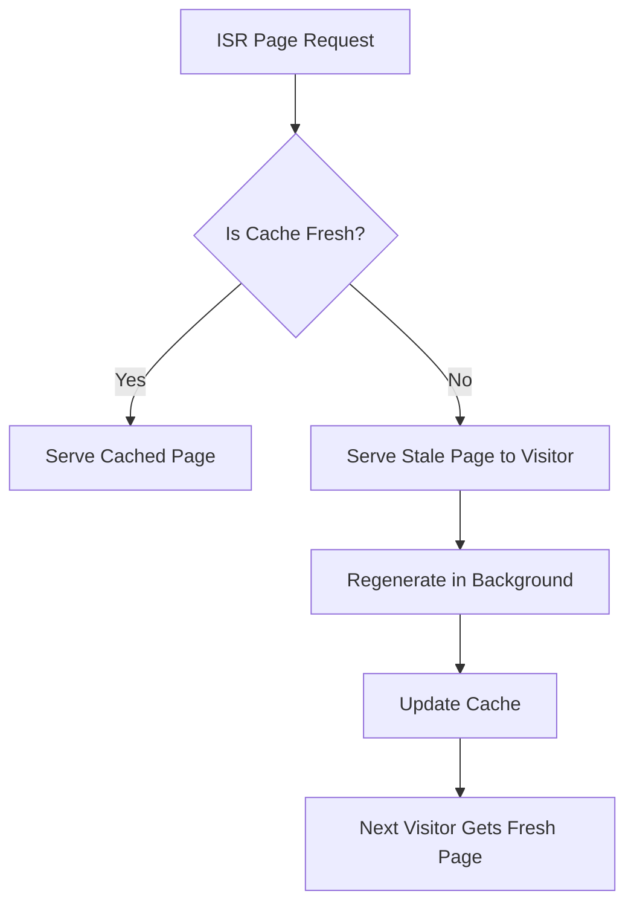

# Day 23 [Intermediate]: ISR with revalidate

## Index

- [Goal](#goal)
- [Prerequisites](#prerequisites)
- [Explanation](#explanation)
- [Topic by Topic](#topic-by-topic)
- [Key Concepts](#key-concepts)
- [Visual Concept Map](#visual-concept-map)
- [End-to-End Practical](#end-to-end-practical)
- [Hands-on Coding](#hands-on-coding)
- [Mini Exercise](#mini-exercise)
- [Assessment Quiz](#assessment-quiz)
- [Task](#task)
- [Self Check](#self-check)
- [Interview Questions and Answers](#interview-questions-and-answers)
- [Day 23 Outcome](#day-23-outcome)

## Goal

Understand Incremental Static Regeneration (ISR) and use the `revalidate` option to serve fast static pages that automatically update in the background.

## Prerequisites

- Day 22 completed
- Understanding of SSG with fetch force-cache
- Familiarity with Next.js App Router and async Server Components

## Explanation

ISR is a hybrid rendering strategy. Pages are built statically at build time (like SSG) but they can be regenerated in the background after a set time period. This gives you the speed of static pages with the freshness of server-side rendering.

Instead of rebuilding the entire site when data changes, only the pages that need to update are regenerated automatically after they are visited past the revalidation window. This makes ISR ideal for content like blog posts, product listings, and dashboards where data changes every few minutes or hours but not every second.

## Topic by Topic

### Topic 1: What is ISR?

Theory:
ISR stands for Incremental Static Regeneration. It allows statically generated pages to be updated after deployment without rebuilding the entire site.

Practical:
Think of an e-commerce product page. It is built statically for speed, but the price updates every 60 seconds via ISR.

Code Example:

```tsx
// Page is static but regenerates every 60 seconds
export const revalidate = 60;

export default async function ProductPage() {
  const res = await fetch("https://api.example.com/product/1");
  const product = await res.json();
  return (
    <h1>
      {product.name} — ${product.price}
    </h1>
  );
}
```
**Explanation:**
This topic explains What is ISR? in practical Next.js terms so you can build correct routing, rendering, and data flow patterns in real applications.

**Key Points:**
- Understand the core concept behind What is ISR?.
- Apply it with the right Next.js feature and defaults.
- Watch for common mistakes that affect performance, SEO, or maintainability.


### Topic 2: Setting revalidate on a Page

Theory:
Export a `revalidate` constant from your page file to control how often it should be regenerated. The value is in seconds.

Practical:
Add `export const revalidate = 60` to a page and observe that it serves cached content until the revalidation time passes.

Code Example:

```tsx
// app/news/page.tsx
export const revalidate = 300; // Regenerate every 5 minutes

export default async function NewsPage() {
  const res = await fetch("https://api.example.com/news");
  const articles = await res.json();
  return (
    <ul>
      {articles.map((a: { id: number; title: string }) => (
        <li key={a.id}>{a.title}</li>
      ))}
    </ul>
  );
}
```
**Explanation:**
This topic explains Setting revalidate on a Page in practical Next.js terms so you can build correct routing, rendering, and data flow patterns in real applications.

**Key Points:**
- Understand the core concept behind Setting revalidate on a Page.
- Apply it with the right Next.js feature and defaults.
- Watch for common mistakes that affect performance, SEO, or maintainability.


### Topic 3: revalidate on a fetch Call

Theory:
You can also set revalidation at the fetch level using the `next.revalidate` option. This gives per-request control rather than page-level control.

Practical:
Fetch two data sources with different revalidation intervals on the same page.

Code Example:

```tsx
export default async function DashboardPage() {
  const stats = await fetch("https://api.example.com/stats", {
    next: { revalidate: 60 },
  });
  const news = await fetch("https://api.example.com/news", {
    next: { revalidate: 3600 },
  });

  const statsData = await stats.json();
  const newsData = await news.json();

  return (
    <div>
      <p>Visitors today: {statsData.visitors}</p>
      <p>Latest headline: {newsData[0].title}</p>
    </div>
  );
}
```
**Explanation:**
This topic explains revalidate on a fetch Call in practical Next.js terms so you can build correct routing, rendering, and data flow patterns in real applications.

**Key Points:**
- Understand the core concept behind revalidate on a fetch Call.
- Apply it with the right Next.js feature and defaults.
- Watch for common mistakes that affect performance, SEO, or maintainability.


### Topic 4: On-demand Revalidation

Theory:
Instead of waiting for the time window to pass, you can trigger revalidation manually using `revalidatePath` or `revalidateTag` inside a Server Action or Route Handler.

Practical:
Trigger a revalidation when a CMS webhook fires or when an admin publishes new content.

Code Example:

```tsx
// app/api/revalidate/route.ts
import { revalidatePath } from "next/cache";
import { NextRequest } from "next/server";

export async function POST(req: NextRequest) {
  const { path } = await req.json();
  revalidatePath(path);
  return Response.json({ revalidated: true });
}
```
**Explanation:**
This topic explains On-demand Revalidation in practical Next.js terms so you can build correct routing, rendering, and data flow patterns in real applications.

**Key Points:**
- Understand the core concept behind On-demand Revalidation.
- Apply it with the right Next.js feature and defaults.
- Watch for common mistakes that affect performance, SEO, or maintainability.


### Topic 5: revalidateTag for Granular Control

Theory:
Tag your fetch calls with `next.tags` and then invalidate all fetches sharing a tag at once with `revalidateTag`. This avoids full-path revalidation when only specific data changes.

Practical:
Tag product data fetches and invalidate only the product tag when a product is updated.

Code Example:

```tsx
// Fetch with a tag
const res = await fetch("https://api.example.com/products", {
  next: { tags: ["products"] },
});

// Revalidate by tag
import { revalidateTag } from "next/cache";
revalidateTag("products");
```
**Explanation:**
This topic explains revalidateTag for Granular Control in practical Next.js terms so you can build correct routing, rendering, and data flow patterns in real applications.

**Key Points:**
- Understand the core concept behind revalidateTag for Granular Control.
- Apply it with the right Next.js feature and defaults.
- Watch for common mistakes that affect performance, SEO, or maintainability.


### Topic 6: ISR vs SSR vs SSG — Choosing the Right Strategy

Theory:
Use SSG for content that almost never changes. Use ISR when content changes periodically. Use SSR when every request must have the absolute latest data.

Practical:
Map these scenarios to strategies: homepage (SSG), blog listing (ISR 1 hour), real-time stock ticker (SSR).

Code Example:

```tsx
// SSG — no revalidate, built once
export const revalidate = false;

// ISR — rebuild every hour
export const revalidate = 3600;

// SSR — fresh on every request
export const revalidate = 0;
// or: cache: "no-store" in fetch
```
**Explanation:**
This topic explains ISR vs SSR vs SSG — Choosing the Right Strategy in practical Next.js terms so you can build correct routing, rendering, and data flow patterns in real applications.

**Key Points:**
- Understand the core concept behind ISR vs SSR vs SSG — Choosing the Right Strategy.
- Apply it with the right Next.js feature and defaults.
- Watch for common mistakes that affect performance, SEO, or maintainability.


### Topic 7: Checking Revalidation Behavior

Theory:
When a page is served past its revalidation window, the old cached page is served to the current visitor while Next.js regenerates it in the background. The next visitor gets the fresh page.

Practical:
Add a timestamp to your page output and observe that it updates only after the revalidation interval passes.

Code Example:

```tsx
export const revalidate = 10;

export default function TimestampPage() {
  return <p>Page generated at: {new Date().toISOString()}</p>;
}
```
**Explanation:**
This topic explains Checking Revalidation Behavior in practical Next.js terms so you can build correct routing, rendering, and data flow patterns in real applications.

**Key Points:**
- Understand the core concept behind Checking Revalidation Behavior.
- Apply it with the right Next.js feature and defaults.
- Watch for common mistakes that affect performance, SEO, or maintainability.


## Key Concepts

- ISR: Incremental Static Regeneration — static pages that update in the background after a time interval
- revalidate: A constant or fetch option specifying seconds before a cached response is considered stale
- On-demand Revalidation: Manually triggering page regeneration via `revalidatePath` or `revalidateTag`
- revalidatePath: Clears the cache for a specific route
- revalidateTag: Clears the cache for all fetches sharing a specific tag
- Stale-while-revalidate: The pattern where the old page is served while regeneration happens in the background

## Visual Concept Map



## End-to-End Practical

1. Create a page that fetches data from a public API.
2. Add `export const revalidate = 10` to the page.
3. Add a timestamp to the page output.
4. Start the app with `npm run build` then `npm start`.
5. Visit the page and note the timestamp.
6. Wait 10 seconds and refresh.
7. Refresh once more to confirm the timestamp updates.
8. Try on-demand revalidation with a Route Handler.

## Hands-on Coding

### Example 1: Blog Listing with ISR

```tsx
// app/blog/page.tsx
export const revalidate = 3600; // Revalidate every hour

interface Post {
  id: number;
  title: string;
  body: string;
}

export default async function BlogPage() {
  const res = await fetch(
    "https://jsonplaceholder.typicode.com/posts?_limit=5",
  );
  const posts: Post[] = await res.json();

  return (
    <div style={{ padding: "24px" }}>
      <h1>Latest Posts</h1>
      <p style={{ color: "gray" }}>
        Last built: {new Date().toLocaleTimeString()}
      </p>
      <ul>
        {posts.map((post) => (
          <li key={post.id}>{post.title}</li>
        ))}
      </ul>
    </div>
  );
}
```

### Example 2: On-demand Revalidation Route Handler

```tsx
// app/api/revalidate/route.ts
import { revalidatePath } from "next/cache";
import { NextRequest } from "next/server";

export async function POST(req: NextRequest) {
  const body = await req.json();
  const secret = req.headers.get("x-revalidate-secret");

  if (secret !== process.env.REVALIDATE_SECRET) {
    return Response.json({ error: "Unauthorized" }, { status: 401 });
  }

  revalidatePath(body.path ?? "/blog");
  return Response.json({ revalidated: true, path: body.path });
}
```

### Example 3: Per-fetch Revalidation with Tags

```tsx
// app/products/page.tsx
interface Product {
  id: number;
  title: string;
  price: number;
}

export default async function ProductsPage() {
  const res = await fetch("https://fakestoreapi.com/products?limit=4", {
    next: { revalidate: 600, tags: ["products"] },
  });
  const products: Product[] = await res.json();

  return (
    <div style={{ padding: "24px" }}>
      <h1>Products</h1>
      {products.map((p) => (
        <div key={p.id}>
          <strong>{p.title}</strong> — ${p.price}
        </div>
      ))}
    </div>
  );
}
```

## Mini Exercise

Scenario:
You are building a sports scores page. Scores update every 30 seconds during a game.

Steps:

1. Create `app/scores/page.tsx`.
2. Fetch score data from a public sports or mock API.
3. Set `revalidate = 30` on the page.
4. Display a "Last updated" timestamp on the page.
5. Build and start the production server.
6. Verify the page regenerates after 30 seconds.

Expected output:

- A scores page that shows a timestamp
- The timestamp updates after 30 seconds when you revisit the page
- The page is served instantly from cache within the window

## Assessment Quiz

### Quiz Questions

1. What does ISR stand for?
2. How do you set a 5-minute revalidation interval on a page?
3. What does `revalidatePath` do?
4. True or False: With ISR, the current visitor gets the new page as soon as it is regenerated.
5. When should you use SSR instead of ISR?

### Quiz Answers

1. Incremental Static Regeneration.
2. Export `export const revalidate = 300` from the page file.
3. It clears the cache for a specific route, triggering it to be regenerated on the next visit.
4. False. The current visitor gets the stale page. The regenerated page is served to the next visitor.
5. When data must be completely fresh for every single request, such as real-time stock prices or personalized dashboards.

## Task

- Create a page with ISR using `export const revalidate`
- Add a visible timestamp to confirm regeneration
- Build the app in production mode and verify ISR behavior
- Implement an on-demand revalidation API endpoint
- Complete the mini exercise

## Self Check

- You can explain what ISR is and how it works
- You can set page-level and fetch-level revalidation
- You can implement on-demand revalidation with `revalidatePath`
- You can choose between SSG, ISR, and SSR for a given scenario
- You can answer at least 4 out of 5 quiz questions correctly

## Interview Questions and Answers

### Beginner

**Question:** What is ISR in Next.js?

**Answer:** ISR is Incremental Static Regeneration. It allows statically generated pages to be updated in the background after a specified time interval without rebuilding the entire site.

**Question:** What value do you export to enable ISR on a page?

**Answer:** You export `export const revalidate = <seconds>` from the page file.

### Middle

**Question:** What is the difference between time-based revalidation and on-demand revalidation?

**Answer:** Time-based revalidation automatically regenerates a page after a set number of seconds. On-demand revalidation is triggered manually using `revalidatePath` or `revalidateTag`, for example when a CMS publishes new content.

**Question:** What happens to the current visitor when a page is past its revalidation window?

**Answer:** The current visitor receives the stale cached page. Next.js regenerates the page in the background and the updated version is served to subsequent visitors.

### Advanced

**Question:** How would you implement cache invalidation across many pages when a product is updated?

**Answer:** Tag all product-related fetch calls with `next: { tags: ["products"] }` and call `revalidateTag("products")` in a Server Action or Route Handler when a product changes. This invalidates all fetches sharing that tag without specifying individual paths.

**Question:** What is the trade-off of using a very short revalidation interval?

**Answer:** Very short intervals reduce the performance benefit of static caching and increase server load, approaching the behavior of SSR. You should choose the shortest interval that meets your data freshness needs without causing excessive regeneration.

## Day 23 Outcome

- You understand ISR and the stale-while-revalidate pattern
- You can use `revalidate` at both page and fetch level
- You can implement on-demand revalidation for CMS or webhook use cases
- You can choose the right rendering strategy for different data requirements
- You are ready to learn generateStaticParams in Day 24
