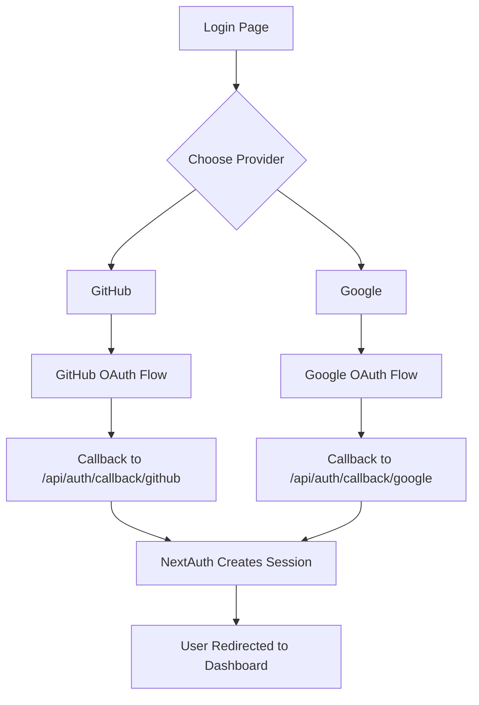

# Day 32 [Intermediate]: OAuth Providers Google and GitHub

## Index

- [Goal](#goal)
- [Prerequisites](#prerequisites)
- [Explanation](#explanation)
- [Topic by Topic](#topic-by-topic)
- [Key Concepts](#key-concepts)
- [Visual Concept Map](#visual-concept-map)
- [End-to-End Practical](#end-to-end-practical)
- [Hands-on Coding](#hands-on-coding)
- [Mini Exercise](#mini-exercise)
- [Assessment Quiz](#assessment-quiz)
- [Task](#task)
- [Self Check](#self-check)
- [Interview Questions and Answers](#interview-questions-and-answers)
- [Day 32 Outcome](#day-32-outcome)

## Goal

Configure Google and GitHub OAuth providers in NextAuth.js so users can sign in with their existing accounts securely.

## Prerequisites

- Day 31 completed
- NextAuth.js installed and basic auth.ts configured
- Access to Google Cloud Console and GitHub Developer Settings

## Explanation

OAuth providers let users sign in to your app using accounts they already have, like Google or GitHub. This removes the need to create and store passwords in your app. The user authenticates with the provider and the provider sends back a verified token. NextAuth handles all the complexity of this flow.

Each provider requires you to register your app on their platform, get a Client ID and Client Secret, and add the allowed callback URLs. NextAuth then handles the redirect, callback, and token exchange automatically.

## Topic by Topic

### Topic 1: How OAuth Works

Theory:
In OAuth, your app redirects the user to the provider login page. After login, the provider sends the user back to your callback URL with an authorization code. NextAuth exchanges this code for a user profile.

Practical:
Trace the OAuth flow from button click to session creation.

Code Example:

```text
User clicks "Sign in with Google"
  → Redirect to accounts.google.com
  → User authorizes your app
  → Google redirects to /api/auth/callback/google
  → NextAuth exchanges code for profile
  → Session created → User sent to dashboard
```
**Explanation:**
This topic explains How OAuth Works in practical Next.js terms so you can build correct routing, rendering, and data flow patterns in real applications.

**Key Points:**
- Understand the core concept behind How OAuth Works.
- Apply it with the right Next.js feature and defaults.
- Watch for common mistakes that affect performance, SEO, or maintainability.


### Topic 2: Setting Up GitHub Provider

Theory:
GitHub OAuth requires creating an OAuth App in GitHub settings and adding the credentials to your environment variables.

Practical:
Register an OAuth App at github.com/settings/developers and configure it in NextAuth.

Code Example:

```tsx
// auth.ts
import NextAuth from "next-auth";
import GitHub from "next-auth/providers/github";

export const { handlers, auth, signIn, signOut } = NextAuth({
  providers: [GitHub],
});

// .env.local
// AUTH_GITHUB_ID=your-client-id
// AUTH_GITHUB_SECRET=your-client-secret
```
**Explanation:**
This topic explains Setting Up GitHub Provider in practical Next.js terms so you can build correct routing, rendering, and data flow patterns in real applications.

**Key Points:**
- Understand the core concept behind Setting Up GitHub Provider.
- Apply it with the right Next.js feature and defaults.
- Watch for common mistakes that affect performance, SEO, or maintainability.


### Topic 3: Setting Up Google Provider

Theory:
Google OAuth requires creating a project in Google Cloud Console, enabling the Google+ API, and creating OAuth 2.0 credentials.

Practical:
Set up Google credentials at console.cloud.google.com and add them to your app.

Code Example:

```tsx
// auth.ts
import NextAuth from "next-auth";
import Google from "next-auth/providers/google";

export const { handlers, auth, signIn, signOut } = NextAuth({
  providers: [Google],
});

// .env.local
// AUTH_GOOGLE_ID=your-client-id.apps.googleusercontent.com
// AUTH_GOOGLE_SECRET=your-client-secret
```
**Explanation:**
This topic explains Setting Up Google Provider in practical Next.js terms so you can build correct routing, rendering, and data flow patterns in real applications.

**Key Points:**
- Understand the core concept behind Setting Up Google Provider.
- Apply it with the right Next.js feature and defaults.
- Watch for common mistakes that affect performance, SEO, or maintainability.


### Topic 4: Using Multiple Providers

Theory:
You can add multiple providers in the `providers` array. Users can then choose which service to sign in with.

Practical:
Add both GitHub and Google to allow users to pick either option.

Code Example:

```tsx
// auth.ts
import NextAuth from "next-auth";
import GitHub from "next-auth/providers/github";
import Google from "next-auth/providers/google";

export const { handlers, auth, signIn, signOut } = NextAuth({
  providers: [GitHub, Google],
});
```
**Explanation:**
This topic explains Using Multiple Providers in practical Next.js terms so you can build correct routing, rendering, and data flow patterns in real applications.

**Key Points:**
- Understand the core concept behind Using Multiple Providers.
- Apply it with the right Next.js feature and defaults.
- Watch for common mistakes that affect performance, SEO, or maintainability.


### Topic 5: Configuring Callback URLs

Theory:
Each OAuth provider must have the exact callback URL registered. For local development it is `http://localhost:3000/api/auth/callback/<provider>`.

Practical:
Set the correct callback URLs in both GitHub and Google consoles.

Code Example:

```text
GitHub callback URL:
http://localhost:3000/api/auth/callback/github

Google callback URL:
http://localhost:3000/api/auth/callback/google

Production (example):
https://myapp.com/api/auth/callback/github
https://myapp.com/api/auth/callback/google
```
**Explanation:**
This topic explains Configuring Callback URLs in practical Next.js terms so you can build correct routing, rendering, and data flow patterns in real applications.

**Key Points:**
- Understand the core concept behind Configuring Callback URLs.
- Apply it with the right Next.js feature and defaults.
- Watch for common mistakes that affect performance, SEO, or maintainability.


### Topic 6: Building a Login Page with Multiple Providers

Theory:
Create a dedicated login page that shows buttons for each provider you support.

Practical:
Build a clean login page with Google and GitHub sign-in buttons.

Code Example:

```tsx
// app/login/page.tsx
import { signIn } from "@/auth";

export default function LoginPage() {
  return (
    <div style={{ padding: "48px", maxWidth: "400px", margin: "0 auto" }}>
      <h1>Sign In</h1>
      <form
        action={async () => {
          "use server";
          await signIn("github", { redirectTo: "/dashboard" });
        }}
      >
        <button
          type="submit"
          style={{
            display: "block",
            width: "100%",
            padding: "12px",
            marginBottom: "12px",
          }}
        >
          Continue with GitHub
        </button>
      </form>
      <form
        action={async () => {
          "use server";
          await signIn("google", { redirectTo: "/dashboard" });
        }}
      >
        <button
          type="submit"
          style={{ display: "block", width: "100%", padding: "12px" }}
        >
          Continue with Google
        </button>
      </form>
    </div>
  );
}
```
**Explanation:**
This topic explains Building a Login Page with Multiple Providers in practical Next.js terms so you can build correct routing, rendering, and data flow patterns in real applications.

**Key Points:**
- Understand the core concept behind Building a Login Page with Multiple Providers.
- Apply it with the right Next.js feature and defaults.
- Watch for common mistakes that affect performance, SEO, or maintainability.


### Topic 7: Accessing Provider-specific Data

Theory:
The session contains `user.name`, `user.email`, and `user.image` from the provider. You can access the original access token using callbacks if needed.

Practical:
Display the user's avatar from the provider profile.

Code Example:

```tsx
import { auth } from "@/auth";

export default async function ProfilePage() {
  const session = await auth();
  if (!session?.user) return <p>Not signed in</p>;

  return (
    <div>
      
      <h2>{session.user.name}</h2>
      <p>{session.user.email}</p>
    </div>
  );
}
```
**Explanation:**
This topic explains Accessing Provider-specific Data in practical Next.js terms so you can build correct routing, rendering, and data flow patterns in real applications.

**Key Points:**
- Understand the core concept behind Accessing Provider-specific Data.
- Apply it with the right Next.js feature and defaults.
- Watch for common mistakes that affect performance, SEO, or maintainability.


## Key Concepts

- OAuth 2.0: An authorization protocol that lets users grant your app access to their data on another platform
- Client ID: A public identifier for your app registered with the OAuth provider
- Client Secret: A private key used to authenticate your app with the provider
- Callback URL: The URL the provider redirects to after the user authorizes your app
- Provider: An authentication service (GitHub, Google, etc.) configured in NextAuth

## Visual Concept Map



## End-to-End Practical

1. Create a GitHub OAuth App at github.com/settings/developers.
2. Set Homepage URL to `http://localhost:3000`.
3. Set Authorization callback URL to `http://localhost:3000/api/auth/callback/github`.
4. Add GitHub credentials to `.env.local`.
5. Create a Google Cloud project and OAuth 2.0 credentials.
6. Add Google credentials to `.env.local`.
7. Configure both providers in `auth.ts`.
8. Build a login page with both buttons and test the full flow.

## Hands-on Coding

### Example 1: auth.ts with Both Providers

```tsx
// auth.ts
import NextAuth from "next-auth";
import GitHub from "next-auth/providers/github";
import Google from "next-auth/providers/google";

export const { handlers, auth, signIn, signOut } = NextAuth({
  providers: [
    GitHub({
      clientId: process.env.AUTH_GITHUB_ID!,
      clientSecret: process.env.AUTH_GITHUB_SECRET!,
    }),
    Google({
      clientId: process.env.AUTH_GOOGLE_ID!,
      clientSecret: process.env.AUTH_GOOGLE_SECRET!,
    }),
  ],
  pages: {
    signIn: "/login",
  },
});
```

### Example 2: User Card Showing Provider Avatar

```tsx
// app/dashboard/page.tsx
import { auth } from "@/auth";
import { redirect } from "next/navigation";

export default async function DashboardPage() {
  const session = await auth();
  if (!session) redirect("/login");

  return (
    <div style={{ padding: "24px" }}>
      <div style={{ display: "flex", alignItems: "center", gap: "16px" }}>
        {session.user?.image && (
          
        )}
        <div>
          <h2>{session.user?.name}</h2>
          <p style={{ color: "#888" }}>{session.user?.email}</p>
        </div>
      </div>
    </div>
  );
}
```

### Example 3: Navigation with Auth State

```tsx
// components/Navbar.tsx
import { auth, signIn, signOut } from "@/auth";

export default async function Navbar() {
  const session = await auth();

  return (
    <nav
      style={{
        display: "flex",
        justifyContent: "space-between",
        padding: "16px 24px",
        borderBottom: "1px solid #eee",
      }}
    >
      <strong>My App</strong>
      {session ? (
        <form
          action={async () => {
            "use server";
            await signOut({ redirectTo: "/" });
          }}
        >
          <button type="submit">Sign Out ({session.user?.name})</button>
        </form>
      ) : (
        <a href="/login">Sign In</a>
      )}
    </nav>
  );
}
```

## Mini Exercise

Scenario:
Add Google sign-in to the app from Day 31 that only had GitHub.

Steps:

1. Create a Google Cloud project and OAuth 2.0 credentials.
2. Add `AUTH_GOOGLE_ID` and `AUTH_GOOGLE_SECRET` to `.env.local`.
3. Add Google provider to `auth.ts` alongside GitHub.
4. Update the login page to show both provider buttons.
5. Test signing in with each provider and verify the profile page shows correct data.

Expected output:

- Login page with two buttons: GitHub and Google
- Both sign-in flows complete successfully
- Profile shows user avatar, name, and email from the chosen provider

## Assessment Quiz

### Quiz Questions

1. What two items do you get from registering an OAuth App?
2. What is the callback URL format for GitHub in NextAuth?
3. How do you add multiple providers in NextAuth?
4. True or False: You can use the same Client ID for both development and production.
5. What session fields does NextAuth populate from an OAuth provider?

### Quiz Answers

1. A Client ID and a Client Secret.
2. `http://localhost:3000/api/auth/callback/github`
3. Add both to the `providers` array in the NextAuth config.
4. False. You should register separate OAuth Apps for development and production with different callback URLs.
5. `user.name`, `user.email`, and `user.image`.

## Task

- Register a GitHub OAuth App and add credentials
- Register a Google OAuth App and add credentials
- Configure both providers in auth.ts
- Build a login page with both options
- Test the full sign-in flow for each provider
- Complete the mini exercise

## Self Check

- You can register OAuth Apps on GitHub and Google
- You can configure multiple providers in NextAuth
- You can build a login page with provider buttons
- You understand callback URLs and why they must match
- You can answer at least 4 out of 5 quiz questions correctly

## Interview Questions and Answers

### Beginner

**Question:** Why use OAuth instead of building your own login system?

**Answer:** OAuth lets users sign in with existing trusted accounts, removing the need to store passwords in your app. It is more secure, faster to implement, and users do not need to remember another password.

**Question:** What is a callback URL in OAuth?

**Answer:** It is the URL the OAuth provider redirects the user to after they authorize your app. NextAuth listens at this URL to complete the authentication flow.

### Middle

**Question:** What would break if you used the wrong callback URL in your OAuth App settings?

**Answer:** The provider would reject the callback redirect and the sign-in flow would fail with a redirect_uri_mismatch error, preventing users from signing in.

**Question:** How does NextAuth know which provider the user selected?

**Answer:** When you call `signIn("github")` or `signIn("google")`, NextAuth redirects to the corresponding provider using the provider key you specified.

### Advanced

**Question:** How would you link a Google sign-in and a GitHub sign-in to the same user account?

**Answer:** Use a database adapter with NextAuth. When a user signs in, the adapter checks if the email already exists in the database. If it does, it links the new OAuth account to the existing user rather than creating a duplicate account.

**Question:** What security precautions should you take with OAuth Client Secrets?

**Answer:** Never expose Client Secrets in client-side code or commit them to version control. Store them in environment variables only. Use separate secrets for development and production. Rotate secrets if they are ever exposed.

## Day 32 Outcome

- You can register and configure Google and GitHub OAuth providers
- You can build a login page supporting multiple sign-in options
- You understand callback URLs and OAuth flow
- You are ready to learn credentials-based authentication in Day 33
