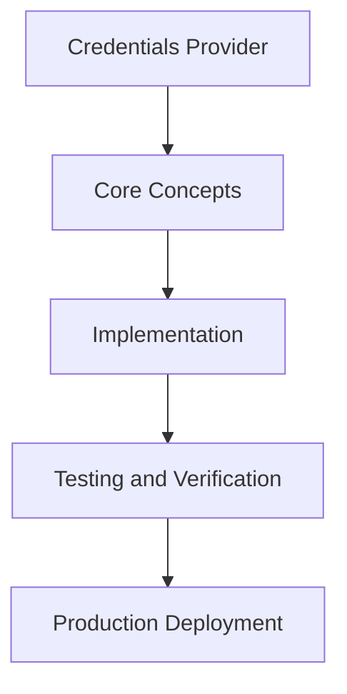

# Day 33 [Intermediate]: Credentials Provider

## Index

- [Goal](#goal)
- [Prerequisites](#prerequisites)
- [Explanation](#explanation)
- [Topic by Topic](#topic-by-topic)
- [Key Concepts](#key-concepts)
- [Visual Concept Map](#visual-concept-map)
- [End-to-End Practical](#end-to-end-practical)
- [Hands-on Coding](#hands-on-coding)
- [Mini Exercise](#mini-exercise)
- [Assessment Quiz](#assessment-quiz)
- [Task](#task)
- [Self Check](#self-check)
- [Interview Questions and Answers](#interview-questions-and-answers)
- [Day 33 Outcome](#day-33-outcome)

## Goal

Understand and apply Credentials Provider in a Next.js application to build production-quality features.

## Prerequisites

- Day 32 completed
- Solid understanding of Next.js App Router and TypeScript basics
- Familiarity with Server Components and data fetching patterns

## Explanation

Credentials provider allows username/password authentication when OAuth is not suitable. It requires you to manage password hashing and validation yourself.

## Topic by Topic

### Topic 1: When to Use Credentials

Theory:
Use credentials when users must sign in with email and password, or custom tokens like API keys.

Practical:
Implement this pattern in your project and observe the behavior.

Code Example:

```tsx
import Credentials from "next-auth/providers/credentials";

export const { handlers, auth, signIn, signOut } = NextAuth({
  providers: [
    Credentials({
      credentials: {
        email: { label: "Email", type: "email" },
        password: { label: "Password", type: "password" },
      },
      async authorize(credentials) {
        // validate and return user or null
        return null;
      },
    }),
  ],
});
```
**Explanation:**
This topic explains When to Use Credentials in practical Next.js terms so you can build correct routing, rendering, and data flow patterns in real applications.

**Key Points:**
- Understand the core concept behind When to Use Credentials.
- Apply it with the right Next.js feature and defaults.
- Watch for common mistakes that affect performance, SEO, or maintainability.


### Topic 2: Password Hashing with bcrypt

Theory:
Never store plain text passwords. Use bcrypt to hash passwords when storing and to compare on login.

Practical:
Implement this pattern in your project and observe the behavior.

Code Example:

```tsx
import bcrypt from "bcryptjs";

// When creating user:
const hash = await bcrypt.hash(password, 12);

// When verifying login:
const valid = await bcrypt.compare(inputPassword, storedHash);
```
**Explanation:**
This topic explains Password Hashing with bcrypt in practical Next.js terms so you can build correct routing, rendering, and data flow patterns in real applications.

**Key Points:**
- Understand the core concept behind Password Hashing with bcrypt.
- Apply it with the right Next.js feature and defaults.
- Watch for common mistakes that affect performance, SEO, or maintainability.


### Topic 3: Authorize Function

Theory:
The authorize function receives credentials, validates them against your database, and returns the user object or null.

Practical:
Implement this pattern in your project and observe the behavior.

Code Example:

```tsx
async authorize(credentials) {
  if (!credentials?.email || !credentials?.password) return null;
  
  const user = await db.user.findUnique({
    where: { email: credentials.email as string },
  });
  
  if (!user) return null;
  const valid = await bcrypt.compare(credentials.password as string, user.passwordHash);
  if (!valid) return null;
  
  return { id: user.id, email: user.email, name: user.name };
}
```
**Explanation:**
This topic explains Authorize Function in practical Next.js terms so you can build correct routing, rendering, and data flow patterns in real applications.

**Key Points:**
- Understand the core concept behind Authorize Function.
- Apply it with the right Next.js feature and defaults.
- Watch for common mistakes that affect performance, SEO, or maintainability.


### Topic 4: Login Form with Server Action

Theory:
Build a login form that calls signIn with the credentials provider.

Practical:
Implement this pattern in your project and observe the behavior.

Code Example:

```tsx
"use client";
import { signIn } from "next-auth/react";
import { useState } from "react";

export default function LoginForm() {
  const [error, setError] = useState("");
  
  async function handleSubmit(e: React.FormEvent<HTMLFormElement>) {
    e.preventDefault();
    const form = new FormData(e.currentTarget);
    const result = await signIn("credentials", {
      email: form.get("email"),
      password: form.get("password"),
      redirect: false,
    });
    if (result?.error) setError("Invalid credentials");
  }
  
  return (
    <form onSubmit={handleSubmit}>
      <input name="email" type="email" placeholder="Email" required />
      <input name="password" type="password" placeholder="Password" required />
      {error && <p style={{color:"red"}}>{error}</p>}
      <button type="submit">Sign In</button>
    </form>
  );
}
```
**Explanation:**
This topic explains Login Form with Server Action in practical Next.js terms so you can build correct routing, rendering, and data flow patterns in real applications.

**Key Points:**
- Understand the core concept behind Login Form with Server Action.
- Apply it with the right Next.js feature and defaults.
- Watch for common mistakes that affect performance, SEO, or maintainability.


### Topic 5: Registration Route

Theory:
You need to build your own registration endpoint when using credentials.

Practical:
Implement this pattern in your project and observe the behavior.

Code Example:

```tsx
// app/api/register/route.ts
import bcrypt from "bcryptjs";
import { db } from "@/lib/db";

export async function POST(req: Request) {
  const { email, password, name } = await req.json();
  const hash = await bcrypt.hash(password, 12);
  const user = await db.user.create({
    data: { email, name, passwordHash: hash },
  });
  return Response.json({ id: user.id });
}
```
**Explanation:**
This topic explains Registration Route in practical Next.js terms so you can build correct routing, rendering, and data flow patterns in real applications.

**Key Points:**
- Understand the core concept behind Registration Route.
- Apply it with the right Next.js feature and defaults.
- Watch for common mistakes that affect performance, SEO, or maintainability.


### Topic 6: Input Validation

Theory:
Always validate credentials input with Zod before processing to prevent injection and bad data.

Practical:
Implement this pattern in your project and observe the behavior.

Code Example:

```tsx
import { z } from "zod";

const schema = z.object({
  email: z.string().email(),
  password: z.string().min(8),
});

// In authorize:
const parsed = schema.safeParse(credentials);
if (!parsed.success) return null;
```
**Explanation:**
This topic explains Input Validation in practical Next.js terms so you can build correct routing, rendering, and data flow patterns in real applications.

**Key Points:**
- Understand the core concept behind Input Validation.
- Apply it with the right Next.js feature and defaults.
- Watch for common mistakes that affect performance, SEO, or maintainability.


## Key Concepts

- Credentials Provider: Allows email/password sign-in
- bcrypt: A password hashing library
- authorize: The function that validates credentials and returns a user or null
- Registration: The process of creating a new user account with hashed password

## Visual Concept Map



## End-to-End Practical

1. Review the explanation and all topic examples.
2. Set up a clean Next.js project or use your existing one.
3. Implement each topic example step by step.
4. Verify the behavior in the browser.
5. Refactor and clean up your implementation.
6. Write a brief note on what you learned.

## Hands-on Coding

### Example 1: Basic Credentials Provider Implementation

```tsx
// Basic implementation of Credentials Provider
// Follow the topic examples above to build this out.
export default function Example() {
  return (
    <div style={{ padding: "24px" }}>
      <h1>Credentials Provider</h1>
      <p>Implementation complete for Day 33.</p>
    </div>
  );
}
```

### Example 2: Practical Use Case

```tsx
// A real-world use case for Credentials Provider
// Refer to the Topic by Topic section for code details.
export default function PracticalExample() {
  return (
    <div>
      <h2>Practical: Credentials Provider</h2>
    </div>
  );
}
```

### Example 3: Combined Pattern

```tsx
// Combining Credentials Provider with other Next.js features
// This example shows integration with the App Router.
export default function CombinedExample() {
  return (
    <section>
      <h2>Credentials Provider — Combined Pattern</h2>
      <p>See topic sections above for detailed code.</p>
    </section>
  );
}
```

## Mini Exercise

Scenario:
You are adding Credentials Provider to a Next.js application for a real-world feature.

Steps:

1. Create a new route or component relevant to this topic.
2. Implement the core pattern from the Topic by Topic section.
3. Test the implementation thoroughly.
4. Verify edge cases are handled.
5. Clean up and document your code.

Expected output:

- Working implementation of Credentials Provider
- All edge cases handled correctly
- Clean, readable code following Next.js conventions

## Assessment Quiz

### Quiz Questions

1. What is the primary purpose of Credentials Provider in Next.js?
2. Where in the project structure do you implement this pattern?
3. What is a common mistake when using Credentials Provider?
4. True or False: Credentials Provider only applies to Client Components.
5. How does Credentials Provider improve the user or developer experience?

### Quiz Answers

1. To enable intermediate-level functionality in a Next.js application efficiently.
2. In the App Router directory structure, using Server Components by default.
3. Mixing server and client concerns incorrectly, or skipping error handling.
4. False. This concept applies broadly across the Next.js architecture.
5. It improves maintainability, performance, and scalability of the application.

## Task

- Study all topic examples in today's lesson
- Implement the core pattern in a Next.js project
- Test all scenarios including error and edge cases
- Complete the mini exercise
- Attempt the quiz before checking answers

## Self Check

- You can implement Credentials Provider from scratch
- You understand when and why to use this pattern
- You can explain the concept in simple terms
- You have tested the implementation in a running app
- You can answer at least 4 out of 5 quiz questions correctly

## Interview Questions and Answers

### Beginner

**Question:** What is Credentials Provider in Next.js?

**Answer:** Credentials Provider is a intermediate-level Next.js feature that helps developers build robust, scalable applications by handling a specific aspect of the framework architecture.

**Question:** When would you use Credentials Provider?

**Answer:** When you need to implement the specific functionality it provides in a production Next.js application, particularly in intermediate-stage projects.

### Middle

**Question:** How does Credentials Provider interact with the Next.js App Router?

**Answer:** It integrates with the App Router through Server Components, Route Handlers, or middleware, depending on the specific implementation pattern required.

**Question:** What are common pitfalls with Credentials Provider?

**Answer:** The most common pitfalls are improper handling of server/client boundaries, missing error states, and not considering caching behavior when relevant.

### Advanced

**Question:** How would you scale Credentials Provider in a large Next.js application with multiple teams?

**Answer:** By establishing clear conventions, creating reusable utilities, documenting patterns in an Architecture Decision Record, and enforcing consistency through code review and linting rules.

**Question:** What performance considerations apply to Credentials Provider?

**Answer:** Consider bundle size impact for client-side features, caching strategies for data fetching, and rendering mode selection to balance performance with data freshness.

## Day 33 Outcome

- You understand Credentials Provider and its role in Next.js
- You can implement this pattern in a real project
- You know when to use and when to avoid this pattern
- You are ready for Day 33 — moving on to the next topic
