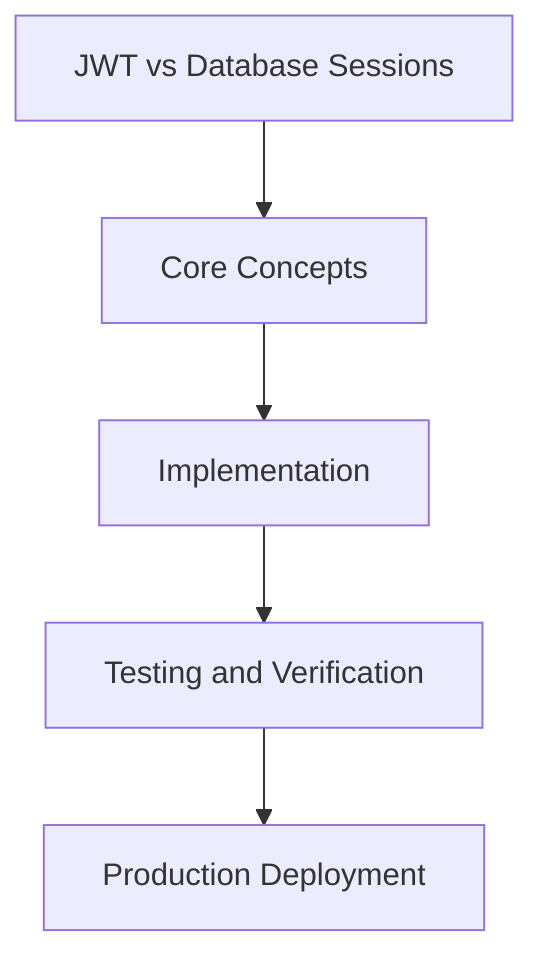

# Day 34 [Intermediate]: JWT vs Database Sessions

## Index

- [Goal](#goal)
- [Prerequisites](#prerequisites)
- [Explanation](#explanation)
- [Topic by Topic](#topic-by-topic)
- [Key Concepts](#key-concepts)
- [Visual Concept Map](#visual-concept-map)
- [End-to-End Practical](#end-to-end-practical)
- [Hands-on Coding](#hands-on-coding)
- [Mini Exercise](#mini-exercise)
- [Assessment Quiz](#assessment-quiz)
- [Task](#task)
- [Self Check](#self-check)
- [Interview Questions and Answers](#interview-questions-and-answers)
- [Day 34 Outcome](#day-34-outcome)

## Goal

Understand and apply JWT vs Database Sessions in a Next.js application to build production-quality features.

## Prerequisites

- Day 33 completed
- Solid understanding of Next.js App Router and TypeScript basics
- Familiarity with Server Components and data fetching patterns

## Explanation

NextAuth supports two session strategies: JWT (default) which stores session data in an encrypted cookie, and database sessions which store session records in your database. Each has trade-offs around performance, security, and flexibility.

## Topic by Topic

### Topic 1: JWT Sessions (Default)

Theory:
JWT sessions store the session data in an encrypted cookie. No database is needed. Fast but cannot be invalidated server-side without extra logic.

Practical:
Implement this pattern in your project and observe the behavior.

Code Example:

```tsx
// auth.ts — JWT is the default
export const { handlers, auth } = NextAuth({
  session: { strategy: "jwt" },
  providers: [GitHub],
});
```
**Explanation:**
This topic explains JWT Sessions (Default) in practical Next.js terms so you can build correct routing, rendering, and data flow patterns in real applications.

**Key Points:**
- Understand the core concept behind JWT Sessions (Default).
- Apply it with the right Next.js feature and defaults.
- Watch for common mistakes that affect performance, SEO, or maintainability.


### Topic 2: Database Sessions

Theory:
Database sessions store a session token in your database. You can invalidate them instantly but they require a database query on every request.

Practical:
Implement this pattern in your project and observe the behavior.

Code Example:

```tsx
// auth.ts — database strategy
import { PrismaAdapter } from "@auth/prisma-adapter";
import { db } from "@/lib/db";

export const { handlers, auth } = NextAuth({
  adapter: PrismaAdapter(db),
  session: { strategy: "database" },
  providers: [GitHub],
});
```
**Explanation:**
This topic explains Database Sessions in practical Next.js terms so you can build correct routing, rendering, and data flow patterns in real applications.

**Key Points:**
- Understand the core concept behind Database Sessions.
- Apply it with the right Next.js feature and defaults.
- Watch for common mistakes that affect performance, SEO, or maintainability.


### Topic 3: Adding Custom Data to JWT

Theory:
Use the jwt callback to add custom fields like user role to the token.

Practical:
Implement this pattern in your project and observe the behavior.

Code Example:

```tsx
export const { handlers, auth } = NextAuth({
  callbacks: {
    async jwt({ token, user }) {
      if (user) token.role = (user as any).role;
      return token;
    },
    async session({ session, token }) {
      if (session.user) session.user.role = token.role as string;
      return session;
    },
  },
});
```
**Explanation:**
This topic explains Adding Custom Data to JWT in practical Next.js terms so you can build correct routing, rendering, and data flow patterns in real applications.

**Key Points:**
- Understand the core concept behind Adding Custom Data to JWT.
- Apply it with the right Next.js feature and defaults.
- Watch for common mistakes that affect performance, SEO, or maintainability.


### Topic 4: Session Expiry

Theory:
Configure session expiry duration in the session options.

Practical:
Implement this pattern in your project and observe the behavior.

Code Example:

```tsx
export const { handlers, auth } = NextAuth({
  session: {
    strategy: "jwt",
    maxAge: 30 * 24 * 60 * 60, // 30 days in seconds
  },
});
```
**Explanation:**
This topic explains Session Expiry in practical Next.js terms so you can build correct routing, rendering, and data flow patterns in real applications.

**Key Points:**
- Understand the core concept behind Session Expiry.
- Apply it with the right Next.js feature and defaults.
- Watch for common mistakes that affect performance, SEO, or maintainability.


### Topic 5: When to Choose Each Strategy

Theory:
JWT is simpler and faster. Database sessions are needed when you need server-side invalidation or fine-grained session management.

Practical:
Implement this pattern in your project and observe the behavior.

Code Example:

```tsx
// JWT pros: no DB, fast, simple
// JWT cons: cannot invalidate without secret rotation

// DB sessions pros: can invalidate any session instantly
// DB sessions cons: database query on every auth check
```
**Explanation:**
This topic explains When to Choose Each Strategy in practical Next.js terms so you can build correct routing, rendering, and data flow patterns in real applications.

**Key Points:**
- Understand the core concept behind When to Choose Each Strategy.
- Apply it with the right Next.js feature and defaults.
- Watch for common mistakes that affect performance, SEO, or maintainability.


### Topic 6: TypeScript Session Augmentation

Theory:
Extend the default Session type to include custom fields like role.

Practical:
Implement this pattern in your project and observe the behavior.

Code Example:

```tsx
// types/next-auth.d.ts
import { DefaultSession } from "next-auth";

declare module "next-auth" {
  interface Session {
    user: { role: string } & DefaultSession["user"];
  }
}
```
**Explanation:**
This topic explains TypeScript Session Augmentation in practical Next.js terms so you can build correct routing, rendering, and data flow patterns in real applications.

**Key Points:**
- Understand the core concept behind TypeScript Session Augmentation.
- Apply it with the right Next.js feature and defaults.
- Watch for common mistakes that affect performance, SEO, or maintainability.


## Key Concepts

- JWT: JSON Web Token — a signed token storing session data in the cookie
- Database Session: A session record stored in your database, referenced by a token cookie
- Session Strategy: The storage approach for session data (jwt or database)
- maxAge: The duration in seconds before a session expires

## Visual Concept Map



## End-to-End Practical

1. Review the explanation and all topic examples.
2. Set up a clean Next.js project or use your existing one.
3. Implement each topic example step by step.
4. Verify the behavior in the browser.
5. Refactor and clean up your implementation.
6. Write a brief note on what you learned.

## Hands-on Coding

### Example 1: Basic JWT vs Database Sessions Implementation

```tsx
// Basic implementation of JWT vs Database Sessions
// Follow the topic examples above to build this out.
export default function Example() {
  return (
    <div style={{ padding: "24px" }}>
      <h1>JWT vs Database Sessions</h1>
      <p>Implementation complete for Day 34.</p>
    </div>
  );
}
```

### Example 2: Practical Use Case

```tsx
// A real-world use case for JWT vs Database Sessions
// Refer to the Topic by Topic section for code details.
export default function PracticalExample() {
  return (
    <div>
      <h2>Practical: JWT vs Database Sessions</h2>
    </div>
  );
}
```

### Example 3: Combined Pattern

```tsx
// Combining JWT vs Database Sessions with other Next.js features
// This example shows integration with the App Router.
export default function CombinedExample() {
  return (
    <section>
      <h2>JWT vs Database Sessions — Combined Pattern</h2>
      <p>See topic sections above for detailed code.</p>
    </section>
  );
}
```

## Mini Exercise

Scenario:
You are adding JWT vs Database Sessions to a Next.js application for a real-world feature.

Steps:

1. Create a new route or component relevant to this topic.
2. Implement the core pattern from the Topic by Topic section.
3. Test the implementation thoroughly.
4. Verify edge cases are handled.
5. Clean up and document your code.

Expected output:

- Working implementation of JWT vs Database Sessions
- All edge cases handled correctly
- Clean, readable code following Next.js conventions

## Assessment Quiz

### Quiz Questions

1. What is the primary purpose of JWT vs Database Sessions in Next.js?
2. Where in the project structure do you implement this pattern?
3. What is a common mistake when using JWT vs Database Sessions?
4. True or False: JWT vs Database Sessions only applies to Client Components.
5. How does JWT vs Database Sessions improve the user or developer experience?

### Quiz Answers

1. To enable intermediate-level functionality in a Next.js application efficiently.
2. In the App Router directory structure, using Server Components by default.
3. Mixing server and client concerns incorrectly, or skipping error handling.
4. False. This concept applies broadly across the Next.js architecture.
5. It improves maintainability, performance, and scalability of the application.

## Task

- Study all topic examples in today's lesson
- Implement the core pattern in a Next.js project
- Test all scenarios including error and edge cases
- Complete the mini exercise
- Attempt the quiz before checking answers

## Self Check

- You can implement JWT vs Database Sessions from scratch
- You understand when and why to use this pattern
- You can explain the concept in simple terms
- You have tested the implementation in a running app
- You can answer at least 4 out of 5 quiz questions correctly

## Interview Questions and Answers

### Beginner

**Question:** What is JWT vs Database Sessions in Next.js?

**Answer:** JWT vs Database Sessions is a intermediate-level Next.js feature that helps developers build robust, scalable applications by handling a specific aspect of the framework architecture.

**Question:** When would you use JWT vs Database Sessions?

**Answer:** When you need to implement the specific functionality it provides in a production Next.js application, particularly in intermediate-stage projects.

### Middle

**Question:** How does JWT vs Database Sessions interact with the Next.js App Router?

**Answer:** It integrates with the App Router through Server Components, Route Handlers, or middleware, depending on the specific implementation pattern required.

**Question:** What are common pitfalls with JWT vs Database Sessions?

**Answer:** The most common pitfalls are improper handling of server/client boundaries, missing error states, and not considering caching behavior when relevant.

### Advanced

**Question:** How would you scale JWT vs Database Sessions in a large Next.js application with multiple teams?

**Answer:** By establishing clear conventions, creating reusable utilities, documenting patterns in an Architecture Decision Record, and enforcing consistency through code review and linting rules.

**Question:** What performance considerations apply to JWT vs Database Sessions?

**Answer:** Consider bundle size impact for client-side features, caching strategies for data fetching, and rendering mode selection to balance performance with data freshness.

## Day 34 Outcome

- You understand JWT vs Database Sessions and its role in Next.js
- You can implement this pattern in a real project
- You know when to use and when to avoid this pattern
- You are ready for Day 34 — moving on to the next topic
