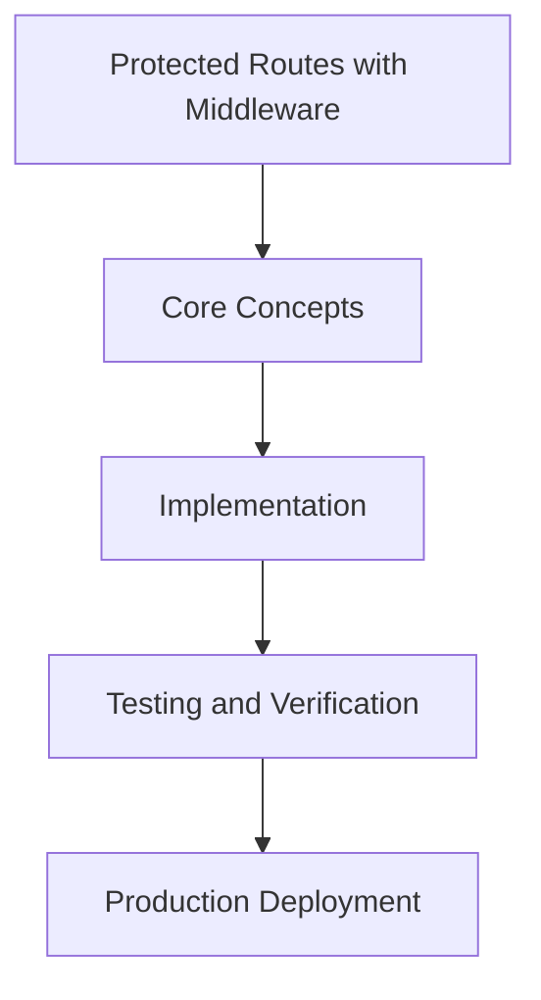

# Day 35 [Intermediate]: Protected Routes with Middleware

## Index

- [Goal](#goal)
- [Prerequisites](#prerequisites)
- [Explanation](#explanation)
- [Topic by Topic](#topic-by-topic)
- [Key Concepts](#key-concepts)
- [Visual Concept Map](#visual-concept-map)
- [End-to-End Practical](#end-to-end-practical)
- [Hands-on Coding](#hands-on-coding)
- [Mini Exercise](#mini-exercise)
- [Assessment Quiz](#assessment-quiz)
- [Task](#task)
- [Self Check](#self-check)
- [Interview Questions and Answers](#interview-questions-and-answers)
- [Day 35 Outcome](#day-35-outcome)

## Goal

Understand and apply Protected Routes with Middleware in a Next.js application to build production-quality features.

## Prerequisites

- Day 34 completed
- Solid understanding of Next.js App Router and TypeScript basics
- Familiarity with Server Components and data fetching patterns

## Explanation

Middleware in Next.js runs before a request is processed. This makes it the ideal place to check authentication and redirect unauthenticated users before they even reach the page, improving security and performance.

## Topic by Topic

### Topic 1: Middleware-based Auth Guard

Theory:
Export a middleware function from middleware.ts to intercept requests and check the session before they reach protected pages.

Practical:
Implement this pattern in your project and observe the behavior.

Code Example:

```tsx
// middleware.ts
export { auth as middleware } from "@/auth";

export const config = {
  matcher: ["/dashboard/:path*", "/admin/:path*", "/profile"],
};
```
**Explanation:**
This topic explains Middleware-based Auth Guard in practical Next.js terms so you can build correct routing, rendering, and data flow patterns in real applications.

**Key Points:**
- Understand the core concept behind Middleware-based Auth Guard.
- Apply it with the right Next.js feature and defaults.
- Watch for common mistakes that affect performance, SEO, or maintainability.


### Topic 2: Custom Middleware Logic

Theory:
For more control, wrap the auth middleware with custom logic to redirect based on session state.

Practical:
Implement this pattern in your project and observe the behavior.

Code Example:

```tsx
// middleware.ts
import { auth } from "@/auth";
import { NextResponse } from "next/server";

export default auth((req) => {
  const isLoggedIn = !!req.auth;
  const isProtected = req.nextUrl.pathname.startsWith("/dashboard");
  
  if (isProtected && !isLoggedIn) {
    return NextResponse.redirect(new URL("/login", req.url));
  }
});
```
**Explanation:**
This topic explains Custom Middleware Logic in practical Next.js terms so you can build correct routing, rendering, and data flow patterns in real applications.

**Key Points:**
- Understand the core concept behind Custom Middleware Logic.
- Apply it with the right Next.js feature and defaults.
- Watch for common mistakes that affect performance, SEO, or maintainability.


### Topic 3: Matcher Config

Theory:
The matcher in the config controls which routes the middleware runs on. Use glob patterns to match paths efficiently.

Practical:
Implement this pattern in your project and observe the behavior.

Code Example:

```tsx
export const config = {
  matcher: [
    "/((?!api|_next/static|_next/image|favicon.ico).*)",
  ],
};
```
**Explanation:**
This topic explains Matcher Config in practical Next.js terms so you can build correct routing, rendering, and data flow patterns in real applications.

**Key Points:**
- Understand the core concept behind Matcher Config.
- Apply it with the right Next.js feature and defaults.
- Watch for common mistakes that affect performance, SEO, or maintainability.


### Topic 4: Redirect vs Rewrite

Theory:
Use redirect to send users to a different URL. Use rewrite to serve different content at the same URL.

Practical:
Implement this pattern in your project and observe the behavior.

Code Example:

```tsx
// Redirect — URL changes in browser
return NextResponse.redirect(new URL("/login", req.url));

// Rewrite — URL stays the same
return NextResponse.rewrite(new URL("/404", req.url));
```
**Explanation:**
This topic explains Redirect vs Rewrite in practical Next.js terms so you can build correct routing, rendering, and data flow patterns in real applications.

**Key Points:**
- Understand the core concept behind Redirect vs Rewrite.
- Apply it with the right Next.js feature and defaults.
- Watch for common mistakes that affect performance, SEO, or maintainability.


### Topic 5: Role-based Guards in Middleware

Theory:
Read custom claims from the session token to restrict routes based on user roles.

Practical:
Implement this pattern in your project and observe the behavior.

Code Example:

```tsx
import { auth } from "@/auth";
import { NextResponse } from "next/server";

export default auth((req) => {
  const role = req.auth?.user?.role;
  if (req.nextUrl.pathname.startsWith("/admin") && role !== "admin") {
    return NextResponse.redirect(new URL("/unauthorized", req.url));
  }
});
```
**Explanation:**
This topic explains Role-based Guards in Middleware in practical Next.js terms so you can build correct routing, rendering, and data flow patterns in real applications.

**Key Points:**
- Understand the core concept behind Role-based Guards in Middleware.
- Apply it with the right Next.js feature and defaults.
- Watch for common mistakes that affect performance, SEO, or maintainability.


### Topic 6: Callback URL Preservation

Theory:
Pass the original URL as a callbackUrl so users are redirected back after signing in.

Practical:
Implement this pattern in your project and observe the behavior.

Code Example:

```tsx
if (isProtected && !isLoggedIn) {
  const loginUrl = new URL("/login", req.url);
  loginUrl.searchParams.set("callbackUrl", req.nextUrl.pathname);
  return NextResponse.redirect(loginUrl);
}
```
**Explanation:**
This topic explains Callback URL Preservation in practical Next.js terms so you can build correct routing, rendering, and data flow patterns in real applications.

**Key Points:**
- Understand the core concept behind Callback URL Preservation.
- Apply it with the right Next.js feature and defaults.
- Watch for common mistakes that affect performance, SEO, or maintainability.


## Key Concepts

- Middleware: Code that runs before a request reaches the page, used for auth guards and redirects
- Matcher: A config option defining which routes the middleware applies to
- callbackUrl: A query param storing the intended URL so the user is redirected there after login
- NextResponse.redirect: Creates an HTTP redirect response

## Visual Concept Map



## End-to-End Practical

1. Review the explanation and all topic examples.
2. Set up a clean Next.js project or use your existing one.
3. Implement each topic example step by step.
4. Verify the behavior in the browser.
5. Refactor and clean up your implementation.
6. Write a brief note on what you learned.

## Hands-on Coding

### Example 1: Basic Protected Routes with Middleware Implementation

```tsx
// Basic implementation of Protected Routes with Middleware
// Follow the topic examples above to build this out.
export default function Example() {
  return (
    <div style={{ padding: "24px" }}>
      <h1>Protected Routes with Middleware</h1>
      <p>Implementation complete for Day 35.</p>
    </div>
  );
}
```

### Example 2: Practical Use Case

```tsx
// A real-world use case for Protected Routes with Middleware
// Refer to the Topic by Topic section for code details.
export default function PracticalExample() {
  return (
    <div>
      <h2>Practical: Protected Routes with Middleware</h2>
    </div>
  );
}
```

### Example 3: Combined Pattern

```tsx
// Combining Protected Routes with Middleware with other Next.js features
// This example shows integration with the App Router.
export default function CombinedExample() {
  return (
    <section>
      <h2>Protected Routes with Middleware — Combined Pattern</h2>
      <p>See topic sections above for detailed code.</p>
    </section>
  );
}
```

## Mini Exercise

Scenario:
You are adding Protected Routes with Middleware to a Next.js application for a real-world feature.

Steps:

1. Create a new route or component relevant to this topic.
2. Implement the core pattern from the Topic by Topic section.
3. Test the implementation thoroughly.
4. Verify edge cases are handled.
5. Clean up and document your code.

Expected output:

- Working implementation of Protected Routes with Middleware
- All edge cases handled correctly
- Clean, readable code following Next.js conventions

## Assessment Quiz

### Quiz Questions

1. What is the primary purpose of Protected Routes with Middleware in Next.js?
2. Where in the project structure do you implement this pattern?
3. What is a common mistake when using Protected Routes with Middleware?
4. True or False: Protected Routes with Middleware only applies to Client Components.
5. How does Protected Routes with Middleware improve the user or developer experience?

### Quiz Answers

1. To enable intermediate-level functionality in a Next.js application efficiently.
2. In the App Router directory structure, using Server Components by default.
3. Mixing server and client concerns incorrectly, or skipping error handling.
4. False. This concept applies broadly across the Next.js architecture.
5. It improves maintainability, performance, and scalability of the application.

## Task

- Study all topic examples in today's lesson
- Implement the core pattern in a Next.js project
- Test all scenarios including error and edge cases
- Complete the mini exercise
- Attempt the quiz before checking answers

## Self Check

- You can implement Protected Routes with Middleware from scratch
- You understand when and why to use this pattern
- You can explain the concept in simple terms
- You have tested the implementation in a running app
- You can answer at least 4 out of 5 quiz questions correctly

## Interview Questions and Answers

### Beginner

**Question:** What is Protected Routes with Middleware in Next.js?

**Answer:** Protected Routes with Middleware is a intermediate-level Next.js feature that helps developers build robust, scalable applications by handling a specific aspect of the framework architecture.

**Question:** When would you use Protected Routes with Middleware?

**Answer:** When you need to implement the specific functionality it provides in a production Next.js application, particularly in intermediate-stage projects.

### Middle

**Question:** How does Protected Routes with Middleware interact with the Next.js App Router?

**Answer:** It integrates with the App Router through Server Components, Route Handlers, or middleware, depending on the specific implementation pattern required.

**Question:** What are common pitfalls with Protected Routes with Middleware?

**Answer:** The most common pitfalls are improper handling of server/client boundaries, missing error states, and not considering caching behavior when relevant.

### Advanced

**Question:** How would you scale Protected Routes with Middleware in a large Next.js application with multiple teams?

**Answer:** By establishing clear conventions, creating reusable utilities, documenting patterns in an Architecture Decision Record, and enforcing consistency through code review and linting rules.

**Question:** What performance considerations apply to Protected Routes with Middleware?

**Answer:** Consider bundle size impact for client-side features, caching strategies for data fetching, and rendering mode selection to balance performance with data freshness.

## Day 35 Outcome

- You understand Protected Routes with Middleware and its role in Next.js
- You can implement this pattern in a real project
- You know when to use and when to avoid this pattern
- You are ready for Day 35 — moving on to the next topic
