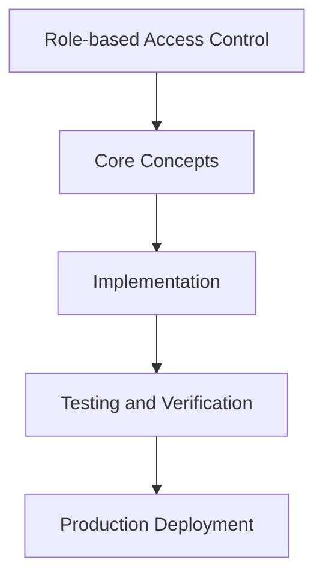

# Day 36 [Intermediate]: Role-based Access Control

## Index

- [Goal](#goal)
- [Prerequisites](#prerequisites)
- [Explanation](#explanation)
- [Topic by Topic](#topic-by-topic)
- [Key Concepts](#key-concepts)
- [Visual Concept Map](#visual-concept-map)
- [End-to-End Practical](#end-to-end-practical)
- [Hands-on Coding](#hands-on-coding)
- [Mini Exercise](#mini-exercise)
- [Assessment Quiz](#assessment-quiz)
- [Task](#task)
- [Self Check](#self-check)
- [Interview Questions and Answers](#interview-questions-and-answers)
- [Day 36 Outcome](#day-36-outcome)

## Goal

Understand and apply Role-based Access Control in a Next.js application to build production-quality features.

## Prerequisites

- Day 35 completed
- Solid understanding of Next.js App Router and TypeScript basics
- Familiarity with Server Components and data fetching patterns

## Explanation

Role-based access control (RBAC) restricts what users can see and do based on their role, such as admin, editor, or viewer. In Next.js, you implement RBAC by storing the role in the session and checking it in middleware, Server Components, and Server Actions.

## Topic by Topic

### Topic 1: Storing Role in Session

Theory:
Add a role field to the user in your database and expose it in the session via JWT callbacks.

Practical:
Implement this pattern in your project and observe the behavior.

Code Example:

```tsx
// auth.ts
callbacks: {
  async jwt({ token, user }) {
    if (user) {
      const dbUser = await db.user.findUnique({ where: { email: user.email! } });
      token.role = dbUser?.role ?? "user";
    }
    return token;
  },
  async session({ session, token }) {
    session.user.role = token.role as string;
    return session;
  },
},
```
**Explanation:**
This topic explains Storing Role in Session in practical Next.js terms so you can build correct routing, rendering, and data flow patterns in real applications.

**Key Points:**
- Understand the core concept behind Storing Role in Session.
- Apply it with the right Next.js feature and defaults.
- Watch for common mistakes that affect performance, SEO, or maintainability.


### Topic 2: Checking Role in Server Components

Theory:
Read the session in a Server Component and check the role before rendering admin-only content.

Practical:
Implement this pattern in your project and observe the behavior.

Code Example:

```tsx
import { auth } from "@/auth";
import { redirect } from "next/navigation";

export default async function AdminPage() {
  const session = await auth();
  if (session?.user?.role !== "admin") redirect("/unauthorized");
  
  return <h1>Admin Panel</h1>;
}
```
**Explanation:**
This topic explains Checking Role in Server Components in practical Next.js terms so you can build correct routing, rendering, and data flow patterns in real applications.

**Key Points:**
- Understand the core concept behind Checking Role in Server Components.
- Apply it with the right Next.js feature and defaults.
- Watch for common mistakes that affect performance, SEO, or maintainability.


### Topic 3: Role Guard in Middleware

Theory:
Protect entire route segments by checking the role in middleware before the request reaches the page.

Practical:
Implement this pattern in your project and observe the behavior.

Code Example:

```tsx
export default auth((req) => {
  const role = (req.auth as any)?.user?.role;
  if (req.nextUrl.pathname.startsWith("/admin") && role !== "admin") {
    return NextResponse.redirect(new URL("/unauthorized", req.url));
  }
});
```
**Explanation:**
This topic explains Role Guard in Middleware in practical Next.js terms so you can build correct routing, rendering, and data flow patterns in real applications.

**Key Points:**
- Understand the core concept behind Role Guard in Middleware.
- Apply it with the right Next.js feature and defaults.
- Watch for common mistakes that affect performance, SEO, or maintainability.


### Topic 4: Role-based UI Rendering

Theory:
Conditionally show UI elements based on the user role from the session.

Practical:
Implement this pattern in your project and observe the behavior.

Code Example:

```tsx
export default async function Dashboard() {
  const session = await auth();
  const isAdmin = session?.user?.role === "admin";
  
  return (
    <div>
      <h1>Dashboard</h1>
      {isAdmin && <a href="/admin">Admin Panel</a>}
    </div>
  );
}
```
**Explanation:**
This topic explains Role-based UI Rendering in practical Next.js terms so you can build correct routing, rendering, and data flow patterns in real applications.

**Key Points:**
- Understand the core concept behind Role-based UI Rendering.
- Apply it with the right Next.js feature and defaults.
- Watch for common mistakes that affect performance, SEO, or maintainability.


### Topic 5: Server Action Authorization

Theory:
Always check roles in Server Actions too. Never trust client-side-only guards.

Practical:
Implement this pattern in your project and observe the behavior.

Code Example:

```tsx
"use server";
import { auth } from "@/auth";

export async function deletePost(postId: string) {
  const session = await auth();
  if (session?.user?.role !== "admin") {
    throw new Error("Unauthorized");
  }
  await db.post.delete({ where: { id: postId } });
}
```
**Explanation:**
This topic explains Server Action Authorization in practical Next.js terms so you can build correct routing, rendering, and data flow patterns in real applications.

**Key Points:**
- Understand the core concept behind Server Action Authorization.
- Apply it with the right Next.js feature and defaults.
- Watch for common mistakes that affect performance, SEO, or maintainability.


### Topic 6: Unauthorized Page

Theory:
Create a dedicated /unauthorized page to show when a user lacks the required role.

Practical:
Implement this pattern in your project and observe the behavior.

Code Example:

```tsx
// app/unauthorized/page.tsx
export default function UnauthorizedPage() {
  return (
    <div style={{ padding: "48px", textAlign: "center" }}>
      <h1>Access Denied</h1>
      <p>You do not have permission to view this page.</p>
      <a href="/">Go Home</a>
    </div>
  );
}
```
**Explanation:**
This topic explains Unauthorized Page in practical Next.js terms so you can build correct routing, rendering, and data flow patterns in real applications.

**Key Points:**
- Understand the core concept behind Unauthorized Page.
- Apply it with the right Next.js feature and defaults.
- Watch for common mistakes that affect performance, SEO, or maintainability.


## Key Concepts

- RBAC: Role-Based Access Control — restricting features based on user roles
- Role: A label assigned to a user (admin, editor, viewer) that defines their permissions
- JWT Callback: A function to enrich the session token with custom data like role
- Authorization: Checking whether an authenticated user has permission for an action

## Visual Concept Map



## End-to-End Practical

1. Review the explanation and all topic examples.
2. Set up a clean Next.js project or use your existing one.
3. Implement each topic example step by step.
4. Verify the behavior in the browser.
5. Refactor and clean up your implementation.
6. Write a brief note on what you learned.

## Hands-on Coding

### Example 1: Basic Role-based Access Control Implementation

```tsx
// Basic implementation of Role-based Access Control
// Follow the topic examples above to build this out.
export default function Example() {
  return (
    <div style={{ padding: "24px" }}>
      <h1>Role-based Access Control</h1>
      <p>Implementation complete for Day 36.</p>
    </div>
  );
}
```

### Example 2: Practical Use Case

```tsx
// A real-world use case for Role-based Access Control
// Refer to the Topic by Topic section for code details.
export default function PracticalExample() {
  return (
    <div>
      <h2>Practical: Role-based Access Control</h2>
    </div>
  );
}
```

### Example 3: Combined Pattern

```tsx
// Combining Role-based Access Control with other Next.js features
// This example shows integration with the App Router.
export default function CombinedExample() {
  return (
    <section>
      <h2>Role-based Access Control — Combined Pattern</h2>
      <p>See topic sections above for detailed code.</p>
    </section>
  );
}
```

## Mini Exercise

Scenario:
You are adding Role-based Access Control to a Next.js application for a real-world feature.

Steps:

1. Create a new route or component relevant to this topic.
2. Implement the core pattern from the Topic by Topic section.
3. Test the implementation thoroughly.
4. Verify edge cases are handled.
5. Clean up and document your code.

Expected output:

- Working implementation of Role-based Access Control
- All edge cases handled correctly
- Clean, readable code following Next.js conventions

## Assessment Quiz

### Quiz Questions

1. What is the primary purpose of Role-based Access Control in Next.js?
2. Where in the project structure do you implement this pattern?
3. What is a common mistake when using Role-based Access Control?
4. True or False: Role-based Access Control only applies to Client Components.
5. How does Role-based Access Control improve the user or developer experience?

### Quiz Answers

1. To enable intermediate-level functionality in a Next.js application efficiently.
2. In the App Router directory structure, using Server Components by default.
3. Mixing server and client concerns incorrectly, or skipping error handling.
4. False. This concept applies broadly across the Next.js architecture.
5. It improves maintainability, performance, and scalability of the application.

## Task

- Study all topic examples in today's lesson
- Implement the core pattern in a Next.js project
- Test all scenarios including error and edge cases
- Complete the mini exercise
- Attempt the quiz before checking answers

## Self Check

- You can implement Role-based Access Control from scratch
- You understand when and why to use this pattern
- You can explain the concept in simple terms
- You have tested the implementation in a running app
- You can answer at least 4 out of 5 quiz questions correctly

## Interview Questions and Answers

### Beginner

**Question:** What is Role-based Access Control in Next.js?

**Answer:** Role-based Access Control is a intermediate-level Next.js feature that helps developers build robust, scalable applications by handling a specific aspect of the framework architecture.

**Question:** When would you use Role-based Access Control?

**Answer:** When you need to implement the specific functionality it provides in a production Next.js application, particularly in intermediate-stage projects.

### Middle

**Question:** How does Role-based Access Control interact with the Next.js App Router?

**Answer:** It integrates with the App Router through Server Components, Route Handlers, or middleware, depending on the specific implementation pattern required.

**Question:** What are common pitfalls with Role-based Access Control?

**Answer:** The most common pitfalls are improper handling of server/client boundaries, missing error states, and not considering caching behavior when relevant.

### Advanced

**Question:** How would you scale Role-based Access Control in a large Next.js application with multiple teams?

**Answer:** By establishing clear conventions, creating reusable utilities, documenting patterns in an Architecture Decision Record, and enforcing consistency through code review and linting rules.

**Question:** What performance considerations apply to Role-based Access Control?

**Answer:** Consider bundle size impact for client-side features, caching strategies for data fetching, and rendering mode selection to balance performance with data freshness.

## Day 36 Outcome

- You understand Role-based Access Control and its role in Next.js
- You can implement this pattern in a real project
- You know when to use and when to avoid this pattern
- You are ready for Day 36 — moving on to the next topic
