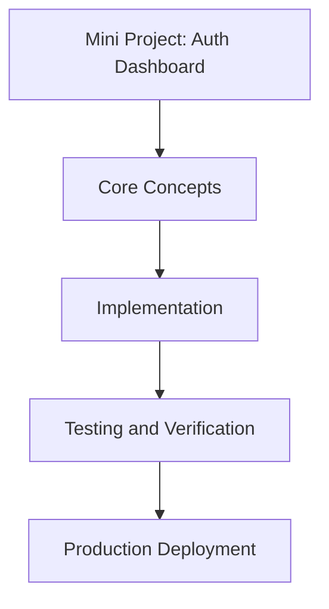

# Day 37 [Intermediate]: Mini Project: Auth Dashboard

## Index

- [Goal](#goal)
- [Prerequisites](#prerequisites)
- [Explanation](#explanation)
- [Topic by Topic](#topic-by-topic)
- [Key Concepts](#key-concepts)
- [Visual Concept Map](#visual-concept-map)
- [End-to-End Practical](#end-to-end-practical)
- [Hands-on Coding](#hands-on-coding)
- [Mini Exercise](#mini-exercise)
- [Assessment Quiz](#assessment-quiz)
- [Task](#task)
- [Self Check](#self-check)
- [Interview Questions and Answers](#interview-questions-and-answers)
- [Day 37 Outcome](#day-37-outcome)

## Goal

Understand and apply Mini Project: Auth Dashboard in a Next.js application to build production-quality features.

## Prerequisites

- Day 36 completed
- Solid understanding of Next.js App Router and TypeScript basics
- Familiarity with Server Components and data fetching patterns

## Explanation

This mini project brings together NextAuth, OAuth providers, middleware-based protection, and role-based access into a complete authenticated dashboard application.

## Topic by Topic

### Topic 1: Project Overview

Theory:
Build an auth dashboard with public home, protected user dashboard, and admin panel requiring the admin role.

Practical:
Implement this pattern in your project and observe the behavior.

Code Example:

```tsx
// Route structure:
// / — public home with sign in button
// /dashboard — protected, any signed-in user
// /admin — protected, admin role only
// /unauthorized — shown when access is denied
```
**Explanation:**
This topic explains Project Overview in practical Next.js terms so you can build correct routing, rendering, and data flow patterns in real applications.

**Key Points:**
- Understand the core concept behind Project Overview.
- Apply it with the right Next.js feature and defaults.
- Watch for common mistakes that affect performance, SEO, or maintainability.


### Topic 2: Auth Configuration

Theory:
Configure NextAuth with GitHub and Google providers plus custom JWT callbacks for role.

Practical:
Implement this pattern in your project and observe the behavior.

Code Example:

```tsx
// auth.ts
import NextAuth from "next-auth";
import GitHub from "next-auth/providers/github";
import Google from "next-auth/providers/google";

export const { handlers, auth, signIn, signOut } = NextAuth({
  providers: [GitHub, Google],
  callbacks: {
    async jwt({ token, user }) {
      if (user?.email === process.env.ADMIN_EMAIL) token.role = "admin";
      else if (user) token.role = "user";
      return token;
    },
    async session({ session, token }) {
      if (session.user) session.user.role = token.role as string;
      return session;
    },
  },
});
```
**Explanation:**
This topic explains Auth Configuration in practical Next.js terms so you can build correct routing, rendering, and data flow patterns in real applications.

**Key Points:**
- Understand the core concept behind Auth Configuration.
- Apply it with the right Next.js feature and defaults.
- Watch for common mistakes that affect performance, SEO, or maintainability.


### Topic 3: Middleware Protection

Theory:
Use middleware to enforce authentication on /dashboard and /admin routes.

Practical:
Implement this pattern in your project and observe the behavior.

Code Example:

```tsx
// middleware.ts
import { auth } from "@/auth";
import { NextResponse } from "next/server";

export default auth((req) => {
  const { pathname } = req.nextUrl;
  const role = (req.auth as any)?.user?.role;
  
  if (pathname.startsWith("/dashboard") && !req.auth) {
    return NextResponse.redirect(new URL("/login", req.url));
  }
  if (pathname.startsWith("/admin") && role !== "admin") {
    return NextResponse.redirect(new URL("/unauthorized", req.url));
  }
});

export const config = { matcher: ["/dashboard/:path*", "/admin/:path*"] };
```
**Explanation:**
This topic explains Middleware Protection in practical Next.js terms so you can build correct routing, rendering, and data flow patterns in real applications.

**Key Points:**
- Understand the core concept behind Middleware Protection.
- Apply it with the right Next.js feature and defaults.
- Watch for common mistakes that affect performance, SEO, or maintainability.


### Topic 4: Dashboard Page

Theory:
Show user info on the dashboard for any authenticated user.

Practical:
Implement this pattern in your project and observe the behavior.

Code Example:

```tsx
// app/dashboard/page.tsx
import { auth } from "@/auth";

export default async function DashboardPage() {
  const session = await auth();
  return (
    <div style={{ padding: "24px" }}>
      <h1>Your Dashboard</h1>
      <p>Welcome, {session?.user?.name}</p>
      <p>Role: {session?.user?.role}</p>
    </div>
  );
}
```
**Explanation:**
This topic explains Dashboard Page in practical Next.js terms so you can build correct routing, rendering, and data flow patterns in real applications.

**Key Points:**
- Understand the core concept behind Dashboard Page.
- Apply it with the right Next.js feature and defaults.
- Watch for common mistakes that affect performance, SEO, or maintainability.


### Topic 5: Admin Panel

Theory:
The admin panel shows extra management options only visible to admin-role users.

Practical:
Implement this pattern in your project and observe the behavior.

Code Example:

```tsx
// app/admin/page.tsx
import { auth } from "@/auth";

export default async function AdminPage() {
  const session = await auth();
  return (
    <div style={{ padding: "24px" }}>
      <h1>Admin Panel</h1>
      <p>Logged in as admin: {session?.user?.email}</p>
      <ul>
        <li>Manage Users</li>
        <li>View Analytics</li>
        <li>Site Settings</li>
      </ul>
    </div>
  );
}
```
**Explanation:**
This topic explains Admin Panel in practical Next.js terms so you can build correct routing, rendering, and data flow patterns in real applications.

**Key Points:**
- Understand the core concept behind Admin Panel.
- Apply it with the right Next.js feature and defaults.
- Watch for common mistakes that affect performance, SEO, or maintainability.


### Topic 6: Navigation Component

Theory:
Build a navigation bar that shows different links based on authentication state and role.

Practical:
Implement this pattern in your project and observe the behavior.

Code Example:

```tsx
// components/Navbar.tsx
import { auth, signIn, signOut } from "@/auth";

export default async function Navbar() {
  const session = await auth();
  return (
    <nav style={{ padding: "12px 24px", borderBottom: "1px solid #eee", display: "flex", gap: "16px" }}>
      <a href="/">Home</a>
      {session && <a href="/dashboard">Dashboard</a>}
      {session?.user?.role === "admin" && <a href="/admin">Admin</a>}
      <div style={{ marginLeft: "auto" }}>
        {session ? (
          <form action={async () => { "use server"; await signOut(); }}>
            <button type="submit">Sign Out</button>
          </form>
        ) : (
          <a href="/login">Sign In</a>
        )}
      </div>
    </nav>
  );
}
```
**Explanation:**
This topic explains Navigation Component in practical Next.js terms so you can build correct routing, rendering, and data flow patterns in real applications.

**Key Points:**
- Understand the core concept behind Navigation Component.
- Apply it with the right Next.js feature and defaults.
- Watch for common mistakes that affect performance, SEO, or maintainability.


## Key Concepts

- Mini Project: A complete working application combining multiple concepts
- ADMIN_EMAIL: An environment variable identifying which user gets admin role
- Navigation Guard: Middleware that enforces auth rules before reaching the page
- Session Role: A custom field on the session object reflecting the user permission level

## Visual Concept Map



## End-to-End Practical

1. Review the explanation and all topic examples.
2. Set up a clean Next.js project or use your existing one.
3. Implement each topic example step by step.
4. Verify the behavior in the browser.
5. Refactor and clean up your implementation.
6. Write a brief note on what you learned.

## Hands-on Coding

### Example 1: Basic Mini Project: Auth Dashboard Implementation

```tsx
// Basic implementation of Mini Project: Auth Dashboard
// Follow the topic examples above to build this out.
export default function Example() {
  return (
    <div style={{ padding: "24px" }}>
      <h1>Mini Project: Auth Dashboard</h1>
      <p>Implementation complete for Day 37.</p>
    </div>
  );
}
```

### Example 2: Practical Use Case

```tsx
// A real-world use case for Mini Project: Auth Dashboard
// Refer to the Topic by Topic section for code details.
export default function PracticalExample() {
  return (
    <div>
      <h2>Practical: Mini Project: Auth Dashboard</h2>
    </div>
  );
}
```

### Example 3: Combined Pattern

```tsx
// Combining Mini Project: Auth Dashboard with other Next.js features
// This example shows integration with the App Router.
export default function CombinedExample() {
  return (
    <section>
      <h2>Mini Project: Auth Dashboard — Combined Pattern</h2>
      <p>See topic sections above for detailed code.</p>
    </section>
  );
}
```

## Mini Exercise

Scenario:
You are adding Mini Project: Auth Dashboard to a Next.js application for a real-world feature.

Steps:

1. Create a new route or component relevant to this topic.
2. Implement the core pattern from the Topic by Topic section.
3. Test the implementation thoroughly.
4. Verify edge cases are handled.
5. Clean up and document your code.

Expected output:

- Working implementation of Mini Project: Auth Dashboard
- All edge cases handled correctly
- Clean, readable code following Next.js conventions

## Assessment Quiz

### Quiz Questions

1. What is the primary purpose of Mini Project: Auth Dashboard in Next.js?
2. Where in the project structure do you implement this pattern?
3. What is a common mistake when using Mini Project: Auth Dashboard?
4. True or False: Mini Project: Auth Dashboard only applies to Client Components.
5. How does Mini Project: Auth Dashboard improve the user or developer experience?

### Quiz Answers

1. To enable intermediate-level functionality in a Next.js application efficiently.
2. In the App Router directory structure, using Server Components by default.
3. Mixing server and client concerns incorrectly, or skipping error handling.
4. False. This concept applies broadly across the Next.js architecture.
5. It improves maintainability, performance, and scalability of the application.

## Task

- Study all topic examples in today's lesson
- Implement the core pattern in a Next.js project
- Test all scenarios including error and edge cases
- Complete the mini exercise
- Attempt the quiz before checking answers

## Self Check

- You can implement Mini Project: Auth Dashboard from scratch
- You understand when and why to use this pattern
- You can explain the concept in simple terms
- You have tested the implementation in a running app
- You can answer at least 4 out of 5 quiz questions correctly

## Interview Questions and Answers

### Beginner

**Question:** What is Mini Project: Auth Dashboard in Next.js?

**Answer:** Mini Project: Auth Dashboard is a intermediate-level Next.js feature that helps developers build robust, scalable applications by handling a specific aspect of the framework architecture.

**Question:** When would you use Mini Project: Auth Dashboard?

**Answer:** When you need to implement the specific functionality it provides in a production Next.js application, particularly in intermediate-stage projects.

### Middle

**Question:** How does Mini Project: Auth Dashboard interact with the Next.js App Router?

**Answer:** It integrates with the App Router through Server Components, Route Handlers, or middleware, depending on the specific implementation pattern required.

**Question:** What are common pitfalls with Mini Project: Auth Dashboard?

**Answer:** The most common pitfalls are improper handling of server/client boundaries, missing error states, and not considering caching behavior when relevant.

### Advanced

**Question:** How would you scale Mini Project: Auth Dashboard in a large Next.js application with multiple teams?

**Answer:** By establishing clear conventions, creating reusable utilities, documenting patterns in an Architecture Decision Record, and enforcing consistency through code review and linting rules.

**Question:** What performance considerations apply to Mini Project: Auth Dashboard?

**Answer:** Consider bundle size impact for client-side features, caching strategies for data fetching, and rendering mode selection to balance performance with data freshness.

## Day 37 Outcome

- You understand Mini Project: Auth Dashboard and its role in Next.js
- You can implement this pattern in a real project
- You know when to use and when to avoid this pattern
- You are ready for Day 37 — moving on to the next topic
