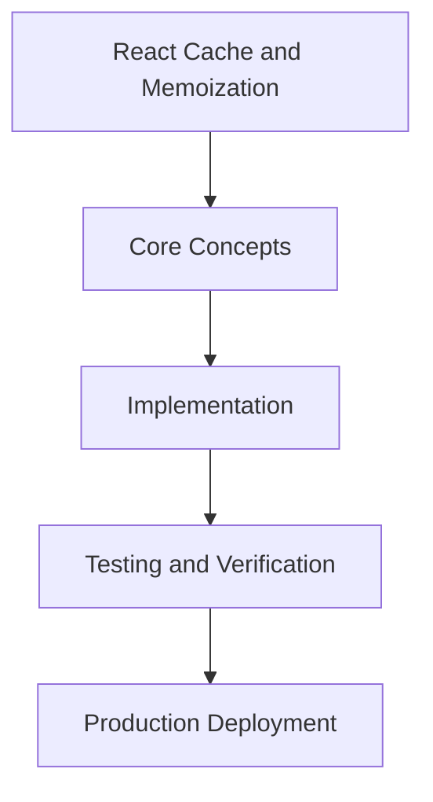

# Day 46 [Intermediate]: React Cache and Memoization

## Index

- [Goal](#goal)
- [Prerequisites](#prerequisites)
- [Explanation](#explanation)
- [Topic by Topic](#topic-by-topic)
- [Key Concepts](#key-concepts)
- [Visual Concept Map](#visual-concept-map)
- [End-to-End Practical](#end-to-end-practical)
- [Hands-on Coding](#hands-on-coding)
- [Mini Exercise](#mini-exercise)
- [Assessment Quiz](#assessment-quiz)
- [Task](#task)
- [Self Check](#self-check)
- [Interview Questions and Answers](#interview-questions-and-answers)
- [Day 46 Outcome](#day-46-outcome)

## Goal

Understand and apply React Cache and Memoization in a Next.js application to build production-quality features.

## Prerequisites

- Day 45 completed
- Solid understanding of Next.js App Router and TypeScript basics
- Familiarity with Server Components and data fetching patterns

## Explanation

React Cache and Memoization is an important concept in Next.js intermediate development. Understanding this topic enables you to build more powerful and production-ready Next.js applications.

## Topic by Topic

### Topic 1: React Cache and Memoization — Part 1

Theory:
This aspect of React Cache and Memoization is essential for production Next.js applications. It builds on core concepts and enables scalable patterns.

Practical:
Apply this concept in a Next.js project and verify it works as expected.

Code Example:

```tsx
// React Cache and Memoization — Topic 1
// Implementation depends on your specific use case.
// Refer to the Next.js documentation for detailed API reference.
export default function Example1() {
  return <div>React Cache and Memoization — Example 1</div>;
}
```
**Explanation:**
This topic explains React Cache and Memoization — Part 1 in practical Next.js terms so you can build correct routing, rendering, and data flow patterns in real applications.

**Key Points:**
- Understand the core concept behind React Cache and Memoization — Part 1.
- Apply it with the right Next.js feature and defaults.
- Watch for common mistakes that affect performance, SEO, or maintainability.


### Topic 2: React Cache and Memoization — Part 2

Theory:
This aspect of React Cache and Memoization is essential for production Next.js applications. It builds on core concepts and enables scalable patterns.

Practical:
Apply this concept in a Next.js project and verify it works as expected.

Code Example:

```tsx
// React Cache and Memoization — Topic 2
// Implementation depends on your specific use case.
// Refer to the Next.js documentation for detailed API reference.
export default function Example2() {
  return <div>React Cache and Memoization — Example 2</div>;
}
```
**Explanation:**
This topic explains React Cache and Memoization — Part 2 in practical Next.js terms so you can build correct routing, rendering, and data flow patterns in real applications.

**Key Points:**
- Understand the core concept behind React Cache and Memoization — Part 2.
- Apply it with the right Next.js feature and defaults.
- Watch for common mistakes that affect performance, SEO, or maintainability.


### Topic 3: React Cache and Memoization — Part 3

Theory:
This aspect of React Cache and Memoization is essential for production Next.js applications. It builds on core concepts and enables scalable patterns.

Practical:
Apply this concept in a Next.js project and verify it works as expected.

Code Example:

```tsx
// React Cache and Memoization — Topic 3
// Implementation depends on your specific use case.
// Refer to the Next.js documentation for detailed API reference.
export default function Example3() {
  return <div>React Cache and Memoization — Example 3</div>;
}
```
**Explanation:**
This topic explains React Cache and Memoization — Part 3 in practical Next.js terms so you can build correct routing, rendering, and data flow patterns in real applications.

**Key Points:**
- Understand the core concept behind React Cache and Memoization — Part 3.
- Apply it with the right Next.js feature and defaults.
- Watch for common mistakes that affect performance, SEO, or maintainability.


### Topic 4: React Cache and Memoization — Part 4

Theory:
This aspect of React Cache and Memoization is essential for production Next.js applications. It builds on core concepts and enables scalable patterns.

Practical:
Apply this concept in a Next.js project and verify it works as expected.

Code Example:

```tsx
// React Cache and Memoization — Topic 4
// Implementation depends on your specific use case.
// Refer to the Next.js documentation for detailed API reference.
export default function Example4() {
  return <div>React Cache and Memoization — Example 4</div>;
}
```
**Explanation:**
This topic explains React Cache and Memoization — Part 4 in practical Next.js terms so you can build correct routing, rendering, and data flow patterns in real applications.

**Key Points:**
- Understand the core concept behind React Cache and Memoization — Part 4.
- Apply it with the right Next.js feature and defaults.
- Watch for common mistakes that affect performance, SEO, or maintainability.


### Topic 5: React Cache and Memoization — Part 5

Theory:
This aspect of React Cache and Memoization is essential for production Next.js applications. It builds on core concepts and enables scalable patterns.

Practical:
Apply this concept in a Next.js project and verify it works as expected.

Code Example:

```tsx
// React Cache and Memoization — Topic 5
// Implementation depends on your specific use case.
// Refer to the Next.js documentation for detailed API reference.
export default function Example5() {
  return <div>React Cache and Memoization — Example 5</div>;
}
```
**Explanation:**
This topic explains React Cache and Memoization — Part 5 in practical Next.js terms so you can build correct routing, rendering, and data flow patterns in real applications.

**Key Points:**
- Understand the core concept behind React Cache and Memoization — Part 5.
- Apply it with the right Next.js feature and defaults.
- Watch for common mistakes that affect performance, SEO, or maintainability.


### Topic 6: React Cache and Memoization — Part 6

Theory:
This aspect of React Cache and Memoization is essential for production Next.js applications. It builds on core concepts and enables scalable patterns.

Practical:
Apply this concept in a Next.js project and verify it works as expected.

Code Example:

```tsx
// React Cache and Memoization — Topic 6
// Implementation depends on your specific use case.
// Refer to the Next.js documentation for detailed API reference.
export default function Example6() {
  return <div>React Cache and Memoization — Example 6</div>;
}
```
**Explanation:**
This topic explains React Cache and Memoization — Part 6 in practical Next.js terms so you can build correct routing, rendering, and data flow patterns in real applications.

**Key Points:**
- Understand the core concept behind React Cache and Memoization — Part 6.
- Apply it with the right Next.js feature and defaults.
- Watch for common mistakes that affect performance, SEO, or maintainability.


## Key Concepts

- React Cache and Memoization: Core concept for intermediate Next.js development
- Next.js App Router: The modern routing system using the app/ directory
- Server Component: A component that runs on the server only
- TypeScript: Strongly typed JavaScript used throughout Next.js projects

## Visual Concept Map



## End-to-End Practical

1. Review the explanation and all topic examples.
2. Set up a clean Next.js project or use your existing one.
3. Implement each topic example step by step.
4. Verify the behavior in the browser.
5. Refactor and clean up your implementation.
6. Write a brief note on what you learned.

## Hands-on Coding

### Example 1: Basic React Cache and Memoization Implementation

```tsx
// Basic implementation of React Cache and Memoization
// Follow the topic examples above to build this out.
export default function Example() {
  return (
    <div style={{ padding: "24px" }}>
      <h1>React Cache and Memoization</h1>
      <p>Implementation complete for Day 46.</p>
    </div>
  );
}
```

### Example 2: Practical Use Case

```tsx
// A real-world use case for React Cache and Memoization
// Refer to the Topic by Topic section for code details.
export default function PracticalExample() {
  return (
    <div>
      <h2>Practical: React Cache and Memoization</h2>
    </div>
  );
}
```

### Example 3: Combined Pattern

```tsx
// Combining React Cache and Memoization with other Next.js features
// This example shows integration with the App Router.
export default function CombinedExample() {
  return (
    <section>
      <h2>React Cache and Memoization — Combined Pattern</h2>
      <p>See topic sections above for detailed code.</p>
    </section>
  );
}
```

## Mini Exercise

Scenario:
You are adding React Cache and Memoization to a Next.js application for a real-world feature.

Steps:

1. Create a new route or component relevant to this topic.
2. Implement the core pattern from the Topic by Topic section.
3. Test the implementation thoroughly.
4. Verify edge cases are handled.
5. Clean up and document your code.

Expected output:

- Working implementation of React Cache and Memoization
- All edge cases handled correctly
- Clean, readable code following Next.js conventions

## Assessment Quiz

### Quiz Questions

1. What is the primary purpose of React Cache and Memoization in Next.js?
2. Where in the project structure do you implement this pattern?
3. What is a common mistake when using React Cache and Memoization?
4. True or False: React Cache and Memoization only applies to Client Components.
5. How does React Cache and Memoization improve the user or developer experience?

### Quiz Answers

1. To enable intermediate-level functionality in a Next.js application efficiently.
2. In the App Router directory structure, using Server Components by default.
3. Mixing server and client concerns incorrectly, or skipping error handling.
4. False. This concept applies broadly across the Next.js architecture.
5. It improves maintainability, performance, and scalability of the application.

## Task

- Study all topic examples in today's lesson
- Implement the core pattern in a Next.js project
- Test all scenarios including error and edge cases
- Complete the mini exercise
- Attempt the quiz before checking answers

## Self Check

- You can implement React Cache and Memoization from scratch
- You understand when and why to use this pattern
- You can explain the concept in simple terms
- You have tested the implementation in a running app
- You can answer at least 4 out of 5 quiz questions correctly

## Interview Questions and Answers

### Beginner

**Question:** What is React Cache and Memoization in Next.js?

**Answer:** React Cache and Memoization is a intermediate-level Next.js feature that helps developers build robust, scalable applications by handling a specific aspect of the framework architecture.

**Question:** When would you use React Cache and Memoization?

**Answer:** When you need to implement the specific functionality it provides in a production Next.js application, particularly in intermediate-stage projects.

### Middle

**Question:** How does React Cache and Memoization interact with the Next.js App Router?

**Answer:** It integrates with the App Router through Server Components, Route Handlers, or middleware, depending on the specific implementation pattern required.

**Question:** What are common pitfalls with React Cache and Memoization?

**Answer:** The most common pitfalls are improper handling of server/client boundaries, missing error states, and not considering caching behavior when relevant.

### Advanced

**Question:** How would you scale React Cache and Memoization in a large Next.js application with multiple teams?

**Answer:** By establishing clear conventions, creating reusable utilities, documenting patterns in an Architecture Decision Record, and enforcing consistency through code review and linting rules.

**Question:** What performance considerations apply to React Cache and Memoization?

**Answer:** Consider bundle size impact for client-side features, caching strategies for data fetching, and rendering mode selection to balance performance with data freshness.

## Day 46 Outcome

- You understand React Cache and Memoization and its role in Next.js
- You can implement this pattern in a real project
- You know when to use and when to avoid this pattern
- You are ready for Day 46 — moving on to the next topic
