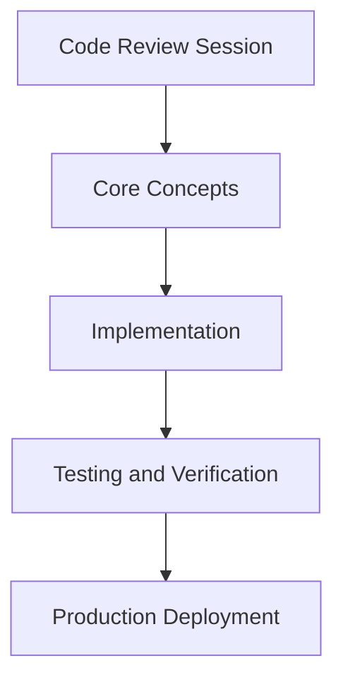

# Day 50 [Intermediate]: Code Review Session

## Index

- [Goal](#goal)
- [Prerequisites](#prerequisites)
- [Explanation](#explanation)
- [Topic by Topic](#topic-by-topic)
- [Key Concepts](#key-concepts)
- [Visual Concept Map](#visual-concept-map)
- [End-to-End Practical](#end-to-end-practical)
- [Hands-on Coding](#hands-on-coding)
- [Mini Exercise](#mini-exercise)
- [Assessment Quiz](#assessment-quiz)
- [Task](#task)
- [Self Check](#self-check)
- [Interview Questions and Answers](#interview-questions-and-answers)
- [Day 50 Outcome](#day-50-outcome)

## Goal

Understand and apply Code Review Session in a Next.js application to build production-quality features.

## Prerequisites

- Day 49 completed
- Solid understanding of Next.js App Router and TypeScript basics
- Familiarity with Server Components and data fetching patterns

## Explanation

A good code review in Next.js is not about style-only comments. It is a structured check for correctness, security, performance, and long-term maintainability.

In this session, you learn a practical review checklist for App Router projects: component boundaries, data fetching and caching, error paths, input safety, bundle impact, and test confidence. This helps teams catch production issues early and ship safer changes.

## Topic by Topic

### Topic 1: Review Architecture and Component Boundaries

Theory:
First review whether responsibilities are in the right place: Server Components for data and secure logic, Client Components for browser interactivity.

Practical:
Check if any file adds client-only logic where server rendering should be used, or leaks server-only code into client bundles.

Code Example:

```tsx
// Code Review Session — Topic 1
// Implementation depends on your specific use case.
// Refer to the Next.js documentation for detailed API reference.
export default function Example1() {
  return <div>Code Review Session — Example 1</div>;
}
```

**Explanation:**
This review step verifies clean boundaries between server and client code. Strong boundaries reduce hydration bugs, avoid accidental secret leaks, and keep rendering predictable.

**Key Points:**

- Validate where use client is required and where it is unnecessary.
- Keep data access and privileged logic in Server Components or Route Handlers.
- Ensure file and route structure communicates intent clearly.

### Topic 2: Review Data Fetching and Caching Behavior

Theory:
Next.js caching defaults can change runtime behavior. Reviews must confirm whether a page is static, dynamic, revalidated, or no-store by design.

Practical:
Check fetch calls, revalidate values, and cache tags against product expectations for freshness and cost.

Code Example:

```tsx
// Code Review Session — Topic 2
// Implementation depends on your specific use case.
// Refer to the Next.js documentation for detailed API reference.
export default function Example2() {
  return <div>Code Review Session — Example 2</div>;
}
```

**Explanation:**
This step prevents stale-data bugs and unnecessary server load. It ensures caching strategy matches business needs, not accidental framework defaults.

**Key Points:**

- Confirm each fetch has an intentional cache policy.
- Verify revalidate windows are realistic for the domain.
- Flag places where cache invalidation is missing after mutations.

### Topic 3: Review Loading, Error, and Empty States

Theory:
Production quality includes failure handling. App Router supports loading.tsx, error.tsx, and not-found.tsx to keep UX stable during failures.

Practical:
Check whether every important route has meaningful states for slow network, empty response, and runtime errors.

Code Example:

```tsx
// Code Review Session — Topic 3
// Implementation depends on your specific use case.
// Refer to the Next.js documentation for detailed API reference.
export default function Example3() {
  return <div>Code Review Session — Example 3</div>;
}
```

**Explanation:**
This review step protects user trust. Instead of broken screens, users get predictable feedback and recovery paths when something goes wrong.

**Key Points:**

- Verify route-level loading and error boundaries exist where needed.
- Ensure empty datasets have clear UX, not silent blank sections.
- Confirm logs and monitoring hooks capture failure context.

### Topic 4: Review Security and Input Safety

Theory:
Code review must inspect trust boundaries: request input, cookies, headers, auth checks, and server actions that mutate data.

Practical:
Check validation schemas, authorization guards, and handling of untrusted input in route handlers and actions.

Code Example:

```tsx
// Code Review Session — Topic 4
// Implementation depends on your specific use case.
// Refer to the Next.js documentation for detailed API reference.
export default function Example4() {
  return <div>Code Review Session — Example 4</div>;
}
```

**Explanation:**
This step catches high-risk issues early, such as missing auth checks, unsafe redirects, or weak input validation in server-side entry points.

**Key Points:**

- Require schema validation for all external input.
- Verify authorization at server boundaries, not only in UI.
- Check cookie and header usage for secure defaults.

### Topic 5: Review Performance and Bundle Impact

Theory:
Performance review checks both server latency and client bundle size. The goal is fast first load and efficient interactions.

Practical:
Inspect client component usage, third-party libraries, image/font settings, and opportunities for streaming or code splitting.

Code Example:

```tsx
// Code Review Session — Topic 5
// Implementation depends on your specific use case.
// Refer to the Next.js documentation for detailed API reference.
export default function Example5() {
  return <div>Code Review Session — Example 5</div>;
}
```

**Explanation:**
This step prevents regressions that pass functional tests but degrade Core Web Vitals and user experience in real devices and networks.

**Key Points:**

- Minimize client-side JavaScript where server rendering is enough.
- Confirm image, font, and caching settings are optimized.
- Use profiling evidence before accepting expensive dependencies.

### Topic 6: Review Test Coverage and Maintainability

Theory:
Maintainable code is understandable and verifiable. Reviews should check naming clarity, module boundaries, and presence of focused tests.

Practical:
Verify changed paths include meaningful tests for success and failure scenarios, and that reviewer notes are converted into actionable follow-ups.

Code Example:

```tsx
// Code Review Session — Topic 6
// Implementation depends on your specific use case.
// Refer to the Next.js documentation for detailed API reference.
export default function Example6() {
  return <div>Code Review Session — Example 6</div>;
}
```

**Explanation:**
This final step ensures the change remains reliable after handoff. It reduces rework by making behavior explicit and test-backed.

**Key Points:**

- Ask for tests that validate critical behavior, not only snapshots.
- Prefer small, composable modules with clear responsibilities.
- Capture unresolved risks as follow-up issues before merge.

## Key Concepts

- Code Review Session: Core concept for intermediate Next.js development
- Next.js App Router: The modern routing system using the app/ directory
- Server Component: A component that runs on the server only
- TypeScript: Strongly typed JavaScript used throughout Next.js projects

## Visual Concept Map



## End-to-End Practical

1. Review the explanation and all topic examples.
2. Set up a clean Next.js project or use your existing one.
3. Implement each topic example step by step.
4. Verify the behavior in the browser.
5. Refactor and clean up your implementation.
6. Write a brief note on what you learned.

## Hands-on Coding

### Example 1: Basic Code Review Session Implementation

```tsx
// Basic implementation of Code Review Session
// Follow the topic examples above to build this out.
export default function Example() {
  return (
    <div style={{ padding: "24px" }}>
      <h1>Code Review Session</h1>
      <p>Implementation complete for Day 50.</p>
    </div>
  );
}
```

### Example 2: Practical Use Case

```tsx
// A real-world use case for Code Review Session
// Refer to the Topic by Topic section for code details.
export default function PracticalExample() {
  return (
    <div>
      <h2>Practical: Code Review Session</h2>
    </div>
  );
}
```

### Example 3: Combined Pattern

```tsx
// Combining Code Review Session with other Next.js features
// This example shows integration with the App Router.
export default function CombinedExample() {
  return (
    <section>
      <h2>Code Review Session — Combined Pattern</h2>
      <p>See topic sections above for detailed code.</p>
    </section>
  );
}
```

## Mini Exercise

Scenario:
You are adding Code Review Session to a Next.js application for a real-world feature.

Steps:

1. Create a new route or component relevant to this topic.
2. Implement the core pattern from the Topic by Topic section.
3. Test the implementation thoroughly.
4. Verify edge cases are handled.
5. Clean up and document your code.

Expected output:

- Working implementation of Code Review Session
- All edge cases handled correctly
- Clean, readable code following Next.js conventions

## Assessment Quiz

### Quiz Questions

1. What is the primary purpose of Code Review Session in Next.js?
2. Where in the project structure do you implement this pattern?
3. What is a common mistake when using Code Review Session?
4. True or False: Code Review Session only applies to Client Components.
5. How does Code Review Session improve the user or developer experience?

### Quiz Answers

1. To enable intermediate-level functionality in a Next.js application efficiently.
2. In the App Router directory structure, using Server Components by default.
3. Mixing server and client concerns incorrectly, or skipping error handling.
4. False. This concept applies broadly across the Next.js architecture.
5. It improves maintainability, performance, and scalability of the application.

## Task

- Study all topic examples in today's lesson
- Implement the core pattern in a Next.js project
- Test all scenarios including error and edge cases
- Complete the mini exercise
- Attempt the quiz before checking answers

## Self Check

- You can implement Code Review Session from scratch
- You understand when and why to use this pattern
- You can explain the concept in simple terms
- You have tested the implementation in a running app
- You can answer at least 4 out of 5 quiz questions correctly

## Interview Questions and Answers

### Beginner

**Question:** What is Code Review Session in Next.js?

**Answer:** Code Review Session is a intermediate-level Next.js feature that helps developers build robust, scalable applications by handling a specific aspect of the framework architecture.

**Question:** When would you use Code Review Session?

**Answer:** When you need to implement the specific functionality it provides in a production Next.js application, particularly in intermediate-stage projects.

### Middle

**Question:** How does Code Review Session interact with the Next.js App Router?

**Answer:** It integrates with the App Router through Server Components, Route Handlers, or middleware, depending on the specific implementation pattern required.

**Question:** What are common pitfalls with Code Review Session?

**Answer:** The most common pitfalls are improper handling of server/client boundaries, missing error states, and not considering caching behavior when relevant.

### Advanced

**Question:** How would you scale Code Review Session in a large Next.js application with multiple teams?

**Answer:** By establishing clear conventions, creating reusable utilities, documenting patterns in an Architecture Decision Record, and enforcing consistency through code review and linting rules.

**Question:** What performance considerations apply to Code Review Session?

**Answer:** Consider bundle size impact for client-side features, caching strategies for data fetching, and rendering mode selection to balance performance with data freshness.

## Day 50 Outcome

- You understand Code Review Session and its role in Next.js
- You can implement this pattern in a real project
- You know when to use and when to avoid this pattern
- You are ready for Day 50 — moving on to the next topic
