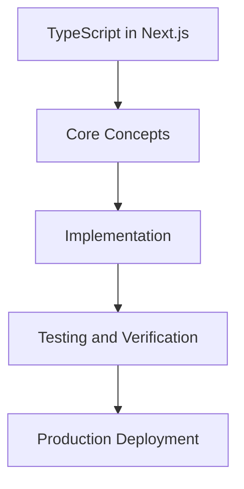

# Day 51 [Advanced]: TypeScript in Next.js

## Index

- [Goal](#goal)
- [Prerequisites](#prerequisites)
- [Explanation](#explanation)
- [Topic by Topic](#topic-by-topic)
- [Key Concepts](#key-concepts)
- [Visual Concept Map](#visual-concept-map)
- [End-to-End Practical](#end-to-end-practical)
- [Hands-on Coding](#hands-on-coding)
- [Mini Exercise](#mini-exercise)
- [Assessment Quiz](#assessment-quiz)
- [Task](#task)
- [Self Check](#self-check)
- [Interview Questions and Answers](#interview-questions-and-answers)
- [Day 51 Outcome](#day-51-outcome)

## Goal

Understand and apply TypeScript in Next.js in a Next.js application to build production-quality features.

## Prerequisites

- Day 50 completed
- Solid understanding of Next.js App Router and TypeScript basics
- Familiarity with Server Components and data fetching patterns

## Explanation

TypeScript in Next.js is most valuable when it prevents real production bugs: wrong route params, unsafe API payloads, broken server/client contracts, and accidental null access.

This lesson focuses on practical typing boundaries in App Router projects. You will type page params, server fetch results, route handlers, server actions, and shared UI props so the compiler catches problems before they reach users.

## Topic by Topic

### Topic 1: TypeScript Project and Strict Settings

Theory:
Strong TypeScript starts with strict compiler rules. In Next.js, strict settings improve safety for both server and client code paths.

Practical:
Review tsconfig options and enable strict null checks and noUncheckedIndexedAccess in larger apps.

Code Example:

```tsx
// TypeScript in Next.js — Topic 1
// Implementation depends on your specific use case.
// Refer to the Next.js documentation for detailed API reference.
export default function Example1() {
  return <div>TypeScript in Next.js — Example 1</div>;
}
```

**Explanation:**
This step sets the baseline quality bar. Strict settings surface hidden bugs early and reduce runtime surprises during refactors.

**Key Points:**

- Keep compiler settings intentional and documented.
- Prefer stricter checks in production codebases.
- Fix type errors instead of bypassing with any.

### Topic 2: Typing Route Params and Search Params

Theory:
App Router pages receive params and searchParams. Incorrect assumptions here are a frequent source of undefined errors.

Practical:
Define explicit param types and validate dynamic route values before use.

Code Example:

```tsx
// TypeScript in Next.js — Topic 2
// Implementation depends on your specific use case.
// Refer to the Next.js documentation for detailed API reference.
export default function Example2() {
  return <div>TypeScript in Next.js — Example 2</div>;
}
```

**Explanation:**
Typing route input makes navigation-safe code. It ensures page logic handles optional query values and malformed URL data correctly.

**Key Points:**

- Type params and searchParams explicitly at entry points.
- Guard and parse values instead of trusting raw strings.
- Keep route contracts consistent across links and pages.

### Topic 3: Type-safe Data Fetching in Server Components

Theory:
Server Components are ideal for typed data fetching because they run on the server and can fail fast with clear error boundaries.

Practical:
Create typed fetch helpers that validate response shape and return domain models.

Code Example:

```tsx
// TypeScript in Next.js — Topic 3
// Implementation depends on your specific use case.
// Refer to the Next.js documentation for detailed API reference.
export default function Example3() {
  return <div>TypeScript in Next.js — Example 3</div>;
}
```

**Explanation:**
Typed fetch layers protect UI components from unpredictable API responses and make refactoring safer as backend schemas evolve.

**Key Points:**

- Separate transport types from UI view models.
- Handle null, empty, and error cases in typed returns.
- Reuse typed helpers to avoid duplicate parsing logic.

### Topic 4: Typing Route Handlers and API Contracts

Theory:
Route Handlers are server boundaries. Their request and response contracts should be explicit and stable.

Practical:
Define request body and response shapes, then enforce them in handler implementation.

Code Example:

```tsx
// TypeScript in Next.js — Topic 4
// Implementation depends on your specific use case.
// Refer to the Next.js documentation for detailed API reference.
export default function Example4() {
  return <div>TypeScript in Next.js — Example 4</div>;
}
```

**Explanation:**
Strong API typing improves collaboration between frontend and backend by reducing guesswork and preventing accidental contract drift.

**Key Points:**

- Type both input and output for every route handler.
- Return consistent error payloads for easier client handling.
- Avoid implicit any in JSON parsing and transformation.

### Topic 5: Type-safe Server Actions and Forms

Theory:
Server Actions move mutation logic server-side, but form data is still untrusted input and must be validated and typed.

Practical:
Use typed validation output and model action return states for success and failure paths.

Code Example:

```tsx
// TypeScript in Next.js — Topic 5
// Implementation depends on your specific use case.
// Refer to the Next.js documentation for detailed API reference.
export default function Example5() {
  return <div>TypeScript in Next.js — Example 5</div>;
}
```

**Explanation:**
This step gives safer mutations and cleaner UI feedback. Typed action states make pending, success, and error rendering straightforward.

**Key Points:**

- Validate FormData before business logic.
- Return discriminated unions for action outcomes.
- Keep form field names and schema keys synchronized.

### Topic 6: Shared Types, Boundaries, and Refactor Safety

Theory:
As apps grow, scattered types cause drift. Shared type modules and clear boundaries keep teams aligned and refactors safe.

Practical:
Organize domain types, DTOs, and UI props so changes are discoverable and compiler-guided.

Code Example:

```tsx
// TypeScript in Next.js — Topic 6
// Implementation depends on your specific use case.
// Refer to the Next.js documentation for detailed API reference.
export default function Example6() {
  return <div>TypeScript in Next.js — Example 6</div>;
}
```

**Explanation:**
This final step improves long-term maintainability. Good type organization turns large refactors into guided changes instead of risky manual edits.

**Key Points:**

- Centralize shared contracts with clear ownership.
- Avoid circular dependencies between type modules.
- Let compile errors guide safe multi-file refactors.

## Key Concepts

- TypeScript in Next.js: Core concept for advanced Next.js development
- Next.js App Router: The modern routing system using the app/ directory
- Server Component: A component that runs on the server only
- TypeScript: Strongly typed JavaScript used throughout Next.js projects

## Visual Concept Map



## End-to-End Practical

1. Review the explanation and all topic examples.
2. Set up a clean Next.js project or use your existing one.
3. Implement each topic example step by step.
4. Verify the behavior in the browser.
5. Refactor and clean up your implementation.
6. Write a brief note on what you learned.

## Hands-on Coding

### Example 1: Basic TypeScript in Next.js Implementation

```tsx
// Basic implementation of TypeScript in Next.js
// Follow the topic examples above to build this out.
export default function Example() {
  return (
    <div style={{ padding: "24px" }}>
      <h1>TypeScript in Next.js</h1>
      <p>Implementation complete for Day 51.</p>
    </div>
  );
}
```

### Example 2: Practical Use Case

```tsx
// A real-world use case for TypeScript in Next.js
// Refer to the Topic by Topic section for code details.
export default function PracticalExample() {
  return (
    <div>
      <h2>Practical: TypeScript in Next.js</h2>
    </div>
  );
}
```

### Example 3: Combined Pattern

```tsx
// Combining TypeScript in Next.js with other Next.js features
// This example shows integration with the App Router.
export default function CombinedExample() {
  return (
    <section>
      <h2>TypeScript in Next.js — Combined Pattern</h2>
      <p>See topic sections above for detailed code.</p>
    </section>
  );
}
```

## Mini Exercise

Scenario:
You are adding TypeScript in Next.js to a Next.js application for a real-world feature.

Steps:

1. Create a new route or component relevant to this topic.
2. Implement the core pattern from the Topic by Topic section.
3. Test the implementation thoroughly.
4. Verify edge cases are handled.
5. Clean up and document your code.

Expected output:

- Working implementation of TypeScript in Next.js
- All edge cases handled correctly
- Clean, readable code following Next.js conventions

## Assessment Quiz

### Quiz Questions

1. What is the primary purpose of TypeScript in Next.js in Next.js?
2. Where in the project structure do you implement this pattern?
3. What is a common mistake when using TypeScript in Next.js?
4. True or False: TypeScript in Next.js only applies to Client Components.
5. How does TypeScript in Next.js improve the user or developer experience?

### Quiz Answers

1. To enable advanced-level functionality in a Next.js application efficiently.
2. In the App Router directory structure, using Server Components by default.
3. Mixing server and client concerns incorrectly, or skipping error handling.
4. False. This concept applies broadly across the Next.js architecture.
5. It improves maintainability, performance, and scalability of the application.

## Task

- Study all topic examples in today's lesson
- Implement the core pattern in a Next.js project
- Test all scenarios including error and edge cases
- Complete the mini exercise
- Attempt the quiz before checking answers

## Self Check

- You can implement TypeScript in Next.js from scratch
- You understand when and why to use this pattern
- You can explain the concept in simple terms
- You have tested the implementation in a running app
- You can answer at least 4 out of 5 quiz questions correctly

## Interview Questions and Answers

### Beginner

**Question:** What is TypeScript in Next.js in Next.js?

**Answer:** TypeScript in Next.js is a advanced-level Next.js feature that helps developers build robust, scalable applications by handling a specific aspect of the framework architecture.

**Question:** When would you use TypeScript in Next.js?

**Answer:** When you need to implement the specific functionality it provides in a production Next.js application, particularly in advanced-stage projects.

### Middle

**Question:** How does TypeScript in Next.js interact with the Next.js App Router?

**Answer:** It integrates with the App Router through Server Components, Route Handlers, or middleware, depending on the specific implementation pattern required.

**Question:** What are common pitfalls with TypeScript in Next.js?

**Answer:** The most common pitfalls are improper handling of server/client boundaries, missing error states, and not considering caching behavior when relevant.

### Advanced

**Question:** How would you scale TypeScript in Next.js in a large Next.js application with multiple teams?

**Answer:** By establishing clear conventions, creating reusable utilities, documenting patterns in an Architecture Decision Record, and enforcing consistency through code review and linting rules.

**Question:** What performance considerations apply to TypeScript in Next.js?

**Answer:** Consider bundle size impact for client-side features, caching strategies for data fetching, and rendering mode selection to balance performance with data freshness.

## Day 51 Outcome

- You understand TypeScript in Next.js and its role in Next.js
- You can implement this pattern in a real project
- You know when to use and when to avoid this pattern
- You are ready for Day 51 — moving on to the next topic
