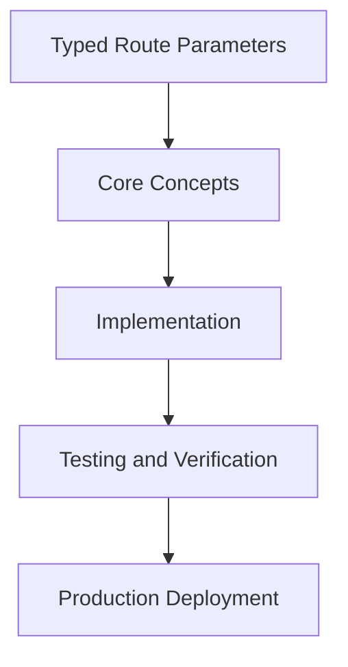

# Day 52 [Advanced]: Typed Route Parameters

## Index

- [Goal](#goal)
- [Prerequisites](#prerequisites)
- [Explanation](#explanation)
- [Topic by Topic](#topic-by-topic)
- [Key Concepts](#key-concepts)
- [Visual Concept Map](#visual-concept-map)
- [End-to-End Practical](#end-to-end-practical)
- [Hands-on Coding](#hands-on-coding)
- [Mini Exercise](#mini-exercise)
- [Assessment Quiz](#assessment-quiz)
- [Task](#task)
- [Self Check](#self-check)
- [Interview Questions and Answers](#interview-questions-and-answers)
- [Day 52 Outcome](#day-52-outcome)

## Goal

Understand and apply Typed Route Parameters in a Next.js application to build production-quality features.

## Prerequisites

- Day 51 completed
- Solid understanding of Next.js App Router and TypeScript basics
- Familiarity with Server Components and data fetching patterns

## Explanation

Typed route parameters are one of the most important safety points in App Router applications. Most runtime bugs in dynamic routes come from invalid IDs, missing segments, or incorrect assumptions about query string values.

In this lesson, you will treat route inputs as untrusted data and build type-safe handling for params and searchParams. This improves correctness, prevents undefined crashes, and makes refactoring dynamic routes much safer.

## Topic by Topic

### Topic 1: Dynamic Segment Types in App Router

Theory:
Dynamic segments like [id], [slug], and nested params should be typed explicitly in page and layout signatures.

Practical:
Define param types near route files so every contributor understands expected URL shape.

Code Example:

```tsx
// Typed Route Parameters — Topic 1
// Implementation depends on your specific use case.
// Refer to the Next.js documentation for detailed API reference.
export default function Example1() {
  return <div>Typed Route Parameters — Example 1</div>;
}
```

**Explanation:**
This step creates compile-time clarity for route contracts. Typed segments reduce accidental misuse and speed up onboarding for complex route trees.

**Key Points:**

- Type params at every route boundary.
- Keep route names and type keys aligned.
- Prefer clear route contracts over implicit assumptions.

### Topic 2: Parsing and Validating Params Safely

Theory:
Route params arrive as strings. Converting them into numbers, UUIDs, or enums needs validation before business logic runs.

Practical:
Parse early and return notFound() or a typed error response when validation fails.

Code Example:

```tsx
// Typed Route Parameters — Topic 2
// Implementation depends on your specific use case.
// Refer to the Next.js documentation for detailed API reference.
export default function Example2() {
  return <div>Typed Route Parameters — Example 2</div>;
}
```

**Explanation:**
This review step prevents invalid URL data from cascading into database errors and broken pages. It turns user input into safe domain values.

**Key Points:**

- Never trust raw params as already valid.
- Validate ID format before querying data sources.
- Use predictable fallback behavior for invalid routes.

### Topic 3: Typing searchParams for Filters and Pagination

Theory:
searchParams are often optional and multi-valued. Incorrect handling leads to inconsistent filtering and pagination bugs.

Practical:
Create a normalization layer that maps raw query values into a typed filter object.

Code Example:

```tsx
// Typed Route Parameters — Topic 3
// Implementation depends on your specific use case.
// Refer to the Next.js documentation for detailed API reference.
export default function Example3() {
  return <div>Typed Route Parameters — Example 3</div>;
}
```

**Explanation:**
Typed query handling keeps UI and URLs synchronized. It also makes deep links and shareable filtered views stable across releases.

**Key Points:**

- Handle missing query values with defaults.
- Parse numbers and booleans explicitly.
- Keep URL state and component state consistent.

### Topic 4: Catch-all and Optional Catch-all Route Types

Theory:
Catch-all routes provide arrays of path segments and optional arrays for optional catch-all routes. Their shape must be typed correctly.

Practical:
Model these segments as string[] or undefined and validate expected depth where required.

Code Example:

```tsx
// Typed Route Parameters — Topic 4
// Implementation depends on your specific use case.
// Refer to the Next.js documentation for detailed API reference.
export default function Example4() {
  return <div>Typed Route Parameters — Example 4</div>;
}
```

**Explanation:**
Correct typing for catch-all routes avoids subtle bugs in docs, category, and nested content paths where segment length matters.

**Key Points:**

- Type catch-all params as arrays, not single strings.
- Validate expected segment counts when business rules require it.
- Handle optional undefined arrays gracefully.

### Topic 5: Reusing Param Types Across Pages and APIs

Theory:
When page routes and route handlers share the same identifiers, duplicated types drift over time and cause inconsistencies.

Practical:
Extract shared param types into a domain module used by both UI routes and API handlers.

Code Example:

```tsx
// Typed Route Parameters — Topic 5
// Implementation depends on your specific use case.
// Refer to the Next.js documentation for detailed API reference.
export default function Example5() {
  return <div>Typed Route Parameters — Example 5</div>;
}
```

**Explanation:**
Shared parameter contracts reduce bugs during renames and migrations. The compiler enforces consistency everywhere a route ID is used.

**Key Points:**

- Centralize route parameter contracts.
- Reuse the same types in page and API layers.
- Avoid copy-paste type definitions across modules.

### Topic 6: Testing and Refactor Safety for Typed Routes

Theory:
Typed routes should be backed by tests for valid and invalid URL paths. This keeps behavior stable through refactors.

Practical:
Add tests for parsing utilities, route rendering with invalid params, and not-found/error outcomes.

Code Example:

```tsx
// Typed Route Parameters — Topic 6
// Implementation depends on your specific use case.
// Refer to the Next.js documentation for detailed API reference.
export default function Example6() {
  return <div>Typed Route Parameters — Example 6</div>;
}
```

**Explanation:**
This final step ensures route safety is not accidental. Tests plus types provide confidence when changing URL structures later.

**Key Points:**

- Test both success and failure route inputs.
- Keep param parsing logic isolated and unit-testable.
- Use types to guide safe dynamic-route refactors.

## Key Concepts

- Typed Route Parameters: Core concept for advanced Next.js development
- Next.js App Router: The modern routing system using the app/ directory
- Server Component: A component that runs on the server only
- TypeScript: Strongly typed JavaScript used throughout Next.js projects

## Visual Concept Map



## End-to-End Practical

1. Review the explanation and all topic examples.
2. Set up a clean Next.js project or use your existing one.
3. Implement each topic example step by step.
4. Verify the behavior in the browser.
5. Refactor and clean up your implementation.
6. Write a brief note on what you learned.

## Hands-on Coding

### Example 1: Basic Typed Route Parameters Implementation

```tsx
// Basic implementation of Typed Route Parameters
// Follow the topic examples above to build this out.
export default function Example() {
  return (
    <div style={{ padding: "24px" }}>
      <h1>Typed Route Parameters</h1>
      <p>Implementation complete for Day 52.</p>
    </div>
  );
}
```

### Example 2: Practical Use Case

```tsx
// A real-world use case for Typed Route Parameters
// Refer to the Topic by Topic section for code details.
export default function PracticalExample() {
  return (
    <div>
      <h2>Practical: Typed Route Parameters</h2>
    </div>
  );
}
```

### Example 3: Combined Pattern

```tsx
// Combining Typed Route Parameters with other Next.js features
// This example shows integration with the App Router.
export default function CombinedExample() {
  return (
    <section>
      <h2>Typed Route Parameters — Combined Pattern</h2>
      <p>See topic sections above for detailed code.</p>
    </section>
  );
}
```

## Mini Exercise

Scenario:
You are adding Typed Route Parameters to a Next.js application for a real-world feature.

Steps:

1. Create a new route or component relevant to this topic.
2. Implement the core pattern from the Topic by Topic section.
3. Test the implementation thoroughly.
4. Verify edge cases are handled.
5. Clean up and document your code.

Expected output:

- Working implementation of Typed Route Parameters
- All edge cases handled correctly
- Clean, readable code following Next.js conventions

## Assessment Quiz

### Quiz Questions

1. What is the primary purpose of Typed Route Parameters in Next.js?
2. Where in the project structure do you implement this pattern?
3. What is a common mistake when using Typed Route Parameters?
4. True or False: Typed Route Parameters only applies to Client Components.
5. How does Typed Route Parameters improve the user or developer experience?

### Quiz Answers

1. To enable advanced-level functionality in a Next.js application efficiently.
2. In the App Router directory structure, using Server Components by default.
3. Mixing server and client concerns incorrectly, or skipping error handling.
4. False. This concept applies broadly across the Next.js architecture.
5. It improves maintainability, performance, and scalability of the application.

## Task

- Study all topic examples in today's lesson
- Implement the core pattern in a Next.js project
- Test all scenarios including error and edge cases
- Complete the mini exercise
- Attempt the quiz before checking answers

## Self Check

- You can implement Typed Route Parameters from scratch
- You understand when and why to use this pattern
- You can explain the concept in simple terms
- You have tested the implementation in a running app
- You can answer at least 4 out of 5 quiz questions correctly

## Interview Questions and Answers

### Beginner

**Question:** What is Typed Route Parameters in Next.js?

**Answer:** Typed Route Parameters is a advanced-level Next.js feature that helps developers build robust, scalable applications by handling a specific aspect of the framework architecture.

**Question:** When would you use Typed Route Parameters?

**Answer:** When you need to implement the specific functionality it provides in a production Next.js application, particularly in advanced-stage projects.

### Middle

**Question:** How does Typed Route Parameters interact with the Next.js App Router?

**Answer:** It integrates with the App Router through Server Components, Route Handlers, or middleware, depending on the specific implementation pattern required.

**Question:** What are common pitfalls with Typed Route Parameters?

**Answer:** The most common pitfalls are improper handling of server/client boundaries, missing error states, and not considering caching behavior when relevant.

### Advanced

**Question:** How would you scale Typed Route Parameters in a large Next.js application with multiple teams?

**Answer:** By establishing clear conventions, creating reusable utilities, documenting patterns in an Architecture Decision Record, and enforcing consistency through code review and linting rules.

**Question:** What performance considerations apply to Typed Route Parameters?

**Answer:** Consider bundle size impact for client-side features, caching strategies for data fetching, and rendering mode selection to balance performance with data freshness.

## Day 52 Outcome

- You understand Typed Route Parameters and its role in Next.js
- You can implement this pattern in a real project
- You know when to use and when to avoid this pattern
- You are ready for Day 52 — moving on to the next topic
