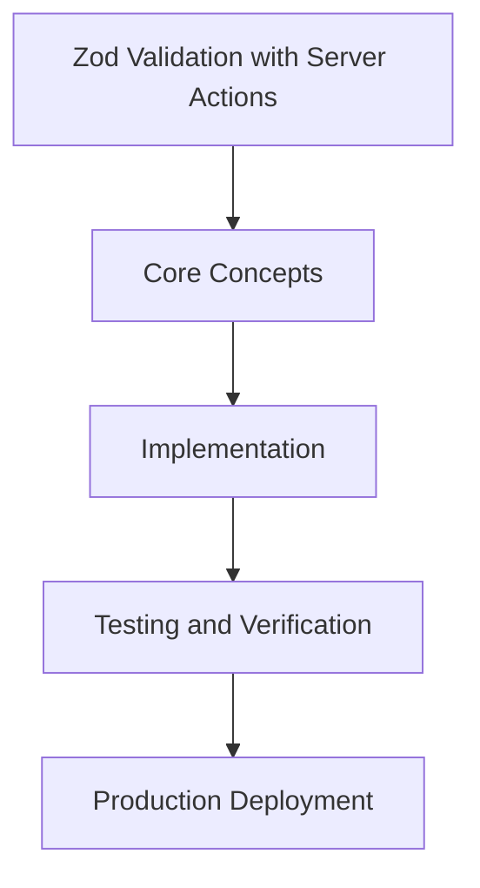

# Day 53 [Advanced]: Zod Validation with Server Actions

## Index

- [Goal](#goal)
- [Prerequisites](#prerequisites)
- [Explanation](#explanation)
- [Topic by Topic](#topic-by-topic)
- [Key Concepts](#key-concepts)
- [Visual Concept Map](#visual-concept-map)
- [End-to-End Practical](#end-to-end-practical)
- [Hands-on Coding](#hands-on-coding)
- [Mini Exercise](#mini-exercise)
- [Assessment Quiz](#assessment-quiz)
- [Task](#task)
- [Self Check](#self-check)
- [Interview Questions and Answers](#interview-questions-and-answers)
- [Day 53 Outcome](#day-53-outcome)

## Goal

Understand and apply Zod Validation with Server Actions in a Next.js application to build production-quality features.

## Prerequisites

- Day 52 completed
- Solid understanding of Next.js App Router and TypeScript basics
- Familiarity with Server Components and data fetching patterns

## Explanation

Zod with Server Actions gives you a safe mutation boundary: validate untrusted input on the server, return typed result states, and keep UI feedback predictable.

In production, this prevents malformed payloads from reaching business logic and helps teams evolve forms without breaking contracts.


## Topic by Topic

### Topic 1: Schema Design for Actions

Theory:
A strong schema should represent domain rules, not just UI field shapes. In Next.js actions, schema choices directly control data integrity.

Practical:
Define base schemas for create/update flows and keep field constraints centralized so form logic and server logic stay aligned.

Code Example:

```tsx
// Zod Validation with Server Actions — Topic 1
// Implementation depends on your specific use case.
// Refer to the Next.js documentation for detailed API reference.
export default function Example1() {
  return <div>Zod Validation with Server Actions — Example 1</div>;
}
```
**Explanation:**
Good schema design reduces validation drift and prevents invalid payloads from entering business code.

**Key Points:**
- Model domain rules explicitly in schema definitions.
- Reuse base schema fragments to avoid duplicate logic.
- Keep validation messages clear for form UX.


### Topic 2: Safe FormData Parsing

Theory:
FormData is untyped and can contain missing or empty values. Parsing should normalize data before schema validation.

Practical:
Convert FormData into a plain object, trim string values, and normalize optional fields before calling safeParse.

Code Example:

```tsx
// Zod Validation with Server Actions — Topic 2
// Implementation depends on your specific use case.
// Refer to the Next.js documentation for detailed API reference.
export default function Example2() {
  return <div>Zod Validation with Server Actions — Example 2</div>;
}
```
**Explanation:**
Normalization before validation avoids subtle bugs caused by inconsistent browser form payloads.

**Key Points:**
- Treat FormData as untrusted input.
- Normalize raw values before schema checks.
- Handle empty-string vs missing-value cases intentionally.


### Topic 3: Typed Action Result Contracts

Theory:
Server Actions should return predictable, typed result states for success and failure. This improves UI reliability.

Practical:
Return discriminated unions with success/data and error/fieldErrors so client components can branch safely.

Code Example:

```tsx
// Zod Validation with Server Actions — Topic 3
// Implementation depends on your specific use case.
// Refer to the Next.js documentation for detailed API reference.
export default function Example3() {
  return <div>Zod Validation with Server Actions — Example 3</div>;
}
```
**Explanation:**
Typed result contracts make form feedback deterministic and easier to test.

**Key Points:**
- Use stable action response unions.
- Include field-level errors for precise UX.
- Avoid throwing for expected validation outcomes.


### Topic 4: Cross-field and Async Validation

Theory:
Many rules need multiple fields or external checks such as uniqueness. These validations belong on the server.

Practical:
Use refine/superRefine for cross-field logic and perform async checks in action flow before persistence.

Code Example:

```tsx
// Zod Validation with Server Actions — Topic 4
// Implementation depends on your specific use case.
// Refer to the Next.js documentation for detailed API reference.
export default function Example4() {
  return <div>Zod Validation with Server Actions — Example 4</div>;
}
```
**Explanation:**
Cross-field and async checks ensure business correctness beyond basic type validation.

**Key Points:**
- Implement multi-field constraints explicitly.
- Perform async checks close to persistence layer.
- Return actionable errors when constraints fail.


### Topic 5: Schema Reuse Across Actions and APIs

Theory:
Validation drift happens when actions and API handlers define similar schemas separately. Shared schemas prevent this.

Practical:
Move schemas to a domain module and import them in route handlers, actions, and test fixtures.

Code Example:

```tsx
// Zod Validation with Server Actions — Topic 5
// Implementation depends on your specific use case.
// Refer to the Next.js documentation for detailed API reference.
export default function Example5() {
  return <div>Zod Validation with Server Actions — Example 5</div>;
}
```
**Explanation:**
Reusing schemas across entry points keeps data contracts consistent application-wide.

**Key Points:**
- Centralize shared validation contracts.
- Use one source of truth for write payloads.
- Refactor schema modules with ownership guidelines.


### Topic 6: Validation Testing Strategy

Theory:
Validation behavior should be treated as business logic and covered by tests for both valid and invalid payloads.

Practical:
Write tests for boundary values, malformed payloads, and expected typed action responses.

Code Example:

```tsx
// Zod Validation with Server Actions — Topic 6
// Implementation depends on your specific use case.
// Refer to the Next.js documentation for detailed API reference.
export default function Example6() {
  return <div>Zod Validation with Server Actions — Example 6</div>;
}
```
**Explanation:**
Validation tests protect data integrity during future refactors and feature changes.

**Key Points:**
- Test both happy and unhappy paths.
- Include edge and boundary inputs in suites.
- Assert exact action error shapes.


## Key Concepts

- Zod Validation with Server Actions: Core concept for advanced Next.js development
- Next.js App Router: The modern routing system using the app/ directory
- Server Component: A component that runs on the server only
- TypeScript: Strongly typed JavaScript used throughout Next.js projects

## Visual Concept Map



## End-to-End Practical

1. Review the explanation and all topic examples.
2. Set up a clean Next.js project or use your existing one.
3. Implement each topic example step by step.
4. Verify the behavior in the browser.
5. Refactor and clean up your implementation.
6. Write a brief note on what you learned.

## Hands-on Coding

### Example 1: Basic Zod Validation with Server Actions Implementation

```tsx
// Basic implementation of Zod Validation with Server Actions
// Follow the topic examples above to build this out.
export default function Example() {
  return (
    <div style={{ padding: "24px" }}>
      <h1>Zod Validation with Server Actions</h1>
      <p>Implementation complete for Day 53.</p>
    </div>
  );
}
```

### Example 2: Practical Use Case

```tsx
// A real-world use case for Zod Validation with Server Actions
// Refer to the Topic by Topic section for code details.
export default function PracticalExample() {
  return (
    <div>
      <h2>Practical: Zod Validation with Server Actions</h2>
    </div>
  );
}
```

### Example 3: Combined Pattern

```tsx
// Combining Zod Validation with Server Actions with other Next.js features
// This example shows integration with the App Router.
export default function CombinedExample() {
  return (
    <section>
      <h2>Zod Validation with Server Actions — Combined Pattern</h2>
      <p>See topic sections above for detailed code.</p>
    </section>
  );
}
```

## Mini Exercise

Scenario:
You are adding Zod Validation with Server Actions to a Next.js application for a real-world feature.

Steps:

1. Create a new route or component relevant to this topic.
2. Implement the core pattern from the Topic by Topic section.
3. Test the implementation thoroughly.
4. Verify edge cases are handled.
5. Clean up and document your code.

Expected output:

- Working implementation of Zod Validation with Server Actions
- All edge cases handled correctly
- Clean, readable code following Next.js conventions

## Assessment Quiz

### Quiz Questions

1. What is the primary purpose of Zod Validation with Server Actions in Next.js?
2. Where in the project structure do you implement this pattern?
3. What is a common mistake when using Zod Validation with Server Actions?
4. True or False: Zod Validation with Server Actions only applies to Client Components.
5. How does Zod Validation with Server Actions improve the user or developer experience?

### Quiz Answers

1. To enable advanced-level functionality in a Next.js application efficiently.
2. In the App Router directory structure, using Server Components by default.
3. Mixing server and client concerns incorrectly, or skipping error handling.
4. False. This concept applies broadly across the Next.js architecture.
5. It improves maintainability, performance, and scalability of the application.

## Task

- Study all topic examples in today's lesson
- Implement the core pattern in a Next.js project
- Test all scenarios including error and edge cases
- Complete the mini exercise
- Attempt the quiz before checking answers

## Self Check

- You can implement Zod Validation with Server Actions from scratch
- You understand when and why to use this pattern
- You can explain the concept in simple terms
- You have tested the implementation in a running app
- You can answer at least 4 out of 5 quiz questions correctly

## Interview Questions and Answers

### Beginner

**Question:** What is Zod Validation with Server Actions in Next.js?

**Answer:** Zod Validation with Server Actions is a advanced-level Next.js feature that helps developers build robust, scalable applications by handling a specific aspect of the framework architecture.

**Question:** When would you use Zod Validation with Server Actions?

**Answer:** When you need to implement the specific functionality it provides in a production Next.js application, particularly in advanced-stage projects.

### Middle

**Question:** How does Zod Validation with Server Actions interact with the Next.js App Router?

**Answer:** It integrates with the App Router through Server Components, Route Handlers, or middleware, depending on the specific implementation pattern required.

**Question:** What are common pitfalls with Zod Validation with Server Actions?

**Answer:** The most common pitfalls are improper handling of server/client boundaries, missing error states, and not considering caching behavior when relevant.

### Advanced

**Question:** How would you scale Zod Validation with Server Actions in a large Next.js application with multiple teams?

**Answer:** By establishing clear conventions, creating reusable utilities, documenting patterns in an Architecture Decision Record, and enforcing consistency through code review and linting rules.

**Question:** What performance considerations apply to Zod Validation with Server Actions?

**Answer:** Consider bundle size impact for client-side features, caching strategies for data fetching, and rendering mode selection to balance performance with data freshness.

## Day 53 Outcome

- You understand Zod Validation with Server Actions and its role in Next.js
- You can implement this pattern in a real project
- You know when to use and when to avoid this pattern
- You are ready for Day 53 — moving on to the next topic
