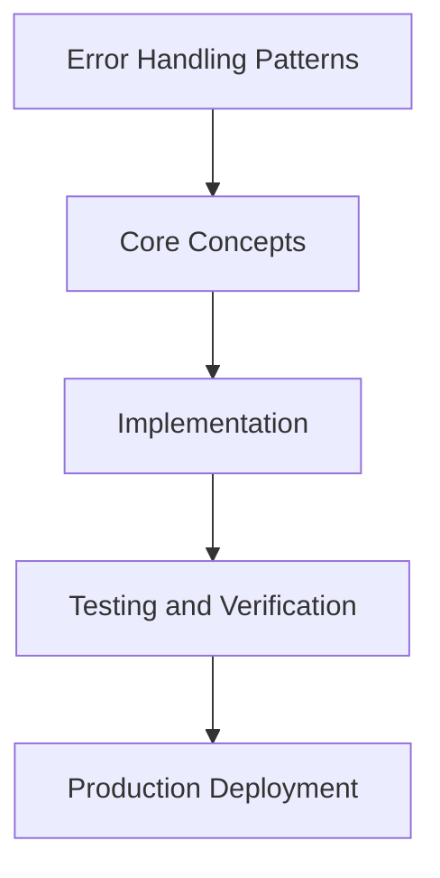

# Day 54 [Advanced]: Error Handling Patterns

## Index

- [Goal](#goal)
- [Prerequisites](#prerequisites)
- [Explanation](#explanation)
- [Topic by Topic](#topic-by-topic)
- [Key Concepts](#key-concepts)
- [Visual Concept Map](#visual-concept-map)
- [End-to-End Practical](#end-to-end-practical)
- [Hands-on Coding](#hands-on-coding)
- [Mini Exercise](#mini-exercise)
- [Assessment Quiz](#assessment-quiz)
- [Task](#task)
- [Self Check](#self-check)
- [Interview Questions and Answers](#interview-questions-and-answers)
- [Day 54 Outcome](#day-54-outcome)

## Goal

Understand and apply Error Handling Patterns in a Next.js application to build production-quality features.

## Prerequisites

- Day 53 completed
- Solid understanding of Next.js App Router and TypeScript basics
- Familiarity with Server Components and data fetching patterns

## Explanation

Error handling in Next.js is a layered system across route segments, server functions, and client interactions. Production quality depends on classifying failures correctly and providing predictable recovery paths.

A good strategy separates expected errors from unexpected faults, logs enough context for diagnosis, and keeps user experience stable during incidents.


## Topic by Topic

### Topic 1: Error Taxonomy in Next.js

Theory:
Different errors need different handling paths. Expected business errors should not be treated like runtime crashes.

Practical:
Classify validation/auth/not-found as expected and reserve thrown exceptions for unexpected failures.

Code Example:

```tsx
// Error Handling Patterns — Topic 1
// Implementation depends on your specific use case.
// Refer to the Next.js documentation for detailed API reference.
export default function Example1() {
  return <div>Error Handling Patterns — Example 1</div>;
}
```
**Explanation:**
Clear taxonomy improves UX and keeps operational alerts meaningful.

**Key Points:**
- Separate expected from unexpected errors.
- Avoid crash-like handling for user-input mistakes.
- Map each class to a consistent UI pattern.


### Topic 2: Route-level Boundaries

Theory:
App Router allows segment-specific error boundaries that contain failures and protect unaffected sections.

Practical:
Use error.tsx and loading.tsx at route segment level where data and rendering risk is highest.

Code Example:

```tsx
// Error Handling Patterns — Topic 2
// Implementation depends on your specific use case.
// Refer to the Next.js documentation for detailed API reference.
export default function Example2() {
  return <div>Error Handling Patterns — Example 2</div>;
}
```
**Explanation:**
Localized boundaries prevent one failure from taking down the entire app experience.

**Key Points:**
- Place boundaries near risky segments.
- Provide meaningful fallback and retry UX.
- Keep non-failing areas interactive.


### Topic 3: Server Action Error Contracts

Theory:
Action consumers need stable return shapes for success and failure to avoid fragile client branching.

Practical:
Return typed codes/messages in action results instead of exposing raw error objects.

Code Example:

```tsx
// Error Handling Patterns — Topic 3
// Implementation depends on your specific use case.
// Refer to the Next.js documentation for detailed API reference.
export default function Example3() {
  return <div>Error Handling Patterns — Example 3</div>;
}
```
**Explanation:**
Stable contracts reduce front-end guesswork and simplify state rendering logic.

**Key Points:**
- Define and version action error payloads.
- Expose safe and useful failure metadata.
- Keep internal stack details private.


### Topic 4: Recovery and Retry UX

Theory:
Many failures are transient and should support quick retry without full-page reset.

Practical:
Add retry actions for fetch failures and preserve user input where possible.

Code Example:

```tsx
// Error Handling Patterns — Topic 4
// Implementation depends on your specific use case.
// Refer to the Next.js documentation for detailed API reference.
export default function Example4() {
  return <div>Error Handling Patterns — Example 4</div>;
}
```
**Explanation:**
Recovery-focused UX reduces frustration and improves completion rates under instability.

**Key Points:**
- Design for retry-first user flows.
- Preserve context when possible after errors.
- Avoid dead-end error screens.


### Topic 5: Observability and Correlation

Theory:
Without context-rich telemetry, production errors are difficult to diagnose and prioritize.

Practical:
Attach request IDs, user context, and route metadata in structured logs and monitoring events.

Code Example:

```tsx
// Error Handling Patterns — Topic 5
// Implementation depends on your specific use case.
// Refer to the Next.js documentation for detailed API reference.
export default function Example5() {
  return <div>Error Handling Patterns — Example 5</div>;
}
```
**Explanation:**
Correlation-ready logs speed up incident investigation and reduce mean time to resolution.

**Key Points:**
- Log contextual metadata, not only messages.
- Propagate correlation IDs across layers.
- Alert on error trends and latency shifts.


### Topic 6: Graceful Degradation

Theory:
When dependencies fail, partial functionality is often better than total outage.

Practical:
Fallback to cached/limited views and disable only non-critical interactions during incidents.

Code Example:

```tsx
// Error Handling Patterns — Topic 6
// Implementation depends on your specific use case.
// Refer to the Next.js documentation for detailed API reference.
export default function Example6() {
  return <div>Error Handling Patterns — Example 6</div>;
}
```
**Explanation:**
Graceful degradation preserves core business flows even when systems are unstable.

**Key Points:**
- Define critical vs optional capabilities.
- Implement safe partial fallbacks.
- Communicate degraded mode clearly.


## Key Concepts

- Error Handling Patterns: Core concept for advanced Next.js development
- Next.js App Router: The modern routing system using the app/ directory
- Server Component: A component that runs on the server only
- TypeScript: Strongly typed JavaScript used throughout Next.js projects

## Visual Concept Map



## End-to-End Practical

1. Review the explanation and all topic examples.
2. Set up a clean Next.js project or use your existing one.
3. Implement each topic example step by step.
4. Verify the behavior in the browser.
5. Refactor and clean up your implementation.
6. Write a brief note on what you learned.

## Hands-on Coding

### Example 1: Basic Error Handling Patterns Implementation

```tsx
// Basic implementation of Error Handling Patterns
// Follow the topic examples above to build this out.
export default function Example() {
  return (
    <div style={{ padding: "24px" }}>
      <h1>Error Handling Patterns</h1>
      <p>Implementation complete for Day 54.</p>
    </div>
  );
}
```

### Example 2: Practical Use Case

```tsx
// A real-world use case for Error Handling Patterns
// Refer to the Topic by Topic section for code details.
export default function PracticalExample() {
  return (
    <div>
      <h2>Practical: Error Handling Patterns</h2>
    </div>
  );
}
```

### Example 3: Combined Pattern

```tsx
// Combining Error Handling Patterns with other Next.js features
// This example shows integration with the App Router.
export default function CombinedExample() {
  return (
    <section>
      <h2>Error Handling Patterns — Combined Pattern</h2>
      <p>See topic sections above for detailed code.</p>
    </section>
  );
}
```

## Mini Exercise

Scenario:
You are adding Error Handling Patterns to a Next.js application for a real-world feature.

Steps:

1. Create a new route or component relevant to this topic.
2. Implement the core pattern from the Topic by Topic section.
3. Test the implementation thoroughly.
4. Verify edge cases are handled.
5. Clean up and document your code.

Expected output:

- Working implementation of Error Handling Patterns
- All edge cases handled correctly
- Clean, readable code following Next.js conventions

## Assessment Quiz

### Quiz Questions

1. What is the primary purpose of Error Handling Patterns in Next.js?
2. Where in the project structure do you implement this pattern?
3. What is a common mistake when using Error Handling Patterns?
4. True or False: Error Handling Patterns only applies to Client Components.
5. How does Error Handling Patterns improve the user or developer experience?

### Quiz Answers

1. To enable advanced-level functionality in a Next.js application efficiently.
2. In the App Router directory structure, using Server Components by default.
3. Mixing server and client concerns incorrectly, or skipping error handling.
4. False. This concept applies broadly across the Next.js architecture.
5. It improves maintainability, performance, and scalability of the application.

## Task

- Study all topic examples in today's lesson
- Implement the core pattern in a Next.js project
- Test all scenarios including error and edge cases
- Complete the mini exercise
- Attempt the quiz before checking answers

## Self Check

- You can implement Error Handling Patterns from scratch
- You understand when and why to use this pattern
- You can explain the concept in simple terms
- You have tested the implementation in a running app
- You can answer at least 4 out of 5 quiz questions correctly

## Interview Questions and Answers

### Beginner

**Question:** What is Error Handling Patterns in Next.js?

**Answer:** Error Handling Patterns is a advanced-level Next.js feature that helps developers build robust, scalable applications by handling a specific aspect of the framework architecture.

**Question:** When would you use Error Handling Patterns?

**Answer:** When you need to implement the specific functionality it provides in a production Next.js application, particularly in advanced-stage projects.

### Middle

**Question:** How does Error Handling Patterns interact with the Next.js App Router?

**Answer:** It integrates with the App Router through Server Components, Route Handlers, or middleware, depending on the specific implementation pattern required.

**Question:** What are common pitfalls with Error Handling Patterns?

**Answer:** The most common pitfalls are improper handling of server/client boundaries, missing error states, and not considering caching behavior when relevant.

### Advanced

**Question:** How would you scale Error Handling Patterns in a large Next.js application with multiple teams?

**Answer:** By establishing clear conventions, creating reusable utilities, documenting patterns in an Architecture Decision Record, and enforcing consistency through code review and linting rules.

**Question:** What performance considerations apply to Error Handling Patterns?

**Answer:** Consider bundle size impact for client-side features, caching strategies for data fetching, and rendering mode selection to balance performance with data freshness.

## Day 54 Outcome

- You understand Error Handling Patterns and its role in Next.js
- You can implement this pattern in a real project
- You know when to use and when to avoid this pattern
- You are ready for Day 54 — moving on to the next topic
