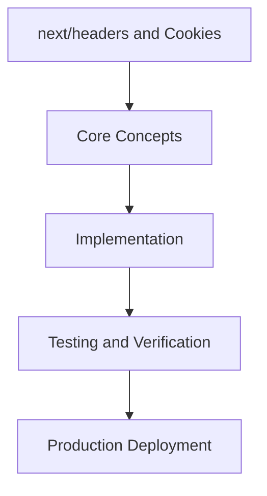

# Day 55 [Advanced]: next/headers and Cookies

## Index

- [Goal](#goal)
- [Prerequisites](#prerequisites)
- [Explanation](#explanation)
- [Topic by Topic](#topic-by-topic)
- [Key Concepts](#key-concepts)
- [Visual Concept Map](#visual-concept-map)
- [End-to-End Practical](#end-to-end-practical)
- [Hands-on Coding](#hands-on-coding)
- [Mini Exercise](#mini-exercise)
- [Assessment Quiz](#assessment-quiz)
- [Task](#task)
- [Self Check](#self-check)
- [Interview Questions and Answers](#interview-questions-and-answers)
- [Day 55 Outcome](#day-55-outcome)

## Goal

Understand and apply next/headers and Cookies in a Next.js application to build production-quality features.

## Prerequisites

- Day 54 completed
- Solid understanding of Next.js App Router and TypeScript basics
- Familiarity with Server Components and data fetching patterns

## Explanation

Headers and cookies are core server-side primitives in Next.js for auth, personalization, caching, and security controls. Misusing them can create cache leaks or unsafe session behavior.

This lesson focuses on safe metadata handling patterns so request context is reliable, secure, and consistent across routes and environments.


## Topic by Topic

### Topic 1: Reading Headers Safely

Theory:
Headers can be missing, malformed, or spoofed depending on proxies and clients.

Practical:
Read only required headers and default defensively when values are absent or invalid.

Code Example:

```tsx
// next/headers and Cookies — Topic 1
// Implementation depends on your specific use case.
// Refer to the Next.js documentation for detailed API reference.
export default function Example1() {
  return <div>next/headers and Cookies — Example 1</div>;
}
```
**Explanation:**
Defensive header handling avoids brittle logic in production request paths.

**Key Points:**
- Treat header input as untrusted.
- Use safe defaults for missing metadata.
- Document which headers influence behavior.


### Topic 2: Cookie Lifecycle Management

Theory:
Cookies carry session and preference state and need clear creation, update, and expiration rules.

Practical:
Centralize cookie operations in server actions/handlers and define explicit lifecycle ownership.

Code Example:

```tsx
// next/headers and Cookies — Topic 2
// Implementation depends on your specific use case.
// Refer to the Next.js documentation for detailed API reference.
export default function Example2() {
  return <div>next/headers and Cookies — Example 2</div>;
}
```
**Explanation:**
Lifecycle clarity reduces state bugs and inconsistent session behavior.

**Key Points:**
- Keep cookie ownership explicit.
- Define expiration/rotation policies.
- Avoid scattered cookie mutations.


### Topic 3: Security Attributes and Defaults

Theory:
Cookie attributes like HttpOnly, Secure, and SameSite are baseline security controls.

Practical:
Set strict defaults for sensitive cookies and review exceptions case by case.

Code Example:

```tsx
// next/headers and Cookies — Topic 3
// Implementation depends on your specific use case.
// Refer to the Next.js documentation for detailed API reference.
export default function Example3() {
  return <div>next/headers and Cookies — Example 3</div>;
}
```
**Explanation:**
Correct attributes reduce token theft and cross-site abuse risk.

**Key Points:**
- Use secure defaults on auth cookies.
- Avoid weakening SameSite without need.
- Review attribute policy during auth changes.


### Topic 4: Personalization vs Caching

Theory:
Per-user header/cookie behavior can conflict with caching strategy and leak responses.

Practical:
Mark personalized routes dynamic and validate cache behavior for authenticated vs anonymous users.

Code Example:

```tsx
// next/headers and Cookies — Topic 4
// Implementation depends on your specific use case.
// Refer to the Next.js documentation for detailed API reference.
export default function Example4() {
  return <div>next/headers and Cookies — Example 4</div>;
}
```
**Explanation:**
Cache-aware personalization prevents cross-user data exposure.

**Key Points:**
- Align caching with personalization scope.
- Do not cache user-specific HTML globally.
- Test mixed auth traffic scenarios.


### Topic 5: Metadata Propagation

Theory:
Internal fetch chains may require selected headers/cookies, but over-forwarding creates security risk.

Practical:
Forward only necessary metadata and strip sensitive values by policy.

Code Example:

```tsx
// next/headers and Cookies — Topic 5
// Implementation depends on your specific use case.
// Refer to the Next.js documentation for detailed API reference.
export default function Example5() {
  return <div>next/headers and Cookies — Example 5</div>;
}
```
**Explanation:**
Selective propagation improves security and keeps service boundaries clean.

**Key Points:**
- Forward minimal required context.
- Block blind passthrough of sensitive headers.
- Use helper utilities for consistent propagation.


### Topic 6: Testing Header/Cookie Flows

Theory:
Metadata-driven behavior is environment-sensitive and often breaks only in integration contexts.

Practical:
Add tests for locale, auth, caching, and security attributes across deployment-like setups.

Code Example:

```tsx
// next/headers and Cookies — Topic 6
// Implementation depends on your specific use case.
// Refer to the Next.js documentation for detailed API reference.
export default function Example6() {
  return <div>next/headers and Cookies — Example 6</div>;
}
```
**Explanation:**
Targeted metadata tests prevent production-only regressions.

**Key Points:**
- Test presence and absence of key metadata.
- Assert cookie flags explicitly.
- Include proxy/CDN-like scenarios in QA.


## Key Concepts

- next/headers and Cookies: Core concept for advanced Next.js development
- Next.js App Router: The modern routing system using the app/ directory
- Server Component: A component that runs on the server only
- TypeScript: Strongly typed JavaScript used throughout Next.js projects

## Visual Concept Map



## End-to-End Practical

1. Review the explanation and all topic examples.
2. Set up a clean Next.js project or use your existing one.
3. Implement each topic example step by step.
4. Verify the behavior in the browser.
5. Refactor and clean up your implementation.
6. Write a brief note on what you learned.

## Hands-on Coding

### Example 1: Basic next/headers and Cookies Implementation

```tsx
// Basic implementation of next/headers and Cookies
// Follow the topic examples above to build this out.
export default function Example() {
  return (
    <div style={{ padding: "24px" }}>
      <h1>next/headers and Cookies</h1>
      <p>Implementation complete for Day 55.</p>
    </div>
  );
}
```

### Example 2: Practical Use Case

```tsx
// A real-world use case for next/headers and Cookies
// Refer to the Topic by Topic section for code details.
export default function PracticalExample() {
  return (
    <div>
      <h2>Practical: next/headers and Cookies</h2>
    </div>
  );
}
```

### Example 3: Combined Pattern

```tsx
// Combining next/headers and Cookies with other Next.js features
// This example shows integration with the App Router.
export default function CombinedExample() {
  return (
    <section>
      <h2>next/headers and Cookies — Combined Pattern</h2>
      <p>See topic sections above for detailed code.</p>
    </section>
  );
}
```

## Mini Exercise

Scenario:
You are adding next/headers and Cookies to a Next.js application for a real-world feature.

Steps:

1. Create a new route or component relevant to this topic.
2. Implement the core pattern from the Topic by Topic section.
3. Test the implementation thoroughly.
4. Verify edge cases are handled.
5. Clean up and document your code.

Expected output:

- Working implementation of next/headers and Cookies
- All edge cases handled correctly
- Clean, readable code following Next.js conventions

## Assessment Quiz

### Quiz Questions

1. What is the primary purpose of next/headers and Cookies in Next.js?
2. Where in the project structure do you implement this pattern?
3. What is a common mistake when using next/headers and Cookies?
4. True or False: next/headers and Cookies only applies to Client Components.
5. How does next/headers and Cookies improve the user or developer experience?

### Quiz Answers

1. To enable advanced-level functionality in a Next.js application efficiently.
2. In the App Router directory structure, using Server Components by default.
3. Mixing server and client concerns incorrectly, or skipping error handling.
4. False. This concept applies broadly across the Next.js architecture.
5. It improves maintainability, performance, and scalability of the application.

## Task

- Study all topic examples in today's lesson
- Implement the core pattern in a Next.js project
- Test all scenarios including error and edge cases
- Complete the mini exercise
- Attempt the quiz before checking answers

## Self Check

- You can implement next/headers and Cookies from scratch
- You understand when and why to use this pattern
- You can explain the concept in simple terms
- You have tested the implementation in a running app
- You can answer at least 4 out of 5 quiz questions correctly

## Interview Questions and Answers

### Beginner

**Question:** What is next/headers and Cookies in Next.js?

**Answer:** next/headers and Cookies is a advanced-level Next.js feature that helps developers build robust, scalable applications by handling a specific aspect of the framework architecture.

**Question:** When would you use next/headers and Cookies?

**Answer:** When you need to implement the specific functionality it provides in a production Next.js application, particularly in advanced-stage projects.

### Middle

**Question:** How does next/headers and Cookies interact with the Next.js App Router?

**Answer:** It integrates with the App Router through Server Components, Route Handlers, or middleware, depending on the specific implementation pattern required.

**Question:** What are common pitfalls with next/headers and Cookies?

**Answer:** The most common pitfalls are improper handling of server/client boundaries, missing error states, and not considering caching behavior when relevant.

### Advanced

**Question:** How would you scale next/headers and Cookies in a large Next.js application with multiple teams?

**Answer:** By establishing clear conventions, creating reusable utilities, documenting patterns in an Architecture Decision Record, and enforcing consistency through code review and linting rules.

**Question:** What performance considerations apply to next/headers and Cookies?

**Answer:** Consider bundle size impact for client-side features, caching strategies for data fetching, and rendering mode selection to balance performance with data freshness.

## Day 55 Outcome

- You understand next/headers and Cookies and its role in Next.js
- You can implement this pattern in a real project
- You know when to use and when to avoid this pattern
- You are ready for Day 55 — moving on to the next topic
