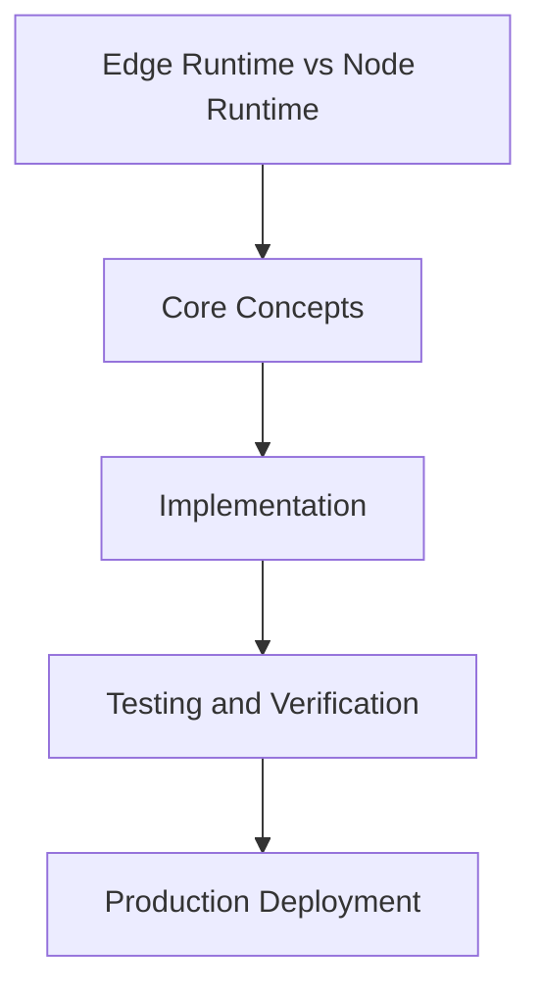

# Day 56 [Advanced]: Edge Runtime vs Node Runtime

## Index

- [Goal](#goal)
- [Prerequisites](#prerequisites)
- [Explanation](#explanation)
- [Topic by Topic](#topic-by-topic)
- [Key Concepts](#key-concepts)
- [Visual Concept Map](#visual-concept-map)
- [End-to-End Practical](#end-to-end-practical)
- [Hands-on Coding](#hands-on-coding)
- [Mini Exercise](#mini-exercise)
- [Assessment Quiz](#assessment-quiz)
- [Task](#task)
- [Self Check](#self-check)
- [Interview Questions and Answers](#interview-questions-and-answers)
- [Day 56 Outcome](#day-56-outcome)

## Goal

Understand and apply Edge Runtime vs Node Runtime in a Next.js application to build production-quality features.

## Prerequisites

- Day 55 completed
- Solid understanding of Next.js App Router and TypeScript basics
- Familiarity with Server Components and data fetching patterns

## Explanation

Choosing Edge Runtime or Node Runtime is an architecture decision with tradeoffs in latency, compatibility, and operational cost.

Understanding workload fit for each runtime helps teams avoid deployment surprises and place features where they perform best.


## Topic by Topic

### Topic 1: Runtime Capability Matrix

Theory:
Edge and Node runtimes offer different APIs and dependency compatibility. Placement should be capability-driven.

Practical:
Create a per-route matrix of required APIs and map each route to the proper runtime.

Code Example:

```tsx
// Edge Runtime vs Node Runtime — Topic 1
// Implementation depends on your specific use case.
// Refer to the Next.js documentation for detailed API reference.
export default function Example1() {
  return <div>Edge Runtime vs Node Runtime — Example 1</div>;
}
```
**Explanation:**
Capability mapping prevents deploying incompatible code to edge contexts.

**Key Points:**
- Audit runtime requirements per route.
- Track unsupported APIs early.
- Avoid one-runtime-fits-all assumptions.


### Topic 2: Latency and Region Tradeoffs

Theory:
Edge can reduce latency for global read workloads, but heavy compute may still fit Node better.

Practical:
Benchmark user-region latency and payload costs before changing runtime placement.

Code Example:

```tsx
// Edge Runtime vs Node Runtime — Topic 2
// Implementation depends on your specific use case.
// Refer to the Next.js documentation for detailed API reference.
export default function Example2() {
  return <div>Edge Runtime vs Node Runtime — Example 2</div>;
}
```
**Explanation:**
Measured tradeoff decisions outperform intuition for runtime architecture.

**Key Points:**
- Use real-user region metrics.
- Balance compute cost vs proximity benefit.
- Re-evaluate placement as traffic evolves.


### Topic 3: Dependency Compatibility

Theory:
Some packages rely on Node-only APIs and fail in edge environments.

Practical:
Isolate incompatible modules behind Node routes and prefer web-standard APIs for edge paths.

Code Example:

```tsx
// Edge Runtime vs Node Runtime — Topic 3
// Implementation depends on your specific use case.
// Refer to the Next.js documentation for detailed API reference.
export default function Example3() {
  return <div>Edge Runtime vs Node Runtime — Example 3</div>;
}
```
**Explanation:**
Compatibility isolation reduces deployment failures and rollback risk.

**Key Points:**
- Audit library runtime assumptions.
- Separate Node-only concerns cleanly.
- Prefer portable APIs for edge code.


### Topic 4: Data Access Patterns

Theory:
Runtime choice changes how you access databases, caches, and internal services.

Practical:
Use edge-friendly cache reads for hot paths and Node runtime for heavy transactional flows.

Code Example:

```tsx
// Edge Runtime vs Node Runtime — Topic 4
// Implementation depends on your specific use case.
// Refer to the Next.js documentation for detailed API reference.
export default function Example4() {
  return <div>Edge Runtime vs Node Runtime — Example 4</div>;
}
```
**Explanation:**
Data-path alignment improves reliability and cost efficiency.

**Key Points:**
- Design data access per runtime strengths.
- Avoid expensive cross-region data hops.
- Keep transactional operations in compatible runtime.


### Topic 5: Cost and Scaling Considerations

Theory:
Runtime billing and autoscaling behavior can differ significantly across providers.

Practical:
Model high-volume endpoints with expected compute time and egress to estimate costs.

Code Example:

```tsx
// Edge Runtime vs Node Runtime — Topic 5
// Implementation depends on your specific use case.
// Refer to the Next.js documentation for detailed API reference.
export default function Example5() {
  return <div>Edge Runtime vs Node Runtime — Example 5</div>;
}
```
**Explanation:**
Cost-aware runtime planning prevents expensive architecture surprises.

**Key Points:**
- Estimate cost before broad migration.
- Monitor runtime-level spend metrics.
- Optimize high-volume routes first.


### Topic 6: Hybrid Runtime Design

Theory:
Most mature apps blend edge and node by workload type rather than choosing a single runtime globally.

Practical:
Define documented rules for runtime placement and enforce them during code review.

Code Example:

```tsx
// Edge Runtime vs Node Runtime — Topic 6
// Implementation depends on your specific use case.
// Refer to the Next.js documentation for detailed API reference.
export default function Example6() {
  return <div>Edge Runtime vs Node Runtime — Example 6</div>;
}
```
**Explanation:**
Hybrid design provides low latency where needed and full capability where required.

**Key Points:**
- Adopt explicit runtime placement rules.
- Review runtime choice during PRs.
- Continuously validate assumptions with telemetry.


## Key Concepts

- Edge Runtime vs Node Runtime: Core concept for advanced Next.js development
- Next.js App Router: The modern routing system using the app/ directory
- Server Component: A component that runs on the server only
- TypeScript: Strongly typed JavaScript used throughout Next.js projects

## Visual Concept Map



## End-to-End Practical

1. Review the explanation and all topic examples.
2. Set up a clean Next.js project or use your existing one.
3. Implement each topic example step by step.
4. Verify the behavior in the browser.
5. Refactor and clean up your implementation.
6. Write a brief note on what you learned.

## Hands-on Coding

### Example 1: Basic Edge Runtime vs Node Runtime Implementation

```tsx
// Basic implementation of Edge Runtime vs Node Runtime
// Follow the topic examples above to build this out.
export default function Example() {
  return (
    <div style={{ padding: "24px" }}>
      <h1>Edge Runtime vs Node Runtime</h1>
      <p>Implementation complete for Day 56.</p>
    </div>
  );
}
```

### Example 2: Practical Use Case

```tsx
// A real-world use case for Edge Runtime vs Node Runtime
// Refer to the Topic by Topic section for code details.
export default function PracticalExample() {
  return (
    <div>
      <h2>Practical: Edge Runtime vs Node Runtime</h2>
    </div>
  );
}
```

### Example 3: Combined Pattern

```tsx
// Combining Edge Runtime vs Node Runtime with other Next.js features
// This example shows integration with the App Router.
export default function CombinedExample() {
  return (
    <section>
      <h2>Edge Runtime vs Node Runtime — Combined Pattern</h2>
      <p>See topic sections above for detailed code.</p>
    </section>
  );
}
```

## Mini Exercise

Scenario:
You are adding Edge Runtime vs Node Runtime to a Next.js application for a real-world feature.

Steps:

1. Create a new route or component relevant to this topic.
2. Implement the core pattern from the Topic by Topic section.
3. Test the implementation thoroughly.
4. Verify edge cases are handled.
5. Clean up and document your code.

Expected output:

- Working implementation of Edge Runtime vs Node Runtime
- All edge cases handled correctly
- Clean, readable code following Next.js conventions

## Assessment Quiz

### Quiz Questions

1. What is the primary purpose of Edge Runtime vs Node Runtime in Next.js?
2. Where in the project structure do you implement this pattern?
3. What is a common mistake when using Edge Runtime vs Node Runtime?
4. True or False: Edge Runtime vs Node Runtime only applies to Client Components.
5. How does Edge Runtime vs Node Runtime improve the user or developer experience?

### Quiz Answers

1. To enable advanced-level functionality in a Next.js application efficiently.
2. In the App Router directory structure, using Server Components by default.
3. Mixing server and client concerns incorrectly, or skipping error handling.
4. False. This concept applies broadly across the Next.js architecture.
5. It improves maintainability, performance, and scalability of the application.

## Task

- Study all topic examples in today's lesson
- Implement the core pattern in a Next.js project
- Test all scenarios including error and edge cases
- Complete the mini exercise
- Attempt the quiz before checking answers

## Self Check

- You can implement Edge Runtime vs Node Runtime from scratch
- You understand when and why to use this pattern
- You can explain the concept in simple terms
- You have tested the implementation in a running app
- You can answer at least 4 out of 5 quiz questions correctly

## Interview Questions and Answers

### Beginner

**Question:** What is Edge Runtime vs Node Runtime in Next.js?

**Answer:** Edge Runtime vs Node Runtime is a advanced-level Next.js feature that helps developers build robust, scalable applications by handling a specific aspect of the framework architecture.

**Question:** When would you use Edge Runtime vs Node Runtime?

**Answer:** When you need to implement the specific functionality it provides in a production Next.js application, particularly in advanced-stage projects.

### Middle

**Question:** How does Edge Runtime vs Node Runtime interact with the Next.js App Router?

**Answer:** It integrates with the App Router through Server Components, Route Handlers, or middleware, depending on the specific implementation pattern required.

**Question:** What are common pitfalls with Edge Runtime vs Node Runtime?

**Answer:** The most common pitfalls are improper handling of server/client boundaries, missing error states, and not considering caching behavior when relevant.

### Advanced

**Question:** How would you scale Edge Runtime vs Node Runtime in a large Next.js application with multiple teams?

**Answer:** By establishing clear conventions, creating reusable utilities, documenting patterns in an Architecture Decision Record, and enforcing consistency through code review and linting rules.

**Question:** What performance considerations apply to Edge Runtime vs Node Runtime?

**Answer:** Consider bundle size impact for client-side features, caching strategies for data fetching, and rendering mode selection to balance performance with data freshness.

## Day 56 Outcome

- You understand Edge Runtime vs Node Runtime and its role in Next.js
- You can implement this pattern in a real project
- You know when to use and when to avoid this pattern
- You are ready for Day 56 — moving on to the next topic
