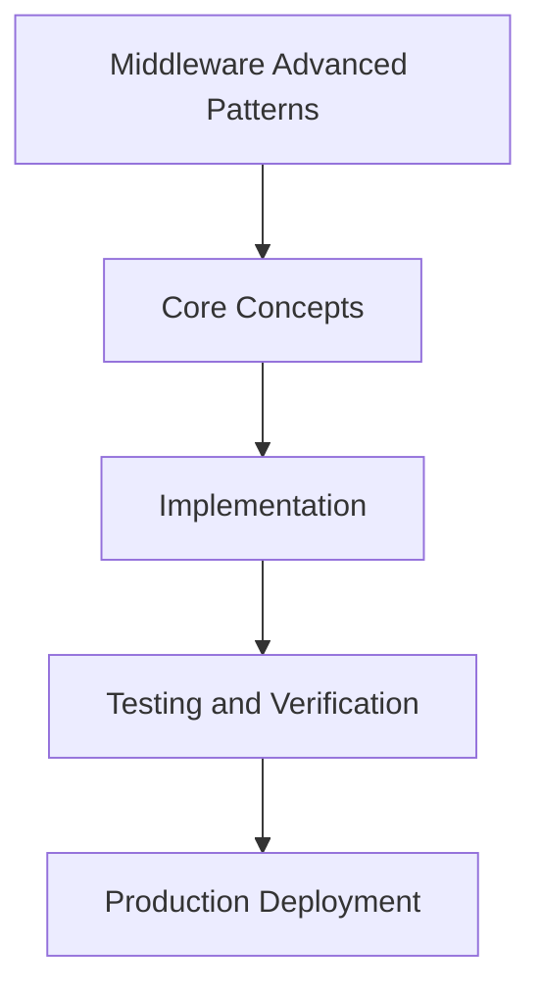

# Day 57 [Advanced]: Middleware Advanced Patterns

## Index

- [Goal](#goal)
- [Prerequisites](#prerequisites)
- [Explanation](#explanation)
- [Topic by Topic](#topic-by-topic)
- [Key Concepts](#key-concepts)
- [Visual Concept Map](#visual-concept-map)
- [End-to-End Practical](#end-to-end-practical)
- [Hands-on Coding](#hands-on-coding)
- [Mini Exercise](#mini-exercise)
- [Assessment Quiz](#assessment-quiz)
- [Task](#task)
- [Self Check](#self-check)
- [Interview Questions and Answers](#interview-questions-and-answers)
- [Day 57 Outcome](#day-57-outcome)

## Goal

Understand and apply Middleware Advanced Patterns in a Next.js application to build production-quality features.

## Prerequisites

- Day 56 completed
- Solid understanding of Next.js App Router and TypeScript basics
- Familiarity with Server Components and data fetching patterns

## Explanation

Middleware is powerful because it runs before route logic, but advanced usage must remain focused and low overhead.

A production middleware strategy enforces policy, protects routes, and preserves performance without turning request entry points into hidden complexity.


## Topic by Topic

### Topic 1: Matcher Scope Strategy

Theory:
Middleware should execute only where necessary; broad matchers increase cost and complexity.

Practical:
Use precise matcher expressions and validate exclusions for static assets and APIs as needed.

Code Example:

```tsx
// Middleware Advanced Patterns — Topic 1
// Implementation depends on your specific use case.
// Refer to the Next.js documentation for detailed API reference.
export default function Example1() {
  return <div>Middleware Advanced Patterns — Example 1</div>;
}
```
**Explanation:**
Scope discipline keeps middleware efficient and predictable.

**Key Points:**
- Limit middleware scope deliberately.
- Exclude non-essential paths early.
- Test matcher rules with route coverage.


### Topic 2: Auth and Redirect Guardrails

Theory:
Middleware is useful for lightweight access checks before expensive rendering begins.

Practical:
Implement token/session gate checks and deterministic redirect paths for protected routes.

Code Example:

```tsx
// Middleware Advanced Patterns — Topic 2
// Implementation depends on your specific use case.
// Refer to the Next.js documentation for detailed API reference.
export default function Example2() {
  return <div>Middleware Advanced Patterns — Example 2</div>;
}
```
**Explanation:**
Early guardrails improve security while reducing wasted render work.

**Key Points:**
- Perform lightweight auth checks only.
- Use deterministic redirect outcomes.
- Keep heavy authorization logic out of middleware.


### Topic 3: Tenant and Locale Resolution

Theory:
Multi-tenant and locale-aware apps often resolve context from domain, path, or headers.

Practical:
Normalize tenant/locale context in middleware and pass it downstream via safe request metadata.

Code Example:

```tsx
// Middleware Advanced Patterns — Topic 3
// Implementation depends on your specific use case.
// Refer to the Next.js documentation for detailed API reference.
export default function Example3() {
  return <div>Middleware Advanced Patterns — Example 3</div>;
}
```
**Explanation:**
Centralized context resolution avoids repeated parsing and inconsistent behavior.

**Key Points:**
- Resolve context once at entry.
- Propagate normalized values downstream.
- Handle unknown context gracefully.


### Topic 4: Security Policy Enforcement

Theory:
Baseline security controls like headers and abuse checks can be enforced before routing.

Practical:
Apply security header policy and lightweight abuse heuristics at middleware boundaries.

Code Example:

```tsx
// Middleware Advanced Patterns — Topic 4
// Implementation depends on your specific use case.
// Refer to the Next.js documentation for detailed API reference.
export default function Example4() {
  return <div>Middleware Advanced Patterns — Example 4</div>;
}
```
**Explanation:**
Early policy enforcement reduces attack surface and protects deeper services.

**Key Points:**
- Set consistent security defaults.
- Keep checks lightweight and deterministic.
- Escalate complex checks to dedicated systems.


### Topic 5: Trace and Request Correlation

Theory:
Observability is strongest when correlation IDs are created and propagated at request entry.

Practical:
Attach trace IDs in middleware and forward them through internal calls and logs.

Code Example:

```tsx
// Middleware Advanced Patterns — Topic 5
// Implementation depends on your specific use case.
// Refer to the Next.js documentation for detailed API reference.
export default function Example5() {
  return <div>Middleware Advanced Patterns — Example 5</div>;
}
```
**Explanation:**
Entry-point correlation improves distributed debugging speed.

**Key Points:**
- Generate/propagate request identifiers.
- Log middleware decisions with context.
- Keep trace metadata consistent across services.


### Topic 6: Performance Budgeting

Theory:
Middleware overhead affects every matched request and needs strict latency budgets.

Practical:
Measure middleware execution, optimize hot paths, and keep emergency rollback toggles available.

Code Example:

```tsx
// Middleware Advanced Patterns — Topic 6
// Implementation depends on your specific use case.
// Refer to the Next.js documentation for detailed API reference.
export default function Example6() {
  return <div>Middleware Advanced Patterns — Example 6</div>;
}
```
**Explanation:**
Budgeted middleware avoids hidden global latency regressions.

**Key Points:**
- Define latency budgets for middleware.
- Optimize common-path execution first.
- Keep rollback path ready for incidents.


## Key Concepts

- Middleware Advanced Patterns: Core concept for advanced Next.js development
- Next.js App Router: The modern routing system using the app/ directory
- Server Component: A component that runs on the server only
- TypeScript: Strongly typed JavaScript used throughout Next.js projects

## Visual Concept Map



## End-to-End Practical

1. Review the explanation and all topic examples.
2. Set up a clean Next.js project or use your existing one.
3. Implement each topic example step by step.
4. Verify the behavior in the browser.
5. Refactor and clean up your implementation.
6. Write a brief note on what you learned.

## Hands-on Coding

### Example 1: Basic Middleware Advanced Patterns Implementation

```tsx
// Basic implementation of Middleware Advanced Patterns
// Follow the topic examples above to build this out.
export default function Example() {
  return (
    <div style={{ padding: "24px" }}>
      <h1>Middleware Advanced Patterns</h1>
      <p>Implementation complete for Day 57.</p>
    </div>
  );
}
```

### Example 2: Practical Use Case

```tsx
// A real-world use case for Middleware Advanced Patterns
// Refer to the Topic by Topic section for code details.
export default function PracticalExample() {
  return (
    <div>
      <h2>Practical: Middleware Advanced Patterns</h2>
    </div>
  );
}
```

### Example 3: Combined Pattern

```tsx
// Combining Middleware Advanced Patterns with other Next.js features
// This example shows integration with the App Router.
export default function CombinedExample() {
  return (
    <section>
      <h2>Middleware Advanced Patterns — Combined Pattern</h2>
      <p>See topic sections above for detailed code.</p>
    </section>
  );
}
```

## Mini Exercise

Scenario:
You are adding Middleware Advanced Patterns to a Next.js application for a real-world feature.

Steps:

1. Create a new route or component relevant to this topic.
2. Implement the core pattern from the Topic by Topic section.
3. Test the implementation thoroughly.
4. Verify edge cases are handled.
5. Clean up and document your code.

Expected output:

- Working implementation of Middleware Advanced Patterns
- All edge cases handled correctly
- Clean, readable code following Next.js conventions

## Assessment Quiz

### Quiz Questions

1. What is the primary purpose of Middleware Advanced Patterns in Next.js?
2. Where in the project structure do you implement this pattern?
3. What is a common mistake when using Middleware Advanced Patterns?
4. True or False: Middleware Advanced Patterns only applies to Client Components.
5. How does Middleware Advanced Patterns improve the user or developer experience?

### Quiz Answers

1. To enable advanced-level functionality in a Next.js application efficiently.
2. In the App Router directory structure, using Server Components by default.
3. Mixing server and client concerns incorrectly, or skipping error handling.
4. False. This concept applies broadly across the Next.js architecture.
5. It improves maintainability, performance, and scalability of the application.

## Task

- Study all topic examples in today's lesson
- Implement the core pattern in a Next.js project
- Test all scenarios including error and edge cases
- Complete the mini exercise
- Attempt the quiz before checking answers

## Self Check

- You can implement Middleware Advanced Patterns from scratch
- You understand when and why to use this pattern
- You can explain the concept in simple terms
- You have tested the implementation in a running app
- You can answer at least 4 out of 5 quiz questions correctly

## Interview Questions and Answers

### Beginner

**Question:** What is Middleware Advanced Patterns in Next.js?

**Answer:** Middleware Advanced Patterns is a advanced-level Next.js feature that helps developers build robust, scalable applications by handling a specific aspect of the framework architecture.

**Question:** When would you use Middleware Advanced Patterns?

**Answer:** When you need to implement the specific functionality it provides in a production Next.js application, particularly in advanced-stage projects.

### Middle

**Question:** How does Middleware Advanced Patterns interact with the Next.js App Router?

**Answer:** It integrates with the App Router through Server Components, Route Handlers, or middleware, depending on the specific implementation pattern required.

**Question:** What are common pitfalls with Middleware Advanced Patterns?

**Answer:** The most common pitfalls are improper handling of server/client boundaries, missing error states, and not considering caching behavior when relevant.

### Advanced

**Question:** How would you scale Middleware Advanced Patterns in a large Next.js application with multiple teams?

**Answer:** By establishing clear conventions, creating reusable utilities, documenting patterns in an Architecture Decision Record, and enforcing consistency through code review and linting rules.

**Question:** What performance considerations apply to Middleware Advanced Patterns?

**Answer:** Consider bundle size impact for client-side features, caching strategies for data fetching, and rendering mode selection to balance performance with data freshness.

## Day 57 Outcome

- You understand Middleware Advanced Patterns and its role in Next.js
- You can implement this pattern in a real project
- You know when to use and when to avoid this pattern
- You are ready for Day 57 — moving on to the next topic
