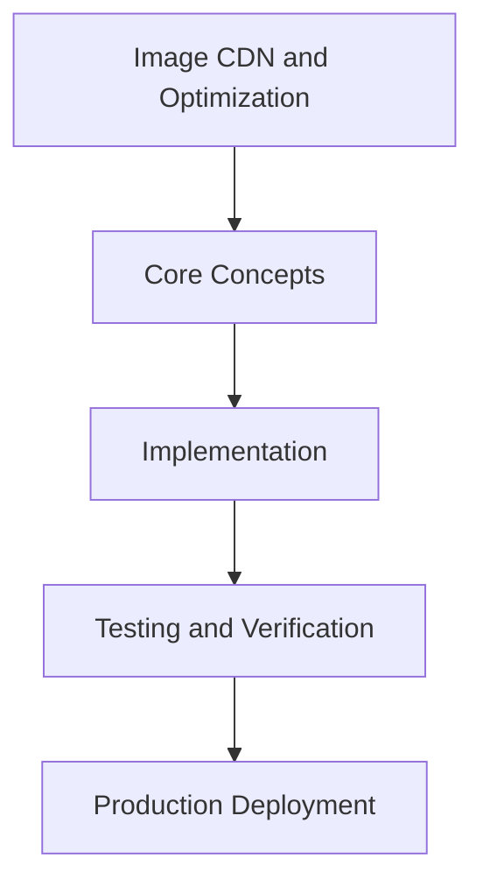

# Day 58 [Advanced]: Image CDN and Optimization

## Index

- [Goal](#goal)
- [Prerequisites](#prerequisites)
- [Explanation](#explanation)
- [Topic by Topic](#topic-by-topic)
- [Key Concepts](#key-concepts)
- [Visual Concept Map](#visual-concept-map)
- [End-to-End Practical](#end-to-end-practical)
- [Hands-on Coding](#hands-on-coding)
- [Mini Exercise](#mini-exercise)
- [Assessment Quiz](#assessment-quiz)
- [Task](#task)
- [Self Check](#self-check)
- [Interview Questions and Answers](#interview-questions-and-answers)
- [Day 58 Outcome](#day-58-outcome)

## Goal

Understand and apply Image CDN and Optimization in a Next.js application to build production-quality features.

## Prerequisites

- Day 57 completed
- Solid understanding of Next.js App Router and TypeScript basics
- Familiarity with Server Components and data fetching patterns

## Explanation

Image delivery is often the largest performance lever in web apps. In Next.js, combining next/image with a good CDN strategy improves LCP, bandwidth efficiency, and visual stability.

The goal is to balance quality, responsive sizing, caching, and source governance with measurable impact on real user performance.


## Topic by Topic

### Topic 1: Image Delivery Architecture

Theory:
Image optimization is most effective when rendering and transformation responsibilities are clearly separated.

Practical:
Define whether resizing/format conversion occurs at Next.js layer, CDN layer, or both with strict rules.

Code Example:

```tsx
// Image CDN and Optimization — Topic 1
// Implementation depends on your specific use case.
// Refer to the Next.js documentation for detailed API reference.
export default function Example1() {
  return <div>Image CDN and Optimization — Example 1</div>;
}
```
**Explanation:**
Architecture clarity prevents redundant transforms and inconsistent output quality.

**Key Points:**
- Document optimization responsibilities clearly.
- Avoid duplicate transform chains.
- Standardize image delivery rules per asset class.


### Topic 2: Responsive Sizing Strategy

Theory:
Right-sized images by viewport significantly reduce transfer cost and improve paint times.

Practical:
Configure next/image sizes and dimensions based on actual layout breakpoints.

Code Example:

```tsx
// Image CDN and Optimization — Topic 2
// Implementation depends on your specific use case.
// Refer to the Next.js documentation for detailed API reference.
export default function Example2() {
  return <div>Image CDN and Optimization — Example 2</div>;
}
```
**Explanation:**
Responsive sizing avoids over-downloading large assets on small screens.

**Key Points:**
- Align sizes with real layout behavior.
- Avoid fixed oversized image dimensions.
- Inspect selected srcset candidates in browser tools.


### Topic 3: Format and Quality Tuning

Theory:
Format and quality settings must balance byte savings with visual fidelity.

Practical:
Tune quality presets by content type and validate subjective quality in target devices.

Code Example:

```tsx
// Image CDN and Optimization — Topic 3
// Implementation depends on your specific use case.
// Refer to the Next.js documentation for detailed API reference.
export default function Example3() {
  return <div>Image CDN and Optimization — Example 3</div>;
}
```
**Explanation:**
Intentional format/quality policy improves performance without degrading visual trust.

**Key Points:**
- Use modern formats where useful.
- Tune compression by asset type.
- Verify output quality before broad rollout.


### Topic 4: CDN Cache and Invalidation

Theory:
Cache policy determines image latency and origin load under real traffic.

Practical:
Use immutable caching for versioned assets and define invalidation workflow for mutable media.

Code Example:

```tsx
// Image CDN and Optimization — Topic 4
// Implementation depends on your specific use case.
// Refer to the Next.js documentation for detailed API reference.
export default function Example4() {
  return <div>Image CDN and Optimization — Example 4</div>;
}
```
**Explanation:**
Reliable cache strategy delivers speed and operational stability.

**Key Points:**
- Set cache headers intentionally.
- Plan invalidation for mutable assets.
- Track hit ratio and origin pressure.


### Topic 5: Remote Source Governance

Theory:
Unrestricted remote image sources increase abuse risk and unpredictability.

Practical:
Whitelist trusted remote hosts and enforce request/transform limits.

Code Example:

```tsx
// Image CDN and Optimization — Topic 5
// Implementation depends on your specific use case.
// Refer to the Next.js documentation for detailed API reference.
export default function Example5() {
  return <div>Image CDN and Optimization — Example 5</div>;
}
```
**Explanation:**
Source governance protects cost, uptime, and security posture.

**Key Points:**
- Restrict allowed remote domains.
- Set safe transform limits.
- Audit source reliability periodically.


### Topic 6: Vitals-driven Optimization

Theory:
Real user metrics like LCP and CLS must guide image optimization decisions.

Practical:
Measure vitals before/after changes and prioritize high-traffic template improvements.

Code Example:

```tsx
// Image CDN and Optimization — Topic 6
// Implementation depends on your specific use case.
// Refer to the Next.js documentation for detailed API reference.
export default function Example6() {
  return <div>Image CDN and Optimization — Example 6</div>;
}
```
**Explanation:**
Metrics-driven tuning connects engineering effort to user-perceived speed gains.

**Key Points:**
- Track LCP/CLS by page class.
- Use staged rollouts for image policy changes.
- Focus on highest-impact routes first.


## Key Concepts

- Image CDN and Optimization: Core concept for advanced Next.js development
- Next.js App Router: The modern routing system using the app/ directory
- Server Component: A component that runs on the server only
- TypeScript: Strongly typed JavaScript used throughout Next.js projects

## Visual Concept Map



## End-to-End Practical

1. Review the explanation and all topic examples.
2. Set up a clean Next.js project or use your existing one.
3. Implement each topic example step by step.
4. Verify the behavior in the browser.
5. Refactor and clean up your implementation.
6. Write a brief note on what you learned.

## Hands-on Coding

### Example 1: Basic Image CDN and Optimization Implementation

```tsx
// Basic implementation of Image CDN and Optimization
// Follow the topic examples above to build this out.
export default function Example() {
  return (
    <div style={{ padding: "24px" }}>
      <h1>Image CDN and Optimization</h1>
      <p>Implementation complete for Day 58.</p>
    </div>
  );
}
```

### Example 2: Practical Use Case

```tsx
// A real-world use case for Image CDN and Optimization
// Refer to the Topic by Topic section for code details.
export default function PracticalExample() {
  return (
    <div>
      <h2>Practical: Image CDN and Optimization</h2>
    </div>
  );
}
```

### Example 3: Combined Pattern

```tsx
// Combining Image CDN and Optimization with other Next.js features
// This example shows integration with the App Router.
export default function CombinedExample() {
  return (
    <section>
      <h2>Image CDN and Optimization — Combined Pattern</h2>
      <p>See topic sections above for detailed code.</p>
    </section>
  );
}
```

## Mini Exercise

Scenario:
You are adding Image CDN and Optimization to a Next.js application for a real-world feature.

Steps:

1. Create a new route or component relevant to this topic.
2. Implement the core pattern from the Topic by Topic section.
3. Test the implementation thoroughly.
4. Verify edge cases are handled.
5. Clean up and document your code.

Expected output:

- Working implementation of Image CDN and Optimization
- All edge cases handled correctly
- Clean, readable code following Next.js conventions

## Assessment Quiz

### Quiz Questions

1. What is the primary purpose of Image CDN and Optimization in Next.js?
2. Where in the project structure do you implement this pattern?
3. What is a common mistake when using Image CDN and Optimization?
4. True or False: Image CDN and Optimization only applies to Client Components.
5. How does Image CDN and Optimization improve the user or developer experience?

### Quiz Answers

1. To enable advanced-level functionality in a Next.js application efficiently.
2. In the App Router directory structure, using Server Components by default.
3. Mixing server and client concerns incorrectly, or skipping error handling.
4. False. This concept applies broadly across the Next.js architecture.
5. It improves maintainability, performance, and scalability of the application.

## Task

- Study all topic examples in today's lesson
- Implement the core pattern in a Next.js project
- Test all scenarios including error and edge cases
- Complete the mini exercise
- Attempt the quiz before checking answers

## Self Check

- You can implement Image CDN and Optimization from scratch
- You understand when and why to use this pattern
- You can explain the concept in simple terms
- You have tested the implementation in a running app
- You can answer at least 4 out of 5 quiz questions correctly

## Interview Questions and Answers

### Beginner

**Question:** What is Image CDN and Optimization in Next.js?

**Answer:** Image CDN and Optimization is a advanced-level Next.js feature that helps developers build robust, scalable applications by handling a specific aspect of the framework architecture.

**Question:** When would you use Image CDN and Optimization?

**Answer:** When you need to implement the specific functionality it provides in a production Next.js application, particularly in advanced-stage projects.

### Middle

**Question:** How does Image CDN and Optimization interact with the Next.js App Router?

**Answer:** It integrates with the App Router through Server Components, Route Handlers, or middleware, depending on the specific implementation pattern required.

**Question:** What are common pitfalls with Image CDN and Optimization?

**Answer:** The most common pitfalls are improper handling of server/client boundaries, missing error states, and not considering caching behavior when relevant.

### Advanced

**Question:** How would you scale Image CDN and Optimization in a large Next.js application with multiple teams?

**Answer:** By establishing clear conventions, creating reusable utilities, documenting patterns in an Architecture Decision Record, and enforcing consistency through code review and linting rules.

**Question:** What performance considerations apply to Image CDN and Optimization?

**Answer:** Consider bundle size impact for client-side features, caching strategies for data fetching, and rendering mode selection to balance performance with data freshness.

## Day 58 Outcome

- You understand Image CDN and Optimization and its role in Next.js
- You can implement this pattern in a real project
- You know when to use and when to avoid this pattern
- You are ready for Day 58 — moving on to the next topic
