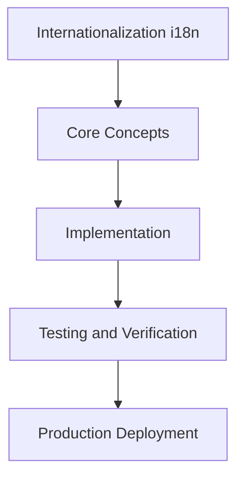

# Day 59 [Advanced]: Internationalization i18n

## Index

- [Goal](#goal)
- [Prerequisites](#prerequisites)
- [Explanation](#explanation)
- [Topic by Topic](#topic-by-topic)
- [Key Concepts](#key-concepts)
- [Visual Concept Map](#visual-concept-map)
- [End-to-End Practical](#end-to-end-practical)
- [Hands-on Coding](#hands-on-coding)
- [Mini Exercise](#mini-exercise)
- [Assessment Quiz](#assessment-quiz)
- [Task](#task)
- [Self Check](#self-check)
- [Interview Questions and Answers](#interview-questions-and-answers)
- [Day 59 Outcome](#day-59-outcome)

## Goal

Understand and apply Internationalization i18n in a Next.js application to build production-quality features.

## Prerequisites

- Day 58 completed
- Solid understanding of Next.js App Router and TypeScript basics
- Familiarity with Server Components and data fetching patterns

## Explanation

Internationalization in Next.js includes locale routing, translation resources, formatting rules, and SEO metadata across languages.

A robust i18n approach keeps server/client locale behavior consistent and ensures users get accurate, culturally appropriate content.


## Topic by Topic

### Topic 1: Locale Routing Design

Theory:
Locale URL strategy impacts SEO, analytics, and operational consistency across markets.

Practical:
Select subpath/domain routing and enforce consistent locale resolution rules.

Code Example:

```tsx
// Internationalization i18n — Topic 1
// Implementation depends on your specific use case.
// Refer to the Next.js documentation for detailed API reference.
export default function Example1() {
  return <div>Internationalization i18n — Example 1</div>;
}
```
**Explanation:**
Stable locale routing reduces ambiguity and improves discoverability.

**Key Points:**
- Choose and document one locale routing strategy.
- Handle default locale behavior explicitly.
- Keep locale redirects deterministic.


### Topic 2: Translation Resource Structure

Theory:
Translation keys should scale by domain without duplication or collisions.

Practical:
Organize translation namespaces by feature and automate missing-key checks in CI.

Code Example:

```tsx
// Internationalization i18n — Topic 2
// Implementation depends on your specific use case.
// Refer to the Next.js documentation for detailed API reference.
export default function Example2() {
  return <div>Internationalization i18n — Example 2</div>;
}
```
**Explanation:**
Structured resources keep localization maintainable as product scope grows.

**Key Points:**
- Use clear namespace conventions.
- Prevent duplicate ambiguous keys.
- Automate translation completeness checks.


### Topic 3: Server-Client Locale Consistency

Theory:
Locale context must remain consistent across server render and client hydration.

Practical:
Resolve locale early and propagate through shared providers/components.

Code Example:

```tsx
// Internationalization i18n — Topic 3
// Implementation depends on your specific use case.
// Refer to the Next.js documentation for detailed API reference.
export default function Example3() {
  return <div>Internationalization i18n — Example 3</div>;
}
```
**Explanation:**
Consistency prevents wrong-language flashes and hydration mismatch issues.

**Key Points:**
- Resolve locale before rendering critical UI.
- Share locale context across boundaries.
- Test hydration behavior for multilingual routes.


### Topic 4: Locale-aware Formatting

Theory:
Dates, numbers, and currency formatting are core localization quality requirements.

Practical:
Use Intl APIs or vetted locale libraries for output formatting across route segments.

Code Example:

```tsx
// Internationalization i18n — Topic 4
// Implementation depends on your specific use case.
// Refer to the Next.js documentation for detailed API reference.
export default function Example4() {
  return <div>Internationalization i18n — Example 4</div>;
}
```
**Explanation:**
Correct formatting increases user trust and reduces comprehension errors.

**Key Points:**
- Use standardized locale formatting APIs.
- Avoid hardcoded regional formats.
- Validate formatting with target-locale samples.


### Topic 5: Fallback and Missing-key Strategy

Theory:
Missing translations should fail gracefully with clear fallback logic.

Practical:
Define fallback locale order and logging for missing keys in production.

Code Example:

```tsx
// Internationalization i18n — Topic 5
// Implementation depends on your specific use case.
// Refer to the Next.js documentation for detailed API reference.
export default function Example5() {
  return <div>Internationalization i18n — Example 5</div>;
}
```
**Explanation:**
Fallback strategy keeps releases stable even with partial translation coverage.

**Key Points:**
- Define explicit fallback priority.
- Log and monitor missing translations.
- Prevent raw key leakage in UI.


### Topic 6: Localized SEO Signals

Theory:
Search engines need locale-specific metadata and alternate language links for proper indexing.

Practical:
Generate hreflang, localized metadata, and canonical signals per locale route.

Code Example:

```tsx
// Internationalization i18n — Topic 6
// Implementation depends on your specific use case.
// Refer to the Next.js documentation for detailed API reference.
export default function Example6() {
  return <div>Internationalization i18n — Example 6</div>;
}
```
**Explanation:**
Localized SEO signals improve region-specific search visibility and reduce duplicate-content confusion.

**Key Points:**
- Implement hreflang and canonical consistently.
- Localize metadata with content context.
- Verify indexed locale variants post-deploy.


## Key Concepts

- Internationalization i18n: Core concept for advanced Next.js development
- Next.js App Router: The modern routing system using the app/ directory
- Server Component: A component that runs on the server only
- TypeScript: Strongly typed JavaScript used throughout Next.js projects

## Visual Concept Map



## End-to-End Practical

1. Review the explanation and all topic examples.
2. Set up a clean Next.js project or use your existing one.
3. Implement each topic example step by step.
4. Verify the behavior in the browser.
5. Refactor and clean up your implementation.
6. Write a brief note on what you learned.

## Hands-on Coding

### Example 1: Basic Internationalization i18n Implementation

```tsx
// Basic implementation of Internationalization i18n
// Follow the topic examples above to build this out.
export default function Example() {
  return (
    <div style={{ padding: "24px" }}>
      <h1>Internationalization i18n</h1>
      <p>Implementation complete for Day 59.</p>
    </div>
  );
}
```

### Example 2: Practical Use Case

```tsx
// A real-world use case for Internationalization i18n
// Refer to the Topic by Topic section for code details.
export default function PracticalExample() {
  return (
    <div>
      <h2>Practical: Internationalization i18n</h2>
    </div>
  );
}
```

### Example 3: Combined Pattern

```tsx
// Combining Internationalization i18n with other Next.js features
// This example shows integration with the App Router.
export default function CombinedExample() {
  return (
    <section>
      <h2>Internationalization i18n — Combined Pattern</h2>
      <p>See topic sections above for detailed code.</p>
    </section>
  );
}
```

## Mini Exercise

Scenario:
You are adding Internationalization i18n to a Next.js application for a real-world feature.

Steps:

1. Create a new route or component relevant to this topic.
2. Implement the core pattern from the Topic by Topic section.
3. Test the implementation thoroughly.
4. Verify edge cases are handled.
5. Clean up and document your code.

Expected output:

- Working implementation of Internationalization i18n
- All edge cases handled correctly
- Clean, readable code following Next.js conventions

## Assessment Quiz

### Quiz Questions

1. What is the primary purpose of Internationalization i18n in Next.js?
2. Where in the project structure do you implement this pattern?
3. What is a common mistake when using Internationalization i18n?
4. True or False: Internationalization i18n only applies to Client Components.
5. How does Internationalization i18n improve the user or developer experience?

### Quiz Answers

1. To enable advanced-level functionality in a Next.js application efficiently.
2. In the App Router directory structure, using Server Components by default.
3. Mixing server and client concerns incorrectly, or skipping error handling.
4. False. This concept applies broadly across the Next.js architecture.
5. It improves maintainability, performance, and scalability of the application.

## Task

- Study all topic examples in today's lesson
- Implement the core pattern in a Next.js project
- Test all scenarios including error and edge cases
- Complete the mini exercise
- Attempt the quiz before checking answers

## Self Check

- You can implement Internationalization i18n from scratch
- You understand when and why to use this pattern
- You can explain the concept in simple terms
- You have tested the implementation in a running app
- You can answer at least 4 out of 5 quiz questions correctly

## Interview Questions and Answers

### Beginner

**Question:** What is Internationalization i18n in Next.js?

**Answer:** Internationalization i18n is a advanced-level Next.js feature that helps developers build robust, scalable applications by handling a specific aspect of the framework architecture.

**Question:** When would you use Internationalization i18n?

**Answer:** When you need to implement the specific functionality it provides in a production Next.js application, particularly in advanced-stage projects.

### Middle

**Question:** How does Internationalization i18n interact with the Next.js App Router?

**Answer:** It integrates with the App Router through Server Components, Route Handlers, or middleware, depending on the specific implementation pattern required.

**Question:** What are common pitfalls with Internationalization i18n?

**Answer:** The most common pitfalls are improper handling of server/client boundaries, missing error states, and not considering caching behavior when relevant.

### Advanced

**Question:** How would you scale Internationalization i18n in a large Next.js application with multiple teams?

**Answer:** By establishing clear conventions, creating reusable utilities, documenting patterns in an Architecture Decision Record, and enforcing consistency through code review and linting rules.

**Question:** What performance considerations apply to Internationalization i18n?

**Answer:** Consider bundle size impact for client-side features, caching strategies for data fetching, and rendering mode selection to balance performance with data freshness.

## Day 59 Outcome

- You understand Internationalization i18n and its role in Next.js
- You can implement this pattern in a real project
- You know when to use and when to avoid this pattern
- You are ready for Day 59 — moving on to the next topic
