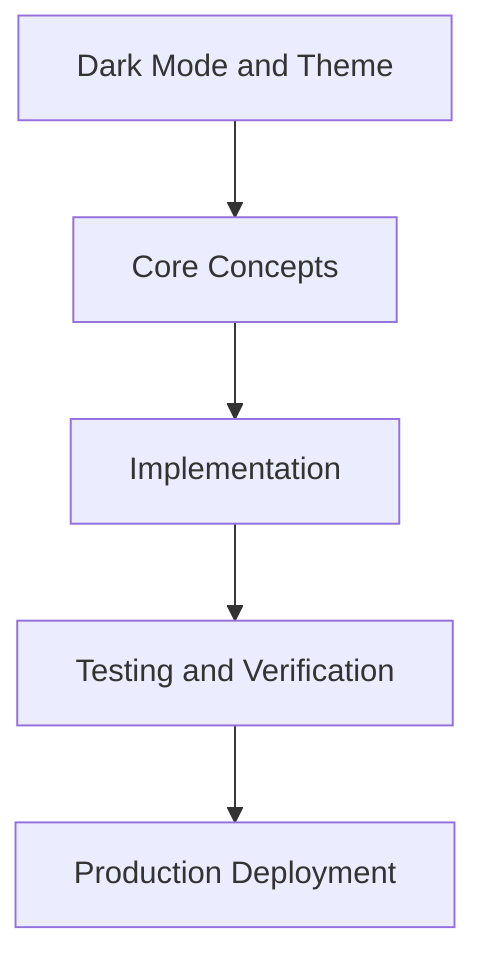

# Day 60 [Advanced]: Dark Mode and Theme

## Index

- [Goal](#goal)
- [Prerequisites](#prerequisites)
- [Explanation](#explanation)
- [Topic by Topic](#topic-by-topic)
- [Key Concepts](#key-concepts)
- [Visual Concept Map](#visual-concept-map)
- [End-to-End Practical](#end-to-end-practical)
- [Hands-on Coding](#hands-on-coding)
- [Mini Exercise](#mini-exercise)
- [Assessment Quiz](#assessment-quiz)
- [Task](#task)
- [Self Check](#self-check)
- [Interview Questions and Answers](#interview-questions-and-answers)
- [Day 60 Outcome](#day-60-outcome)

## Goal

Understand and apply Dark Mode and Theme in a Next.js application to build production-quality features.

## Prerequisites

- Day 59 completed
- Solid understanding of Next.js App Router and TypeScript basics
- Familiarity with Server Components and data fetching patterns

## Explanation

Theme systems in Next.js should be SSR-safe, accessible, and maintainable. A simple toggle is not enough if it causes hydration mismatch or flash-of-wrong-theme.

This lesson focuses on token-based theming, preference persistence, and accessibility validation so dark mode works reliably in production.


## Topic by Topic

### Topic 1: Theme Token Foundations

Theory:
Scalable theming starts with semantic design tokens rather than raw color literals.

Practical:
Define shared CSS variable tokens for surfaces, text, borders, and states across themes.

Code Example:

```tsx
// Dark Mode and Theme — Topic 1
// Implementation depends on your specific use case.
// Refer to the Next.js documentation for detailed API reference.
export default function Example1() {
  return <div>Dark Mode and Theme — Example 1</div>;
}
```
**Explanation:**
Token foundations make theme evolution manageable and consistent across components.

**Key Points:**
- Use semantic tokens as the source of truth.
- Avoid hardcoded per-component colors.
- Document token usage rules for teams.


### Topic 2: SSR-safe Theme Initialization

Theory:
Initial theme must be applied before first paint to avoid flash-of-wrong-theme and hydration mismatch.

Practical:
Hydrate theme class/data-attribute from reliable server-compatible preference source.

Code Example:

```tsx
// Dark Mode and Theme — Topic 2
// Implementation depends on your specific use case.
// Refer to the Next.js documentation for detailed API reference.
export default function Example2() {
  return <div>Dark Mode and Theme — Example 2</div>;
}
```
**Explanation:**
SSR-safe initialization preserves visual consistency from first render.

**Key Points:**
- Set initial theme before meaningful paint.
- Keep server/client theme selection aligned.
- Support system preference as fallback.


### Topic 3: Preference Persistence

Theory:
Theme preference should persist predictably across sessions and devices where applicable.

Practical:
Store preference with clear precedence rules between user choice and system setting.

Code Example:

```tsx
// Dark Mode and Theme — Topic 3
// Implementation depends on your specific use case.
// Refer to the Next.js documentation for detailed API reference.
export default function Example3() {
  return <div>Dark Mode and Theme — Example 3</div>;
}
```
**Explanation:**
Predictable persistence improves UX and prevents repeated user reconfiguration.

**Key Points:**
- Define preference precedence clearly.
- Persist selection in stable storage path.
- Handle first-visit behavior intentionally.


### Topic 4: Accessibility and Contrast

Theory:
Dark mode quality requires verified contrast and focus visibility across all interactive states.

Practical:
Audit normal/hover/focus/disabled/error states for WCAG contrast in both themes.

Code Example:

```tsx
// Dark Mode and Theme — Topic 4
// Implementation depends on your specific use case.
// Refer to the Next.js documentation for detailed API reference.
export default function Example4() {
  return <div>Dark Mode and Theme — Example 4</div>;
}
```
**Explanation:**
Accessibility validation ensures theming remains usable for all users, not only aesthetic.

**Key Points:**
- Check contrast in all component states.
- Keep focus indicators visible in both themes.
- Include accessibility checks in release QA.


### Topic 5: Third-party Component Theming

Theory:
External UI packages may not follow your token system and can break visual consistency.

Practical:
Wrap and map third-party styles to your theme variables through adapter layers.

Code Example:

```tsx
// Dark Mode and Theme — Topic 5
// Implementation depends on your specific use case.
// Refer to the Next.js documentation for detailed API reference.
export default function Example5() {
  return <div>Dark Mode and Theme — Example 5</div>;
}
```
**Explanation:**
Controlled integration keeps design language consistent across mixed component sources.

**Key Points:**
- Theme third-party components via adapters.
- Avoid ad-hoc one-off style overrides.
- Review consistency in shared layouts.


### Topic 6: Theme Performance Maintenance

Theory:
Large duplicated theme CSS and runtime toggling logic can impact performance over time.

Practical:
Prefer token switching over duplicated style trees and track theme-related CSS growth.

Code Example:

```tsx
// Dark Mode and Theme — Topic 6
// Implementation depends on your specific use case.
// Refer to the Next.js documentation for detailed API reference.
export default function Example6() {
  return <div>Dark Mode and Theme — Example 6</div>;
}
```
**Explanation:**
Performance-aware theming keeps UI fast and easier to maintain at scale.

**Key Points:**
- Switch tokens instead of duplicating style blocks.
- Monitor theme CSS bundle size regularly.
- Refactor stale overrides during maintenance cycles.


## Key Concepts

- Dark Mode and Theme: Core concept for advanced Next.js development
- Next.js App Router: The modern routing system using the app/ directory
- Server Component: A component that runs on the server only
- TypeScript: Strongly typed JavaScript used throughout Next.js projects

## Visual Concept Map



## End-to-End Practical

1. Review the explanation and all topic examples.
2. Set up a clean Next.js project or use your existing one.
3. Implement each topic example step by step.
4. Verify the behavior in the browser.
5. Refactor and clean up your implementation.
6. Write a brief note on what you learned.

## Hands-on Coding

### Example 1: Basic Dark Mode and Theme Implementation

```tsx
// Basic implementation of Dark Mode and Theme
// Follow the topic examples above to build this out.
export default function Example() {
  return (
    <div style={{ padding: "24px" }}>
      <h1>Dark Mode and Theme</h1>
      <p>Implementation complete for Day 60.</p>
    </div>
  );
}
```

### Example 2: Practical Use Case

```tsx
// A real-world use case for Dark Mode and Theme
// Refer to the Topic by Topic section for code details.
export default function PracticalExample() {
  return (
    <div>
      <h2>Practical: Dark Mode and Theme</h2>
    </div>
  );
}
```

### Example 3: Combined Pattern

```tsx
// Combining Dark Mode and Theme with other Next.js features
// This example shows integration with the App Router.
export default function CombinedExample() {
  return (
    <section>
      <h2>Dark Mode and Theme — Combined Pattern</h2>
      <p>See topic sections above for detailed code.</p>
    </section>
  );
}
```

## Mini Exercise

Scenario:
You are adding Dark Mode and Theme to a Next.js application for a real-world feature.

Steps:

1. Create a new route or component relevant to this topic.
2. Implement the core pattern from the Topic by Topic section.
3. Test the implementation thoroughly.
4. Verify edge cases are handled.
5. Clean up and document your code.

Expected output:

- Working implementation of Dark Mode and Theme
- All edge cases handled correctly
- Clean, readable code following Next.js conventions

## Assessment Quiz

### Quiz Questions

1. What is the primary purpose of Dark Mode and Theme in Next.js?
2. Where in the project structure do you implement this pattern?
3. What is a common mistake when using Dark Mode and Theme?
4. True or False: Dark Mode and Theme only applies to Client Components.
5. How does Dark Mode and Theme improve the user or developer experience?

### Quiz Answers

1. To enable advanced-level functionality in a Next.js application efficiently.
2. In the App Router directory structure, using Server Components by default.
3. Mixing server and client concerns incorrectly, or skipping error handling.
4. False. This concept applies broadly across the Next.js architecture.
5. It improves maintainability, performance, and scalability of the application.

## Task

- Study all topic examples in today's lesson
- Implement the core pattern in a Next.js project
- Test all scenarios including error and edge cases
- Complete the mini exercise
- Attempt the quiz before checking answers

## Self Check

- You can implement Dark Mode and Theme from scratch
- You understand when and why to use this pattern
- You can explain the concept in simple terms
- You have tested the implementation in a running app
- You can answer at least 4 out of 5 quiz questions correctly

## Interview Questions and Answers

### Beginner

**Question:** What is Dark Mode and Theme in Next.js?

**Answer:** Dark Mode and Theme is a advanced-level Next.js feature that helps developers build robust, scalable applications by handling a specific aspect of the framework architecture.

**Question:** When would you use Dark Mode and Theme?

**Answer:** When you need to implement the specific functionality it provides in a production Next.js application, particularly in advanced-stage projects.

### Middle

**Question:** How does Dark Mode and Theme interact with the Next.js App Router?

**Answer:** It integrates with the App Router through Server Components, Route Handlers, or middleware, depending on the specific implementation pattern required.

**Question:** What are common pitfalls with Dark Mode and Theme?

**Answer:** The most common pitfalls are improper handling of server/client boundaries, missing error states, and not considering caching behavior when relevant.

### Advanced

**Question:** How would you scale Dark Mode and Theme in a large Next.js application with multiple teams?

**Answer:** By establishing clear conventions, creating reusable utilities, documenting patterns in an Architecture Decision Record, and enforcing consistency through code review and linting rules.

**Question:** What performance considerations apply to Dark Mode and Theme?

**Answer:** Consider bundle size impact for client-side features, caching strategies for data fetching, and rendering mode selection to balance performance with data freshness.

## Day 60 Outcome

- You understand Dark Mode and Theme and its role in Next.js
- You can implement this pattern in a real project
- You know when to use and when to avoid this pattern
- You are ready for Day 60 — moving on to the next topic
