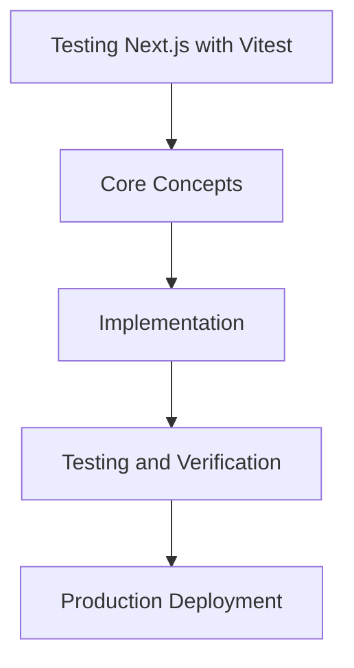

# Day 61 [Advanced]: Testing Next.js with Vitest

## Index

- [Goal](#goal)
- [Prerequisites](#prerequisites)
- [Explanation](#explanation)
- [Topic by Topic](#topic-by-topic)
- [Key Concepts](#key-concepts)
- [Visual Concept Map](#visual-concept-map)
- [End-to-End Practical](#end-to-end-practical)
- [Hands-on Coding](#hands-on-coding)
- [Mini Exercise](#mini-exercise)
- [Assessment Quiz](#assessment-quiz)
- [Task](#task)
- [Self Check](#self-check)
- [Interview Questions and Answers](#interview-questions-and-answers)
- [Day 61 Outcome](#day-61-outcome)

## Goal

Understand and apply Testing Next.js with Vitest in a Next.js application to build production-quality features.

## Prerequisites

- Day 60 completed
- Solid understanding of Next.js App Router and TypeScript basics
- Familiarity with Server Components and data fetching patterns

## Explanation

Vitest can give fast and reliable test feedback in Next.js projects when test boundaries are clear and environment setup is intentional.

This lesson focuses on testing strategy for components, utilities, and server-facing logic so teams can catch regressions early without slow or flaky pipelines.


## Topic by Topic

### Topic 1: Vitest Setup and Environment Strategy

Theory:
This topic covers Vitest Setup and Environment Strategy in production Next.js systems, focusing on reliability, maintainability, and measurable outcomes.

Practical:
Apply Vitest Setup and Environment Strategy in a realistic project scenario, validate behavior under edge cases, and record tradeoffs for team review.

Code Example:

```tsx
// Testing Next.js with Vitest — Topic 1
// Implementation depends on your specific use case.
// Refer to the Next.js documentation for detailed API reference.
export default function Example1() {
  return <div>Testing Next.js with Vitest — Example 1</div>;
}
```
**Explanation:**
Vitest Setup and Environment Strategy helps you convert framework knowledge into operationally safe delivery practices for real applications.

**Key Points:**
- Understand why Vitest Setup and Environment Strategy matters in production.
- Apply Next.js patterns intentionally with clear boundaries.
- Verify outcomes with testing, monitoring, or review checks.


### Topic 2: Testing Utility and Domain Logic

Theory:
This topic covers Testing Utility and Domain Logic in production Next.js systems, focusing on reliability, maintainability, and measurable outcomes.

Practical:
Apply Testing Utility and Domain Logic in a realistic project scenario, validate behavior under edge cases, and record tradeoffs for team review.

Code Example:

```tsx
// Testing Next.js with Vitest — Topic 2
// Implementation depends on your specific use case.
// Refer to the Next.js documentation for detailed API reference.
export default function Example2() {
  return <div>Testing Next.js with Vitest — Example 2</div>;
}
```
**Explanation:**
Testing Utility and Domain Logic helps you convert framework knowledge into operationally safe delivery practices for real applications.

**Key Points:**
- Understand why Testing Utility and Domain Logic matters in production.
- Apply Next.js patterns intentionally with clear boundaries.
- Verify outcomes with testing, monitoring, or review checks.


### Topic 3: Component Testing with Mocks

Theory:
This topic covers Component Testing with Mocks in production Next.js systems, focusing on reliability, maintainability, and measurable outcomes.

Practical:
Apply Component Testing with Mocks in a realistic project scenario, validate behavior under edge cases, and record tradeoffs for team review.

Code Example:

```tsx
// Testing Next.js with Vitest — Topic 3
// Implementation depends on your specific use case.
// Refer to the Next.js documentation for detailed API reference.
export default function Example3() {
  return <div>Testing Next.js with Vitest — Example 3</div>;
}
```
**Explanation:**
Component Testing with Mocks helps you convert framework knowledge into operationally safe delivery practices for real applications.

**Key Points:**
- Understand why Component Testing with Mocks matters in production.
- Apply Next.js patterns intentionally with clear boundaries.
- Verify outcomes with testing, monitoring, or review checks.


### Topic 4: Server-aware Test Boundaries

Theory:
This topic covers Server-aware Test Boundaries in production Next.js systems, focusing on reliability, maintainability, and measurable outcomes.

Practical:
Apply Server-aware Test Boundaries in a realistic project scenario, validate behavior under edge cases, and record tradeoffs for team review.

Code Example:

```tsx
// Testing Next.js with Vitest — Topic 4
// Implementation depends on your specific use case.
// Refer to the Next.js documentation for detailed API reference.
export default function Example4() {
  return <div>Testing Next.js with Vitest — Example 4</div>;
}
```
**Explanation:**
Server-aware Test Boundaries helps you convert framework knowledge into operationally safe delivery practices for real applications.

**Key Points:**
- Understand why Server-aware Test Boundaries matters in production.
- Apply Next.js patterns intentionally with clear boundaries.
- Verify outcomes with testing, monitoring, or review checks.


### Topic 5: Coverage and Quality Gates

Theory:
This topic covers Coverage and Quality Gates in production Next.js systems, focusing on reliability, maintainability, and measurable outcomes.

Practical:
Apply Coverage and Quality Gates in a realistic project scenario, validate behavior under edge cases, and record tradeoffs for team review.

Code Example:

```tsx
// Testing Next.js with Vitest — Topic 5
// Implementation depends on your specific use case.
// Refer to the Next.js documentation for detailed API reference.
export default function Example5() {
  return <div>Testing Next.js with Vitest — Example 5</div>;
}
```
**Explanation:**
Coverage and Quality Gates helps you convert framework knowledge into operationally safe delivery practices for real applications.

**Key Points:**
- Understand why Coverage and Quality Gates matters in production.
- Apply Next.js patterns intentionally with clear boundaries.
- Verify outcomes with testing, monitoring, or review checks.


### Topic 6: Flake Prevention and CI Stability

Theory:
This topic covers Flake Prevention and CI Stability in production Next.js systems, focusing on reliability, maintainability, and measurable outcomes.

Practical:
Apply Flake Prevention and CI Stability in a realistic project scenario, validate behavior under edge cases, and record tradeoffs for team review.

Code Example:

```tsx
// Testing Next.js with Vitest — Topic 6
// Implementation depends on your specific use case.
// Refer to the Next.js documentation for detailed API reference.
export default function Example6() {
  return <div>Testing Next.js with Vitest — Example 6</div>;
}
```
**Explanation:**
Flake Prevention and CI Stability helps you convert framework knowledge into operationally safe delivery practices for real applications.

**Key Points:**
- Understand why Flake Prevention and CI Stability matters in production.
- Apply Next.js patterns intentionally with clear boundaries.
- Verify outcomes with testing, monitoring, or review checks.


## Key Concepts

- Testing Next.js with Vitest: Core concept for advanced Next.js development
- Next.js App Router: The modern routing system using the app/ directory
- Server Component: A component that runs on the server only
- TypeScript: Strongly typed JavaScript used throughout Next.js projects

## Visual Concept Map



## End-to-End Practical

1. Review the explanation and all topic examples.
2. Set up a clean Next.js project or use your existing one.
3. Implement each topic example step by step.
4. Verify the behavior in the browser.
5. Refactor and clean up your implementation.
6. Write a brief note on what you learned.

## Hands-on Coding

### Example 1: Basic Testing Next.js with Vitest Implementation

```tsx
// Basic implementation of Testing Next.js with Vitest
// Follow the topic examples above to build this out.
export default function Example() {
  return (
    <div style={{ padding: "24px" }}>
      <h1>Testing Next.js with Vitest</h1>
      <p>Implementation complete for Day 61.</p>
    </div>
  );
}
```

### Example 2: Practical Use Case

```tsx
// A real-world use case for Testing Next.js with Vitest
// Refer to the Topic by Topic section for code details.
export default function PracticalExample() {
  return (
    <div>
      <h2>Practical: Testing Next.js with Vitest</h2>
    </div>
  );
}
```

### Example 3: Combined Pattern

```tsx
// Combining Testing Next.js with Vitest with other Next.js features
// This example shows integration with the App Router.
export default function CombinedExample() {
  return (
    <section>
      <h2>Testing Next.js with Vitest — Combined Pattern</h2>
      <p>See topic sections above for detailed code.</p>
    </section>
  );
}
```

## Mini Exercise

Scenario:
You are adding Testing Next.js with Vitest to a Next.js application for a real-world feature.

Steps:

1. Create a new route or component relevant to this topic.
2. Implement the core pattern from the Topic by Topic section.
3. Test the implementation thoroughly.
4. Verify edge cases are handled.
5. Clean up and document your code.

Expected output:

- Working implementation of Testing Next.js with Vitest
- All edge cases handled correctly
- Clean, readable code following Next.js conventions

## Assessment Quiz

### Quiz Questions

1. What is the primary purpose of Testing Next.js with Vitest in Next.js?
2. Where in the project structure do you implement this pattern?
3. What is a common mistake when using Testing Next.js with Vitest?
4. True or False: Testing Next.js with Vitest only applies to Client Components.
5. How does Testing Next.js with Vitest improve the user or developer experience?

### Quiz Answers

1. To enable advanced-level functionality in a Next.js application efficiently.
2. In the App Router directory structure, using Server Components by default.
3. Mixing server and client concerns incorrectly, or skipping error handling.
4. False. This concept applies broadly across the Next.js architecture.
5. It improves maintainability, performance, and scalability of the application.

## Task

- Study all topic examples in today's lesson
- Implement the core pattern in a Next.js project
- Test all scenarios including error and edge cases
- Complete the mini exercise
- Attempt the quiz before checking answers

## Self Check

- You can implement Testing Next.js with Vitest from scratch
- You understand when and why to use this pattern
- You can explain the concept in simple terms
- You have tested the implementation in a running app
- You can answer at least 4 out of 5 quiz questions correctly

## Interview Questions and Answers

### Beginner

**Question:** What is Testing Next.js with Vitest in Next.js?

**Answer:** Testing Next.js with Vitest is a advanced-level Next.js feature that helps developers build robust, scalable applications by handling a specific aspect of the framework architecture.

**Question:** When would you use Testing Next.js with Vitest?

**Answer:** When you need to implement the specific functionality it provides in a production Next.js application, particularly in advanced-stage projects.

### Middle

**Question:** How does Testing Next.js with Vitest interact with the Next.js App Router?

**Answer:** It integrates with the App Router through Server Components, Route Handlers, or middleware, depending on the specific implementation pattern required.

**Question:** What are common pitfalls with Testing Next.js with Vitest?

**Answer:** The most common pitfalls are improper handling of server/client boundaries, missing error states, and not considering caching behavior when relevant.

### Advanced

**Question:** How would you scale Testing Next.js with Vitest in a large Next.js application with multiple teams?

**Answer:** By establishing clear conventions, creating reusable utilities, documenting patterns in an Architecture Decision Record, and enforcing consistency through code review and linting rules.

**Question:** What performance considerations apply to Testing Next.js with Vitest?

**Answer:** Consider bundle size impact for client-side features, caching strategies for data fetching, and rendering mode selection to balance performance with data freshness.

## Day 61 Outcome

- You understand Testing Next.js with Vitest and its role in Next.js
- You can implement this pattern in a real project
- You know when to use and when to avoid this pattern
- You are ready for Day 61 — moving on to the next topic
