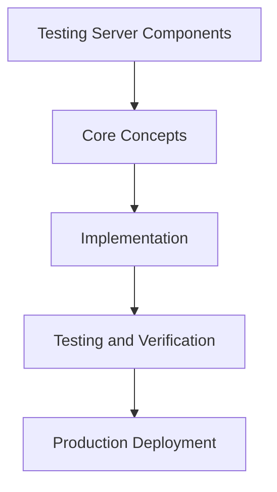

# Day 62 [Advanced]: Testing Server Components

## Index

- [Goal](#goal)
- [Prerequisites](#prerequisites)
- [Explanation](#explanation)
- [Topic by Topic](#topic-by-topic)
- [Key Concepts](#key-concepts)
- [Visual Concept Map](#visual-concept-map)
- [End-to-End Practical](#end-to-end-practical)
- [Hands-on Coding](#hands-on-coding)
- [Mini Exercise](#mini-exercise)
- [Assessment Quiz](#assessment-quiz)
- [Task](#task)
- [Self Check](#self-check)
- [Interview Questions and Answers](#interview-questions-and-answers)
- [Day 62 Outcome](#day-62-outcome)

## Goal

Understand and apply Testing Server Components in a Next.js application to build production-quality features.

## Prerequisites

- Day 61 completed
- Solid understanding of Next.js App Router and TypeScript basics
- Familiarity with Server Components and data fetching patterns

## Explanation

Server Components require a different testing mindset because they execute on the server and often depend on async data and framework boundaries.

A good test strategy isolates pure logic, validates rendered output, and keeps framework-specific integration cases focused and maintainable.


## Topic by Topic

### Topic 1: Server Component Test Scope

Theory:
This topic covers Server Component Test Scope in production Next.js systems, focusing on reliability, maintainability, and measurable outcomes.

Practical:
Apply Server Component Test Scope in a realistic project scenario, validate behavior under edge cases, and record tradeoffs for team review.

Code Example:

```tsx
// Testing Server Components — Topic 1
// Implementation depends on your specific use case.
// Refer to the Next.js documentation for detailed API reference.
export default function Example1() {
  return <div>Testing Server Components — Example 1</div>;
}
```
**Explanation:**
Server Component Test Scope helps you convert framework knowledge into operationally safe delivery practices for real applications.

**Key Points:**
- Understand why Server Component Test Scope matters in production.
- Apply Next.js patterns intentionally with clear boundaries.
- Verify outcomes with testing, monitoring, or review checks.


### Topic 2: Testing Async Data Rendering

Theory:
This topic covers Testing Async Data Rendering in production Next.js systems, focusing on reliability, maintainability, and measurable outcomes.

Practical:
Apply Testing Async Data Rendering in a realistic project scenario, validate behavior under edge cases, and record tradeoffs for team review.

Code Example:

```tsx
// Testing Server Components — Topic 2
// Implementation depends on your specific use case.
// Refer to the Next.js documentation for detailed API reference.
export default function Example2() {
  return <div>Testing Server Components — Example 2</div>;
}
```
**Explanation:**
Testing Async Data Rendering helps you convert framework knowledge into operationally safe delivery practices for real applications.

**Key Points:**
- Understand why Testing Async Data Rendering matters in production.
- Apply Next.js patterns intentionally with clear boundaries.
- Verify outcomes with testing, monitoring, or review checks.


### Topic 3: Mocking Server Dependencies

Theory:
This topic covers Mocking Server Dependencies in production Next.js systems, focusing on reliability, maintainability, and measurable outcomes.

Practical:
Apply Mocking Server Dependencies in a realistic project scenario, validate behavior under edge cases, and record tradeoffs for team review.

Code Example:

```tsx
// Testing Server Components — Topic 3
// Implementation depends on your specific use case.
// Refer to the Next.js documentation for detailed API reference.
export default function Example3() {
  return <div>Testing Server Components — Example 3</div>;
}
```
**Explanation:**
Mocking Server Dependencies helps you convert framework knowledge into operationally safe delivery practices for real applications.

**Key Points:**
- Understand why Mocking Server Dependencies matters in production.
- Apply Next.js patterns intentionally with clear boundaries.
- Verify outcomes with testing, monitoring, or review checks.


### Topic 4: Error and Empty-state Scenarios

Theory:
This topic covers Error and Empty-state Scenarios in production Next.js systems, focusing on reliability, maintainability, and measurable outcomes.

Practical:
Apply Error and Empty-state Scenarios in a realistic project scenario, validate behavior under edge cases, and record tradeoffs for team review.

Code Example:

```tsx
// Testing Server Components — Topic 4
// Implementation depends on your specific use case.
// Refer to the Next.js documentation for detailed API reference.
export default function Example4() {
  return <div>Testing Server Components — Example 4</div>;
}
```
**Explanation:**
Error and Empty-state Scenarios helps you convert framework knowledge into operationally safe delivery practices for real applications.

**Key Points:**
- Understand why Error and Empty-state Scenarios matters in production.
- Apply Next.js patterns intentionally with clear boundaries.
- Verify outcomes with testing, monitoring, or review checks.


### Topic 5: Route-level Integration Cases

Theory:
This topic covers Route-level Integration Cases in production Next.js systems, focusing on reliability, maintainability, and measurable outcomes.

Practical:
Apply Route-level Integration Cases in a realistic project scenario, validate behavior under edge cases, and record tradeoffs for team review.

Code Example:

```tsx
// Testing Server Components — Topic 5
// Implementation depends on your specific use case.
// Refer to the Next.js documentation for detailed API reference.
export default function Example5() {
  return <div>Testing Server Components — Example 5</div>;
}
```
**Explanation:**
Route-level Integration Cases helps you convert framework knowledge into operationally safe delivery practices for real applications.

**Key Points:**
- Understand why Route-level Integration Cases matters in production.
- Apply Next.js patterns intentionally with clear boundaries.
- Verify outcomes with testing, monitoring, or review checks.


### Topic 6: Maintainable Test Architecture

Theory:
This topic covers Maintainable Test Architecture in production Next.js systems, focusing on reliability, maintainability, and measurable outcomes.

Practical:
Apply Maintainable Test Architecture in a realistic project scenario, validate behavior under edge cases, and record tradeoffs for team review.

Code Example:

```tsx
// Testing Server Components — Topic 6
// Implementation depends on your specific use case.
// Refer to the Next.js documentation for detailed API reference.
export default function Example6() {
  return <div>Testing Server Components — Example 6</div>;
}
```
**Explanation:**
Maintainable Test Architecture helps you convert framework knowledge into operationally safe delivery practices for real applications.

**Key Points:**
- Understand why Maintainable Test Architecture matters in production.
- Apply Next.js patterns intentionally with clear boundaries.
- Verify outcomes with testing, monitoring, or review checks.


## Key Concepts

- Testing Server Components: Core concept for advanced Next.js development
- Next.js App Router: The modern routing system using the app/ directory
- Server Component: A component that runs on the server only
- TypeScript: Strongly typed JavaScript used throughout Next.js projects

## Visual Concept Map



## End-to-End Practical

1. Review the explanation and all topic examples.
2. Set up a clean Next.js project or use your existing one.
3. Implement each topic example step by step.
4. Verify the behavior in the browser.
5. Refactor and clean up your implementation.
6. Write a brief note on what you learned.

## Hands-on Coding

### Example 1: Basic Testing Server Components Implementation

```tsx
// Basic implementation of Testing Server Components
// Follow the topic examples above to build this out.
export default function Example() {
  return (
    <div style={{ padding: "24px" }}>
      <h1>Testing Server Components</h1>
      <p>Implementation complete for Day 62.</p>
    </div>
  );
}
```

### Example 2: Practical Use Case

```tsx
// A real-world use case for Testing Server Components
// Refer to the Topic by Topic section for code details.
export default function PracticalExample() {
  return (
    <div>
      <h2>Practical: Testing Server Components</h2>
    </div>
  );
}
```

### Example 3: Combined Pattern

```tsx
// Combining Testing Server Components with other Next.js features
// This example shows integration with the App Router.
export default function CombinedExample() {
  return (
    <section>
      <h2>Testing Server Components — Combined Pattern</h2>
      <p>See topic sections above for detailed code.</p>
    </section>
  );
}
```

## Mini Exercise

Scenario:
You are adding Testing Server Components to a Next.js application for a real-world feature.

Steps:

1. Create a new route or component relevant to this topic.
2. Implement the core pattern from the Topic by Topic section.
3. Test the implementation thoroughly.
4. Verify edge cases are handled.
5. Clean up and document your code.

Expected output:

- Working implementation of Testing Server Components
- All edge cases handled correctly
- Clean, readable code following Next.js conventions

## Assessment Quiz

### Quiz Questions

1. What is the primary purpose of Testing Server Components in Next.js?
2. Where in the project structure do you implement this pattern?
3. What is a common mistake when using Testing Server Components?
4. True or False: Testing Server Components only applies to Client Components.
5. How does Testing Server Components improve the user or developer experience?

### Quiz Answers

1. To enable advanced-level functionality in a Next.js application efficiently.
2. In the App Router directory structure, using Server Components by default.
3. Mixing server and client concerns incorrectly, or skipping error handling.
4. False. This concept applies broadly across the Next.js architecture.
5. It improves maintainability, performance, and scalability of the application.

## Task

- Study all topic examples in today's lesson
- Implement the core pattern in a Next.js project
- Test all scenarios including error and edge cases
- Complete the mini exercise
- Attempt the quiz before checking answers

## Self Check

- You can implement Testing Server Components from scratch
- You understand when and why to use this pattern
- You can explain the concept in simple terms
- You have tested the implementation in a running app
- You can answer at least 4 out of 5 quiz questions correctly

## Interview Questions and Answers

### Beginner

**Question:** What is Testing Server Components in Next.js?

**Answer:** Testing Server Components is a advanced-level Next.js feature that helps developers build robust, scalable applications by handling a specific aspect of the framework architecture.

**Question:** When would you use Testing Server Components?

**Answer:** When you need to implement the specific functionality it provides in a production Next.js application, particularly in advanced-stage projects.

### Middle

**Question:** How does Testing Server Components interact with the Next.js App Router?

**Answer:** It integrates with the App Router through Server Components, Route Handlers, or middleware, depending on the specific implementation pattern required.

**Question:** What are common pitfalls with Testing Server Components?

**Answer:** The most common pitfalls are improper handling of server/client boundaries, missing error states, and not considering caching behavior when relevant.

### Advanced

**Question:** How would you scale Testing Server Components in a large Next.js application with multiple teams?

**Answer:** By establishing clear conventions, creating reusable utilities, documenting patterns in an Architecture Decision Record, and enforcing consistency through code review and linting rules.

**Question:** What performance considerations apply to Testing Server Components?

**Answer:** Consider bundle size impact for client-side features, caching strategies for data fetching, and rendering mode selection to balance performance with data freshness.

## Day 62 Outcome

- You understand Testing Server Components and its role in Next.js
- You can implement this pattern in a real project
- You know when to use and when to avoid this pattern
- You are ready for Day 62 — moving on to the next topic
