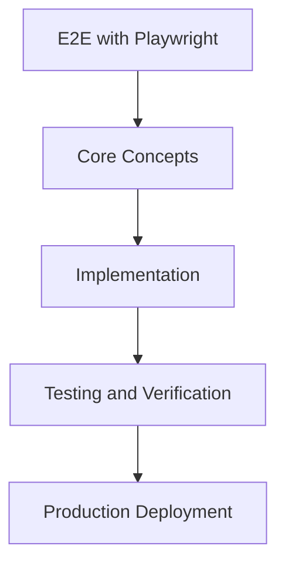

# Day 63 [Advanced]: E2E with Playwright

## Index

- [Goal](#goal)
- [Prerequisites](#prerequisites)
- [Explanation](#explanation)
- [Topic by Topic](#topic-by-topic)
- [Key Concepts](#key-concepts)
- [Visual Concept Map](#visual-concept-map)
- [End-to-End Practical](#end-to-end-practical)
- [Hands-on Coding](#hands-on-coding)
- [Mini Exercise](#mini-exercise)
- [Assessment Quiz](#assessment-quiz)
- [Task](#task)
- [Self Check](#self-check)
- [Interview Questions and Answers](#interview-questions-and-answers)
- [Day 63 Outcome](#day-63-outcome)

## Goal

Understand and apply E2E with Playwright in a Next.js application to build production-quality features.

## Prerequisites

- Day 62 completed
- Solid understanding of Next.js App Router and TypeScript basics
- Familiarity with Server Components and data fetching patterns

## Explanation

Playwright E2E tests validate full user journeys across browser, network, and backend boundaries. In Next.js apps, they are essential for catching integration issues missed by unit tests.

The goal is deterministic flows with stable selectors, realistic fixtures, and clear failure diagnostics for fast debugging.


## Topic by Topic

### Topic 1: E2E Scope and Critical Journeys

Theory:
This topic covers E2E Scope and Critical Journeys in production Next.js systems, focusing on reliability, maintainability, and measurable outcomes.

Practical:
Apply E2E Scope and Critical Journeys in a realistic project scenario, validate behavior under edge cases, and record tradeoffs for team review.

Code Example:

```tsx
// E2E with Playwright — Topic 1
// Implementation depends on your specific use case.
// Refer to the Next.js documentation for detailed API reference.
export default function Example1() {
  return <div>E2E with Playwright — Example 1</div>;
}
```
**Explanation:**
E2E Scope and Critical Journeys helps you convert framework knowledge into operationally safe delivery practices for real applications.

**Key Points:**
- Understand why E2E Scope and Critical Journeys matters in production.
- Apply Next.js patterns intentionally with clear boundaries.
- Verify outcomes with testing, monitoring, or review checks.


### Topic 2: Reliable Locator Strategy

Theory:
This topic covers Reliable Locator Strategy in production Next.js systems, focusing on reliability, maintainability, and measurable outcomes.

Practical:
Apply Reliable Locator Strategy in a realistic project scenario, validate behavior under edge cases, and record tradeoffs for team review.

Code Example:

```tsx
// E2E with Playwright — Topic 2
// Implementation depends on your specific use case.
// Refer to the Next.js documentation for detailed API reference.
export default function Example2() {
  return <div>E2E with Playwright — Example 2</div>;
}
```
**Explanation:**
Reliable Locator Strategy helps you convert framework knowledge into operationally safe delivery practices for real applications.

**Key Points:**
- Understand why Reliable Locator Strategy matters in production.
- Apply Next.js patterns intentionally with clear boundaries.
- Verify outcomes with testing, monitoring, or review checks.


### Topic 3: Auth and Session Bootstrapping

Theory:
This topic covers Auth and Session Bootstrapping in production Next.js systems, focusing on reliability, maintainability, and measurable outcomes.

Practical:
Apply Auth and Session Bootstrapping in a realistic project scenario, validate behavior under edge cases, and record tradeoffs for team review.

Code Example:

```tsx
// E2E with Playwright — Topic 3
// Implementation depends on your specific use case.
// Refer to the Next.js documentation for detailed API reference.
export default function Example3() {
  return <div>E2E with Playwright — Example 3</div>;
}
```
**Explanation:**
Auth and Session Bootstrapping helps you convert framework knowledge into operationally safe delivery practices for real applications.

**Key Points:**
- Understand why Auth and Session Bootstrapping matters in production.
- Apply Next.js patterns intentionally with clear boundaries.
- Verify outcomes with testing, monitoring, or review checks.


### Topic 4: Deterministic Test Data Setup

Theory:
This topic covers Deterministic Test Data Setup in production Next.js systems, focusing on reliability, maintainability, and measurable outcomes.

Practical:
Apply Deterministic Test Data Setup in a realistic project scenario, validate behavior under edge cases, and record tradeoffs for team review.

Code Example:

```tsx
// E2E with Playwright — Topic 4
// Implementation depends on your specific use case.
// Refer to the Next.js documentation for detailed API reference.
export default function Example4() {
  return <div>E2E with Playwright — Example 4</div>;
}
```
**Explanation:**
Deterministic Test Data Setup helps you convert framework knowledge into operationally safe delivery practices for real applications.

**Key Points:**
- Understand why Deterministic Test Data Setup matters in production.
- Apply Next.js patterns intentionally with clear boundaries.
- Verify outcomes with testing, monitoring, or review checks.


### Topic 5: Cross-browser and CI Execution

Theory:
This topic covers Cross-browser and CI Execution in production Next.js systems, focusing on reliability, maintainability, and measurable outcomes.

Practical:
Apply Cross-browser and CI Execution in a realistic project scenario, validate behavior under edge cases, and record tradeoffs for team review.

Code Example:

```tsx
// E2E with Playwright — Topic 5
// Implementation depends on your specific use case.
// Refer to the Next.js documentation for detailed API reference.
export default function Example5() {
  return <div>E2E with Playwright — Example 5</div>;
}
```
**Explanation:**
Cross-browser and CI Execution helps you convert framework knowledge into operationally safe delivery practices for real applications.

**Key Points:**
- Understand why Cross-browser and CI Execution matters in production.
- Apply Next.js patterns intentionally with clear boundaries.
- Verify outcomes with testing, monitoring, or review checks.


### Topic 6: Debugging Failures Effectively

Theory:
This topic covers Debugging Failures Effectively in production Next.js systems, focusing on reliability, maintainability, and measurable outcomes.

Practical:
Apply Debugging Failures Effectively in a realistic project scenario, validate behavior under edge cases, and record tradeoffs for team review.

Code Example:

```tsx
// E2E with Playwright — Topic 6
// Implementation depends on your specific use case.
// Refer to the Next.js documentation for detailed API reference.
export default function Example6() {
  return <div>E2E with Playwright — Example 6</div>;
}
```
**Explanation:**
Debugging Failures Effectively helps you convert framework knowledge into operationally safe delivery practices for real applications.

**Key Points:**
- Understand why Debugging Failures Effectively matters in production.
- Apply Next.js patterns intentionally with clear boundaries.
- Verify outcomes with testing, monitoring, or review checks.


## Key Concepts

- E2E with Playwright: Core concept for advanced Next.js development
- Next.js App Router: The modern routing system using the app/ directory
- Server Component: A component that runs on the server only
- TypeScript: Strongly typed JavaScript used throughout Next.js projects

## Visual Concept Map



## End-to-End Practical

1. Review the explanation and all topic examples.
2. Set up a clean Next.js project or use your existing one.
3. Implement each topic example step by step.
4. Verify the behavior in the browser.
5. Refactor and clean up your implementation.
6. Write a brief note on what you learned.

## Hands-on Coding

### Example 1: Basic E2E with Playwright Implementation

```tsx
// Basic implementation of E2E with Playwright
// Follow the topic examples above to build this out.
export default function Example() {
  return (
    <div style={{ padding: "24px" }}>
      <h1>E2E with Playwright</h1>
      <p>Implementation complete for Day 63.</p>
    </div>
  );
}
```

### Example 2: Practical Use Case

```tsx
// A real-world use case for E2E with Playwright
// Refer to the Topic by Topic section for code details.
export default function PracticalExample() {
  return (
    <div>
      <h2>Practical: E2E with Playwright</h2>
    </div>
  );
}
```

### Example 3: Combined Pattern

```tsx
// Combining E2E with Playwright with other Next.js features
// This example shows integration with the App Router.
export default function CombinedExample() {
  return (
    <section>
      <h2>E2E with Playwright — Combined Pattern</h2>
      <p>See topic sections above for detailed code.</p>
    </section>
  );
}
```

## Mini Exercise

Scenario:
You are adding E2E with Playwright to a Next.js application for a real-world feature.

Steps:

1. Create a new route or component relevant to this topic.
2. Implement the core pattern from the Topic by Topic section.
3. Test the implementation thoroughly.
4. Verify edge cases are handled.
5. Clean up and document your code.

Expected output:

- Working implementation of E2E with Playwright
- All edge cases handled correctly
- Clean, readable code following Next.js conventions

## Assessment Quiz

### Quiz Questions

1. What is the primary purpose of E2E with Playwright in Next.js?
2. Where in the project structure do you implement this pattern?
3. What is a common mistake when using E2E with Playwright?
4. True or False: E2E with Playwright only applies to Client Components.
5. How does E2E with Playwright improve the user or developer experience?

### Quiz Answers

1. To enable advanced-level functionality in a Next.js application efficiently.
2. In the App Router directory structure, using Server Components by default.
3. Mixing server and client concerns incorrectly, or skipping error handling.
4. False. This concept applies broadly across the Next.js architecture.
5. It improves maintainability, performance, and scalability of the application.

## Task

- Study all topic examples in today's lesson
- Implement the core pattern in a Next.js project
- Test all scenarios including error and edge cases
- Complete the mini exercise
- Attempt the quiz before checking answers

## Self Check

- You can implement E2E with Playwright from scratch
- You understand when and why to use this pattern
- You can explain the concept in simple terms
- You have tested the implementation in a running app
- You can answer at least 4 out of 5 quiz questions correctly

## Interview Questions and Answers

### Beginner

**Question:** What is E2E with Playwright in Next.js?

**Answer:** E2E with Playwright is a advanced-level Next.js feature that helps developers build robust, scalable applications by handling a specific aspect of the framework architecture.

**Question:** When would you use E2E with Playwright?

**Answer:** When you need to implement the specific functionality it provides in a production Next.js application, particularly in advanced-stage projects.

### Middle

**Question:** How does E2E with Playwright interact with the Next.js App Router?

**Answer:** It integrates with the App Router through Server Components, Route Handlers, or middleware, depending on the specific implementation pattern required.

**Question:** What are common pitfalls with E2E with Playwright?

**Answer:** The most common pitfalls are improper handling of server/client boundaries, missing error states, and not considering caching behavior when relevant.

### Advanced

**Question:** How would you scale E2E with Playwright in a large Next.js application with multiple teams?

**Answer:** By establishing clear conventions, creating reusable utilities, documenting patterns in an Architecture Decision Record, and enforcing consistency through code review and linting rules.

**Question:** What performance considerations apply to E2E with Playwright?

**Answer:** Consider bundle size impact for client-side features, caching strategies for data fetching, and rendering mode selection to balance performance with data freshness.

## Day 63 Outcome

- You understand E2E with Playwright and its role in Next.js
- You can implement this pattern in a real project
- You know when to use and when to avoid this pattern
- You are ready for Day 63 — moving on to the next topic
