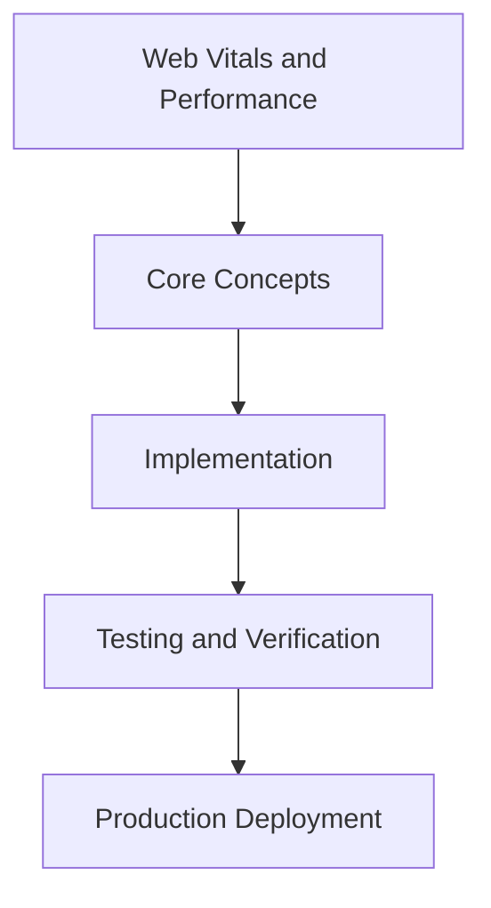

# Day 64 [Advanced]: Web Vitals and Performance

## Index

- [Goal](#goal)
- [Prerequisites](#prerequisites)
- [Explanation](#explanation)
- [Topic by Topic](#topic-by-topic)
- [Key Concepts](#key-concepts)
- [Visual Concept Map](#visual-concept-map)
- [End-to-End Practical](#end-to-end-practical)
- [Hands-on Coding](#hands-on-coding)
- [Mini Exercise](#mini-exercise)
- [Assessment Quiz](#assessment-quiz)
- [Task](#task)
- [Self Check](#self-check)
- [Interview Questions and Answers](#interview-questions-and-answers)
- [Day 64 Outcome](#day-64-outcome)

## Goal

Understand and apply Web Vitals and Performance in a Next.js application to build production-quality features.

## Prerequisites

- Day 63 completed
- Solid understanding of Next.js App Router and TypeScript basics
- Familiarity with Server Components and data fetching patterns

## Explanation

Web Vitals connect engineering choices to user-perceived speed. In Next.js, architecture decisions around rendering, caching, and assets directly affect LCP, INP, and CLS.

This lesson helps you measure vitals correctly and prioritize optimizations that move real business outcomes.


## Topic by Topic

### Topic 1: Vitals Metrics and Business Impact

Theory:
This topic covers Vitals Metrics and Business Impact in production Next.js systems, focusing on reliability, maintainability, and measurable outcomes.

Practical:
Apply Vitals Metrics and Business Impact in a realistic project scenario, validate behavior under edge cases, and record tradeoffs for team review.

Code Example:

```tsx
// Web Vitals and Performance — Topic 1
// Implementation depends on your specific use case.
// Refer to the Next.js documentation for detailed API reference.
export default function Example1() {
  return <div>Web Vitals and Performance — Example 1</div>;
}
```
**Explanation:**
Vitals Metrics and Business Impact helps you convert framework knowledge into operationally safe delivery practices for real applications.

**Key Points:**
- Understand why Vitals Metrics and Business Impact matters in production.
- Apply Next.js patterns intentionally with clear boundaries.
- Verify outcomes with testing, monitoring, or review checks.


### Topic 2: Instrumentation and Measurement

Theory:
This topic covers Instrumentation and Measurement in production Next.js systems, focusing on reliability, maintainability, and measurable outcomes.

Practical:
Apply Instrumentation and Measurement in a realistic project scenario, validate behavior under edge cases, and record tradeoffs for team review.

Code Example:

```tsx
// Web Vitals and Performance — Topic 2
// Implementation depends on your specific use case.
// Refer to the Next.js documentation for detailed API reference.
export default function Example2() {
  return <div>Web Vitals and Performance — Example 2</div>;
}
```
**Explanation:**
Instrumentation and Measurement helps you convert framework knowledge into operationally safe delivery practices for real applications.

**Key Points:**
- Understand why Instrumentation and Measurement matters in production.
- Apply Next.js patterns intentionally with clear boundaries.
- Verify outcomes with testing, monitoring, or review checks.


### Topic 3: LCP Optimization Patterns

Theory:
This topic covers LCP Optimization Patterns in production Next.js systems, focusing on reliability, maintainability, and measurable outcomes.

Practical:
Apply LCP Optimization Patterns in a realistic project scenario, validate behavior under edge cases, and record tradeoffs for team review.

Code Example:

```tsx
// Web Vitals and Performance — Topic 3
// Implementation depends on your specific use case.
// Refer to the Next.js documentation for detailed API reference.
export default function Example3() {
  return <div>Web Vitals and Performance — Example 3</div>;
}
```
**Explanation:**
LCP Optimization Patterns helps you convert framework knowledge into operationally safe delivery practices for real applications.

**Key Points:**
- Understand why LCP Optimization Patterns matters in production.
- Apply Next.js patterns intentionally with clear boundaries.
- Verify outcomes with testing, monitoring, or review checks.


### Topic 4: INP and Interaction Responsiveness

Theory:
This topic covers INP and Interaction Responsiveness in production Next.js systems, focusing on reliability, maintainability, and measurable outcomes.

Practical:
Apply INP and Interaction Responsiveness in a realistic project scenario, validate behavior under edge cases, and record tradeoffs for team review.

Code Example:

```tsx
// Web Vitals and Performance — Topic 4
// Implementation depends on your specific use case.
// Refer to the Next.js documentation for detailed API reference.
export default function Example4() {
  return <div>Web Vitals and Performance — Example 4</div>;
}
```
**Explanation:**
INP and Interaction Responsiveness helps you convert framework knowledge into operationally safe delivery practices for real applications.

**Key Points:**
- Understand why INP and Interaction Responsiveness matters in production.
- Apply Next.js patterns intentionally with clear boundaries.
- Verify outcomes with testing, monitoring, or review checks.


### Topic 5: CLS Prevention Techniques

Theory:
This topic covers CLS Prevention Techniques in production Next.js systems, focusing on reliability, maintainability, and measurable outcomes.

Practical:
Apply CLS Prevention Techniques in a realistic project scenario, validate behavior under edge cases, and record tradeoffs for team review.

Code Example:

```tsx
// Web Vitals and Performance — Topic 5
// Implementation depends on your specific use case.
// Refer to the Next.js documentation for detailed API reference.
export default function Example5() {
  return <div>Web Vitals and Performance — Example 5</div>;
}
```
**Explanation:**
CLS Prevention Techniques helps you convert framework knowledge into operationally safe delivery practices for real applications.

**Key Points:**
- Understand why CLS Prevention Techniques matters in production.
- Apply Next.js patterns intentionally with clear boundaries.
- Verify outcomes with testing, monitoring, or review checks.


### Topic 6: Performance Budget Governance

Theory:
This topic covers Performance Budget Governance in production Next.js systems, focusing on reliability, maintainability, and measurable outcomes.

Practical:
Apply Performance Budget Governance in a realistic project scenario, validate behavior under edge cases, and record tradeoffs for team review.

Code Example:

```tsx
// Web Vitals and Performance — Topic 6
// Implementation depends on your specific use case.
// Refer to the Next.js documentation for detailed API reference.
export default function Example6() {
  return <div>Web Vitals and Performance — Example 6</div>;
}
```
**Explanation:**
Performance Budget Governance helps you convert framework knowledge into operationally safe delivery practices for real applications.

**Key Points:**
- Understand why Performance Budget Governance matters in production.
- Apply Next.js patterns intentionally with clear boundaries.
- Verify outcomes with testing, monitoring, or review checks.


## Key Concepts

- Web Vitals and Performance: Core concept for advanced Next.js development
- Next.js App Router: The modern routing system using the app/ directory
- Server Component: A component that runs on the server only
- TypeScript: Strongly typed JavaScript used throughout Next.js projects

## Visual Concept Map



## End-to-End Practical

1. Review the explanation and all topic examples.
2. Set up a clean Next.js project or use your existing one.
3. Implement each topic example step by step.
4. Verify the behavior in the browser.
5. Refactor and clean up your implementation.
6. Write a brief note on what you learned.

## Hands-on Coding

### Example 1: Basic Web Vitals and Performance Implementation

```tsx
// Basic implementation of Web Vitals and Performance
// Follow the topic examples above to build this out.
export default function Example() {
  return (
    <div style={{ padding: "24px" }}>
      <h1>Web Vitals and Performance</h1>
      <p>Implementation complete for Day 64.</p>
    </div>
  );
}
```

### Example 2: Practical Use Case

```tsx
// A real-world use case for Web Vitals and Performance
// Refer to the Topic by Topic section for code details.
export default function PracticalExample() {
  return (
    <div>
      <h2>Practical: Web Vitals and Performance</h2>
    </div>
  );
}
```

### Example 3: Combined Pattern

```tsx
// Combining Web Vitals and Performance with other Next.js features
// This example shows integration with the App Router.
export default function CombinedExample() {
  return (
    <section>
      <h2>Web Vitals and Performance — Combined Pattern</h2>
      <p>See topic sections above for detailed code.</p>
    </section>
  );
}
```

## Mini Exercise

Scenario:
You are adding Web Vitals and Performance to a Next.js application for a real-world feature.

Steps:

1. Create a new route or component relevant to this topic.
2. Implement the core pattern from the Topic by Topic section.
3. Test the implementation thoroughly.
4. Verify edge cases are handled.
5. Clean up and document your code.

Expected output:

- Working implementation of Web Vitals and Performance
- All edge cases handled correctly
- Clean, readable code following Next.js conventions

## Assessment Quiz

### Quiz Questions

1. What is the primary purpose of Web Vitals and Performance in Next.js?
2. Where in the project structure do you implement this pattern?
3. What is a common mistake when using Web Vitals and Performance?
4. True or False: Web Vitals and Performance only applies to Client Components.
5. How does Web Vitals and Performance improve the user or developer experience?

### Quiz Answers

1. To enable advanced-level functionality in a Next.js application efficiently.
2. In the App Router directory structure, using Server Components by default.
3. Mixing server and client concerns incorrectly, or skipping error handling.
4. False. This concept applies broadly across the Next.js architecture.
5. It improves maintainability, performance, and scalability of the application.

## Task

- Study all topic examples in today's lesson
- Implement the core pattern in a Next.js project
- Test all scenarios including error and edge cases
- Complete the mini exercise
- Attempt the quiz before checking answers

## Self Check

- You can implement Web Vitals and Performance from scratch
- You understand when and why to use this pattern
- You can explain the concept in simple terms
- You have tested the implementation in a running app
- You can answer at least 4 out of 5 quiz questions correctly

## Interview Questions and Answers

### Beginner

**Question:** What is Web Vitals and Performance in Next.js?

**Answer:** Web Vitals and Performance is a advanced-level Next.js feature that helps developers build robust, scalable applications by handling a specific aspect of the framework architecture.

**Question:** When would you use Web Vitals and Performance?

**Answer:** When you need to implement the specific functionality it provides in a production Next.js application, particularly in advanced-stage projects.

### Middle

**Question:** How does Web Vitals and Performance interact with the Next.js App Router?

**Answer:** It integrates with the App Router through Server Components, Route Handlers, or middleware, depending on the specific implementation pattern required.

**Question:** What are common pitfalls with Web Vitals and Performance?

**Answer:** The most common pitfalls are improper handling of server/client boundaries, missing error states, and not considering caching behavior when relevant.

### Advanced

**Question:** How would you scale Web Vitals and Performance in a large Next.js application with multiple teams?

**Answer:** By establishing clear conventions, creating reusable utilities, documenting patterns in an Architecture Decision Record, and enforcing consistency through code review and linting rules.

**Question:** What performance considerations apply to Web Vitals and Performance?

**Answer:** Consider bundle size impact for client-side features, caching strategies for data fetching, and rendering mode selection to balance performance with data freshness.

## Day 64 Outcome

- You understand Web Vitals and Performance and its role in Next.js
- You can implement this pattern in a real project
- You know when to use and when to avoid this pattern
- You are ready for Day 64 — moving on to the next topic
