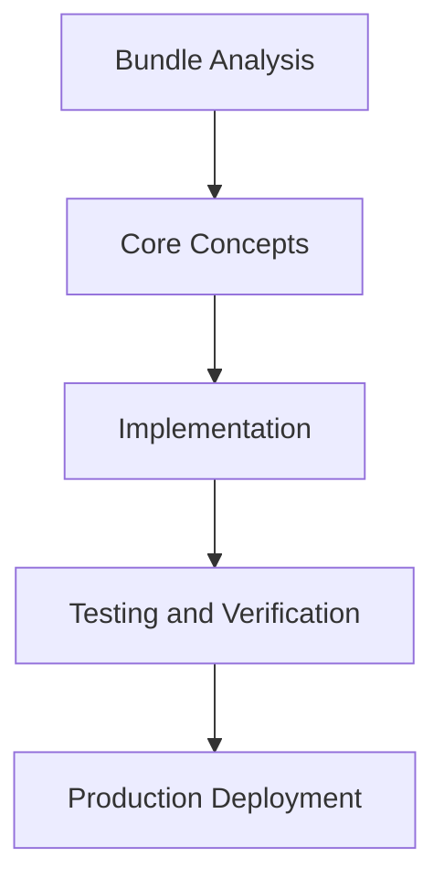

# Day 65 [Advanced]: Bundle Analysis

## Index

- [Goal](#goal)
- [Prerequisites](#prerequisites)
- [Explanation](#explanation)
- [Topic by Topic](#topic-by-topic)
- [Key Concepts](#key-concepts)
- [Visual Concept Map](#visual-concept-map)
- [End-to-End Practical](#end-to-end-practical)
- [Hands-on Coding](#hands-on-coding)
- [Mini Exercise](#mini-exercise)
- [Assessment Quiz](#assessment-quiz)
- [Task](#task)
- [Self Check](#self-check)
- [Interview Questions and Answers](#interview-questions-and-answers)
- [Day 65 Outcome](#day-65-outcome)

## Goal

Understand and apply Bundle Analysis in a Next.js application to build production-quality features.

## Prerequisites

- Day 64 completed
- Solid understanding of Next.js App Router and TypeScript basics
- Familiarity with Server Components and data fetching patterns

## Explanation

Bundle analysis shows which dependencies and patterns increase client JavaScript cost. In App Router projects, controlling bundle size is critical for first-load performance.

This lesson focuses on reading bundle reports and turning them into practical optimization decisions.


## Topic by Topic

### Topic 1: Reading Bundle Analyzer Reports

Theory:
This topic covers Reading Bundle Analyzer Reports in production Next.js systems, focusing on reliability, maintainability, and measurable outcomes.

Practical:
Apply Reading Bundle Analyzer Reports in a realistic project scenario, validate behavior under edge cases, and record tradeoffs for team review.

Code Example:

```tsx
// Bundle Analysis — Topic 1
// Implementation depends on your specific use case.
// Refer to the Next.js documentation for detailed API reference.
export default function Example1() {
  return <div>Bundle Analysis — Example 1</div>;
}
```
**Explanation:**
Reading Bundle Analyzer Reports helps you convert framework knowledge into operationally safe delivery practices for real applications.

**Key Points:**
- Understand why Reading Bundle Analyzer Reports matters in production.
- Apply Next.js patterns intentionally with clear boundaries.
- Verify outcomes with testing, monitoring, or review checks.


### Topic 2: Identifying Heavy Dependencies

Theory:
This topic covers Identifying Heavy Dependencies in production Next.js systems, focusing on reliability, maintainability, and measurable outcomes.

Practical:
Apply Identifying Heavy Dependencies in a realistic project scenario, validate behavior under edge cases, and record tradeoffs for team review.

Code Example:

```tsx
// Bundle Analysis — Topic 2
// Implementation depends on your specific use case.
// Refer to the Next.js documentation for detailed API reference.
export default function Example2() {
  return <div>Bundle Analysis — Example 2</div>;
}
```
**Explanation:**
Identifying Heavy Dependencies helps you convert framework knowledge into operationally safe delivery practices for real applications.

**Key Points:**
- Understand why Identifying Heavy Dependencies matters in production.
- Apply Next.js patterns intentionally with clear boundaries.
- Verify outcomes with testing, monitoring, or review checks.


### Topic 3: Code Splitting and Lazy Loading

Theory:
This topic covers Code Splitting and Lazy Loading in production Next.js systems, focusing on reliability, maintainability, and measurable outcomes.

Practical:
Apply Code Splitting and Lazy Loading in a realistic project scenario, validate behavior under edge cases, and record tradeoffs for team review.

Code Example:

```tsx
// Bundle Analysis — Topic 3
// Implementation depends on your specific use case.
// Refer to the Next.js documentation for detailed API reference.
export default function Example3() {
  return <div>Bundle Analysis — Example 3</div>;
}
```
**Explanation:**
Code Splitting and Lazy Loading helps you convert framework knowledge into operationally safe delivery practices for real applications.

**Key Points:**
- Understand why Code Splitting and Lazy Loading matters in production.
- Apply Next.js patterns intentionally with clear boundaries.
- Verify outcomes with testing, monitoring, or review checks.


### Topic 4: Server-first Refactoring Opportunities

Theory:
This topic covers Server-first Refactoring Opportunities in production Next.js systems, focusing on reliability, maintainability, and measurable outcomes.

Practical:
Apply Server-first Refactoring Opportunities in a realistic project scenario, validate behavior under edge cases, and record tradeoffs for team review.

Code Example:

```tsx
// Bundle Analysis — Topic 4
// Implementation depends on your specific use case.
// Refer to the Next.js documentation for detailed API reference.
export default function Example4() {
  return <div>Bundle Analysis — Example 4</div>;
}
```
**Explanation:**
Server-first Refactoring Opportunities helps you convert framework knowledge into operationally safe delivery practices for real applications.

**Key Points:**
- Understand why Server-first Refactoring Opportunities matters in production.
- Apply Next.js patterns intentionally with clear boundaries.
- Verify outcomes with testing, monitoring, or review checks.


### Topic 5: Tree-shaking and Dead-code Control

Theory:
This topic covers Tree-shaking and Dead-code Control in production Next.js systems, focusing on reliability, maintainability, and measurable outcomes.

Practical:
Apply Tree-shaking and Dead-code Control in a realistic project scenario, validate behavior under edge cases, and record tradeoffs for team review.

Code Example:

```tsx
// Bundle Analysis — Topic 5
// Implementation depends on your specific use case.
// Refer to the Next.js documentation for detailed API reference.
export default function Example5() {
  return <div>Bundle Analysis — Example 5</div>;
}
```
**Explanation:**
Tree-shaking and Dead-code Control helps you convert framework knowledge into operationally safe delivery practices for real applications.

**Key Points:**
- Understand why Tree-shaking and Dead-code Control matters in production.
- Apply Next.js patterns intentionally with clear boundaries.
- Verify outcomes with testing, monitoring, or review checks.


### Topic 6: Regression Monitoring in CI

Theory:
This topic covers Regression Monitoring in CI in production Next.js systems, focusing on reliability, maintainability, and measurable outcomes.

Practical:
Apply Regression Monitoring in CI in a realistic project scenario, validate behavior under edge cases, and record tradeoffs for team review.

Code Example:

```tsx
// Bundle Analysis — Topic 6
// Implementation depends on your specific use case.
// Refer to the Next.js documentation for detailed API reference.
export default function Example6() {
  return <div>Bundle Analysis — Example 6</div>;
}
```
**Explanation:**
Regression Monitoring in CI helps you convert framework knowledge into operationally safe delivery practices for real applications.

**Key Points:**
- Understand why Regression Monitoring in CI matters in production.
- Apply Next.js patterns intentionally with clear boundaries.
- Verify outcomes with testing, monitoring, or review checks.


## Key Concepts

- Bundle Analysis: Core concept for advanced Next.js development
- Next.js App Router: The modern routing system using the app/ directory
- Server Component: A component that runs on the server only
- TypeScript: Strongly typed JavaScript used throughout Next.js projects

## Visual Concept Map



## End-to-End Practical

1. Review the explanation and all topic examples.
2. Set up a clean Next.js project or use your existing one.
3. Implement each topic example step by step.
4. Verify the behavior in the browser.
5. Refactor and clean up your implementation.
6. Write a brief note on what you learned.

## Hands-on Coding

### Example 1: Basic Bundle Analysis Implementation

```tsx
// Basic implementation of Bundle Analysis
// Follow the topic examples above to build this out.
export default function Example() {
  return (
    <div style={{ padding: "24px" }}>
      <h1>Bundle Analysis</h1>
      <p>Implementation complete for Day 65.</p>
    </div>
  );
}
```

### Example 2: Practical Use Case

```tsx
// A real-world use case for Bundle Analysis
// Refer to the Topic by Topic section for code details.
export default function PracticalExample() {
  return (
    <div>
      <h2>Practical: Bundle Analysis</h2>
    </div>
  );
}
```

### Example 3: Combined Pattern

```tsx
// Combining Bundle Analysis with other Next.js features
// This example shows integration with the App Router.
export default function CombinedExample() {
  return (
    <section>
      <h2>Bundle Analysis — Combined Pattern</h2>
      <p>See topic sections above for detailed code.</p>
    </section>
  );
}
```

## Mini Exercise

Scenario:
You are adding Bundle Analysis to a Next.js application for a real-world feature.

Steps:

1. Create a new route or component relevant to this topic.
2. Implement the core pattern from the Topic by Topic section.
3. Test the implementation thoroughly.
4. Verify edge cases are handled.
5. Clean up and document your code.

Expected output:

- Working implementation of Bundle Analysis
- All edge cases handled correctly
- Clean, readable code following Next.js conventions

## Assessment Quiz

### Quiz Questions

1. What is the primary purpose of Bundle Analysis in Next.js?
2. Where in the project structure do you implement this pattern?
3. What is a common mistake when using Bundle Analysis?
4. True or False: Bundle Analysis only applies to Client Components.
5. How does Bundle Analysis improve the user or developer experience?

### Quiz Answers

1. To enable advanced-level functionality in a Next.js application efficiently.
2. In the App Router directory structure, using Server Components by default.
3. Mixing server and client concerns incorrectly, or skipping error handling.
4. False. This concept applies broadly across the Next.js architecture.
5. It improves maintainability, performance, and scalability of the application.

## Task

- Study all topic examples in today's lesson
- Implement the core pattern in a Next.js project
- Test all scenarios including error and edge cases
- Complete the mini exercise
- Attempt the quiz before checking answers

## Self Check

- You can implement Bundle Analysis from scratch
- You understand when and why to use this pattern
- You can explain the concept in simple terms
- You have tested the implementation in a running app
- You can answer at least 4 out of 5 quiz questions correctly

## Interview Questions and Answers

### Beginner

**Question:** What is Bundle Analysis in Next.js?

**Answer:** Bundle Analysis is a advanced-level Next.js feature that helps developers build robust, scalable applications by handling a specific aspect of the framework architecture.

**Question:** When would you use Bundle Analysis?

**Answer:** When you need to implement the specific functionality it provides in a production Next.js application, particularly in advanced-stage projects.

### Middle

**Question:** How does Bundle Analysis interact with the Next.js App Router?

**Answer:** It integrates with the App Router through Server Components, Route Handlers, or middleware, depending on the specific implementation pattern required.

**Question:** What are common pitfalls with Bundle Analysis?

**Answer:** The most common pitfalls are improper handling of server/client boundaries, missing error states, and not considering caching behavior when relevant.

### Advanced

**Question:** How would you scale Bundle Analysis in a large Next.js application with multiple teams?

**Answer:** By establishing clear conventions, creating reusable utilities, documenting patterns in an Architecture Decision Record, and enforcing consistency through code review and linting rules.

**Question:** What performance considerations apply to Bundle Analysis?

**Answer:** Consider bundle size impact for client-side features, caching strategies for data fetching, and rendering mode selection to balance performance with data freshness.

## Day 65 Outcome

- You understand Bundle Analysis and its role in Next.js
- You can implement this pattern in a real project
- You know when to use and when to avoid this pattern
- You are ready for Day 65 — moving on to the next topic
