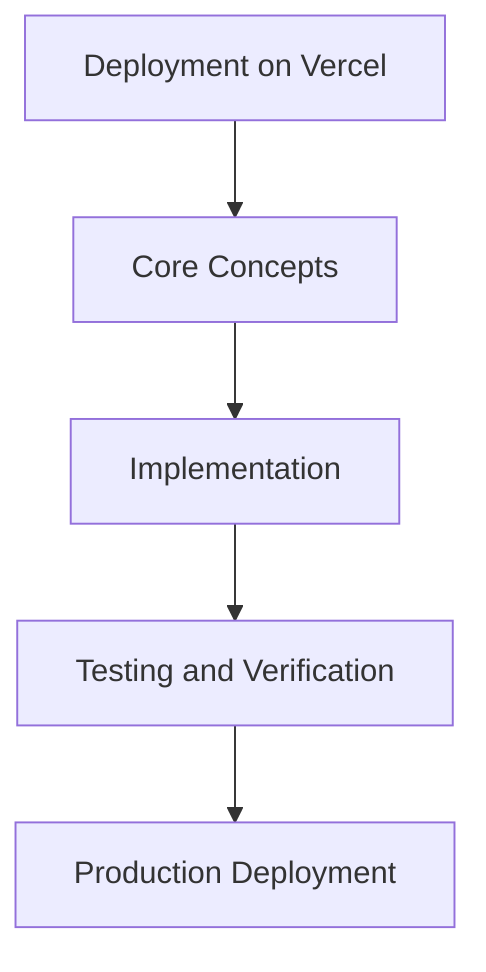

# Day 66 [Advanced]: Deployment on Vercel

## Index

- [Goal](#goal)
- [Prerequisites](#prerequisites)
- [Explanation](#explanation)
- [Topic by Topic](#topic-by-topic)
- [Key Concepts](#key-concepts)
- [Visual Concept Map](#visual-concept-map)
- [End-to-End Practical](#end-to-end-practical)
- [Hands-on Coding](#hands-on-coding)
- [Mini Exercise](#mini-exercise)
- [Assessment Quiz](#assessment-quiz)
- [Task](#task)
- [Self Check](#self-check)
- [Interview Questions and Answers](#interview-questions-and-answers)
- [Day 66 Outcome](#day-66-outcome)

## Goal

Understand and apply Deployment on Vercel in a Next.js application to build production-quality features.

## Prerequisites

- Day 65 completed
- Solid understanding of Next.js App Router and TypeScript basics
- Familiarity with Server Components and data fetching patterns

## Explanation

Vercel provides a smooth deployment path for Next.js, but production readiness still depends on environment design, observability, and rollback safety.

This lesson covers a deployment workflow that is fast for teams and safe for customer-facing releases.


## Topic by Topic

### Topic 1: Project and Environment Configuration

Theory:
This topic covers Project and Environment Configuration in production Next.js systems, focusing on reliability, maintainability, and measurable outcomes.

Practical:
Apply Project and Environment Configuration in a realistic project scenario, validate behavior under edge cases, and record tradeoffs for team review.

Code Example:

```tsx
// Deployment on Vercel — Topic 1
// Implementation depends on your specific use case.
// Refer to the Next.js documentation for detailed API reference.
export default function Example1() {
  return <div>Deployment on Vercel — Example 1</div>;
}
```
**Explanation:**
Project and Environment Configuration helps you convert framework knowledge into operationally safe delivery practices for real applications.

**Key Points:**
- Understand why Project and Environment Configuration matters in production.
- Apply Next.js patterns intentionally with clear boundaries.
- Verify outcomes with testing, monitoring, or review checks.


### Topic 2: Build Pipeline and Preview Strategy

Theory:
This topic covers Build Pipeline and Preview Strategy in production Next.js systems, focusing on reliability, maintainability, and measurable outcomes.

Practical:
Apply Build Pipeline and Preview Strategy in a realistic project scenario, validate behavior under edge cases, and record tradeoffs for team review.

Code Example:

```tsx
// Deployment on Vercel — Topic 2
// Implementation depends on your specific use case.
// Refer to the Next.js documentation for detailed API reference.
export default function Example2() {
  return <div>Deployment on Vercel — Example 2</div>;
}
```
**Explanation:**
Build Pipeline and Preview Strategy helps you convert framework knowledge into operationally safe delivery practices for real applications.

**Key Points:**
- Understand why Build Pipeline and Preview Strategy matters in production.
- Apply Next.js patterns intentionally with clear boundaries.
- Verify outcomes with testing, monitoring, or review checks.


### Topic 3: Secrets and Runtime Variables

Theory:
This topic covers Secrets and Runtime Variables in production Next.js systems, focusing on reliability, maintainability, and measurable outcomes.

Practical:
Apply Secrets and Runtime Variables in a realistic project scenario, validate behavior under edge cases, and record tradeoffs for team review.

Code Example:

```tsx
// Deployment on Vercel — Topic 3
// Implementation depends on your specific use case.
// Refer to the Next.js documentation for detailed API reference.
export default function Example3() {
  return <div>Deployment on Vercel — Example 3</div>;
}
```
**Explanation:**
Secrets and Runtime Variables helps you convert framework knowledge into operationally safe delivery practices for real applications.

**Key Points:**
- Understand why Secrets and Runtime Variables matters in production.
- Apply Next.js patterns intentionally with clear boundaries.
- Verify outcomes with testing, monitoring, or review checks.


### Topic 4: Release Safety and Rollback

Theory:
This topic covers Release Safety and Rollback in production Next.js systems, focusing on reliability, maintainability, and measurable outcomes.

Practical:
Apply Release Safety and Rollback in a realistic project scenario, validate behavior under edge cases, and record tradeoffs for team review.

Code Example:

```tsx
// Deployment on Vercel — Topic 4
// Implementation depends on your specific use case.
// Refer to the Next.js documentation for detailed API reference.
export default function Example4() {
  return <div>Deployment on Vercel — Example 4</div>;
}
```
**Explanation:**
Release Safety and Rollback helps you convert framework knowledge into operationally safe delivery practices for real applications.

**Key Points:**
- Understand why Release Safety and Rollback matters in production.
- Apply Next.js patterns intentionally with clear boundaries.
- Verify outcomes with testing, monitoring, or review checks.


### Topic 5: Edge and Regional Deployment Choices

Theory:
This topic covers Edge and Regional Deployment Choices in production Next.js systems, focusing on reliability, maintainability, and measurable outcomes.

Practical:
Apply Edge and Regional Deployment Choices in a realistic project scenario, validate behavior under edge cases, and record tradeoffs for team review.

Code Example:

```tsx
// Deployment on Vercel — Topic 5
// Implementation depends on your specific use case.
// Refer to the Next.js documentation for detailed API reference.
export default function Example5() {
  return <div>Deployment on Vercel — Example 5</div>;
}
```
**Explanation:**
Edge and Regional Deployment Choices helps you convert framework knowledge into operationally safe delivery practices for real applications.

**Key Points:**
- Understand why Edge and Regional Deployment Choices matters in production.
- Apply Next.js patterns intentionally with clear boundaries.
- Verify outcomes with testing, monitoring, or review checks.


### Topic 6: Post-deploy Verification

Theory:
This topic covers Post-deploy Verification in production Next.js systems, focusing on reliability, maintainability, and measurable outcomes.

Practical:
Apply Post-deploy Verification in a realistic project scenario, validate behavior under edge cases, and record tradeoffs for team review.

Code Example:

```tsx
// Deployment on Vercel — Topic 6
// Implementation depends on your specific use case.
// Refer to the Next.js documentation for detailed API reference.
export default function Example6() {
  return <div>Deployment on Vercel — Example 6</div>;
}
```
**Explanation:**
Post-deploy Verification helps you convert framework knowledge into operationally safe delivery practices for real applications.

**Key Points:**
- Understand why Post-deploy Verification matters in production.
- Apply Next.js patterns intentionally with clear boundaries.
- Verify outcomes with testing, monitoring, or review checks.


## Key Concepts

- Deployment on Vercel: Core concept for advanced Next.js development
- Next.js App Router: The modern routing system using the app/ directory
- Server Component: A component that runs on the server only
- TypeScript: Strongly typed JavaScript used throughout Next.js projects

## Visual Concept Map



## End-to-End Practical

1. Review the explanation and all topic examples.
2. Set up a clean Next.js project or use your existing one.
3. Implement each topic example step by step.
4. Verify the behavior in the browser.
5. Refactor and clean up your implementation.
6. Write a brief note on what you learned.

## Hands-on Coding

### Example 1: Basic Deployment on Vercel Implementation

```tsx
// Basic implementation of Deployment on Vercel
// Follow the topic examples above to build this out.
export default function Example() {
  return (
    <div style={{ padding: "24px" }}>
      <h1>Deployment on Vercel</h1>
      <p>Implementation complete for Day 66.</p>
    </div>
  );
}
```

### Example 2: Practical Use Case

```tsx
// A real-world use case for Deployment on Vercel
// Refer to the Topic by Topic section for code details.
export default function PracticalExample() {
  return (
    <div>
      <h2>Practical: Deployment on Vercel</h2>
    </div>
  );
}
```

### Example 3: Combined Pattern

```tsx
// Combining Deployment on Vercel with other Next.js features
// This example shows integration with the App Router.
export default function CombinedExample() {
  return (
    <section>
      <h2>Deployment on Vercel — Combined Pattern</h2>
      <p>See topic sections above for detailed code.</p>
    </section>
  );
}
```

## Mini Exercise

Scenario:
You are adding Deployment on Vercel to a Next.js application for a real-world feature.

Steps:

1. Create a new route or component relevant to this topic.
2. Implement the core pattern from the Topic by Topic section.
3. Test the implementation thoroughly.
4. Verify edge cases are handled.
5. Clean up and document your code.

Expected output:

- Working implementation of Deployment on Vercel
- All edge cases handled correctly
- Clean, readable code following Next.js conventions

## Assessment Quiz

### Quiz Questions

1. What is the primary purpose of Deployment on Vercel in Next.js?
2. Where in the project structure do you implement this pattern?
3. What is a common mistake when using Deployment on Vercel?
4. True or False: Deployment on Vercel only applies to Client Components.
5. How does Deployment on Vercel improve the user or developer experience?

### Quiz Answers

1. To enable advanced-level functionality in a Next.js application efficiently.
2. In the App Router directory structure, using Server Components by default.
3. Mixing server and client concerns incorrectly, or skipping error handling.
4. False. This concept applies broadly across the Next.js architecture.
5. It improves maintainability, performance, and scalability of the application.

## Task

- Study all topic examples in today's lesson
- Implement the core pattern in a Next.js project
- Test all scenarios including error and edge cases
- Complete the mini exercise
- Attempt the quiz before checking answers

## Self Check

- You can implement Deployment on Vercel from scratch
- You understand when and why to use this pattern
- You can explain the concept in simple terms
- You have tested the implementation in a running app
- You can answer at least 4 out of 5 quiz questions correctly

## Interview Questions and Answers

### Beginner

**Question:** What is Deployment on Vercel in Next.js?

**Answer:** Deployment on Vercel is a advanced-level Next.js feature that helps developers build robust, scalable applications by handling a specific aspect of the framework architecture.

**Question:** When would you use Deployment on Vercel?

**Answer:** When you need to implement the specific functionality it provides in a production Next.js application, particularly in advanced-stage projects.

### Middle

**Question:** How does Deployment on Vercel interact with the Next.js App Router?

**Answer:** It integrates with the App Router through Server Components, Route Handlers, or middleware, depending on the specific implementation pattern required.

**Question:** What are common pitfalls with Deployment on Vercel?

**Answer:** The most common pitfalls are improper handling of server/client boundaries, missing error states, and not considering caching behavior when relevant.

### Advanced

**Question:** How would you scale Deployment on Vercel in a large Next.js application with multiple teams?

**Answer:** By establishing clear conventions, creating reusable utilities, documenting patterns in an Architecture Decision Record, and enforcing consistency through code review and linting rules.

**Question:** What performance considerations apply to Deployment on Vercel?

**Answer:** Consider bundle size impact for client-side features, caching strategies for data fetching, and rendering mode selection to balance performance with data freshness.

## Day 66 Outcome

- You understand Deployment on Vercel and its role in Next.js
- You can implement this pattern in a real project
- You know when to use and when to avoid this pattern
- You are ready for Day 66 — moving on to the next topic
