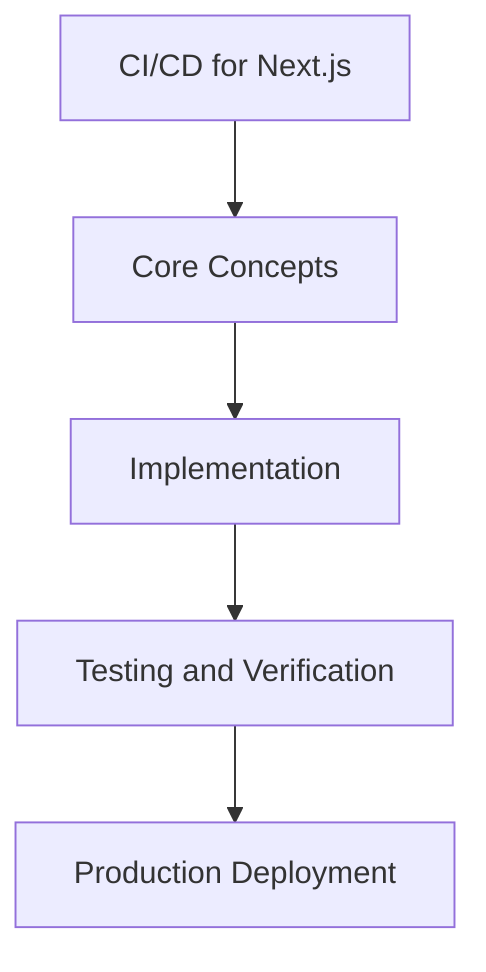

# Day 69 [Advanced]: CI/CD for Next.js

## Index

- [Goal](#goal)
- [Prerequisites](#prerequisites)
- [Explanation](#explanation)
- [Topic by Topic](#topic-by-topic)
- [Key Concepts](#key-concepts)
- [Visual Concept Map](#visual-concept-map)
- [End-to-End Practical](#end-to-end-practical)
- [Hands-on Coding](#hands-on-coding)
- [Mini Exercise](#mini-exercise)
- [Assessment Quiz](#assessment-quiz)
- [Task](#task)
- [Self Check](#self-check)
- [Interview Questions and Answers](#interview-questions-and-answers)
- [Day 69 Outcome](#day-69-outcome)

## Goal

Understand and apply CI/CD for Next.js in a Next.js application to build production-quality features.

## Prerequisites

- Day 68 completed
- Solid understanding of Next.js App Router and TypeScript basics
- Familiarity with Server Components and data fetching patterns

## Explanation

CI/CD for Next.js should optimize both speed and confidence: faster feedback for developers and safer releases for users.

A robust pipeline includes build validation, automated tests, policy checks, and controlled rollout mechanisms.


## Topic by Topic

### Topic 1: Pipeline Stages and Quality Gates

Theory:
This topic covers Pipeline Stages and Quality Gates in production Next.js systems, focusing on reliability, maintainability, and measurable outcomes.

Practical:
Apply Pipeline Stages and Quality Gates in a realistic project scenario, validate behavior under edge cases, and record tradeoffs for team review.

Code Example:

```tsx
// CI/CD for Next.js — Topic 1
// Implementation depends on your specific use case.
// Refer to the Next.js documentation for detailed API reference.
export default function Example1() {
  return <div>CI/CD for Next.js — Example 1</div>;
}
```
**Explanation:**
Pipeline Stages and Quality Gates helps you convert framework knowledge into operationally safe delivery practices for real applications.

**Key Points:**
- Understand why Pipeline Stages and Quality Gates matters in production.
- Apply Next.js patterns intentionally with clear boundaries.
- Verify outcomes with testing, monitoring, or review checks.


### Topic 2: Test Strategy in CI

Theory:
This topic covers Test Strategy in CI in production Next.js systems, focusing on reliability, maintainability, and measurable outcomes.

Practical:
Apply Test Strategy in CI in a realistic project scenario, validate behavior under edge cases, and record tradeoffs for team review.

Code Example:

```tsx
// CI/CD for Next.js — Topic 2
// Implementation depends on your specific use case.
// Refer to the Next.js documentation for detailed API reference.
export default function Example2() {
  return <div>CI/CD for Next.js — Example 2</div>;
}
```
**Explanation:**
Test Strategy in CI helps you convert framework knowledge into operationally safe delivery practices for real applications.

**Key Points:**
- Understand why Test Strategy in CI matters in production.
- Apply Next.js patterns intentionally with clear boundaries.
- Verify outcomes with testing, monitoring, or review checks.


### Topic 3: Artifact and Cache Management

Theory:
This topic covers Artifact and Cache Management in production Next.js systems, focusing on reliability, maintainability, and measurable outcomes.

Practical:
Apply Artifact and Cache Management in a realistic project scenario, validate behavior under edge cases, and record tradeoffs for team review.

Code Example:

```tsx
// CI/CD for Next.js — Topic 3
// Implementation depends on your specific use case.
// Refer to the Next.js documentation for detailed API reference.
export default function Example3() {
  return <div>CI/CD for Next.js — Example 3</div>;
}
```
**Explanation:**
Artifact and Cache Management helps you convert framework knowledge into operationally safe delivery practices for real applications.

**Key Points:**
- Understand why Artifact and Cache Management matters in production.
- Apply Next.js patterns intentionally with clear boundaries.
- Verify outcomes with testing, monitoring, or review checks.


### Topic 4: Deployment Orchestration

Theory:
This topic covers Deployment Orchestration in production Next.js systems, focusing on reliability, maintainability, and measurable outcomes.

Practical:
Apply Deployment Orchestration in a realistic project scenario, validate behavior under edge cases, and record tradeoffs for team review.

Code Example:

```tsx
// CI/CD for Next.js — Topic 4
// Implementation depends on your specific use case.
// Refer to the Next.js documentation for detailed API reference.
export default function Example4() {
  return <div>CI/CD for Next.js — Example 4</div>;
}
```
**Explanation:**
Deployment Orchestration helps you convert framework knowledge into operationally safe delivery practices for real applications.

**Key Points:**
- Understand why Deployment Orchestration matters in production.
- Apply Next.js patterns intentionally with clear boundaries.
- Verify outcomes with testing, monitoring, or review checks.


### Topic 5: Security and Compliance Checks

Theory:
This topic covers Security and Compliance Checks in production Next.js systems, focusing on reliability, maintainability, and measurable outcomes.

Practical:
Apply Security and Compliance Checks in a realistic project scenario, validate behavior under edge cases, and record tradeoffs for team review.

Code Example:

```tsx
// CI/CD for Next.js — Topic 5
// Implementation depends on your specific use case.
// Refer to the Next.js documentation for detailed API reference.
export default function Example5() {
  return <div>CI/CD for Next.js — Example 5</div>;
}
```
**Explanation:**
Security and Compliance Checks helps you convert framework knowledge into operationally safe delivery practices for real applications.

**Key Points:**
- Understand why Security and Compliance Checks matters in production.
- Apply Next.js patterns intentionally with clear boundaries.
- Verify outcomes with testing, monitoring, or review checks.


### Topic 6: Continuous Improvement of Pipeline

Theory:
This topic covers Continuous Improvement of Pipeline in production Next.js systems, focusing on reliability, maintainability, and measurable outcomes.

Practical:
Apply Continuous Improvement of Pipeline in a realistic project scenario, validate behavior under edge cases, and record tradeoffs for team review.

Code Example:

```tsx
// CI/CD for Next.js — Topic 6
// Implementation depends on your specific use case.
// Refer to the Next.js documentation for detailed API reference.
export default function Example6() {
  return <div>CI/CD for Next.js — Example 6</div>;
}
```
**Explanation:**
Continuous Improvement of Pipeline helps you convert framework knowledge into operationally safe delivery practices for real applications.

**Key Points:**
- Understand why Continuous Improvement of Pipeline matters in production.
- Apply Next.js patterns intentionally with clear boundaries.
- Verify outcomes with testing, monitoring, or review checks.


## Key Concepts

- CI/CD for Next.js: Core concept for advanced Next.js development
- Next.js App Router: The modern routing system using the app/ directory
- Server Component: A component that runs on the server only
- TypeScript: Strongly typed JavaScript used throughout Next.js projects

## Visual Concept Map



## End-to-End Practical

1. Review the explanation and all topic examples.
2. Set up a clean Next.js project or use your existing one.
3. Implement each topic example step by step.
4. Verify the behavior in the browser.
5. Refactor and clean up your implementation.
6. Write a brief note on what you learned.

## Hands-on Coding

### Example 1: Basic CI/CD for Next.js Implementation

```tsx
// Basic implementation of CI/CD for Next.js
// Follow the topic examples above to build this out.
export default function Example() {
  return (
    <div style={{ padding: "24px" }}>
      <h1>CI/CD for Next.js</h1>
      <p>Implementation complete for Day 69.</p>
    </div>
  );
}
```

### Example 2: Practical Use Case

```tsx
// A real-world use case for CI/CD for Next.js
// Refer to the Topic by Topic section for code details.
export default function PracticalExample() {
  return (
    <div>
      <h2>Practical: CI/CD for Next.js</h2>
    </div>
  );
}
```

### Example 3: Combined Pattern

```tsx
// Combining CI/CD for Next.js with other Next.js features
// This example shows integration with the App Router.
export default function CombinedExample() {
  return (
    <section>
      <h2>CI/CD for Next.js — Combined Pattern</h2>
      <p>See topic sections above for detailed code.</p>
    </section>
  );
}
```

## Mini Exercise

Scenario:
You are adding CI/CD for Next.js to a Next.js application for a real-world feature.

Steps:

1. Create a new route or component relevant to this topic.
2. Implement the core pattern from the Topic by Topic section.
3. Test the implementation thoroughly.
4. Verify edge cases are handled.
5. Clean up and document your code.

Expected output:

- Working implementation of CI/CD for Next.js
- All edge cases handled correctly
- Clean, readable code following Next.js conventions

## Assessment Quiz

### Quiz Questions

1. What is the primary purpose of CI/CD for Next.js in Next.js?
2. Where in the project structure do you implement this pattern?
3. What is a common mistake when using CI/CD for Next.js?
4. True or False: CI/CD for Next.js only applies to Client Components.
5. How does CI/CD for Next.js improve the user or developer experience?

### Quiz Answers

1. To enable advanced-level functionality in a Next.js application efficiently.
2. In the App Router directory structure, using Server Components by default.
3. Mixing server and client concerns incorrectly, or skipping error handling.
4. False. This concept applies broadly across the Next.js architecture.
5. It improves maintainability, performance, and scalability of the application.

## Task

- Study all topic examples in today's lesson
- Implement the core pattern in a Next.js project
- Test all scenarios including error and edge cases
- Complete the mini exercise
- Attempt the quiz before checking answers

## Self Check

- You can implement CI/CD for Next.js from scratch
- You understand when and why to use this pattern
- You can explain the concept in simple terms
- You have tested the implementation in a running app
- You can answer at least 4 out of 5 quiz questions correctly

## Interview Questions and Answers

### Beginner

**Question:** What is CI/CD for Next.js in Next.js?

**Answer:** CI/CD for Next.js is a advanced-level Next.js feature that helps developers build robust, scalable applications by handling a specific aspect of the framework architecture.

**Question:** When would you use CI/CD for Next.js?

**Answer:** When you need to implement the specific functionality it provides in a production Next.js application, particularly in advanced-stage projects.

### Middle

**Question:** How does CI/CD for Next.js interact with the Next.js App Router?

**Answer:** It integrates with the App Router through Server Components, Route Handlers, or middleware, depending on the specific implementation pattern required.

**Question:** What are common pitfalls with CI/CD for Next.js?

**Answer:** The most common pitfalls are improper handling of server/client boundaries, missing error states, and not considering caching behavior when relevant.

### Advanced

**Question:** How would you scale CI/CD for Next.js in a large Next.js application with multiple teams?

**Answer:** By establishing clear conventions, creating reusable utilities, documenting patterns in an Architecture Decision Record, and enforcing consistency through code review and linting rules.

**Question:** What performance considerations apply to CI/CD for Next.js?

**Answer:** Consider bundle size impact for client-side features, caching strategies for data fetching, and rendering mode selection to balance performance with data freshness.

## Day 69 Outcome

- You understand CI/CD for Next.js and its role in Next.js
- You can implement this pattern in a real project
- You know when to use and when to avoid this pattern
- You are ready for Day 69 — moving on to the next topic
