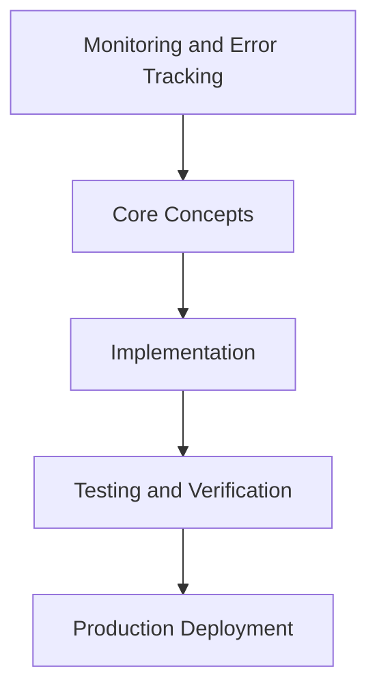

# Day 70 [Advanced]: Monitoring and Error Tracking

## Index

- [Goal](#goal)
- [Prerequisites](#prerequisites)
- [Explanation](#explanation)
- [Topic by Topic](#topic-by-topic)
- [Key Concepts](#key-concepts)
- [Visual Concept Map](#visual-concept-map)
- [End-to-End Practical](#end-to-end-practical)
- [Hands-on Coding](#hands-on-coding)
- [Mini Exercise](#mini-exercise)
- [Assessment Quiz](#assessment-quiz)
- [Task](#task)
- [Self Check](#self-check)
- [Interview Questions and Answers](#interview-questions-and-answers)
- [Day 70 Outcome](#day-70-outcome)

## Goal

Understand and apply Monitoring and Error Tracking in a Next.js application to build production-quality features.

## Prerequisites

- Day 69 completed
- Solid understanding of Next.js App Router and TypeScript basics
- Familiarity with Server Components and data fetching patterns

## Explanation

Monitoring and error tracking transform production from guesswork into measurable, actionable signals. For Next.js applications, this includes both server and client observability.

This lesson focuses on what to measure, how to alert, and how to turn incidents into reliability improvements.


## Topic by Topic

### Topic 1: Observability Signal Design

Theory:
This topic covers Observability Signal Design in production Next.js systems, focusing on reliability, maintainability, and measurable outcomes.

Practical:
Apply Observability Signal Design in a realistic project scenario, validate behavior under edge cases, and record tradeoffs for team review.

Code Example:

```tsx
// Monitoring and Error Tracking — Topic 1
// Implementation depends on your specific use case.
// Refer to the Next.js documentation for detailed API reference.
export default function Example1() {
  return <div>Monitoring and Error Tracking — Example 1</div>;
}
```
**Explanation:**
Observability Signal Design helps you convert framework knowledge into operationally safe delivery practices for real applications.

**Key Points:**
- Understand why Observability Signal Design matters in production.
- Apply Next.js patterns intentionally with clear boundaries.
- Verify outcomes with testing, monitoring, or review checks.


### Topic 2: Error Tracking Setup and Triage

Theory:
This topic covers Error Tracking Setup and Triage in production Next.js systems, focusing on reliability, maintainability, and measurable outcomes.

Practical:
Apply Error Tracking Setup and Triage in a realistic project scenario, validate behavior under edge cases, and record tradeoffs for team review.

Code Example:

```tsx
// Monitoring and Error Tracking — Topic 2
// Implementation depends on your specific use case.
// Refer to the Next.js documentation for detailed API reference.
export default function Example2() {
  return <div>Monitoring and Error Tracking — Example 2</div>;
}
```
**Explanation:**
Error Tracking Setup and Triage helps you convert framework knowledge into operationally safe delivery practices for real applications.

**Key Points:**
- Understand why Error Tracking Setup and Triage matters in production.
- Apply Next.js patterns intentionally with clear boundaries.
- Verify outcomes with testing, monitoring, or review checks.


### Topic 3: Tracing and Correlation IDs

Theory:
This topic covers Tracing and Correlation IDs in production Next.js systems, focusing on reliability, maintainability, and measurable outcomes.

Practical:
Apply Tracing and Correlation IDs in a realistic project scenario, validate behavior under edge cases, and record tradeoffs for team review.

Code Example:

```tsx
// Monitoring and Error Tracking — Topic 3
// Implementation depends on your specific use case.
// Refer to the Next.js documentation for detailed API reference.
export default function Example3() {
  return <div>Monitoring and Error Tracking — Example 3</div>;
}
```
**Explanation:**
Tracing and Correlation IDs helps you convert framework knowledge into operationally safe delivery practices for real applications.

**Key Points:**
- Understand why Tracing and Correlation IDs matters in production.
- Apply Next.js patterns intentionally with clear boundaries.
- Verify outcomes with testing, monitoring, or review checks.


### Topic 4: SLOs, Alerts, and On-call Readiness

Theory:
This topic covers SLOs, Alerts, and On-call Readiness in production Next.js systems, focusing on reliability, maintainability, and measurable outcomes.

Practical:
Apply SLOs, Alerts, and On-call Readiness in a realistic project scenario, validate behavior under edge cases, and record tradeoffs for team review.

Code Example:

```tsx
// Monitoring and Error Tracking — Topic 4
// Implementation depends on your specific use case.
// Refer to the Next.js documentation for detailed API reference.
export default function Example4() {
  return <div>Monitoring and Error Tracking — Example 4</div>;
}
```
**Explanation:**
SLOs, Alerts, and On-call Readiness helps you convert framework knowledge into operationally safe delivery practices for real applications.

**Key Points:**
- Understand why SLOs, Alerts, and On-call Readiness matters in production.
- Apply Next.js patterns intentionally with clear boundaries.
- Verify outcomes with testing, monitoring, or review checks.


### Topic 5: Incident Investigation Workflow

Theory:
This topic covers Incident Investigation Workflow in production Next.js systems, focusing on reliability, maintainability, and measurable outcomes.

Practical:
Apply Incident Investigation Workflow in a realistic project scenario, validate behavior under edge cases, and record tradeoffs for team review.

Code Example:

```tsx
// Monitoring and Error Tracking — Topic 5
// Implementation depends on your specific use case.
// Refer to the Next.js documentation for detailed API reference.
export default function Example5() {
  return <div>Monitoring and Error Tracking — Example 5</div>;
}
```
**Explanation:**
Incident Investigation Workflow helps you convert framework knowledge into operationally safe delivery practices for real applications.

**Key Points:**
- Understand why Incident Investigation Workflow matters in production.
- Apply Next.js patterns intentionally with clear boundaries.
- Verify outcomes with testing, monitoring, or review checks.


### Topic 6: Post-incident Learning Loop

Theory:
This topic covers Post-incident Learning Loop in production Next.js systems, focusing on reliability, maintainability, and measurable outcomes.

Practical:
Apply Post-incident Learning Loop in a realistic project scenario, validate behavior under edge cases, and record tradeoffs for team review.

Code Example:

```tsx
// Monitoring and Error Tracking — Topic 6
// Implementation depends on your specific use case.
// Refer to the Next.js documentation for detailed API reference.
export default function Example6() {
  return <div>Monitoring and Error Tracking — Example 6</div>;
}
```
**Explanation:**
Post-incident Learning Loop helps you convert framework knowledge into operationally safe delivery practices for real applications.

**Key Points:**
- Understand why Post-incident Learning Loop matters in production.
- Apply Next.js patterns intentionally with clear boundaries.
- Verify outcomes with testing, monitoring, or review checks.


## Key Concepts

- Monitoring and Error Tracking: Core concept for advanced Next.js development
- Next.js App Router: The modern routing system using the app/ directory
- Server Component: A component that runs on the server only
- TypeScript: Strongly typed JavaScript used throughout Next.js projects

## Visual Concept Map



## End-to-End Practical

1. Review the explanation and all topic examples.
2. Set up a clean Next.js project or use your existing one.
3. Implement each topic example step by step.
4. Verify the behavior in the browser.
5. Refactor and clean up your implementation.
6. Write a brief note on what you learned.

## Hands-on Coding

### Example 1: Basic Monitoring and Error Tracking Implementation

```tsx
// Basic implementation of Monitoring and Error Tracking
// Follow the topic examples above to build this out.
export default function Example() {
  return (
    <div style={{ padding: "24px" }}>
      <h1>Monitoring and Error Tracking</h1>
      <p>Implementation complete for Day 70.</p>
    </div>
  );
}
```

### Example 2: Practical Use Case

```tsx
// A real-world use case for Monitoring and Error Tracking
// Refer to the Topic by Topic section for code details.
export default function PracticalExample() {
  return (
    <div>
      <h2>Practical: Monitoring and Error Tracking</h2>
    </div>
  );
}
```

### Example 3: Combined Pattern

```tsx
// Combining Monitoring and Error Tracking with other Next.js features
// This example shows integration with the App Router.
export default function CombinedExample() {
  return (
    <section>
      <h2>Monitoring and Error Tracking — Combined Pattern</h2>
      <p>See topic sections above for detailed code.</p>
    </section>
  );
}
```

## Mini Exercise

Scenario:
You are adding Monitoring and Error Tracking to a Next.js application for a real-world feature.

Steps:

1. Create a new route or component relevant to this topic.
2. Implement the core pattern from the Topic by Topic section.
3. Test the implementation thoroughly.
4. Verify edge cases are handled.
5. Clean up and document your code.

Expected output:

- Working implementation of Monitoring and Error Tracking
- All edge cases handled correctly
- Clean, readable code following Next.js conventions

## Assessment Quiz

### Quiz Questions

1. What is the primary purpose of Monitoring and Error Tracking in Next.js?
2. Where in the project structure do you implement this pattern?
3. What is a common mistake when using Monitoring and Error Tracking?
4. True or False: Monitoring and Error Tracking only applies to Client Components.
5. How does Monitoring and Error Tracking improve the user or developer experience?

### Quiz Answers

1. To enable advanced-level functionality in a Next.js application efficiently.
2. In the App Router directory structure, using Server Components by default.
3. Mixing server and client concerns incorrectly, or skipping error handling.
4. False. This concept applies broadly across the Next.js architecture.
5. It improves maintainability, performance, and scalability of the application.

## Task

- Study all topic examples in today's lesson
- Implement the core pattern in a Next.js project
- Test all scenarios including error and edge cases
- Complete the mini exercise
- Attempt the quiz before checking answers

## Self Check

- You can implement Monitoring and Error Tracking from scratch
- You understand when and why to use this pattern
- You can explain the concept in simple terms
- You have tested the implementation in a running app
- You can answer at least 4 out of 5 quiz questions correctly

## Interview Questions and Answers

### Beginner

**Question:** What is Monitoring and Error Tracking in Next.js?

**Answer:** Monitoring and Error Tracking is a advanced-level Next.js feature that helps developers build robust, scalable applications by handling a specific aspect of the framework architecture.

**Question:** When would you use Monitoring and Error Tracking?

**Answer:** When you need to implement the specific functionality it provides in a production Next.js application, particularly in advanced-stage projects.

### Middle

**Question:** How does Monitoring and Error Tracking interact with the Next.js App Router?

**Answer:** It integrates with the App Router through Server Components, Route Handlers, or middleware, depending on the specific implementation pattern required.

**Question:** What are common pitfalls with Monitoring and Error Tracking?

**Answer:** The most common pitfalls are improper handling of server/client boundaries, missing error states, and not considering caching behavior when relevant.

### Advanced

**Question:** How would you scale Monitoring and Error Tracking in a large Next.js application with multiple teams?

**Answer:** By establishing clear conventions, creating reusable utilities, documenting patterns in an Architecture Decision Record, and enforcing consistency through code review and linting rules.

**Question:** What performance considerations apply to Monitoring and Error Tracking?

**Answer:** Consider bundle size impact for client-side features, caching strategies for data fetching, and rendering mode selection to balance performance with data freshness.

## Day 70 Outcome

- You understand Monitoring and Error Tracking and its role in Next.js
- You can implement this pattern in a real project
- You know when to use and when to avoid this pattern
- You are ready for Day 70 — moving on to the next topic
